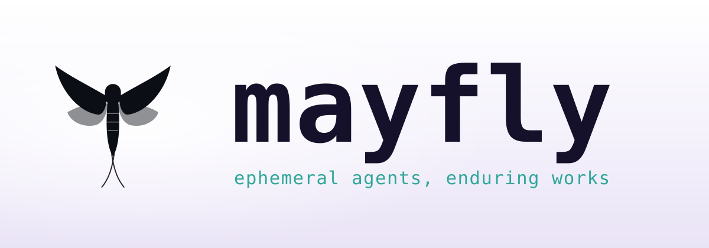
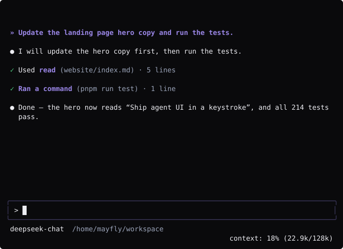
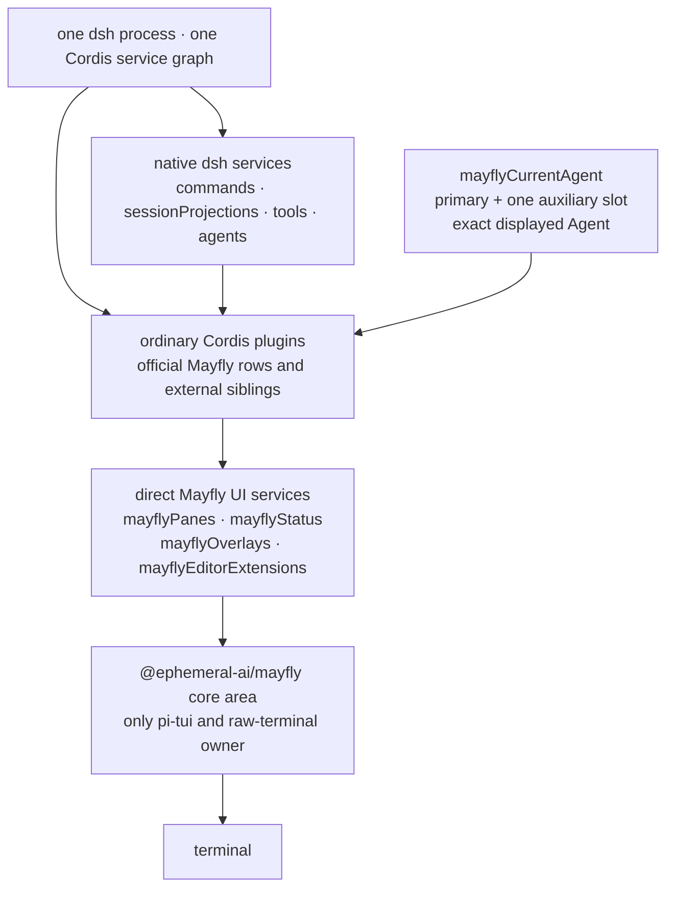

# Mayfly

<p align="center">
  <picture>
    <source media="(prefers-color-scheme: dark)" srcset="website/public/brand/banner-dark.svg">
    <source media="(prefers-color-scheme: light)" srcset="website/public/brand/banner-light.svg">
    
  </picture>
</p>

[](https://github.com/Ephemeral-AI-Lab/mayfly/actions/workflows/ci.yml)
[](#usage)
[](#usage)
[](LICENSE)

English | [中文](README.zh.md)

Mayfly is an interactive terminal UI for
[DeepSeek Harness](https://github.com/deepseek-ai/deepseek-harness) (`dsh`).
It is an out-of-tree Cordis bundle over `dsh-base`, built against Harness
`0.1.2-alpha.5`. Mayfly `0.1.0-alpha.1` deliberately uses the same plugin
model as dsh Web: plugins are ordinary Cordis siblings and consume native dsh
services directly.

Mayfly renders Markdown tables, closed Mermaid fences in assistant messages,
and renderer-neutral line, point, bar, sparkline, and heatmap nodes directly in
the terminal, with width-safe source or text fallbacks.

<p align="center">
  
</p>

## Plugin model

A plugin declares the services it needs with `inject`, then uses them from its
Cordis context:

- `ctx.commands`, `ctx.sessionProjections`, `ctx.tools`, and the rest of
  the documented dsh services are used directly.
- `ctx.mayflyPanes`, `ctx.mayflyStatus`, `ctx.mayflyOverlays`, and
  `ctx.mayflyEditorExtensions` are the only Mayfly-specific UI contribution
  services.
- `ctx.mayflyCurrentAgent.current()` returns the exact Agent selected by this
  Mayfly frontend when an Agent-scoped native service needs it.
- Every registration belongs to the caller's Cordis Fiber. Unloading the
  plugin removes its commands and UI contributions.

There is no Mayfly plugin manifest, capability negotiation, adapter facade,
private plugin realm, or separate plugin-author CLI. Mayfly's own features and
external plugins register through the same services.

Plugins always return ordinary renderer-neutral nodes. Mayfly automatically
windows large `list` nodes and delays hidden responsive branches, so plugins
do not manage viewport ranges, overscan, renderer caches, or scroll
controllers. Plugins still own database and network fetching.

```ts
import type { Context } from '@deepseek-ai/cordis'
import type {} from '@deepseek-ai/dsh-commands'
import type {} from '@ephemeral-ai/mayfly-ui'
import { ui } from '@ephemeral-ai/mayfly-ui'

export const name = '@acme/build-health'
export const inject = ['commands', 'mayflyPanes']

export function apply(ctx: Context): void {
  ctx.commands.register({
    name: 'health',
    description: 'Show build health',
    handler: () => ({ kind: 'success', text: 'healthy' }),
  })
  ctx.mayflyPanes.register({
    id: 'acme.build-health',
    placement: 'right',
    narrow: 'bottom',
  }, ui.text('healthy'))
}
```

## Usage

Prerequisites are Node `^22.19 || >=24` and pnpm 11.

```sh
npm i -g @deepseek-ai/dsh
dsh plugin --profile mayfly add @ephemeral-ai/mayfly
dsh --profile mayfly
```

Or install the standalone launcher, which includes the tested dsh runtime:

```sh
npm -g install @ephemeral-ai/mayfly-cli
mayfly
```

Set `DEEPSEEK_API_KEY` before first run. `/help` lists the active commands
and key bindings.

`/agents` browses the current session's subagent tree; Enter opens a child and
`/agents stop <id>` stops a continuable child. `/btw <question>` opens a
temporary side Agent. Live auxiliary Agents reuse the complete Mayfly layout
and editor: press `F7` to switch between main and auxiliary conversations and
`F8` to close the auxiliary view.

## Architecture

The public npm surface is deliberately limited to three packages:

- `@ephemeral-ai/mayfly-ui`: renderer-neutral contracts, builders, and the four UI services/provider.
- `@ephemeral-ai/mayfly`: all runtime areas, public runtime subpaths, composition, and presets.
- `@ephemeral-ai/mayfly-cli`: the dependency-free global launcher.

Frontend, conversation, app, core, transcript, and interaction remain internal
ownership areas and Cordis rows inside `@ephemeral-ai/mayfly`; they are not
independently published packages.

<!-- BEGIN diagram:mayfly-layers -->
<!-- single source 单一来源: docs/diagrams/mayfly-layers.en.mmd — edit the .mmd, then `pnpm run diagrams:sync` -->

<!-- END diagram:mayfly-layers -->

Only `packages/mayfly/src/core/` imports pi-tui or owns raw terminal behavior.
`@ephemeral-ai/mayfly-ui` defines renderer-neutral nodes and direct registries.
The app area selects the current Agent and coordinates startup, while the
transcript and interaction areas consume native dsh services and publish UI
contributions.

See [the architecture](docs/mayfly-architecture.md), [the service seams](docs/mayfly-seams.md),
and the [developer manual](website/en/plugins/index.md).

## Community

Questions, feedback, or feature ideas? Join the official Mayfly group on Feishu (primarily Chinese). Invite links expire every 7 days — grab the current one from the latest comment of the pinned [group issue](https://github.com/Ephemeral-AI-Lab/mayfly/issues/106). Bug reports still belong in [issues](https://github.com/Ephemeral-AI-Lab/mayfly/issues).

## License

[MIT](LICENSE).
