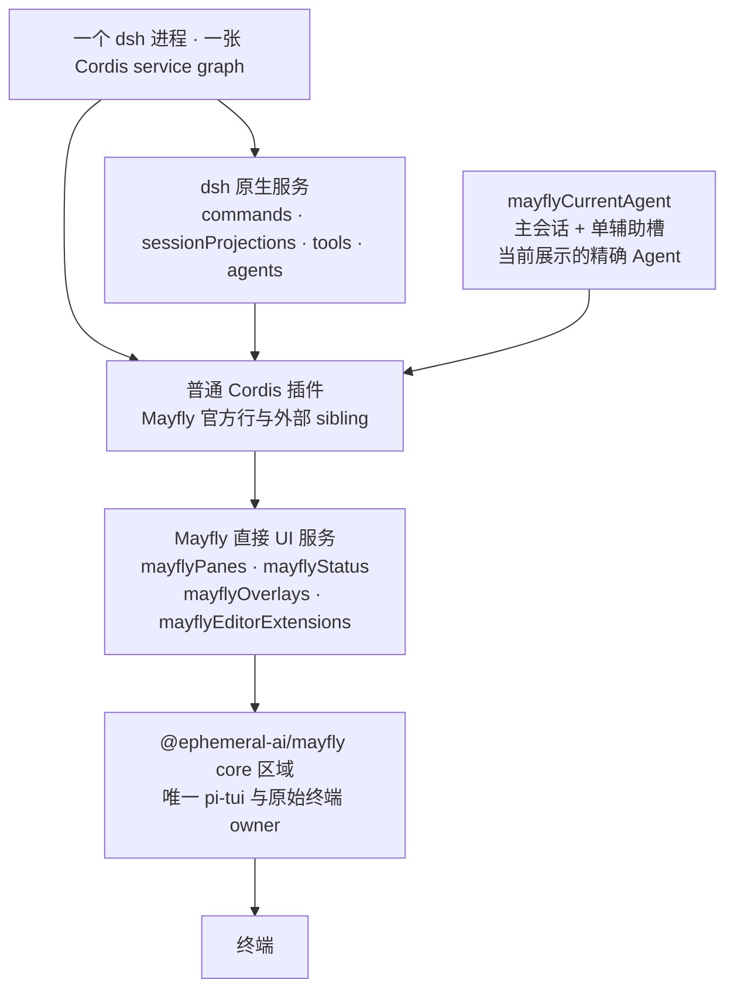

# Mayfly

<p align="center">
  <picture>
    <source media="(prefers-color-scheme: dark)" srcset="website/public/brand/banner-dark.svg">
    <source media="(prefers-color-scheme: light)" srcset="website/public/brand/banner-light.svg">
    
  </picture>
</p>

[](https://github.com/Ephemeral-AI-Lab/mayfly/actions/workflows/ci.yml)
[](#用法)
[](#用法)
[](LICENSE)

[English](README.md) | 中文

Mayfly 是 [DeepSeek Harness](https://github.com/deepseek-ai/deepseek-harness)
（`dsh`）的交互式终端界面。它是叠加在 `dsh-base` 上的树外 Cordis
bundle，针对 Harness `0.1.2-alpha.5` 构建。Mayfly `0.1.0-alpha.2`
刻意与 dsh Web 使用同一种插件模型：插件是普通 Cordis sibling，直接消费
dsh 原生服务。

Mayfly 可以直接在终端显示 Markdown 表格、assistant 消息中的闭合 Mermaid fence，
以及 renderer-neutral 的 line、point、bar、sparkline 与 heatmap 节点；超宽或不支持
的内容会安全回退为源码或文本。

<p align="center">
  
</p>

## 插件模型

插件通过 `inject` 声明服务，然后直接从 Cordis context 使用：

- `ctx.commands`、`ctx.sessionProjections`、`ctx.tools` 以及其他有文档的
  dsh 服务直接复用，不经过 Mayfly 适配。
- `ctx.mayflyPanes`、`ctx.mayflyStatus`、`ctx.mayflyOverlays` 与
  `ctx.mayflyEditorExtensions` 是仅有的 Mayfly 专属 UI 贡献服务。
- Agent-scoped 原生服务需要当前对象时，通过
  `ctx.mayflyCurrentAgent.current()` 获取这个 Mayfly frontend 当前选择的精确
  Agent。
- 每次注册都属于调用方的 Cordis Fiber；插件卸载会移除命令和 UI 贡献。

Mayfly 不再有专用插件 manifest、能力协商、适配 facade、私有插件域或独立的
插件作者 CLI。Mayfly 官方功能与外部插件注册到完全相同的服务。

插件始终只返回普通的 renderer-neutral 节点。Mayfly 会自动窗口化大型 `list`
节点，并延迟隐藏的响应式分支；插件无需管理 viewport range、overscan、renderer
cache 或 scroll controller。数据库与网络取数仍由插件负责。

```ts
import type { Context } from '@deepseek-ai/cordis'
import type {} from '@deepseek-ai/dsh-commands'
import type {} from '@ephemeral-ai/mayfly-ui'
import { ui } from '@ephemeral-ai/mayfly-ui'

export const name = '@acme/build-health'
export const inject = ['commands', 'mayflyPanes']

export function apply(ctx: Context): void {
  ctx.commands.register({
    name: 'health',
    description: 'Show build health',
    handler: () => ({ kind: 'success', text: 'healthy' }),
  })
  ctx.mayflyPanes.register({
    id: 'acme.build-health',
    placement: 'right',
    narrow: 'bottom',
  }, ui.text('healthy'))
}
```

## 用法

前置条件为 Node `^22.19 || >=24` 与 pnpm 11。

```sh
npm i -g @deepseek-ai/dsh
dsh plugin --profile mayfly add @ephemeral-ai/mayfly
dsh --profile mayfly
```

也可以安装包含已测试 dsh runtime 的独立启动器：

```sh
npm -g install @ephemeral-ai/mayfly-cli
mayfly
```

首次运行前设置 `DEEPSEEK_API_KEY`。`/help` 会列出当前有效的命令和键位。

`/agents` 浏览当前会话的 subagent 树；Enter 打开 child，
`/agents stop <id>` 停止没有 live 后代的 live continuable child；仍有 live 后代的
父节点会被拒绝，避免一次操作静默销毁整棵子树。`/btw <question>` 打开临时
旁路 Agent。live 辅助 Agent 复用完整的 Mayfly 布局与编辑器：`F7` 在主/辅助会话间
切换，`F8` 关闭辅助视图。中断当前会话时也会中断它仍在运行的所有 continuable
后代，但不会关闭这些 Agent。

## 架构

公开 npm surface 明确收敛为三个包：

- `@ephemeral-ai/mayfly-ui`：renderer-neutral contract、builder 与四个 UI service/provider。
- `@ephemeral-ai/mayfly`：全部运行时区域、公开 subpath、composition 与 presets。
- `@ephemeral-ai/mayfly-cli`：无运行时依赖的全局启动器。

frontend、conversation、app、core、transcript 与 interaction 继续作为
`@ephemeral-ai/mayfly` 内部的源码所有权区域和 Cordis row，不再独立发布。

<!-- BEGIN diagram:mayfly-layers -->
<!-- single source 单一来源: docs/diagrams/mayfly-layers.zh.mmd — edit the .mmd, then `pnpm run diagrams:sync` -->

<!-- END diagram:mayfly-layers -->

只有 `packages/mayfly/src/core/` 可以导入 pi-tui 或处理原始终端行为。
`@ephemeral-ai/mayfly-ui` 定义 renderer-neutral 节点和直接 registry；app 区域
选择当前 Agent 并协调启动；transcript 与 interaction 区域消费 dsh 原生服务并
发布 UI 贡献。

进一步阅读：[架构](docs/mayfly-architecture.md)、[服务 seam](docs/mayfly-seams.md)、
[开发手册](website/plugins/index.md)。

## 社区

欢迎加入 Mayfly 官方飞书群——反馈、排障、功能讨论与版本动态的第一线。入群链接 7 天过期，请从置顶的[群组 issue](https://github.com/Ephemeral-AI-Lab/mayfly/issues/106) 最新评论获取当前链接；bug 仍请通过 [issue](https://github.com/Ephemeral-AI-Lab/mayfly/issues) 提交追踪。

## 许可证

[MIT](LICENSE)。
