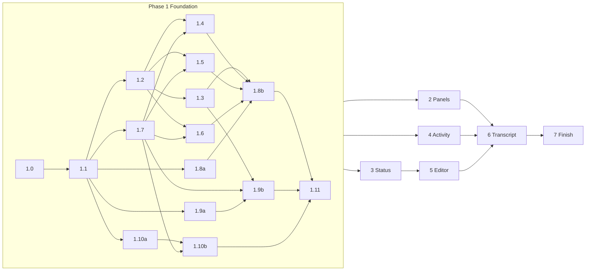

# Mayfly UI implementation roadmap

This roadmap turns the reviewed UI design into an ordered series of changes to `packages/`. It plans the work; it
ships no behavior. It was written on 2026-10-02 against `main` at `94de488`, DeepSeek Harness `0.2.0-rc.2`, and pi-tui
`0.84.2`; where it names a file, a type, or a service, that name exists in that tree unless the text says *new*. It
was revised on 2026-10-05, against the same tree, to put the whole basic layer and its performance work into one
foundation phase (D16-D20); §5 maps the earlier phase names onto the current ones. Implementation began on
2026-10-05; the status table in Phase 1 records what has landed, and the slice texts describe what was built once a
slice is marked done.

| Input | Role in the implementation |
| --- | --- |
| [`prototypes/ui-preview.mjs`](./prototypes/ui-preview.mjs) with its kit and components | **The final look and behavior.** Every phase reproduces its scenes with the real renderer (§1). |
| [component-library.md](./component-library.md) (the spec) | The rules behind the scenes: states, keys, degradation, vocabulary. |
| [component-library-reference.md](./component-library-reference.md) | Wire mechanics and the backlog IDs (A2 … R25) this roadmap schedules (§9). |
| §2 of this file | The decisions taken after review, and every place the implementation knowingly differs from the prototype. |

Read §1 and §2 first. §3 states the UI API in real terms, §4 the target architecture and the engine, §5 the phases, §6
where each Mayfly component gets its data and where it writes, §7 verification and the work budgets, §8 risks, §9
traceability.

## 1. Rules for every phase

1. **The prototype is the oracle.** A phase is done when the real renderer draws the phase's scenes the way
   `node docs/design/prototypes/ui-preview.mjs <scene>` draws them at the scene's widths. The comparison is strict
   (D19): every cell's character and style class (tone by palette token, weight, inverse, background), every key walk
   the scene supports with the hint row after each key, and every motion table and cadence under a fake clock. The
   only accepted differences are the rows of §2.3. Slice 1.0 makes this checkable.
2. **Real signatures stay.** `@ephemeral-ai/mayfly-ui` changes additively: new optional fields, new enum values, and
   two new node kinds (`prompt`, `image`). The prototype's shorthand calls map onto today's builders (§3.1); no existing
   parameter changes, and no field is repurposed.
3. **Mayfly components are pure.** They live in `packages/mayfly/src/components/` (*new*), import only
   `@ephemeral-ai/mayfly-ui` and their siblings, and turn plain facts into `ui.*` nodes. They read no width, paint no
   ANSI, own no timer, and see no key. A spec enforces it from the slice that creates the area (2a).
4. **The architecture rules hold.** Only `packages/mayfly/src/core/` imports pi-tui and owns width, ANSI, focus, layout,
   and clocks. Contributions go through the four services (`mayflyPanes`, `mayflyStatus`, `mayflyOverlays`,
   `mayflyEditorExtensions`); host slots use a core-private lease (§3.4). Effects are Fiber-owned; Agent-scoped writes
   use the exact Agent from `mayflyCurrentAgent`. Data comes from native dsh services and projections; no renderer folds
   session events into a second store.
5. **Every phase is shippable.** A phase reaches `main` slice by slice, or, when its slices only make sense together,
   through an integration branch with staged acceptance and one merge (Phase 1, D18). Each slice is its own branch,
   starts with `pnpm run verify:changed -- --plan`, and runs `pnpm run verify:full` whenever `packages/ui` or a shared
   contract changes. It adds width-scan rows for every new row renderer, English and Chinese strings
   (`tests/locale-catalog.spec.ts`), refreshed screenshots (`pnpm run shots:sync`), the Website pages it changes (with
   a LAN preview), and, for runtime behavior, a `PROFILE=mayfly-<tag> script/install-dev.sh` profile with PTY smoke and
   human acceptance before the merge to `main` (root `AGENTS.md`).
6. **Identity is the cache key, and work is budgeted.** A node that reaches core is a frozen snapshot, so an unchanged
   subtree must cost nothing on publish: its admission, its compiled component, and its painted rows are reused by
   identity (§4.1). A component keeps an unchanged sub-node identical instead of rebuilding it. Performance is gated
   by deterministic work budgets (nodes validated, units compiled, rows painted per step, §7.1); wall-clock time is
   reported with every slice but gates nothing, because it is not stable in CI.

## 2. Decisions and differences

### 2.1 Decisions taken for the implementation

Taken with the reviewer on 2026-10-02, after the design was approved. D16 to D20 were taken on 2026-10-05, when the
phases were re-cut.

| ID | Decision | Consequence |
| --- | --- | --- |
| D1 | **Literal `ui.*` migration, staged.** The status footer, the main editor, and the transcript become pure components whose nodes core compiles, like any plugin surface. | Core gains a node-backed host slot (§3.4, slice 1.10) and the engine that makes it cheap (§4.1, slice 1.1). The footer moves in Phase 3, the editor in Phase 5, and the transcript last, in Phase 6. |
| D2 | **Row-2 views are panes** with a new `placement: 'views'` and a summary. | `mayflyPanes` grows (§3.4); a plugin adds a view with the same call Mayfly uses. |
| D3 | **Native options only** for permissions and plan review. | The permission panel and the onboarding step list the native presets (`read-only`, `workspace-write`, `danger-full-access`). The plan card offers *Approve and start*, *Keep planning…*, *Reject*; there is no *Accept edits* preset and no *Approve and auto-accept edits*. |
| D4 | **Decision cards use variant B, grant-first.** | The common grant is row 1 and focused, digits choose at once, `Esc` rejects, and every card that opens unprompted gets the 300 ms arm delay (E4, slice 1.8). |
| D5 | **No session delete.** The Harness has no deletion (`SessionPersistence` offers `create`, `open`, `flush`, `stat`, `list`). | `/sessions` ships without `x` and without the `u undo · 8s` toast. They return when the Harness exposes deletion. |
| D6 | **Keys are scoped by focus.** | In the editor `Ctrl+S` stays *steer* and `Ctrl+F`/`Ctrl+J` keep their pi-tui editing meaning; inside surfaces `Ctrl+S` is `ui.save`; `Ctrl+F` searches only while the stream or a list has focus; the toast drops `Ctrl+J view` (§3.4 has the table). |
| D7 | **One components area**, `packages/mayfly/src/components/`, with no Cordis entry and no public subpath. | `packages/mayfly/AGENTS.md` gains the area and its layering rule. |
| D8 | **The `/` palette is the editor's completion list.** | Scene 15's inline list, drawn with scene 30's row layout (match bold, description, the command's key at the right). No palette overlay. |
| D9 | **`@` completions: `Enter` or `Tab` insert the token; `Ctrl+G` opens the focused file externally** (`ui.external`, the row shows `↗ code`). | Scene 30's *Files* overlay is not a separate surface. |
| D10 | **Rewind keeps today's conversation branch**, without the restore-scope strip (the Harness has no file checkpoints). | The checkpoint list takes the new look only. |
| D11 | **Changed files opens from a new `/changes` command.** | Data comes from the session's edit and write calls. |
| D12 | **Settings: the rail lists native namespaces; each keeps a draft and saves with `Ctrl+S`** through today's revision-checked `settings.mutate`. | Not the scene's curated groups, and not apply-as-you-go. |
| D13 | **Usage money estimates are priced from models.dev**, in USD, marked `≈`, hidden when a model has no price. | `interaction/models-dev.ts` also reads the catalog's cost fields. |
| D14 | **A new `ui.image` content node** keeps pasted images inline in the stream. | Core paints it with the existing image component; plugins get it too. |
| D15 | **This roadmap lives in PR #84** beside the spec. | — |
| D16 | **Foundation first, then an API freeze.** Phase 1 delivers the oracle, the engine, the visual language, every basic component, the key engine, the patterns, `ui.prompt`, `ui.image`, the views lane, and the node host slot. No Mayfly surface migrates in it. | `@ephemeral-ai/mayfly-ui` has no planned change after Phase 1, so Phases 2 to 6 start from the changed gate. A later phase may still add an optional field under §1 rule 2, with the full gate. |
| D17 | **An incremental engine, not point caches.** | Admission, compilation, and painting reuse an unchanged subtree by identity; animation patches cells; one clock serves every surface (§4.1). It is slice 1.1, ahead of every feature slice, so each new painter is written once, in its cacheable form. |
| D18 | **Phase 1 lands through an integration branch**, `feat/ui-foundation`, with three acceptance checkpoints and one merge to `main`. | `main` and the release-candidate line never carry a half-restyled UI. The branch is rebased on `main` at each checkpoint (§5, §8). |
| D19 | **Parity is strict.** | Every cell's character and style class, every key walk, and every motion table are compared (§1 rule 1), not only the rows and the marks. |
| D20 | **No type-only API.** Every public addition is live end to end when it ships and has a plugin-side consumer in `examples/`. | The views lane ships in slice 1.10 with a gallery view, although Mayfly's own views move onto it in Phase 3. |

### 2.2 Spec §8 questions, resolved

| Spec §8 | Resolution |
| --- | --- |
| 1 Decision variant | B (D4). |
| 2 Rebinding | Overrides persist in the `mayfly` settings namespace (`keybindings`); plugin action ids are namespaced `<owner>.<action>` and `ui.*` is reserved; a clash is refused with the owner's name (slice 1.7). |
| 3 Slash-to-filter | Kept (`filterMode: 'slash'`, slice 1.4). |
| 4 Side conversations | As drawn: identity in row 1's center band, `F7 switch · F8 close` (or `detach`) in row 2's right cluster (Phase 3). |
| 5 Unchecked keys | D6 plus the key audit (slices 1.0 and 1.7). `/view <level>` and `Alt+V` stay unscheduled until confirmed; the scene's `Ctrl+O` level cycling is a demo key. |
| 6 Onboarding permissions step | Ships, with the native presets (D3); the deployment's current preset is marked `recommended`. |
| 7 Delete session | Dropped for now (D5). |
| 8 Account balance | `deepseekAccount.getBalance()` when signed in with the DeepSeek account; API-key providers hide the row (the design's *unsupported*). No identity is shown. |
| 9 Lifetimes | 5 s of visible time for `✓` and `ℹ`; the 8 s undo is unused after D5. |
| 10 Unicode fallback | Specified in slice 1.2 as a proposal to confirm at checkpoint A. |
| 11 API additions | Approved as §3. |
| 12 Unused builders | `sections` and `diagram` stay for plugins. |
| 13 Trace turn | Derived in Mayfly from the session events (`interaction/trace-aggregate.ts`); no Harness change. |
| 14 Write highlighting | Capped at the expanded card's 12 rows and 32 KB, then plain text. |
| 15 Turn rule | Start time only, as drawn. |

### 2.3 Where the implementation differs from the prototype

Each row is a deliberate difference. Slice 1.0's parity specs list them by number, and anything else is a defect. A new
row needs the reviewer's approval before the slice that introduces it merges.

| # | Scene | The prototype draws | The implementation does | Why |
| --- | --- | --- | --- | --- |
| Δ1 | 21 | Variant toggle (`Ctrl+T`), A by default | Variant B only, digits choose, a 300 ms arm delay; the scene's stray-key demo becomes a replay test that grants nothing | D4 |
| Δ2 | 21, 18 | Plan card with four options | *Approve and start*, *Keep planning…* (focuses `Revise:`), *Reject*; `Esc` declines | D3 |
| Δ3 | 21 p4, 29 | *Default*, *Accept edits*, *Full access* | The native presets with their configured names and descriptions; `danger-full-access` asks the shared Yes/No | D3 |
| Δ4 | 24 | `x` delete and `u undo · 8s` | Absent; the hint row omits them | D5 |
| Δ5 | 16 p2 | A toast with `Ctrl+J view` | The toast without a key | D6 |
| Δ6 | 25 | Curated groups, edits applied at once | Native namespaces, a draft per namespace, `Ctrl+S` saves | D12 |
| Δ7 | 26 | `≈ ¥` money figures | `≈ $` priced from models.dev, hidden without a price | D13 |
| Δ8 | 30 p1, p2 | A *Commands* overlay and a *Files* overlay | The editor's `/` and `@` completion lists (scene 15) with the palette's row layout; `Ctrl+G` opens a file | D8, D9 |
| Δ9 | 30 p4 | A restore-scope strip on each checkpoint | No strip; rewind branches the conversation | D10 |
| Δ10 | 19 | Seven prompt styles | Style A (the turn rule) only; the list item `block` field is not added | Spec §5.6 chose A |
| Δ11 | 15 | `Ctrl+K`/`Ctrl+V` add demo tokens | Real flows: pasted images and pastes (`interaction/paste-image.ts`), `@` mentions as tokens | Demo keys |
| Δ12 | 18 | `c` and `Ctrl+G` report what they would do | Real clipboard (`interaction/clipboard-write.ts`) and `$EDITOR` (`interaction/external-editor.ts`) | Demo keys |
| Δ13 | 13, 18 | Row 2 always drawn | Row 2 renders only while a view or a row-2 entry has something to show | Spec §5.1; spec §9 notes the simplification |
| Δ14 | 20 | The after-percentage as a known number | `~` estimate from `compaction/summary.shadowedTokenCount` until the next request reports usage | No native after-value until then |
| Δ15 | 21, 18 | `⚠ deletes files` on a command | A documented Mayfly heuristic on the command text (`rm`, `rmdir`, `unlink`, `git clean`, `del`, …) | No native signal |
| Δ16 | 26, 28 | A balance for every provider | Only with the DeepSeek account sign-in; otherwise the row is hidden | §2.2 row 8 |
| Δ17 | 1 | Captions mention `▌` as the selection mark | The muted bold `→` (spec §2.2) | Stale caption |
| Δ18 | all | The hint words of the kit's `hintFragments` | The same words, including `pick` on a focused select | The kit is the oracle; spec §3.2's table gains `pick` when it is next edited |
| Δ19 | 24 | `n new` on every workspace | `n` acts on the current workspace; other rows carry `unavailableActions.new` with a reason, unless the Harness can start a session in another directory (verify in slice 2b) | Process cwd |
| Δ20 | all | The kit's word wrap drops a line's leading spaces and does not reopen the style on a wrapped continuation | The renderer keeps both (scene 7's todo row, scene 8's indented code line, wrapped captions) | Prototype wrap artifact; approved by the reviewer |
| Δ21 | 8 p3 | Markdown drawn by the kit's five rules (bare heading, `•`, `│` quote, a language label over the code) | The shipped markdown component: blank rows between blocks, fences kept, the `md*` tokens | The transcript keeps the streamed markdown component (Phase 6); proposed in slice 1.3 |
| Δ22 | 8 `h` | `h` swaps highlighted code for one flat user tone | The code node always highlights; no switch | Demo key; proposed in slice 1.3 |
| Δ23 | 8 p5-p7 | Line, point, vertical-bar, and stacked or grouped horizontal-bar charts, and the diagram, from hand-written glyph rows | `simple-ascii-chart` and `beautiful-mermaid` draw them (a horizontal bar is normalized only); the sparkline and the heatmap are the kit's | The kit stands in for libraries it does not specify; proposed in slice 1.3 |
| Δ24 | 7 scroll | `↑` from a followed tail jumps to the top (a stale offset) | `↑` scrolls one row from the tail | Prototype artifact; proposed in slice 1.3 |
| Δ25 | 10 | A flex row of framed surfaces: surfaces measured structurally, the grow remainder to the last child, `…` columns below 60 | The layout engine measures a surface by painting it and shares the remainder by its own rule | The row layout is pi-tui's stack layout; proposed in slice 1.3 |
| Δ26 | 10 `h` | `h` changes only the caption: the `minHeight: 20` child stays | The renderer hides it below 20 rows | Prototype artifact (its viewport height is not read); proposed in slice 1.3 |
| Δ27 | 3, 4, 12 | `▌` marks the cursor in an edited field | The terminal cursor sits there; no glyph is drawn | Spec §4.3 calls it the terminal cursor; approved by the reviewer |
| Δ28 | 4, 6, 12 | The `unsaved changes` badge in scene 3 only | Core adds it to every surface whose form is dirty | Roadmap slice 1.6; approved by the reviewer |
| Δ29 | 6, 11 | `← labels` is never hinted on a focused select, although `←` leaves it for the rail at its first option | The hint row names `← labels` whenever `←` would reach the rail, selects included | Spec §4.5 ("the cue is true"); approved by the reviewer |

Spec items the preview does not draw and this roadmap does not schedule: diff hunk review (`HunkReview` is unreachable
in scene 30), scroll match ticks (`marks`, `currentMark`) and `reveal`, the views' fan-out stagger and row flash, and
the edit card's settle flash. They can follow Phase 7 if wanted.

## 3. The UI API in real terms

### 3.1 Prototype calls and today's builders

The kit (`ui-kit.mjs`) shortens a few calls. The implementation keeps today's signatures:

| Prototype | Real API |
| --- | --- |
| `ui.scroll({ id, child, … })` | `ui.scroll(child, { id, … })` |
| `ui.empty(title, { description })` | `ui.empty({ title, description })` |
| `ui.spacer(n)`, `ui.divider(label)` | `ui.spacer({ size: n })`, `ui.divider({ label })` |
| `ui.diff(before, after, options)` | the same, with the new optional third parameter (§3.2) |
| `ui.list({ … })` without `selectedIds` | `selectedIds: []` (required today) |
| list item `label: span[]`, `detail: span[]` | `label: string` (plain, used for filtering) plus `labelSpans` (*new*); the existing `detailSpans` |
| list item `strong: true` | `labelSpans` with `styles: ['strong']` |
| `fields` row `value: 'text'` | `value: [{ text }]` |
| `defineComponent(name, layer, render)` | `defineMayflyComponent({ id: 'mayfly.<name>', render })`; the layer is the module location |
| `patterns.*` | `patterns` exported from `@ephemeral-ai/mayfly-ui` (*new*, slice 1.8) |
| `activate.selected` (each list's cursor row) | The existing action `selections` addresses; a browse list with nothing selected reports its focused row (`UiSurfaceModel.unavailableReason` already resolves it this way) |
| `submit.values` | The existing `MayflySubmission.forms[].fields` |
| reply `invalid.errors: { field: message }` | The existing `MayflyFieldError[]` with form and field addresses |
| `rt.say(message, severity)`, `rt.feedbackNode()` | Reply `feedback`, and `context.report()` for progress; core paints feedback in the surface footer |
| module-level `keymap` | The core `mayflyKeymap` service, extended (§3.4) |

### 3.2 Contract additions

All in `packages/ui/src/contracts.ts` unless noted; every field is optional and defaults to today's behavior.

```ts
// Content
export type MayflyLoaderVariant = 'bloom' | 'fill' | 'gap' | 'breath'
export interface MayflyInlineSpan {
  // …text, tone, styles
  /** One motion channel: the letters shimmer, or the span is one animated loader cell (text must be ''). */
  readonly motion?: 'shimmer' | 'loader'
  readonly variant?: MayflyLoaderVariant              // with motion 'loader'; default 'gap'
}
export type MayflyTextOverflow = 'wrap' | 'truncate' | 'middle' | 'start'   // two new values
export interface MayflyTextNode { /* … */ readonly styles?: readonly MayflyTextStyle[] }
export interface MayflyCodeNode { /* … */ readonly numbered?: boolean }      // highlighting becomes the default
export interface MayflyDiffNode {
  // …before, after
  readonly start?: number            // first line number (default 1)
  readonly numbered?: boolean        // old/new gutters (default true)
  readonly hunkHeader?: boolean      // force an @@ header (default: only when more than one hunk)
  readonly context?: number          // context lines per hunk (default 1, at most 3)
  readonly maxRows?: number          // then `… +N rows · Ctrl+O`
}
export interface MayflyHeatmapChartNode { /* … */ readonly cell?: 1 | 2, readonly columnLabels?: readonly string[] }
export interface MayflyImageNode {   // new kind (D14)
  readonly kind: 'image'
  readonly attachmentId: string      // bytes come from a loader the host tree supplies (slice 1.9)
  readonly alt: string               // the text fallback, e.g. `[Image #1 84 KB]`
  readonly maxRows?: number
}

// Feedback
export interface MayflyLoaderNode {
  // …elapsedMs, cancelActionId, cancelLabel
  readonly message?: string          // now optional: a bare glyph for the activity row
  readonly variant?: MayflyLoaderVariant | 'braille' | 'tide'   // the old values stay accepted as 'gap'
}
export interface MayflyProgressNode {
  // …label, value, max
  readonly style?: 'cells' | 'rule'
  readonly width?: number
  readonly tone?: MayflyTone
  readonly showCount?: boolean       // default true for cells
  readonly showPercent?: boolean
  readonly transition?: { readonly from: number, readonly ms: number, readonly rev: number }  // a renderer-owned one-shot (the compaction drain)
}

// Layout and chrome
export interface MayflyUiChild {
  // …node, id, tab, basis, grow, shrink, minSize, maxSize, when
  readonly priority?: number         // admission order in a row; lower is kept first
  readonly band?: 'left' | 'center' | 'right'
  readonly overflow?: 'truncate' | 'hide'
}
export interface MayflySurfaceNode {
  // …title, subtitle, badges, chrome, padding, child, footer
  readonly titleAlign?: 'left' | 'right'
  readonly border?: MayflyTone
  readonly escapeLabel?: 'close' | 'back' | 'cancel' | 'reject' | 'leave'
  readonly hint?: 'auto' | 'none' | 'completions'
}
export interface MayflyScrollNode {
  // …id, child, follow, scrollbar
  readonly height?: number
  readonly expandedHeight?: number
  readonly fit?: boolean             // shrink to short content; scrollbar only on overflow
  readonly pill?: boolean            // `↓ N new · End` while scrolled away from a followed tail
}

// Tabs
export interface MayflyTabItem {
  // …id, label, disabled, backId
  readonly count?: number | string   // widened: the todo tab reads `2/6`
  readonly attention?: boolean
  readonly group?: string            // rail heading
  readonly clip?: 'end' | 'start'
}
export interface MayflyTabsNode { /* … */ readonly orientation?: 'horizontal' | 'vertical', readonly hintLabel?: string }

// Lists
export interface MayflyListSegment { /* … */ readonly inheritedId?: string }
export type MayflyListBodyNode = MayflyContentNode | MayflyImageNode | MayflyProgressNode | MayflySpacerNode
  | MayflyDividerNode | MayflyListBodyStackNode                               // content only, never a control
export interface MayflyListBodyStackNode extends Omit<MayflyStackNode, 'children'> {
  readonly children: readonly (Omit<MayflyUiChild, 'node' | 'tab'> & { readonly node: MayflyListBodyNode })[]
}
export interface MayflyListItem {
  // …existing fields
  readonly labelSpans?: readonly MayflyInlineSpan[]
  readonly right?: readonly MayflyInlineSpan[]
  readonly rightFocus?: readonly MayflyInlineSpan[]
  readonly body?: string | MayflyListBodyNode
  readonly bodyAlways?: boolean
  readonly expanded?: boolean        // initial disclosure
  readonly wrap?: boolean
  readonly wrapMax?: number          // then `▸ N more lines · Enter`
  readonly meter?: { readonly value: number, readonly max: number, readonly width?: number, readonly tone?: MayflyTone }
  readonly indent?: number
  readonly rule?: string             // a non-selectable muted rule with right-aligned text
  readonly gap?: boolean             // a non-selectable blank row
}
export interface MayflyListNode {
  // …existing fields
  readonly filterMode?: 'type' | 'slash'
  readonly marker?: 'cursor' | 'selection'
  readonly marks?: boolean           // ● ○ on a single choose list
  readonly maxRows?: number
  readonly expandFocused?: boolean
  readonly acceptVerb?: 'open' | 'choose' | 'expand' | 'edit' | 'restore'
  readonly autofocus?: boolean
  readonly focusItem?: { readonly id: string, readonly rev: number }
  readonly hintLabel?: string
}

// Forms
export interface MayflyFormFieldBase { /* … */ readonly help?: string, readonly group?: string }
// input, textarea, secret: readonly pattern?: string, patternMessage?: string, suggestions?: readonly string[]

// Actions
export type MayflyCommonMeaning = 'save' | 'copy' | 'delete' | 'refresh' | 'external' | 'search'
export interface MayflyActionItem {
  // …existing fields
  readonly semantic?: MayflyCommonMeaning   // the key is that meaning's binding; exclusive with `key`
  readonly action?: string                  // `<owner>.<action>` component action; `key` is its default
  readonly hintLabel?: string
}
export interface MayflyActionsNode { /* … */ readonly scope?: string | readonly string[] }

// The prompt (new kind)
export interface MayflyPromptNode {
  readonly kind: 'prompt'
  readonly id: string
  readonly symbol?: string                            // default '> '
  readonly symbolTone?: MayflyTone
  readonly value?: string
  readonly tokens?: readonly { readonly id: string, readonly label: string, readonly size?: string }[]
  readonly recall?: readonly { readonly kind: 'queued' | 'history', readonly text: string }[]
  readonly recallLabel?: string
  readonly placeholder?: string | readonly string[]  // a ladder, longest first
  readonly completions?: { readonly items: readonly { readonly id: string, readonly label: string, readonly detail?: string, readonly right?: string }[] }
  readonly reset?: { readonly rev: number, readonly value: string }
  readonly submitLabel?: string
  readonly autofocus?: boolean
}
```

`MayflyUiNode` gains `MayflyPromptNode` and `MayflyImageNode`. Status nodes stay text, rich text, fields, progress, and
stacks of them, now with child admission but no motion. Editor decorations admit neither new kind. The builders
add `ui.image(...)`, `ui.prompt(...)`, and the optional third parameter of `ui.diff`; `packages/ui/src/patterns.ts`
(*new*) adds the four patterns.

`MayflyComponentDefinition` gains `memo?: boolean` (slice 1.1). With it, a call whose props are shallowly equal to
the previous call's returns the same frozen node, so core's identity caches (§4.1) hit without the author holding
references. A component's `render` is already required to be pure, which is what makes this sound.

### 3.3 Events

`packages/ui/src/interaction.ts` gains three action events and two observations:

| Event | Class | Carries | Emitted by |
| --- | --- | --- | --- |
| `focus-change` | observation | `controlId`, `itemId?` | a list cursor move, at most once per render frame (detail follows the cursor) |
| `recall-change` | observation | `controlId`, `source: 'queued' \| 'history' \| 'draft'`, `index` | the prompt walking its recall |
| `token-remove` | action | `controlId`, `tokenId` | the prompt's second `Backspace` |
| `completion-accept` | action | `controlId`, `itemId` | `Tab` or `Enter` on a completion |
| `completion-dismiss` | action | `controlId` | `Esc` on an open completion list |

The prompt reuses two events: `value-change` (with `formId` set to the prompt id) and `submit`, whose
`MayflySubmission` holds one form addressed by the prompt id with the fields `text` and `tokens` (the token ids). The
replies are unchanged.

### 3.4 Services, runtime, and core-private seams

| Seam | Change |
| --- | --- |
| `mayflyPanes` (public) | `MayflyPanePlacement` gains `'views'`. A views pane declares `summary: { node: MayflyStatusNode, count?: number \| string }` and updates it with the new `registration.setSummary(summary \| null)`; `null` takes the view out of row 2. Its `set(node)` publishes the panel. `size` and `narrow` do not apply; `onEvent`, `load`, `refresh`, and `loadMore` work as for other panes. The lane ships in slice 1.10; Mayfly's own views register on it in Phase 3. |
| `mayflyOverlays` (public) | `MayflyOverlayDefinition.armMs?: number` (0-2000, default 0): every key except `Esc` is swallowed for that long after the overlay first takes focus (slice 1.8). |
| `mayflyStatus` (public) | No new API. Core composes row 1 and row 2 with the `ui.child` admission primitive, so a plugin entry and a Mayfly entry are admitted by one rule. |
| `mayflyEditorExtensions` (public) | No new API. `complete()` results join the prompt's completion list; `before`/`after` decorations sit around the editor surface. |
| `mayflyKeymap` (core service) | Scopes (`global`, `editor`, `surface`, `stream`); `bind(id, keys)`, `reset(id)`, `resetAll()`, `list()` (label, scope, defaults, effective keys, owner, overridden), `preferPlain`. Conflicts are refused per scope with the owner's name (the existing `KEY_CONFLICT`). |
| `mayflyScreen` (core-private) | *New* `mountNodeSlot(id, { region: 'content' \| 'dock' \| 'footer' })` returns `{ set(node), dispose() }`; core compiles the node like a surface, with its interaction state in `mayflyUiInteraction`. It ships in slice 1.10 beside `mountContentSlot` and `mountDockSlot`, exercised by a test host; the footer (Phase 3), the editor (Phase 5), and the conversation (Phase 6) use it. |
| `mayflyUiInteraction` (frontend) | A *new* `UiPromptModel` beside the form, choice, and tab models (draft, selected token, recall index), and list `focusItem` and expansion state, so a core reload keeps them. |

The key scopes of D6:

| Key | Editor (prompt focused) | Surface (overlay or pane focused) | Stream focused |
| --- | --- | --- | --- |
| `Ctrl+S` | steer (`mayfly.interaction.steer`) | `ui.save` | — |
| `Ctrl+F` | cursor right (pi-tui) | `ui.search`, when a list has focus | `ui.search` |
| `Ctrl+G` | `ui.external`: the draft in `$EDITOR` (today's behavior) | `ui.external`: the focused content | `ui.external`: the row |
| `Ctrl+J` | newline (pi-tui) | `ui.newline` in a textarea | — |
| `c` `x` `r` | text | `ui.copy` `ui.delete` `ui.refresh` (no type-to-filter list, not editing) | `ui.copy` |
| `Alt+↑` / `F4` | focus the stream | `ui.focus-prev` | — |
| `Alt+↓` / `F5` | enter the views (empty prompt) | `ui.focus-next` | back to the prompt |
| `F6` | enter the views, then the interactive panes (`mayfly.surface.next`) | next surface | next surface |
| `?` | key help (empty prompt) | text | — |
| `F7` / `F8` | conversation switch / close or detach (global) | same | same |
| `Ctrl+O` | the last three turns at Verbose (global) | same | same |
| `Ctrl+T` | open the views on Todo (global; replaces the todo-pane toggle) | same | same |

### 3.5 What is not added

`MayflyListItem.block`, `strong`, and `expandable` (a body implies it); scroll `marks`, `currentMark`, and `reveal`; the
reference's F1 *buttons on demand*. None appears in the preview.

## 4. Target architecture

```
native dsh services and projections            (Agent, Session, goal, jobs, userQuestions, settings, account, …)
        │ facts (plain readonly data)
        ▼
feature plugins in transcript/ and interaction/  (Fiber-owned subscriptions, writes, timers for data refresh)
        │ call
        ▼
components/  (pure: facts + t → ui.* nodes)     ◄── the same builders a plugin uses
        │ nodes
        ▼
four public services, or a core-private host slot lease
        │
        ▼
core: validator → compiler → painters; one key grammar; one keymap; the only clocks
        │
        ▼
terminal (pi-tui)
```

- **`packages/ui`** owns the wire contracts, builders, and patterns. It never imports Cordis outside `./provider`.
- **`components/`** holds every Mayfly component of spec §6.2 under the names in §6. Each is
  `defineMayflyComponent({ id: 'mayfly.<name>', render })`, takes facts plus a `t` translator, and is covered by
  fixtures, a width scan, and a parity spec.
- **Feature plugins** keep their Cordis rows. They subscribe to native services, keep Agent identity exact, own data
  refresh timers (an elapsed counter is data, refreshed once a second), and publish the component's node.
- **Core** owns every animation clock (loader variants, shimmer, one-shot transitions), width ladders, admission,
  focus, the key grammar and keymap, and the host slots. The prototype's `--audit` becomes
  `tests/components/layering.spec.ts`.

### 4.1 The engine

Today every `set()` is a full rebuild. `UiSurfaceModel.receive` (`core/ui-interaction-surface.ts`) validates the whole
tree into a new admitted tree, `compileMayflyUiSurfaceNode` builds a fresh `CompiledSurface`, and the per-width row
memos of `pureStaticComponent` die with it. Every loader tick repaints the whole surface, because `renderFrameOnce`
keys its memo on the animation frame, and list, tab, action, and form-field rows are repainted on every frame. That
is affordable for a panel; it is not for a status area, an editor, and a transcript published as nodes (D1).

The registries freeze every snapshot (`freezeWire` in `packages/ui/src/services.ts`), so a node that reaches core is
deeply immutable and **its identity is a sound cache key**. The engine (slice 1.1) builds on that:

| Part | Change | Where |
| --- | --- | --- |
| Admission memo | A subtree admitted once returns the same admitted object the next time. A stored summary (node, text, and chart counts; control ids, tabs, pages, action keys, the filterable flag) is replayed into the budget, so every limit and every duplicate check still runs. The key is the raw node's identity plus its context (mode, page path, scroll depth, depth). It applies to registry snapshots only; a caller-owned value takes today's path. | `core/ui-validator.ts`, `core/ui-interaction-surface.ts` |
| Compile reuse | `compileNode` looks an admitted node up in a per-runtime `WeakMap`; a hit reuses the component and replays its control bindings into the new generation. Theme, keymap, locale, and screen-mode changes start a new epoch. | `core/ui-compiler.ts`, `core/ui-compile-cache.ts` (*new*) |
| Row cache | List, tab, action, and form-field painters become functions of (item, width, state bits) with a small cache per item, so a cursor move repaints two rows. Rows of varying height keep a prefix-sum index for windowing. | `core/ui-patterns.ts`, `core/ui-row-cache.ts` (*new*) |
| Animation patches | Static rows are cached without the animation frame. An animated cell registers a slot (row, column, a paint function of the frame), and a tick repaints only the rows that hold one. | `core/ui-compiler.ts` (`renderFrameOnce`) |
| One clock | One core timer serves every surface. A surface subscribes while it shows an animated cell and leaves when it hides, so the timer stops when nothing moves; reduced motion freezes every channel. Slice 1.1 keeps today's 80 ms step, and slice 1.3 sets the design's cadences. | `core/ui-loader-animation.ts` |
| Measured cells | Painters assemble rows from cells that carry their text and width, so a string is measured once and painted ANSI is never measured again on a hot path. | `core/ui-measure.ts` (*new*), over `core/width.ts` |
| Hint memo | The hint row is memoized on the focus identity, the interaction revision, the width, and the keymap revision. | `core/ui-compiler.ts` (`contextKeyHintRows`) |
| Lazy item bodies | A list item's body is admitted with the item, lazily and under a per-item budget (extending `lazyListItems`), so a long list of rich rows is legal without raising the tree quotas. It lands with the `body` field, in slice 1.4. | `core/ui-validator.ts` |
| Upstream identity | `defineMayflyComponent({ memo: true })` (§3.2). | `packages/ui/src/builders.ts` |

The precedents are already in core: `pureStaticComponent` (a per-width memo), `walkControlsCached` (a revision-keyed
memo), `clampFrameFrom` in `core/frame-clamp.ts` (frames compared by identity), and `lazyListItems` with `listWindow`
(bounded list work). The counters that prove the reuse are passed through the compiler options (§7.1), never held in
a singleton.

## 5. Phases

Phase 1 is the foundation: the whole basic layer, the engine under it, and the seams the later phases mount on. When
it ends, the public UI API is complete (D16). Phases 2 to 6 build the Mayfly components on it, and Phase 7 finishes.

| Phase | Slices | Delivers | Prototype scenes | Gate |
| --- | --- | --- | --- | --- |
| 1 Foundation | 12 (1.0-1.11) | The oracle, the engine, the visual language, every basic component, the key engine, the patterns, the prompt and image nodes, the host seams, the API freeze | 1-12, 15 (the prompt alone), 13 (the lane) | full for each slice; a profile at each checkpoint |
| 2 Command panels | 6 (2a-2f) | The components area and every command panel | 21-32 | full for 2a (new area), then as planned; profile |
| 3 Status area and views | 1-2 | The two status rows and Mayfly's four views | 13, 12 | as planned + profile |
| 4 Activity and notices | 1 | The activity row, notices, tool rows, compaction | 14, 16, 17, 20 | as planned + profile |
| 5 Editor | 1-2 | The editor as a prompt composition | 15, 30 p1-p2 | as planned + profile |
| 6 Transcript | 2-3 | The stream as a list, levels, search, request rows | 17-21 | as planned + profile |
| 7 Finish | 1 | Website, skills, docs, cleanup, release | — | full + pack |

*As planned* is the gate that `pnpm run verify:changed -- --plan` selects. With `packages/ui` frozen that is the
changed gate, unless a slice touches a core seam, the composition, or a shared contract, which widens it to the full
gate.



Phase 1's slices run in parallel (the *Working in parallel* section below): 1.8, 1.9, and 1.10 each split into an
early half that depends on nothing (`armMs`, `ui.image`, the node slot: 1.8a, 1.9a, 1.10a) and a late half (the
patterns, the prompt, the views lane: 1.8b, 1.9b, 1.10b); 1.7 moves ahead of 1.4-1.6 because it renames the action ids
they bind; 1.4-1.6 depend on 1.2 and 1.7, not on 1.3, which needs only 1.2.

The first version of this roadmap named its phases P0 to P8. They map onto the current ones as follows:

| Earlier | Now | What moved |
| --- | --- | --- |
| P0 | 1.0 | Gains the work counters and the baseline. The layering spec moves to 2a, with the area it guards. |
| — | 1.1 | New: the engine, brought forward from P7's *Host and performance*. |
| P1 | 1.2 | — |
| P2a-P2g | 1.3-1.9 | `ui.image` moves from P2a to 1.9. |
| P4 (the API), `mountNodeSlot` | 1.10 | The views lane and the node slot, without their Mayfly consumers. |
| — | 1.11 | New: the freeze. |
| P3a-P3f | 2a-2f | — |
| P4 | 3 | The consumers of the lane and the slot. |
| P5, P6 | 4, 5 | — |
| P7 | 6 | Runs on the engine of 1.1. |
| P8 | 7 | — |

### Phase 1 Foundation

**Goal.** The basic components draw and behave as scenes 1 to 12 do, on an engine that makes an unchanged subtree
free, with every public addition of §3 live. No Mayfly component exists yet: existing panels change only through the
shared painters.

**Exit criteria.**

- *Fidelity.* Every page, state, and width of scenes 1 to 12, and of scene 15 for the prompt, has a golden and a
  strict parity spec (§1 rule 1). `examples/ui-gallery` has a page for each basic scene, to run beside the prototype.
- *Performance.* The work budgets of §7.1 hold in the gate, and the wall-clock report shows each slice against the
  baseline of slice 1.0.
- *API.* Every addition of §3 is live end to end and has a plugin-side consumer (D20); `pnpm run check:lib`,
  `check:pack`, and `check:examples` pass.

**Landing (D18).** The slices are PRs into `feat/ui-foundation`, developed in a dedicated worktree with the profile
`mayfly-ui-foundation`. The reviewer accepts at three checkpoints, and the branch is rebased on `main` at each:

| Checkpoint | After | The reviewer checks |
| --- | --- | --- |
| A | 1.0-1.2 | The goldens beside the interactive preview; existing panels in the new visual language at 120 and 60 columns, with `NO_COLOR=1`, ASCII glyphs, and reduced motion; the first work report |
| B | 1.3-1.8 | The gallery page of each basic scene beside the prototype; a key rebound in settings, with the hint row following it; one pattern in `examples/mayfly-user-kit` |
| C | 1.9-1.11 | The prompt (paste, IME, and the clipboard through `docs/platform-acceptance.md`); an inline image; a plugin view in row 2; the final budgets; the Website reference on a LAN preview |

After checkpoint C the branch merges to `main` once, followed by `pnpm run check:pack` and the main rebuild.

**Status** (updated by each slice's PR; the slice text below describes the built behavior once a slice is done):

| Slice | State | Branch | Notes |
| --- | --- | --- | --- |
| 1.0 | merged (#99) | `feat/ui-foundation-1-0` (`781ae7e`) | Full gate green with 100% coverage; no runtime behavior change |
| 1.1 | merged (#100) | `feat/ui-foundation-1-1` | Full gate green with 100% coverage; no visible change (goldens and screenshots identical); budgets below |
| 1.2 | merged (#102) | `feat/ui-foundation-1-2` | Six parts; full gate green; scenes 1 p1-p5, 7 p1, 8 p3-p4, 9 p3 pinned and scene 2 matched; Δ20 approved |
| 1.7 | merged (#101) | `feat/ui-foundation-1-7` | Six parts; full gate green with 100% coverage |
| 1.10a | merged (#103) | `feat/ui-foundation-1-10a` | Node slot. Full gate green with 100% coverage; no visible change; `W1-slot` and `W4-slot` budgets |
| 1.9a | merged (#104) | `feat/ui-foundation-1-9a` | `ui.image`. Full gate green with 100% coverage; one new shot (`image`), no other visible change |
| 1.8a | merged (#105) | `feat/ui-foundation-1-8a` | `armMs`; two parts; full gate green with 100% coverage; no visible change unless a definition sets `armMs` |
| 1.3 | merged (#106) | `feat/ui-foundation-1-3` | Seven parts; full gate green with 100% coverage; scenes 7 to 10 pinned (Δ21 to Δ26 proposed); the list window of scene 10 was left in the ledger for 1.4, which closed it |
| 1.4 | merged (#107) | `feat/ui-foundation-1-4` | Six parts; full gate green with 100% coverage; scene 5 (all seven pages and the `move`, `open`, `filter` walks) and scene 1 page 1's lists pinned; one `Esc back` hint left pending for 1.5; `W4b` budget |
| 1.5 | merged (#110) | `feat/ui-foundation-1-5` | Five parts; full gate green with 100% coverage; scene 6 (all four pages and the rail's walks) and scene 11 page 2 pinned; the `Esc back` entry of scene 5 closed; `W12-rail` budget; Δ29 approved |
| 1.6 | merged (#109) | `feat/ui-foundation-1-6` | Two parts; full gate green; scenes 3, 4, 12 and scene 1 page 1's form block pinned (Δ27, Δ28 approved); one `Esc back` hint left pending for 1.5; no budget change |
| 1.10b | merged (#108) | `feat/ui-foundation-1-10b` | Views lane. Full gate green with 100% coverage; one new shot (`views-summary`), no other visible change |
| 1.9b | not started | `feat/ui-foundation-1-9b` | Prompt. Needs: 1.3, 1.7, 1.9a |
| 1.8b | not started | `feat/ui-foundation-1-8b` | Patterns. Needs: 1.3 to 1.6, 1.8a |
| 1.11 | not started | `feat/ui-foundation-1-11` | Needs: all |
| Checkpoint A / B / C | pending | | A after 1.2; B after 1.3 to 1.8; C after 1.9 to 1.11 |

**Working in parallel.** Up to three slices are in flight, each in its own worktree and agent.

- *Ownership.* A slice edits the functions its text names (`renderList` is 1.4's, `renderTabs` 1.5's,
  `renderFormField` 1.6's, `keyGrammar` and the keymap 1.7's, `renderSurfaceHead/Tail` 1.2's then 1.3's). New logic goes
  in a new module with an arm or call site in `ui-compiler.ts` or `ui-validator.ts`; no drive-by refactors, moves, or
  reformatting. A slice that needs a contract field another slice owns stops and says so.
- *Shared files.* Generated files (`pnpm run shots:sync`, `design:golden`) are regenerated, never hand-merged;
  `tests/perf/budgets.json` and `script/design-golden-walks.mjs` take append-only rows for a slice's own scenes;
  each slice's gallery page is a new file `examples/ui-gallery/src/groups/<slice>.ts` wired by one import line; each
  slice edits only its own Status row and its own slice text.
- *Scenes that span slices* (1: 1.2 and 1.4; 7: 1.2 and 1.3; 11: 1.5 and 1.8b; 12: 1.6 and 1.8b; 2: 1.7) list the
  walks they cannot match yet in `tests/design/pending.ts`; slice 1.11 asserts the list is empty.
- *Gates.* Narrow checks run freely; `pnpm run verify:full` runs under one lock, so at most one runs at a time.
  Before a PR opens, and after each sibling merges, the branch rebases on `feat/ui-foundation` and reruns its checks.
- *Review.* One PR per slot is in flight; a PR is a series of commits that are each green, as 1.1 was.


Slices 1.3 to 1.10 change `packages/ui`. Each updates `website/plugins/ui-reference.md` and its English twin together
with `script/shots/manifest.mjs` (their fidelity contract), adds `examples/ui-gallery` coverage for its new props, and
keeps `pnpm run check:examples` green.

#### 1.0 Oracle, baseline, and guardrails

**Goal.** Make "draws like the preview" and "does no more work than it must" checkable, before anything visible
changes. The prototype is not modified.

- **Golden frames.** `script/design-golden.mjs` runs
  `node --import script/design-golden-clock.mjs docs/design/prototypes/ui-preview.mjs <scene>` with piped stdio, so
  the runner takes its non-TTY path. The preload pins `Date.now`, turns `setInterval` into a no-op, and replays the
  walk itself from `GOLDEN_SCRIPT` (a key is one stdin chunk, a number advances the fake clock by that many
  milliseconds and runs one repaint tick), so no output depends on write timing; a marker after each step lets the
  runner cut one frame per step. A walk starts with a NUL key to paint frame 0, and the runner strips the cursor-control
  prefix and keeps the scene body. The walk table is `script/design-golden-walks.mjs` (one walk per page and per state
  named in the scene's footer, a first version that later slices extend). It writes
  `packages/mayfly/tests/design/golden/<nn>-<scene>/<walk>.txt` (visible text) and `.ansi` (raw); `--check` fails when
  the prototype's output changes, and `pnpm run design:golden` and `design:golden:check` run it. The capture is
  deterministic: two runs of all 172 walks are byte-identical.
- **Parity helper.** `packages/mayfly/tests/design/parity.ts` (*new*) compiles a node with `compileMayflyUiNode` at the
  golden's width, the way `script/shots/render.mjs` does, drives keys through the compiler's focus target, parses both
  outputs into cells, and compares each cell's character and style class, with trailing blank cells trimmed (D19). A
  style class is a tone, a weight, inverse, and a background. The prototype's truecolor values and its dim, bold, and
  inverse attributes map to palette tokens; the real output is painted with a probe palette in which every semantic
  color is a distinct sequence, so two tones never compare equal by accident. Motion is compared frame by frame under
  a fake clock. `tests/design/deltas.ts` (*new*) lists the accepted differences, each citing its §2.3 row.
- **Key audit.** `packages/mayfly/tests/core/key-audit.spec.ts` (*new*): within one scope no two actions share a key;
  every default that uses Alt has a plain alternative; no printable key binds in the editor scope. Scopes do not exist
  before slice 1.7, so the grammar's focus states stand in for them. The Alt defaults that have no plain alternative
  today (`prev-tab`, `next-tab`, `newline`, `cycle-model`) are a recorded list that slice 1.7 must shrink: the spec
  fails when an entry already has a plain key. The inline registrations of the surface renderer, paste, transcript, and
  todo plugins are checked against their owners' source text. The only grammar overlap is `←`/`→` on an adjustable
  select, which is recorded.
- **Work counters.** An optional, core-private `counters` sink in the compiler options, which the validator, the
  compiler, and the painters increment: nodes validated, units compiled, rows painted, strings measured. Production
  passes none. Strings measured is partial until slice 1.1's `ui-measure.ts`: it counts the injected components seam
  and the compiler's frame and hint paths, not the painters in `ui-patterns.ts`; per-item list rows wait for the row
  cache of slice 1.1.
- **Workloads and baseline.** `script/audit-performance.mjs` gains the workloads W1 to W8 of §7.1 and prints the
  counters beside its wall-clock timings. `packages/mayfly/tests/perf/work-budget.spec.ts` (*new*) runs the same
  workloads headless and compares today's counts with `tests/perf/baseline.json` (`UPDATE_WORK_BASELINE=1` rewrites it),
  the baseline that slice 1.1 turns into a gate. The workloads live in `tests/perf/workloads.ts`, shared by the spec and
  the script; a fixture of the script that predated the projection schema was repaired. The wall-clock targets of §7.1
  are fixed from this baseline.
- **Impact rules.** `script/test-impact.mjs` selects the parity specs and the work-budget spec for `src/core/ui-*.ts`,
  the key audit for the key tables, and the golden `--check` for `docs/design/prototypes/**` and the goldens;
  `packages/ui/src/**` keeps the full gate, which already includes them. The golden check is also a CI step.

No runtime behavior changes. The goldens and the baseline report are reviewed at checkpoint A.

#### 1.1 The engine

**Goal.** An unchanged subtree costs nothing on publish, and a tick or a cursor move repaints only what changed (§4.1,
D17). **Backlog:** D3 (the shared clock), R1 (clocks).

This slice is a refactor with no visible change: every existing spec, golden, and screenshot stays byte-identical. It
landed in eight parts, each green on its own:

1. **Gate.** `tests/perf/budgets.json` holds a ceiling per workload and counter. It starts at the slice 1.0 baseline,
   may never exceed it, and each part below lowered its rows; `work-budget.spec.ts` also checks that W6 grows with the
   panes that changed (`swarmWorkload(k)`), not with all 32.
2. **Epochs.** `isWireSnapshot` (beside `freezeWire` in `@ephemeral-ai/mayfly-ui`, additive) and
   `MayflyKeymapService.revision`.
3. **Admission memo** (`core/ui-validator.ts`, `createAdmissionCache()`). A surface model keeps one; a status or editor
   compile takes it from the compiler options. A frozen snapshot subtree that added only counts to the tree budget, and
   every list item (which admits under its own quota), is returned as admitted, with the node, text, and chart quotas
   replayed (a replay that would exceed one takes the full path, so the error is the original). A subtree that carries a
   control, tab, page, action key, filter, editor slot, or responsive branch is admitted whole each time.
4. **Compile reuse** (`core/ui-compile-cache.ts`). A surface runtime keeps a memo from an admitted node to its
   component for the static leaves (text, fields, code, diff, sections, rich text, divider), re-pointed at the newest
   surface for failure reporting and counters, lent at most once per compile pass. Control-bearing units are not reused:
   no budget needs it, and a stale binding is the costlier failure. Pure static leaves remember four widths.
5. **Row cache** (`core/ui-row-cache.ts`). List item rows are kept per admitted item and the state bits the painter
   folds in, and per palette; `rowsPainted` counts the rows a painter actually painted. Tabs, actions, and form fields
   keep their painters: they are single rows and no budget needs them.
6. **One clock** (`UiAnimationClock` in `core/ui-loader-animation.ts`), owned by the surface renderer; the step stays
   80 ms. A pure static leaf's rows survive `invalidate()`, so a tick repaints the loader row and not the surface.
7. **Hint memo.** The hint parts are read fresh on every paint, because the grammar reads focus, editing, search, and
   form state. The painted and fitted row is memoized, keyed by the translated candidates, the width, and the palette.
8. **`memo: true`** on `defineMayflyComponent`, with `examples/mayfly-user-kit`'s `summaryMetric` as its consumer.

The budgets now are (validated / compiled / rows, one step): W1 2 / 2 / 2 (the changed entry and the row that holds it;
the row's entry is painted at the two widths a layout measures); W2 0 / 0 / 1; W3 0 / 0 / 2; W4 2 / 1 / 1 (the list node
and at most one item); W5 0 / 0 / 1; W6 proportional to the changed panes; W7 and W8 as at the baseline. The first
part's reading of W3's baseline is that its 81 rows were two real list paints, because the frame renders again whenever
the rows exceed the viewport, plus the hint row twice.

Not done in this slice, and why: *measured cells* (`ui-measure.ts`) and the strings-measured budget, because they change
every painter's contract and no §7.1 row gates them; they belong with the painters slices 1.2 and 1.3 rewrite anyway.
*Animation slots* as a registry: the same effect holds without one, because static leaves are memoized and the loader
is the only row that repaints on a tick. *Lazy item bodies* wait for the `body` field of slice 1.4, as planned.

Tests: the work-budget spec is a gate; `ui-admission-cache.spec.ts` (every replayed quota, the contexts, the
non-memoizable subtrees), `ui-compile-cache.spec.ts` (take and keep, the passes, the palettes, the hint memo),
`ui-row-cache.spec.ts` (equality with the unmemoized painter, the repaint of two rows, the palette epoch), and
`ui-loader-animation.spec.ts` (two surfaces on one timer, a hidden surface leaving, the timer stopping) are new;
`ui-compiler.spec.ts`, `ui-validator.spec.ts`, and the surface-bridge specs ran unchanged.

#### 1.2 Visual language in the painters

**Goal.** Everything already on screen adopts the vocabulary of spec §2, with no contract change.
**Backlog:** A2, A4 (core), B5, C1, C2 (defaults), D1, D2, G4, G8, G9, G12, G22, H3, R13 (contrast).

It landed in five parts, each green on its own, and a sixth after slice 1.7 merged:

1. **Presentation.** The `mayfly` settings namespace gained a self-contained block: `glyphs` (`auto` \| `unicode` \|
   `ascii`; `auto` follows the locale's charset, so `LANG=C` is ASCII and an unset locale is Unicode), `monochrome`, and
   `reducedMotion`; `NO_COLOR` forces monochrome. `core/presentation.ts` resolves them. A theme provider paints with a
   weight-only palette under monochrome (`primary`, `warning`, `danger`, and strong text bold; `muted`, `textMuted`, and
   borders dim; no color and no background), and the components service records the presentation it was built for. A
   settings commit that changes it restarts the live theme provider (`reloadTheme` in `interaction/theme-switch.ts`), so
   every consumer and every cached row is rebuilt, the way `/theme` works; nothing reads the presentation per paint.
   `core/glyphs.ts` holds the fallback table. Every static component of a compiled surface converts its painted rows
   (every replacement is one cell, so the conversion runs after layout), markdown and diagram leaves too; the editor
   converts its frame but never the text being typed. The loader swaps its spinner for `- \ | /`, and under reduced
   motion it stays on its first frame without joining the clock.
2. **Chrome, marks, tabs.** `overlay` and `surface` are one rounded frame with the inset title rule
   (`╭ Title ─── badge ╮`): the title bold in text color, badges at the right of the rule (dropped first when narrow,
   then the title ellipsises), the subtitle inside the frame, the overlay in `borderFocus` and the inline surface in
   `border`, with at least one column of gutter whatever `padding` says. `lane` is a muted `── Title ───` rule and
   `none` the bold title. A list row is `→ label`: the cursor arrow, bold primary, only while its list has focus, the
   cursor row's label bold, no selection band. Multiple lists draw `●`/`○` in their own column (`◐` for a partly chosen
   parent), pickers `●`/`○` for `[x]`/`[ ]`, numbers read `1  label`, badges and details are muted. `CURRENT_MARK`,
   `SELECT_POINTER`, and `interaction/symbols.ts` are gone: `/theme` and `/permission` show the one muted `[current]` the
   model picker used. The active tab is `primary` with a heavy `━` underline (bold primary while the strip has focus,
   muted otherwise), the rest muted; wizard steps read `✓ ● ○` joined by a muted `›`; a strip that does not fit folds to
   `‹ active next +N ›` (slice 1.5 refines it).
3. **Feedback and hints.** Feedback is a glyph and words (`feedbackSpans` in `core/ui-interaction-notifications.ts`):
   `✓`/`ℹ` before a message in text color, `⚠`/`✗` in their own tone, in a surface footer and in the prompt's
   feedback lane; the 5 s lifetime of `✓` and `ℹ` was already in place. The hint row paints keys in text and labels
   muted, in the kit's order (navigation, adjustment, digits, the primary operation, accelerators, filter and clear,
   tabs, groups, `Esc`) and words (`Space toggle · Enter choose`, `←/→ adjust · Enter pick`, `Enter toggle`,
   `←/→ actions`, `No/Yes` on a decision, `↑/↓ fields`, `↑/↓ scroll · Ctrl+E expand`). `hintNotation` in
   `core/ui-key-grammar.ts` writes a printable accelerator as itself (`c copy`, labels lowercased) and names a shared
   modifier once (`Alt+←/→`); the transcript's fold hints and the exit notice write `Ctrl+O` and `Ctrl+C`.
4. **Diff and code.** `paintDiffRows` draws old and new line-number gutters (muted, ending in `│`), `−`/`+`, and the
   removed or added band behind the code only; one context line around each change, `⋯` for a skipped run, `…` at the
   end of a long line, an `@@` header when there is more than one hunk. It takes `start`, `numbered`, `hunkHeader`,
   `context`, and `maxRows` as painter options for slice 1.3 to put on the node; `CTX_EDGE_ROWS` became
   `DIFF_CONTEXT_ROWS`. A code node with a known language is highlighted by default (keywords `primary`, strings
   `success`, as the kit does; comments muted; every other token class in text color, so no color outside the palette
   reaches the terminal), for the first 12 rows of a block of at most 32 KB; markdown fences use the same theme.
5. **Guards and parity.** `tests/core/theme-contrast.spec.ts` checks every tone at 4.5:1 or more against each theme's
   canvas (dark against the shots canvas `#0A0A0C`, light against white, ocean against `#0E1A2B`, paper against
   `#F6F0E4`; `auto` is dark or light); light's `accent` and paper's `primary` and `warning` were darkened to pass.

6. **The actions row** (after slice 1.7 landed, scene 2). `renderActions` writes the kit's `actionTokens`: `[ Label ]`
   primary, `! Label` danger, a declared key as `(c)` (`(Ctrl+Y)` with a modifier), a busy token as `… Label` and a
   disabled one as `Label — reason`, both muted and without their key. Tokens sit three spaces apart after a one-column
   indent; the focused token is inverted with a space either side and the cursor marker takes the column before it.
   A row that does not fit keeps the tokens that do (at least one) and ends with a muted `+N`. Scene 2's five walks
   match the prototype cell by cell (the copy walks through the host's reply as feedback under the actions), with the
   narrow walk's wrapped caption under Δ20.

Unicode fallback, as built (every replacement is one cell; the right half extends the roadmap's proposal with the
arrows and marks the painters also draw; confirm it at checkpoint A):

| Unicode | ASCII | Unicode | ASCII |
| --- | --- | --- | --- |
| `→` `←` `↑` `↓` | `>` `<` `^` `v` | `■` `?` `⚠` `ℹ` | `#` `?` `!` `i` |
| `▸` `▾` | `+` `-` | `⎿` `│` | `L` `:` |
| `●` `○` `◐` | `*` `o` `~` | `━` `─` | `=` `-` |
| `‹` `›` | `<` `>` | `▰` `▱` | `#` `.` |
| `✓` `✗` `✕` `⊘` | `v` `x` `x` `/` | `╭╮╰╯┌┐└┘├┤` | `+` |
| `░` `▒` `▓` `█` | `.` `:` `*` `#` | spinner frames | `-` `\` `\|` `/` |
| `−` `⋯` `•` | `-` `:` `*` | `✻` `»` `⏵` `⇥` | `*` `>` `>` `>` |

Parity. `tests/design/visual-language.spec.ts` pins scene 1 pages 1 (its first list) to 5, scene 7 page 1, scene 8
pages 3 (the code) and 4 (numbered on and off, through the painter options), and scene 9 page 3, with the helpers of
`tests/design/scene.ts`. The parity mapping reads a frame's `border`/`borderFocus`, `textMuted`, `textStrong`, and the
diff tokens as the prototype tones they draw, and strips pi-tui's cursor marker as the terminal does.
`tests/design/pending.ts` is the pending-parity ledger: scene 1 page 1 below its first list (1.4, 1.6; both closed), the default
loader glyph (1.3), scene 1 page 6 (1.8b), scene 8's markdown and its demo `h` toggle (1.3). **Δ20 is approved** (§2.3):
the kit's word wrap drops a line's leading spaces and does not reopen a style on a wrapped continuation,
while the renderer keeps both (scene 7's todo row, scene 8's indented code line, wrapped captions).

Choices this slice made where the text left room: `glyphs` has an `auto` value, because a schema default cannot follow
the locale; ASCII mode converts the content of compiled surfaces too (a terminal that cannot draw a glyph cannot draw
it in content), but never typed text; the shot runner keeps the C locale with a UTF-8 charset so the shots show the
design's glyphs. Not done here: the Website's prose and key reference still write `Ctrl-O` (the key reference moves with
slice 1.7); a `detailSpans` detail keeps its muted dash; select and number fields keep their field painter (1.6).

Work report against the slice 1.0 baseline (one step; validated / compiled / rows; median wall clock): W1 2 / 2 / 2,
1.0 ms; W2 0 / 0 / 1, 0.16 ms; W3 0 / 0 / 2, 0.69 ms (baseline 0.6 ms); W4 1 / 1 / 0, 1.3 ms (baseline 3.6 ms); W5 0 /
0 / 0; W6 44 / 12 / 32; W7 0 / 0 / 9; W8 11 / 3 / 9; every count within its budget.

At checkpoint A: open `/model`, `/settings`, `/permission`, `/theme`, `/status`, and an edit approval at 120 and 60
columns; `NO_COLOR=1 dsh --profile mayfly-ui-foundation`; `glyphs: ascii` and `reducedMotion: true` in `/settings`.

#### 1.3 Content, layout, and motion

**Backlog:** C1, C2, C3, C4, D3, R4, R25 (chart).

It landed in seven parts, each green on its own: the contract, validator, and painters; the parity specs of scenes 7, 9,
and 10; the work-budget rows; the unit specs; then the Website, the shots, the gallery, and this text.

- **Admission** (`core/ui-admission.ts`, new; `StatusFooterComponent` is untouched, Phase 3 deletes it). A `stack.row`
  whose children carry `priority` compiles to an `AdmissionRow`: children are admitted in priority order (ties keep their
  position) while they fit, a `gap` (2 by default) between them; a `truncate` child takes the room that is left (at least
  8 cells) and fills the row; a `hide` child drops while later ones may still fit; a child with neither ends admission, as in
  the kit. Admitted children sit in `left`, `center` (centered between its neighbours, as the footer does), and `right`
  bands, one row each. Each child is painted once at the probe width (120, or the row's if wider) to learn its natural
  width, and again only when it is truncated; the row counts its one row in `rowsPainted`. Status stacks admit the same way.
- **Surfaces.** `titleAlign: 'right'` puts the title at the top-right corner with the badges at the left, a long title
  losing its start (`truncateMiddle(.., 'start')` in `core/width.ts`); `border` is a tone for the head, tail, and bars;
  `escapeLabel` replaces the host's label (`close`, `leave`, and the new `reject`, `back`, `cancel`, which are grammar
  steps `reject`, `surface-back`, `surface-cancel`) and hands `Esc` to the host's `onUnhandledEscape`, so a rejecting host
  reads the `dismiss` as its rejection; `hint: 'none'` draws no hint row and `'completions'` draws it only while the new
  compile option `completionsOpen` says the editor's list is open (the frame memo keys on it).
- **Scroll** (`core/ui-scroll-region.ts`, new). Naming `height`, `expandedHeight`, `fit`, or `pill` compiles a `ScrollRegion`
  instead of the layout-driven scroll: it paints exactly `height` rows (6 by default; `expandedHeight`, 14, while `Ctrl+E`
  has expanded it), a scrollbar column (`█` thumb on a `░` track, default on), pads a short view, and keeps the surface at
  its natural height because it is `inline` to the compiler (no layout frame, no full-frame expansion). `fit` shrinks to
  short content and drops the bar until it overflows; `pill` draws the inverse `↓ N new · End` over the last row when the
  view has left a followed tail and N rows have arrived since. The position lives in a per-runtime `ScrollMemory`, so a
  republish keeps it, and document anchors (an `id` with content blocks) keep working through the same hooks as the
  layout-driven scroll. The expanded hint reads `Ctrl+E collapse · Esc collapse`, as the kit's.
- **Content.** Text `middle`/`start` ellipsis and `styles`; fields align their labels in one column; a titled section
  indents its body two columns and a collapsed one shows `  …`; code `numbered` (a muted `n │ ` gutter, wrapped rows under
  their code); diff `start`, `numbered`, `hunkHeader`, `context`, `maxRows` straight onto the 1.2 painter; the divider is
  `── Label ───`; an empty state is muted. The heatmap is the kit's, written in `chart-renderer.ts` without the library:
  title, header (names padded to four columns, or `columnLabels` written at their columns in `cell: 1` mode), a row of
  `░░ ▒▒ ▓▓ ██` (or `· ░ ▒ ▓ █`) per label, and the `legend:` row; the sparkline is one row, the muted label then eight-step
  cells in `accent`. Line, point, vertical-bar, and horizontal-normalized charts and the diagram stay the libraries' (Δ23).
- **Feedback.** `renderProgress` draws `style: 'cells'` (`▰▱`, label, `n/N`, `%`), `'rule'` (`━`/`─`), or, with neither
  `style` nor `width`, the old full-row block bar (now honoring `tone`, `showCount`, `showPercent`); `transition` drains
  linearly on the one clock (`core/ui-progress-transition.ts`, new; a runtime with no clock or reduced motion shows the
  settled value, and a new `rev` starts it again). `renderLoader` draws the variant's cell, an optional message, and the
  elapsed time up to hours; the cancel is the muted row `Esc cancel`: the loader's control is now fired by `Esc` (grammar
  step `cancel-work`, ahead of the surface's own `Esc`), `Enter` still works, and the hint row names only `Esc`.
- **Motion** (`core/ui-loader-animation.ts`, `core/ui-motion-text.ts`, new). The tables of bloom, fill, and gap, the
  breath (six levels, 0.25 to 1, one every fourth step, blended from the palette's `primary` toward its `textMuted`, so
  the brightest shade is `primary` and a palette without truecolor paints the tone), and the shimmer (a three-letter
  window; the prototype's `primary` bold over muted, not the spec's `accent`) live there. The one clock moved from 80 to
  100 ms. A rich-text row with a `motion` span is an uncached row: it joins the clock while painted and a tick repaints
  that row only; reduced motion paints frame 0 and never joins; ASCII glyphs draw the `- \ | /` spinner. The validator
  rejects two motion channels in one row, a `loader` span with text, a `shimmer` span without, a `variant` without a
  loader, motion outside rich text, and anything animated in a status node (`motion` and `transition`).
- **Contract.** Everything is optional: text `overflow` gains `middle`/`start` (rich text keeps `wrap`/`truncate`) and
  `styles`; span `motion` and `variant`; code `numbered`; the diff fields and the builder's third parameter; heatmap
  `cell` and `columnLabels`; loader `message` (optional) and the four variants beside `braille`/`tide`; the progress
  fields; child `priority`, `band`, `overflow`; surface `titleAlign`, `border`, `escapeLabel`, `hint`; scroll `height`,
  `expandedHeight`, `fit`, `pill`. A scroll's `scrollbar` defaults to on once it names a viewport.

Choices this slice made where the text left room: a child with no `overflow` ends admission rather than truncating (the
kit's rule, not the footer's); `pill` shows only once a row has arrived since the view left the tail; the shimmer uses
`primary`; the loader's `Esc` is a new escape step, which changes the old `Enter cancel` hint to `Esc cancel`.

Parity. `tests/design/scene-07-surfaces.spec.ts` (every frame of the pages, end, and expand walks, and the scroll walk's
arriving-line frames, through a republishing overlay), `scene-08-content.spec.ts` (pages 1 to 4 and the diff, highlight
walks; the sparkline and the heatmap of page 5; the other charts and the diagram assert their titles), `scene-09-feedback.spec.ts`
(pages 1, 2, 4, and the 13-frame motion walk under a fake clock) and `scene-10-layout.spec.ts` (the ladder and the
admission row at every width, height, and overflow step). The parity helper maps the breath's shades to one class
(`breath:<level>`) on both sides. `pending.ts` lost its three entries tagged 1.3 (the loader's default glyph, scene 8's
markdown, and its `h` frame, the last two as Δ21 and Δ22) and gained scene 10's list window (slice 1.4). **Δ21 to Δ26 are
proposals for the reviewer.**

Work report against the slice 1.0 baseline (one step; validated / compiled / rows): W1 2 / 2 / 2, W2 0 / 0 / 1, W3 0 / 0 / 2,
W4 2 / 1 / 1, W5 0 / 0 / 1, W6 44 / 12 / 32, W7 0 / 0 / 9, W8 11 / 3 / 9 as before; new rows W9 (a shimmering label, a
breath cell, and a draining bar among 120 rows, one tick) 0 / 0 / 3, W10 (a 100-line log in a 6-row region, one line
arrives) 3 / 3 / 7, W11 (a status row of 12 prioritized entries, one changes) 2 / 2 / 2.

Tests: `ui-validator-content.spec.ts` (every field), `ui-compiler-content.spec.ts` (surface fields, the loader's `Esc`,
the scroll region's keys, pill, fit, expand, and memory, motion rows, the draining bar), `ui-admission.spec.ts` (the
ladder, the bands, and a 24 to 140 column scan over every adversarial fixture), `ui-content-painters.spec.ts` (ellipsis,
the motion tables and the breath, progress, loader, divider, chrome, content views, sparkline, heatmap),
`width-scan-content.spec.ts`, and the work-budget rows.

At checkpoint B: the gallery's last block (`examples/ui-gallery` group `content-layout`) beside scenes 7 to 10 of the
prototype; the Website reference's new shots on a LAN preview.

#### 1.4 Lists

**Backlog:** E1, E5, G2, G3, G25, B2, R9 (lists).

It landed in six parts, each green on its own: the contract, validator, choice model, painter, and grammar with scene 5
pinned (1); the painter, strip, key, hint, and validator specs with the `W4b` budget (2); the public `ui.listBody`
builder, the Website reference in both languages with two shots, and the gallery group (3); the roadmap and the gate (4); the last coverage gaps and scene 10's list (5, 6).

- **Slash filter.** `filterMode: 'slash'`: printable keys never start a search; `/` starts it or resumes the kept
  query; `Esc` ends it and keeps the query; `Ctrl+U` clears; the hint reads `/ filter` (a type list reads
  `Type filter`). The validator keeps one rule for the whole tree: a printable accelerator is refused beside any
  filterable list that is not `slash`, and the message names `filterMode: 'slash'`. The grammar frees printable
  accelerators on a slash list until its search opens, and digits are text while one is open. While a search is
  open the hint names only Enter, `Ctrl+U clear`, and `Esc end search`; the filter row ends with the muted `N matches`
  (`1 match`).
- **Rows** (`core/ui-list-paint.ts`, new; `renderList` in `core/ui-patterns.ts` is a wrapper over it).
  `marker: 'selection'` keeps a muted bold `→` on the cursor row after focus leaves; the cursor row's label is bold
  whether or not the list has focus (the kit's rule), so a list that does not hold focus still shows its cursor.
  `marks` draws `● ○`; `maxRows` windows over entries (a group heading and an open body each count as one, items
  outside the materialized window as one) with the `↑ n more · ↓ n more` row; `acceptVerb` and `hintLabel` name
  `Enter` and `↑/↓`; `autofocus` is the first focus of a surface (before an action's `defaultFocus`); `focusItem` moves
  the cursor once per `rev` and opens the parents; `expandFocused`; `expanded` starts a row open (read from the raw
  items, so a long list admits nothing to answer); bodies (`▸ ▾`, a `│ ╰` guide for strings, node bodies compiled as
  content once the row opens, `bodyAlways` without a disclosure); `wrap`/`wrapMax` wrap under the row's own prefix;
  `meter` (`▰▱`); `indent`; `rule` and `gap` rows (not focusable, so every arrow skips them); `labelSpans`, `right`,
  `rightFocus`; tree guides `│ ╰`, `*` and `-`. A disabled row shows its detail and then `— reason`. A multiple
  tree's Enter opens a branch (Space toggles the check); a single tree keeps Enter for accepting; a row with a body
  opens with Enter, Space, or Right. The first row of a single choose list opens focused on its current value, a
  multiple list on its first row. Past the first or last row `↑`/`↓` hand focus to the control above or below.
- **Cost.** A node body admits with its item, under that item's own quota of `MAYFLY_UI_MAX_ITEM_BODY_NODES` (32)
  nodes and its own text budget; a list over 16 items that carries node bodies admits lazily like a list over 200
  (`lazyListItems`), so a stream of thousands of rich rows needs no more of the tree's quotas than plain ones. Every
  item is a row-cache entry (`UiRowCache.readLines`) keyed by width, gutter, cursor, focus, check, number, depth,
  disclosure, and strip state; an open body is its own entry. Rows of varying height window through the prefix sums of
  the entries' line counts (the cursor entry is kept whole, centered when the rows allow). `W3` holds at 2 rows per
  `↓`; the new `W4b` (2,000 items with node bodies, the last always open and changing) validates 5 nodes, compiles 4
  units, and paints 5 rows.
- **Segment strip on the row** (E1, G3; `core/ui-list-segment.ts`, new). Drawn on the focused row only; `(default)`
  marks the `inheritedId` option while the row is unpinned; `←/→` clamp and skip disabled tokens, and an unset
  strip starts from the edge the arrow points into; stepping onto the inherited option unpins; `Delete` unpins
  (`Delete use default` in the hint, only while a row that inherits is pinned). `selection-accept` carries
  `segmentId` only while such a row is pinned. The ladder: inline with `(default)`, inline without it, then one
  footer line the list reserves in advance (a blank row and the line, decided over the materialized window, so focus
  never moves a row): `Label: strip`, the strip alone, without `(default)`, folded around the active token with a
  `+N`, and last the active token alone, cut to the width. A segment that inherits nothing keeps the old fallback
  (the first enabled option). The model picker's caption now appears only in the footer.
- **API.** `MayflyListBodyNode` (content, an image, progress, spacer, divider, a stack of those) and the additive
  builder `ui.listBody(children)`, because a body stack typed as `MayflyStackNode` would admit controls.

Parity. `tests/design/scene-05-lists.spec.ts` replays every golden walk of scene 5 (`initial`, `pages`,
`page-6-narrow`, `move`, `open`, `filter`) cell by cell, and scene 1 page 1's lists (the form block is pending for
1.6). The `move` walk's `Esc back` hint (Esc returns focus to the surface's first control, then closes) was closed by
slice 1.5's focus levels. Scene 10's windowed list (`maxRows: 4`) draws as the prototype does at every width and height step of scene 10's walks (`scene-10-layout.spec.ts` compares it), so the ledger entries slice 1.3 left for it are closed.

Files: `core/ui-validator.ts` (`listItemRowFields`, `listNodeFields`, `listBody`, `admittedListExpanded`),
`core/ui-compiler.ts` (the `list` arm, `listQueryRow`, `grammarStateFor`), `core/ui-list-paint.ts`,
`core/ui-list-segment.ts`, `core/ui-paint.ts` (the span painters, moved), `core/ui-interaction-choice.ts`
(`choiceRow`, `choicePinned`, `expand-all`, `unpin`), `core/ui-key-grammar.ts`. Tests: `ui-list-paint.spec.ts`,
`ui-list-segment.spec.ts` (120, 84, 62, 40 columns), `ui-list-keys.spec.ts` (the hint row in every list state), the
choice reducers, the width scan, and the work-budget gate.

#### 1.5 Tabs, rails, and focus levels

**Backlog:** F2, G24, R9 (tabs), R22.

It landed in five parts, each green on its own: the contract, validator, painters, grammar, and compiler with scene 6
pinned (1); the specs, scene 11's rail, and the `W12-rail` budget (2); the rail's golden walks and their ledger (3); the
Website reference, key reference, gallery group, and shot (4); this text and the gate (5).

- **Contract** (all optional). `MayflyTabItem` gained `count` as a number or text (`2/6`), `attention`, `group`, and `clip`;
  `MayflyTabsNode` gained `orientation` and `hintLabel`; `focus-change` joined the observations (`controlId`, `itemId?`).
  The validator (`core/ui-validator-tabs.ts`) refuses a vertical wizard. `hintLabel` words the `Alt+←/→` hint (the kit's
  rule); the strip's own `←/→ tabs` hint keeps that word.
- **Strip and wizard** (`core/ui-tabs-paint.ts`, new; `renderTabs` in `ui-patterns.ts` delegates). Counts are muted (the
  active tab's `primary`), `!` is a strong `warning` that replaces the count. A strip that does not fit folds around the
  active tab as `‹ active next +N ›`; two further rungs keep it inside any width: `‹ active +N ›`, then the row cut to the
  width. The cursor mark rides at the end of the fold when a column is left. A wizard's focused rule is not bold, and its
  strip words `Esc` as `back`.
- **Rail.** Group headings (`' ' + GROUP`, muted), a bold `→` on the active label (`primary` while the rail has focus,
  muted once focus is in the content), counts or `!` right-aligned with the cursor mark in the gap before them,
  `clip: 'start'` through `truncateMiddle`, the end ellipsised by default. Each item's rows (heading included) are kept
  in the surface's row cache keyed by width, active, focus, and heading, so a cursor move repaints two items (`W12-rail`: 8
  rows for a 60-label rail, the layout's two probe widths included). Below 60 viewport columns the node is drawn, and its
  controls navigate, as the horizontal strip (`tabsShape`).
- **Keys.** `↑/↓` on the rail send `tab-change` at once (`tab-move`); `→` and `Enter` descend to the next control group;
  `←` is swallowed. The hint reads `↑/↓ labels · → open · Esc close`.
- **The `←` ladder** (`core/ui-focus-levels.ts`, new; the grammar's `railLeft`). A control keeps `←` only while it changes
  something: a select that has an enabled option before its value, a segment strip likewise, a tree row or body that is
  open, a later action in an actions row. The grammar state carries `stuckLeft` for those controls, `groupStart` for the
  actions row, and `railBack` (the surface has a rail the focus is not on); an unused `←` is the `rail-back` intent, which
  moves focus to the nearest rail before the focused control, else the first, with its hint `← labels` bound only then.
  A field's own button keeps its spatial `←`. A number gains its rung with the stepping of slice 1.6: until then it never
  uses `←`.
- **Focus levels.** `ui.focus-prev/next` (`Alt+↑/↓`, `F4`/`F5`) are bound outside text editing and open pickers and move to
  the previous or next control group without wrapping; they carry no hint, as in the kit. `ui.tab-prev/next` were already
  bound; after a switch the strip remembers the tab it shows, so `←`, `Tab`, and `Esc` return to it.
- **`Esc` returns home.** Away from the surface's home control (an `autofocus` list, else a default action, else the first
  control) the grammar's `home` step words `Esc` as `back` and moves focus there; it ranks after a search, a page `backId`,
  and a loader's cancel, and before the surface's own close. That closes scene 5's `move` walk.
- **`focus-change`** is reported by the compiled surface after each painted frame in which the focused control differs
  from the previous frame's (the first frame is not a move), at most once per frame, through a microtask so the paint is
  never disturbed, and only while the surface is current. It has its own observation slot, so it never cancels a
  `tab-change` or `value-change` in flight; as an observation it cannot publish, navigate, or dismiss.

Parity. `tests/design/scene-06-tabs.spec.ts` replays the golden walks `initial`, `pages`, `page-4-narrow`, `alt-tabs`,
`arrows`, and the new `rail-move` and `rail-enter` (the select's `←` adjusts and then falls out to the rail), cell by cell;
slice 1.6 closed the settings form's rows. What remains in the ledger for slice 1.11 is a select stepped away from its inherited value and back: the form keeps the override (`(override)`, the `•` mark, `Delete reset`) where the prototype unpins it; the `unsaved changes` badge is Δ28.
`scene-11-patterns.spec.ts` pins page 2 (`railPanel`, composed from the same nodes; the rail child needs `shrink: 0`,
which the kit's default does not, so slice 1.8b's pattern sets it), and the ledger lists pages 1, 3, and 4 of scene 11 and
its `move` walk under 1.8b. **Δ29 is approved:** the kit never hints `← labels` on a select, although `←` leaves it for the
rail at its first option; the renderer hints it whenever it is true (at 78 columns the three-fragment row drops it, so the
scene's frames still match). Also unlike the kit, `Alt+→` from the content keeps focus in the content of the new page.

Tests: `ui-tabs-keys.spec.ts` (the hint row in each tab state, the rail's keys, the ladder across a select, a segment strip,
a branch, an actions row, a scroll, an empty list, a text field, and a trailing rail, focus levels, the tab switch, `Esc`
home), `ui-tabs-paint.spec.ts`, `ui-focus-levels.spec.ts`, `ui-validator-tabs.spec.ts`, `ui-focus-change.spec.ts`,
`width-scan-tabs.spec.ts` (every adversarial fixture, in a viewport that follows the width and in a wide one), the grammar
and key-audit enumerations, and the `W12-rail` work budget. The gallery group is `examples/ui-gallery/src/groups/tabs.ts`.

Files: `core/ui-validator-tabs.ts`, `core/ui-tabs-paint.ts`, `core/ui-focus-levels.ts` (new); `core/ui-compiler.ts` (the tabs
arm, the control walk, `grammarStateFor`, `selectedTabGroup`, `homeGroup`, `focusLevel`, `reportFocusMove`),
`core/ui-key-grammar.ts`, `core/ui-interaction-surface.ts` (`observeFocus`), `packages/ui` (`contracts.ts`, `interaction.ts`,
`snapshot-events.ts`).

#### 1.6 Forms

**Backlog:** B3, G7, R9 (forms).

A form reads as the kit draws it, and its keys follow the kit's hint words. The slice landed in two parts, each green on
its own; every field kind is drawn by one painter and one grammar arm.

- **Fields** (`core/ui-form-paint.ts`, new; `renderFormField` in `core/ui-patterns.ts` is a wrapper over it). Every
  field gained `help` and `group`; the text fields (`input`, `textarea`, `secret`) gained `pattern`, `patternMessage`,
  and `suggestions` (`core/ui-validator-form.ts`, new: `pattern` at most 256 characters, compiled with the `u` flag at
  admission, `suggestions` at most 64 single lines). A row is a mark column (`→` focused, `•` edited or different from
  its `resetValue`), the label aligned to the form's widest label, the value in its kind's reading, and a muted
  `(inherited)` or `(override)` on an origin field. A group heading is `── Group ───` at most 44 cells wide; the
  focused field's help sits under it and is the first thing a form under 40 columns drops; `! message` sits under a field
  with an error; a label wider than the row stacks its value under it. A secret reads `•••• (saved)` while its stored
  value is untouched and as bullets only once edited; a number reads `45 s`, and `‹ 45 › s  5–120` (or `≥ 5`, `≤ 120`)
  while focused; a focused or edited textarea opens a box (42 cells, at least three rows, the editor's rows while it is
  edited); an open picker shows the label alone and the option rows with the arrow under the help's indent. A disabled
  field is muted whole. Only a field being typed into asks its editor for rows; every other reading is drawn from the
  value, so an untouched text field builds no editor until it holds focus.
- **Rules.** `pattern` checks a non-empty value (an empty one is `required`'s business); a broken rule shows under its
  field once the value was edited and the edit is over, and never while it is typed into (`fieldDisplayError`); a save
  runs every rule. The messages are `Required` and `Invalid value` (or `patternMessage`). A refused save marks every
  invalid field, says `Fix the highlighted fields`, and keeps the focus where it was; an error on another page of the
  surface brings that page forward.
- **Keys** (`core/ui-key-grammar.ts`, `core/ui-compiler.ts`, `core/ui-interaction-form.ts`). `Tab` takes the first
  suggestion the typed text starts (`⇥` marks it; the hint reads `Tab complete` only while one matches, else the group
  move). `←`/`→` step a number by `step` within `min`/`max` and give the key to the control beside it at a limit (hint
  `←/→ step`). With `enterSubmits` (or a single field and a `submitActionId`) `Enter` submits from a select, a
  multiselect, and a toggle too, worded `continue`, and `Space` opens the picker or flips the switch. `Enter` in a text
  field commits it and moves to the next field, in a textarea as in the rest; `Alt+Enter` and `Ctrl+J` insert a newline
  (the hint reads `Enter next · Alt+Enter newline`). `Delete` returns an edited field with no `resetValue` to the value it
  opened with. `ui.save` (`Ctrl+S`) submits the surface's form from any field, picker, or button: through the form's
  `submitActionId`, the action `enterSubmits` names, or the primary action that submits the form
  (`UiSurfaceModel.saveActionFor`).
- **Buttons.** A form with several fields (or none) draws one primary submit, `submitLabel` or *Save*; a single-field
  form draws none. `cancelActionId` is never drawn: the outermost `Escape` runs it (and closes the surface through the
  usual discard confirmation), and a surface whose host gave `Escape` no handler words it `Esc cancel`. The one other
  consumer, the loader's `cancelActionId`, was already a hint and is unchanged.
- **Head.** Core adds the muted-warning `unsaved changes` badge to the surface head while any form holds an edit
  (`UiSurfaceModel.formsDirty`), after the badges the author gave; the head drops badges before the title when narrow.

Parity. `tests/design/scene-03-forms.spec.ts` replays every golden walk of scenes 3 (`initial`, `move`, `edit`, `reset`,
`discard`), 4 (`initial`, `fill`, `focus`), and 12 (`initial`, `move`, `enter`) cell by cell, from the surface's top rule
to its bottom rule (the caption above, scene 12's status row below, and the host's reply, which the renderer draws under
the surface and the spec compares as text, are not part of it), and scene 1 page 1's form block joins
`scene-05-lists.spec.ts`. Two differences are approved by the reviewer: **Δ27** (the prototype's `▌` is the terminal cursor; the
renderer parks the hardware cursor there and draws no glyph) and **Δ28** (the dirty badge is core's on every surface;
the prototype adds it in scene 3 only). Scene 12 `move` frame 3's `Esc back` hint waits for slice 1.5's focus levels
(a ledger entry). Choices this slice made where the prototype left room: the wording of an open picker follows the
prototype's rows and the spec's label-alone head; a refused save keeps the focus on the same page (the prototype never
moves it); `A value is required` stays in the catalog for the onboarding panel while forms say `Required`.

Cost. W5 (a keystroke in a 20-field form) is unchanged at 0 validated, 0 compiled, 0 rows counted: a text field is not
a counted painter, so the budget row stays at its slice 1.1 figure. The text fields no longer render through their editor
when they are not being typed into.

Files: `core/ui-form-paint.ts`, `core/ui-validator-form.ts`, `core/ui-interaction-form.ts`
(`fieldDisplayError`, `fieldDecor`, `stepNumber`, the `reset` arm), `core/ui-interaction-field-actions.ts`
(`fieldReset`), `core/ui-interaction-surface.ts` (`formsDirty`, `formCancel`, `saveActionFor`, `showValidationErrors`),
`core/ui-key-grammar.ts` (`textEditing`, `picker`, the text, select, and toggle arms), `core/ui-compiler.ts` (the `form`
arm, `paintField`, `editorFieldComponent`, `withDirtyBadge`, `closeSurface`), `packages/ui/src/contracts.ts`
(`MayflyTextFieldRules`). The UI reference (both languages) has the new field properties and a `form-groups` shot; the
gallery's `forms` group shows each of them.

#### 1.7 Actions, named actions, and the keymap

**Backlog:** R21 (API), the D6 scopes.

Every key the runtime dispatches now belongs to a named action, and the key is that action's current binding. The
slice landed in six parts, each green on its own:

1. **Named actions and scopes.** The navigation and common-meaning ids of the kit's `DEFAULT_KEYMAP` (`ui.up` …
   `ui.search`) replaced the `mayfly.interaction.*` navigation ids in `core/key-actions.ts` and `interaction/keys.ts`,
   with their defaults in `DEFAULT_ACTION_KEYS`; `ui.filter`, `ui.focus-prev/next`, and the common meanings joined the
   batch. The constant names (`ACTION_MOVE_UP` …) stayed, so the grammar did not change; their values are the named
   actions. Every Alt default gained a plain second key (`F2`/`F3` tabs, `F4`/`F5` focus, `Ctrl+J` newline). A key action
   carries a `scope` (`global`, `editor`, `surface`, `stream`) and a conflict is refused only within overlapping
   scopes, naming the owner, so `Ctrl+S` steers in the editor and saves in a surface (D6). Product actions kept their
   ids and gained a scope; plan-mode toggling became its own editor action, `mayfly.interaction.cycle-mode`, instead of
   riding the surface's `Shift+Tab`. The slash filter dispatches through `ui.filter`.
2. **The actions contract.** `MayflyActionItem` gained `semantic` (a `MayflyCommonMeaning`), `action`, and `hintLabel`;
   `MayflyActionsNode` gained `scope`. The validator (rules in `core/ui-actions.ts`) requires `<owner>.<action>` ids,
   reserves `ui.*`, refuses `semantic` beside `key` or `action`, checks that `scope` names a control on the page or an
   enclosing one (a responsive branch may hold it), and claims a meaning's default key for the page rules, so a
   printable meaning is refused beside a type-to-filter list; two groups share a key only when their scopes are
   disjoint. A scope matches the focused control, the list, form, tabs, or actions group that holds it, or a scroll's
   own id. The compiler resolves each keyed item's effective keys through the keymap on every key and paint; an action
   with several keys is hinted once. `examples/ui-gallery` has a named-actions group, and the UI reference an
   `actions-named` shot.
3. **The keymap service** (`core/keymap.ts`): `bind`, `reset`, `resetAll`, `applyOverrides`, `list`, `see`, `resolve`,
   `subscribe`, and `preferPlain`. A rebound-away key is dead, not an alias; a binding that collides in an overlapping
   scope is refused with the owner's name; `Esc` and `Enter` cannot be unbound or taken; a printable key cannot be bound
   in the editor or global scope. `list()` returns the registered actions, the component actions the compiler has seen
   in admitted nodes, and the actions that only have an override, each with its label, scope, owner, defaults,
   effective keys, and `overridden`. The frame memo is keyed on the keymap revision and core repaints on every change.
   The first `F2`-`F5` press sets `preferPlain` for the session; `setPreferPlain` sets it for good.
4. **Persistence.** `keybindings` (action id to keys and label) and `preferPlainKeys` in the `mayfly` settings namespace
   (`interaction/settings.ts`), applied live by the keys plugin on load and on every commit; a refused line is skipped
   with a warning. `saveKeybinding`, `resetKeybinding`, and `resetAllKeybindings` in `interaction/keys.ts` bind now and
   write through `settings.mutate`; they are the write half of `/keys` (slice 2f). There is no declaration API: the four
   contribution services stay the only plugin surface.
5. **Decoder.** The check against spec §3.5 found three gaps, closed beside the input normalization in
   `core/terminal.ts`: pi-tui's input buffer cuts a bare `ESC` prefix before an arrow and an SS3 modifier (`ESC O 3 A`)
   in two, so the renderer reads its terminal through `joinSplitModifiers`; kitty's unmodified `CSI P/Q/S` and the
   repeat forms of F1-F12 were not decoded, so `normalizeFunctionKeyInput` maps them to legacy sequences; pi-tui matched
   no modified function key (`Shift+F6` never worked), so `matchesKeyId` decodes them. xterm `CSI 1;3A` with or without
   a kitty event type, kitty `CSI u`, and modifyOtherKeys were already decoded; `tests/core/key-decoder.spec.ts` feeds
   every encoding through the real input path.
6. **Hints and docs.** Hint rows read each action's first effective key (plain first under `preferPlain`).
   `SHARED_KEY_REFERENCE`, both Website `reference/keys.md` pages (with a *Named actions and custom bindings* section),
   and `key-grammar-docs.spec.ts` moved together. The key audit checks collisions per scope, checks the shipped `ui.*`
   actions against the kit's `DEFAULT_KEYMAP`, and its Alt-gap list shrank to `cycle-model`, which has no agreed plain
   key yet; the audit fails when a listed entry already has one.

Scene 2: `tests/design/scene-02-actions.spec.ts` replays every golden walk cell by cell and checks the walks' key
behavior (the accelerator and the hidden key run from anywhere, arrows run nothing, the hint row names the effective
keys). With the visual language of slice 1.2 (chrome, action tokens, the feedback row, the kit's hint words and the
lowercase `c` notation) merged, all five walks match and no scene 2 walk is pending. Scene 32 follows with slice 2f.

#### 1.8 Patterns and the arm delay

**Backlog:** E4 (now required by D4).

**Slice 1.8a (built): the arm delay.** `MayflyOverlayDefinition` gained `armMs?: number` (an integer from 0 to 2000,
default 0; `services.ts` refuses anything else), the one place §3.4 puts it. The window is `core/overlay-arm.ts`
(`OverlayArm`): the overlay component owns one, starts it the first time the overlay takes focus, and disposes it with
the component, so closing the overlay, replacing its model, or unloading the renderer cancels the timer and a stale
callback cannot fire. While armed, `OverlayComponent.handleInput` swallows every key except `Esc` (a dismissal never
grants), before the content-scroll keys and the surface see it; a stray `1` or `Enter` typed into the editor as the
request opens chooses nothing, and the same keys choose once the window closes. The delay is a wall-clock timeout:
reduced motion does not shorten it. The hint row names the state through the compiler's existing `contextHints.extra`
provider (`… ready in a moment`, zh `稍候即可操作`, one fragment of priority 100); when the window closes the component
invalidates and repaints. The prototype's scene 21 has no arm state in its hint row, so the wording is this slice's.
`interaction/request-overlay.ts` gained an optional `armMs` that passes through; no existing request sets it, because
the decision cards that open unprompted arrive in Phase 2 (slice 2e) and set `armMs: 300`. `ui-interaction-surface.ts`
needed no change: the swallow sits in front of every key path of the overlay. Tests: `tests/core/overlay-arm.spec.ts`
(the `1` + `Enter` replay grants nothing and chooses after the delay, `Esc` dismisses while armed, no timer after close
or unload, validation), `request-overlay.spec.ts`, and `provider.spec.ts`; the type fixture is in `ui.compile.ts`; the
UI reference (both languages) has a section; `examples/ui-gallery/src/groups/arm-delay.ts` describes the field (the
gallery is a pane and opens no overlay).

**Slice 1.8b (not built): the patterns.**
`packages/ui/src/patterns.ts` exports `patterns.decisionPanel`, `railPanel`, `splitView`, and `statusPage`: pure and
frozen, built only from the builders, with the kit's props adapted to the real ones (§3.1). `examples/mayfly-user-kit`
adopts one pattern as the plugin-side proof. Scenes 11, 12.

#### 1.9 The prompt and image nodes

**Backlog:** R20 (contract).

These are the two new node kinds. The main editor and the transcript do not use them until Phases 5 and 6; here a
gallery page mounts each (D20).

**Prompt.** Core compiles `prompt` on top of the existing editor adapter (`createEditor` in `core/components.ts`), so
kill-ring, undo, paste folding, and IME stay pi-tui's. The first row paints the symbol, the tokens (`[label size ×]`,
inverse when selected), and the buffer; the right corner reads `↑ history 2/4` while recalling; the placeholder is the
longest
variant that fits, never cut inside a trigger, and hidden for a multi-line buffer or an IME composition; the completion
list shows up to five rows and, with `hint: 'completions'`, its key line. Keys: the first `Backspace` on an empty buffer
selects the last token and the second removes it (`token-remove`); `↑/↓` on an empty buffer walk `recall`, queued
messages first (`recall-change`), and `↓` past the newest returns the draft; `Enter` submits; `Alt+Enter` and `Ctrl+J`
insert a newline. The draft lives in `UiPromptModel`. Scene 15 in an overlay harness at 96, 60, and 40 columns; paste and
IME go through `docs/platform-acceptance.md`.

**Image** (slice 1.9a, built). `MayflyImageNode { kind: 'image', attachmentId, alt, maxRows? }` joins `MayflyUiNode`
(§3.2; status nodes and editor decorations admit neither new kind) with the builder `ui.image({ attachmentId, alt,
maxRows? })`. The validator admits it with quotas: an `attachmentId` of 1 to 128 characters, a `maxRows` of 1 to 40,
and 8 images per tree (`MAYFLY_UI_MAX_IMAGES`, replayed from the admission memo like chart cells); it is passive, so a
non-capturing overlay takes it. The painter is `core/ui-image.ts` (`UiImagePainter`, one `image` arm in
`core/ui-compiler.ts`): one muted `alt` row (line breaks collapsed, truncated to the width) until the bytes arrive,
when no loader knows the id, and on a terminal without an image protocol, then the existing `createImage` adapter,
made once per bytes with `maxRows` as `maxHeightCells`. The leaf is not a reusable static kind, because its rows move
without a publish.

- *The loader.* Core stays independent of the Harness: bytes come from `ctx.mayflyUiImages`
  (`core/ui-images.ts`, owned by `frontend/index.ts` beside `mayflyUiInteraction`). The host tree calls
  `provide(loader)` from a Fiber (`ctx.effect`) with a `(attachmentId, signal) => Promise<{ data, mediaType, name? } |
  undefined>`; the newest loader is asked first and the next when it answers `undefined` or fails. The loader
  receives the node's id alone, so it resolves the media type itself; the transcript's `UserImageLoader` keys by an
  `ImageAttachmentRef`, which Phase 6's transcript wraps (it owns the id-to-ref map). No product consumer provides
  one in this phase.
- *Loads.* One load per id, shared by every surface, answered from a 16-image LRU; a settled image tells the surface
  that asked (`MayflyUiSurfaceRuntime.repaint`, the pane's own invalidate-and-render), once. A loader that comes or
  goes restarts the loads that have no bytes, and a load that finishes for an older loader set is dropped; unloading
  the owner aborts every load.
- *Terminal capability.* `MayflyComponents.imageProtocol()` (pi-tui's `getCapabilities().images`) is the only new
  method on the component factory; the painter shows its own `alt` instead of pi-tui's `[Image: ...]` fallback.
- *Node slots.* A node slot (slice 1.10a) receives the same byte source: the surface renderer lends it as
  `MayflyNodeSlotCompiler.images`, and the slot's `MayflyUiSurfaceRuntime` takes it as a pane's does. List bodies
  (`MayflyListBodyNode`) are slice 1.4.
- *Proof (D20).* `examples/ui-gallery/src/groups/image.ts` (the gallery supplies no loader, so it shows the alt rows);
  `website/plugins/ui-reference.md` and its English twin; the `image` shot. Tests: `tests/core/ui-image.spec.ts`
  (admission and quotas, the service, the painter, the compiled node), a pane repainting when the bytes arrive in
  `tests/core/plugin-surface-bridge-pane.spec.ts`, a slot reading the same source in `tests/core/node-slot.spec.ts`, the width scan, type fixtures in `packages/ui/tests/`.

#### 1.10 Host seams: the node slot and the views lane

**Backlog:** R7 and R20 (the lane and the slot only; their consumers are Phase 3).

- **Node slot** (slice 1.10a, built). `mayflyScreen.mountNodeSlot(id, { region })` leases a core-private slot beside
  `mountContentSlot` and `mountDockSlot`. The logic is `core/node-slot.ts`; `core/screen.ts` gained the method,
  `bindNodeSlots`, and a teardown effect. A region claims one of the screen's existing hosts: `content` any content id
  (a fixed host such as `transcript.conversation`, or a local one), `dock` the prompt host `editor.prompt`, and
  `footer` the footer host `status.footer`; an unknown or taken host throws and leaves nothing behind. The lease is
  `{ id, disposed, set(node), focus(), dispose() }`: `focus()` was added to the pair of §3.4, because an editor-shaped
  slot has to take keys. `set` freezes the node as a pane's `set` does, and `set(null)` clears the slot and its state.
  - *The surface path.* The surface renderer lends the slots its compiler dependencies and its one animation clock
    (`bindNodeSlots`, one effect in `core/surface-renderer.ts`). Each slot publishes into a `slot` model in
    `mayflyUiInteraction` (`UiSurfaceKind` gained `'slot'`) and compiles with `compileMayflyUiSurfaceNode` over its own
    `MayflyUiSurfaceRuntime`, so the admission memo, compile reuse, the row cache, the hint memo, the key grammar, and
    the hint row are a pane's. A slot recompiles on the first paint after its model moved (a pane recompiles on the
    same signal, a microtask later), so a burst of publishes compiles once. The content and footer regions compile
    against the terminal's size, the dock against `editorViewport`.
  - *Lifetime.* A renderer gap (a theme switch) drops the compile state and keeps the model. The screen's teardown (a
    core reload) revokes every lease and keeps every model, and the next lease of the same id adopts it, so a list
    cursor and a form draft survive the reload; a lease from before the reload is fenced (`set`, `focus`, and
    `dispose` do nothing). An explicit `dispose()` drops the model, or, when no renderer has held it yet, has the next
    bind drop it.
  - *Staleness.* A slot repaints when the keymap or the locale changes without a publish: the renderer passes a paint
    epoch (`nodeSlotEpoch`, the keymap revision plus the locale revision), and a slot whose model did not move drops
    its frame when the epoch moves. Panes have no such epoch and keep their frame until their model moves; that is
    left as it is.
  - *Events.* Slots route no events yet: an action settles as succeeded without a handler, as on a disposed endpoint.
    The first consumer that needs a reply (Phase 5's prompt submit) adds the event option.
  - *Consumer (D20).* The slot is core-private, so it changes no public package, Website page, or gallery page. Its
    consumer in this phase is the test host `tests/core/node-slot-host.ts`, which leases a status-shaped row in the
    footer, an editor-shaped form in the dock, and a stream-shaped list in the content region from an ordinary Fiber,
    beside a core that binds them through the real surface renderer.
  - *Budgets.* `W1-slot` and `W4-slot` run W1's status row and W4's focused stream through the slot
    (`tests/perf/workloads.ts`, reported by `script/audit-performance.mjs`); their rows were appended to `budgets.json`
    and to `baseline.json`, where the baseline is their first measurement: 2 / 2 / 2 and 1 / 1 / 0 (validated /
    compiled / rows), the work of the direct path, with one more string measured for the footer row. Slice 1.11 moves
    W1 and W4 themselves onto the slot.
  - *Tests.* `tests/core/screen.spec.ts`: each region, the refused hosts, publish, replacement, clearing, disposal, the
    renderer gap, the teardown and adoption, a disposal without a renderer, the regions' viewports, a pending decision,
    an animation tick, and the paint epoch. `tests/core/node-slot.spec.ts`: the three shapes with keys and hint rows, a
    core reload that keeps a list cursor and a form draft, stale leases, the host's unload, and a warm slot repainted
    for a new theme, a rebound key, a new locale, and a new width.
- **Views lane** (slice 1.10b, built). `MayflyPanePlacement` gained `'views'`; a views pane declares `summary: { node, count? }`
  and updates it with `registration.setSummary(summary | null)` (`null` takes the view out of row 2). `MayflyPaneEntry`
  carries `summary` (a views pane's entry is republished at the same revision and node when only the summary moves, so
  an in-flight `refresh` is not disturbed); the service refuses `size` and `narrow` on a views pane and a summary on
  any other placement. The lane's logic is `core/views-lane.ts` (`ViewsLane`, owned by `SurfaceManager.views`, so
  `core/surface-manager.ts` only gained the field, the focus id `@views`, and the focus bookkeeping).
  - *Row 2.* The lane has no rows of its own. `ViewsLane.statusEntries()` yields each summary as a status entry (`views/<id>`,
    row 2, left band, the view's priority; lower comes first), and `StatusFooterComponent` takes the lane as an optional
    last argument and admits those entries beside its registry entries, so a plugin chip and a view are admitted by one
    rule. The summary is admitted with the status validator (the status subset; slice 1.3 adds the no-motion rule to
    that validator), so an invalid summary paints the footer's error text instead of failing the pane.
  - *The panel.* While a view is entered, `render` returns row 1, then the tab strip (titles, with the count after the
    title; the active tab in `primary`, the others `muted`, joined by three spaces, elided with a `+N` when the row is
    narrow), the `━` rule under the active tab, and the active panel's rows, at most a third of the terminal's rows
    in all (a cut panel ends in the shared `… +K more rows`). A view's title names its tab, so its panel carries no frame
    of its own. A view is *in the row* with a summary and *enterable* with a summary, a panel, and a focus target.
  - *Keys.* `Alt+↓`/`F5` on an empty prompt (the editor's `onKey` tests `ui.focus-next`, then `mayflyScreen.enterViews()`)
    and `F6` (`mayfly.surface.next`, which now walks the views first, then the interactive panes) enter the first view;
    `←`/`→` (`ui.left`/`ui.right`) switch views and hold at the ends, except while the panel is editing a field; `Esc`
    (`ui.cancel`) leaves through the panel's own unhandled-escape path; every other key is the active panel's. The
    renderer adds `←/→ tabs` to the panel's hint row with the compiler's `contextHints.extra`. No action id was added.
    The `F6` order is in `reference/keys.md` (both languages), `SHARED_KEY_REFERENCE`, and `key-grammar-docs.spec.ts`.
  - *Lifetime.* A view's lane slot lives and dies with its `PaneComponent` (`record.component.view`), so every renderer
    teardown path removes it; a core reload replays the registry, the panel's interaction state (a list cursor, a draft)
    lives in `mayflyUiInteraction` and survives, and the lane returns to the prompt like any focused pane. A view whose
    panel goes away while it is entered hands over to the view now at its place, or leaves. Events need no routing of
    their own: the compiled panel emits into its own pane model, so an action reaches the `onEvent` of the active view.
- **Proof (D20).** `examples/ui-gallery/src/groups/views.ts` registers a view through the public service (one import and
  one call in `index.ts`); its test drives `setSummary` and the Fiber cleanup. Mayfly's agents, jobs, goal, and todo views
  register in Phase 3, so the product's own row 2 does not change in this phase.

Scene 13 (the lane only, with the gallery view). Tests: `tests/core/views-lane.spec.ts` (the lane), `views-lane-renderer.spec.ts`
(the renderer: F6 order, entering, switching, event routing, cleanup), the footer in `status-model.spec.ts`, the focus id in
`surface-manager.spec.ts`, width scans of the strip and panel, `tests/e2e.spec.ts` (a plugin view registered through the public
service, entered with `F6`, kept across a core reload, and cleaned up with its Fiber), and `tests/design/scene-13-views.spec.ts`,
which replays the four views walks on a real lane and compares the tab strip and the rule cell by cell. What the lane does not
draw (row 1 and the editor frame, the idle row 2 with its right cue, the panel bodies) is listed in `tests/design/pending.ts`
against Phase 3 (and 1.4 for the list painter). Open question for slice 1.11: its empty-ledger assertion must leave these Phase 3 entries alone.

#### 1.11 Freeze

- **Budgets.** The final values of §7.1 in the work-budget spec, with W1 and W4 running through the node slot.
- **API.** Type fixtures in `packages/ui/tests/` for every addition of §3, including component inference with `memo`
  and the rejection of custom kinds; `pnpm run check:lib` and `pnpm run check:examples`. From here a change to
  `packages/ui` is an exception that takes the full gate (D16).
- **Reference.** The final pass over `website/plugins/ui-reference.md` and its English twin with
  `script/shots/manifest.mjs`, built and previewed on the LAN for checkpoint C; every shot refreshed.
- **Instructions.** `packages/ui/AGENTS.md` and `packages/mayfly/AGENTS.md` describe, as current behavior, the rule
  that identity is the cache key, the node slot, the views lane, the keymap scopes, and the work-budget gate.

### Phase 2 Components area and panels

Creates `packages/mayfly/src/components/` (`index.ts`, no Cordis entry, not exported) and records it in
`packages/mayfly/AGENTS.md`. Each slice moves its panels' node building into components, rewires the owning plugin, and
adds the component's fixtures, parity spec, width scan, strings, and shots. §6 lists every component's facts and writes.

Slice 2a also adds the guard for the area. `packages/mayfly/tests/components/layering.spec.ts` (*new*): a file under
`src/components/` imports only `@ephemeral-ai/mayfly-ui` and its siblings; no `node:` module, no Cordis, nothing from
`../core`, no width helper (`visibleWidth`, `truncateToWidth`, `wrapText`), no escape sequence, no timer, no keymap. A
second test renders every component's fixtures and records the node kinds it emits, which must match spec §6.2's
builder column. `script/test-impact.mjs` selects the components specs for `src/components/**`.

| Slice | Panels | Scenes | Key changes |
| --- | --- | --- | --- |
| 2a | `/model`, `/effort`, `/permission`, `/theme` marks | 23, 21 p4 | Thinking strip on the row with `inheritedId` (the `default` pseudo-option goes); no buttons; `[current · high]`; `/effort` as a numbered list with *Provider default*; native presets with `danger-full-access` behind the shared Yes/No (E1-E3, G2, G7) |
| 2b | `/settings`, `/sessions` | 25, 24, 6 p3 | `patterns.railPanel`; settings namespaces each a tab page so drafts survive switching, `Ctrl+S` saves through the existing CAS path, *Open settings.yaml* becomes `Ctrl+G`; sessions with long-path rules, `filterMode: 'slash'`, `expandFocused` bodies, `c` copy path, `n` new (Δ19), no delete (R10, R18) |
| 2c | `/status`, `/account`, onboarding | 26, 28, 29 | `patterns.statusPage` with Overview, Usage (heatmap and statistics), Account, Connections, About; the account panel with no buttons in any state; the four-step wizard with native presets (R16, R17, R25) |
| 2d | `/plugin` | 27 | `patterns.splitView` at 100 columns, slash filter, `i u x s r` keys, detail following the cursor through `focus-change`, a single-flight loader, the persistent restart banner (R15) |
| 2e | Questions, decision cards | 22, 21 | The wizard with a Review page and `←/→` between questions; `patterns.decisionPanel` as a lane card in the editor slot, variant B, `armMs: 300`, `Esc reject`, `Feedback:`/`Revise:` on the same line, `Ctrl+G` opens the diff or plan, `c` copies the plan (B1, G5, G7, R8, R23). Until Phase 6 the plan keeps today's content-flow document and approvals show their reason above the card. |
| 2f | `/trace`, `/keys`, key help, rewind, job output, `/changes` | 31, 32, 30 p3-p6 | The trace tree with duration meters and numbered JSON; the keybinding panel with capture and restore; key help grouped by task; rewind rows without a strip; job output with follow and stop; the new `/changes` (R11, R21, R24) |

Notes per slice:

- **2a.** `commitModelSelection` in `interaction/model-commands.ts` stays the write path; `selection-accept.segmentId`
  absent means unpinned (provider default). The notice reads `Switched to <model> (<provider>) · thinking high` or
  `Thinking set to high`.
- **2b.** Rail labels come from `settings.describe({ redactSecrets: true })`; schema sub-objects become `group`
  headings and schema descriptions become `help`. A revision mismatch still replies `conflict`. Session bodies and
  titles keep the bounded, revision-keyed reads of `interaction/session-list-reads.ts`.
- **2c.** The Usage tab builds a cross-session index from `sessionPersistence.list()` (once per refresh) and bounded
  cold reads, cached by persistence revision in the command Fiber, the `/sessions` precedent; `sessionStats` supplies
  the current session's figures; models.dev supplies prices. Slow reads show the gap spinner and never block another
  tab. The Account tab and panel read `deepseekAccount.getState()`, `getBalance()`, and `AccountView.links`.
- **2e.** Approval answers stay `ApprovalOutcome` (`allowed-once` with the per-Agent allowance for *this session*, or
  `rejected` with the feedback steered to the Agent, both already in `interaction/approval-plugin.ts`). Plan answers
  stay `AskUserQuestionAnswer`: the approve label, the decline label, or `custom` text for *Keep planning…*; dismissal
  becomes a decline instead of `ASK_CANCELLED`. The queue position reads `1 of N waiting` from the approval plugin's
  FIFO.
- **2f.** `trace-aggregate.ts` derives each item's turn from `turn/start` boundaries and its duration from the next
  record's time; the detail follows the cursor through `focus-change`; `/trace copy <seq>` and `copy all` remain.
  `/changes` (*new* `interaction/changes-command.ts`) lists the session's edit and write calls; `Enter` opens the file
  at its first changed line in the external editor (detached with `file:line` for GUI editors, `screen.suspend` for
  terminal editors, only inside the workspace, and pointing to `/settings` when none is configured), `d` shows the diff.
  Job output reads with `jobs.read`/`readAt` without splitting surrogate pairs, and `x` rechecks `jobs.get` before
  `jobs.kill`.

### Phase 3 Status area and views

**Goal.** Two composable rows; row 2 views through the public pane API. **Backlog:** B4 (chips), C4, G16, G17, G23, R6,
R7, R20 (status).

- **Lane and slot.** Both exist since slice 1.10. This phase registers Mayfly's views on the lane and moves the footer
  onto the slot; it adds no API.
- **Footer.** The transcript footer plugin builds `StatusRows` (§6) from `mayflyStatus.list()` and the views panes, and
  leases the footer slot with `mountNodeSlot`. `StatusFooterComponent` goes; admission is slice 1.3's primitive.
- **Row 1.** The existing registrations, restyled: model and effort (priority 0), uppercase `PLAN`/`PLAN…` primary
  strong and `YOLO` warning strong (priority 1, `interaction/mode-status.ts`), context (4, right, hide), directory (5,
  truncate), the low-balance chip `⚠ ¥6.2` (6, right, account only, *new*), git (10), the side-conversation identity in
  the center band (`interaction/conversation-view-status.ts`, without its key text), and plugin entries.
- **Row 2.** Agents (`transcript/pane-agents.ts`), Jobs (`transcript/status-jobs.ts`), Goal (`transcript/status-goal.ts`),
  and Todo (`transcript/pane-todo.ts`) become views panes; the right cue reads `↓ views`, or `F7 switch · F8 close` (or
  `detach`) when two or more conversations exist. The goal chip leaves row 1 and the todo pane leaves the space above
  the editor.
- **Inside a view.** Entering, switching, and leaving are the lane's (slice 1.10). In Mayfly's views `↑/↓` select;
  `Enter` opens an agent's conversation (`mayflyConversations`, `F7` returns) or a job's output; `x` stops behind
  the shared Yes/No (`subagents.interrupt(child, { kind: 'ancestor', agent })`, or `jobs.kill` after rechecking
  `jobs.get`); `Esc` returns to the prompt. `Ctrl+T` opens the views on Todo.
- **Goal and todo panels.** The rule heading is the progress bar (`progress` with `style: 'rule'`); the goal shows
  `● active`, `❚❚ paused`, or `✕ blocked` with its reason, from the `goal` projection; the todo panel shows at most five
  rows (in progress, the earliest pending, one slot for the latest done) and `… +N more (k done)`, then
  `✓ Todo done 6/6 · 4m 12s` before the view leaves.

Scenes 13 (100, 72, 52, and 36 columns, every toggle), 12, 18 (the rows under the stream). Tests: each view's
registration and Fiber cleanup, the footer on the node slot within the W1 budget (§7.1), admission width scans, and a
PTY smoke that enters the views, stops a job, and returns. Website:
`features/status-bar.md`, `features/panes.md`, `plugins/status.md`, `plugins/dock.md`, `reference/keys.md` (both
languages).

### Phase 4 Activity row, motion, notices, and compaction

**Backlog:** G10, G13, G20, G21, H4, H5, R1, R2, R5.

- **Activity row** (`ActivityRow`). The glyph by phase: thinking blooms, *Deep diving* fills, waiting on an external
  action breathes, a running tool keeps a still `●` while its label shimmers, waiting on the user is a static `?`, and
  stopping is a static `■`. The header tail (`· 8s · ↑30.2k ↓1.1k · 38 tok/s`) is priority 2 and hides first; the right
  gap (priority 1) carries `Esc interrupt · Ctrl+O expand` while a detail exists, the rotating tip only in the
  *Deep diving* row, or a toast. Up to three `⎿` detail items, one truncated row each, as the scene draws. The row pads
  to the turn's highest detail count (a plugin fact) and renders nothing when idle.
- **Ownership.** `transcript/pane-activity.ts` stops measuring widths and stops animating: core's clock moves the glyph
  and the shimmer; the plugin republishes once a second for the elapsed time and throughput (data, not motion). The
  moon and braille tables in `transcript/spinners.ts` and the `tide` loader retire.
- **Tips and cues.** Tips teach keys and prefixes (`transcript/tips-content.ts`) and appear only in the
  *Deep diving* gap; a quiet-hints setting (`minimal`, `off`) trims the gap cue and the placeholder.
- **Notices.** `Banner` rows for rate limiting, offline, context nearly full, low balance, and a resumed session, bound
  to the native facts that carry them (confirm the retry and offline signals against the Harness reference); toasts in
  the activity gap from the notification lane.
- **Tool rows.** `ToolLine`, `EditCard` (numbered diff, diffstat, `A`/`M`/`D` per file, the failure reason on `⎿`), and
  `WriteCard` (one line, numbered highlighted code when expanded), ready for Phase 6.
- **Compaction.** `CompactionRow` over `compaction/start`, `compaction/summary` (`shadowedTokenCount`), and
  `compaction/end` (`error`): `1/2 summarizing`, `2/2 applying`, the occupancy bar from the token meter, the 800 ms drain
  as a `progress.transition`, the settled `✓ Compacted 84 items · 91% → 9%`, and the failure row.

Scenes 14 (every phase at 96, 60, 40, 28), 16, 17, 20.

### Phase 5 Editor

**Backlog:** B4 (border), G15, G18, G19, H7, H8, R11 (`?`), R20 (editor).

- The `Editor` component: an optional queue line (`queued (2)  ⏎ "…"  +N  ↑ recall`, three items cut to 22
  characters), then `ui.surface({ titleAlign: 'right', chrome: 'surface', hint: 'completions', border })` around
  `ui.prompt`. `interaction/input-plugin.ts` publishes it into the editor dock slot through `mountNodeSlot`.
- **Title** from the official `title` session projection (the source `interaction/terminal-title.ts` mirrors).
- **Shell mode** is the `!` symbol and the `accent` border only; `setBorderLabel` goes (`interaction/editor-plus.ts`).
- **Tokens**: pasted images, pasted blocks, and `@` mentions become prompt tokens; on submit the existing pipeline
  (`interaction/prompt-submit-pipeline.ts`) expands them to the same content it sends today.
- **Recall**: queued messages first, then history; recalling a queued message withdraws it (today's `withdrawQueued`),
  and sending it again queues it. `interaction/pane-queue.ts` becomes the queue line.
- **Placeholders** by state from spec §3.3 (main idle or running, shell, side question, subagent live or resumable,
  read-only).
- **Subagent replies** (G18). In a live or resumable subagent conversation the editor sends through the existing
  addressed-subagent path in `interaction/subagent-reply.ts`, and the explicit delivery choice becomes the editor's own
  pair: `Enter` queues, `Ctrl+S` steers. The reply form's `Send`/`Cancel` buttons and its delivery select go;
  `mayfly/request-subagent-reply` stays for plugins.
- **Completions** for `/` (commands, D8), `@` (files through `createFileMentionProvider`; `Enter`/`Tab` insert, `Ctrl+G`
  opens, D9), and `#` (skills); editor-extension `complete()` results join them. The legacy autocomplete adapter
  (`SelectListAdapter`, `core/wrapping-select-list.ts`) retires.
- **Keys** in the editor scope: `Alt+↑` focuses the stream (after Phase 6), `Alt+↓`/`F6` enter the views, `?` opens
  key help on an empty prompt, `Ctrl+S` steers, `Ctrl+G` opens the draft externally.

Scenes 15 (every context at 96, 60, 40), 30 p1-p2 (as completion lists), 13. Platform acceptance for paste, IME, and the
clipboard on macOS, Linux, and Windows.

### Phase 6 Transcript and request rows

**Backlog:** A4 (transcript), G11, G14, H2, H6, R3, R12, R19, R23.

- **`TranscriptView`** returns one `ui.list({ id: 'stream', role: 'browse', acceptVerb: 'expand', hintLabel: 'stream' })`
  and an actions node scoped to the stream (`ui.copy`, `ui.external`). Rows per level follow spec §5.6 and the kit's
  `turnItemsRaw`: the turn rule (a gap and a rule with the start time) before every turn after the first; the prompt
  row with `wrapMax: 4`; the header with its diffstat or the failure line; edit cards with numbered diffs (6 rows
  collapsed, 12 expanded); command rows with their `⎿` tails; reasoning rows; wrapped answers; `⏎ queued` and
  `■ interrupted`; compaction rows; images as `ui.image` bodies; the welcome banner as rich text.
- **Levels.** `transcript/presentation-policy.ts` keeps the four modes with the policies of the spec's table (the header
  open at Detailed, everything open at Verbose, detail in exactly one place); `Ctrl+O` opens the last three turns at
  Verbose; `Enter` on a header toggles that turn.
- **Request rows.** A pending approval (`approval/asked` without `approval/decided`, matched to the tool call by
  `callId`) or plan review (`userQuestions` projection, `intent.callId`) is the newest stream row, open, with today's
  content: the command and `⚠ deletes files` (Δ15), the diff, or the plan as markdown. The decision card stays in the
  editor slot (slice 2e) and `plan-document.ts` retires.
- **Selection and search.** `Alt+↑` from the prompt focuses the newest row; `Enter` expands, `c` copies the row's
  content, `Ctrl+G` opens it in `$EDITOR`, `Esc`/`Alt+↓` return. `Ctrl+F` opens `StreamSearch` under the stream; matches
  are computed over the frontend transcript models (so details a level hides still match), the turn holding a match
  opens at Verbose, `focusItem` selects the current match, and matched text is `warning` + `strong`.
- **Host and performance.** The conversation slot becomes a node slot (slice 1.10). Items are memoized frozen snapshots
  keyed by entry id, content revision, level, and disclosure, so `freezeWire` keeps their identity and the engine
  (§4.1) skips their admission, compilation, and painting; only the live turn's items are rebuilt per publish. The
  engine was measured on a synthetic stream in Phase 1, so this phase supplies stable identities, not a new cache. Live
  markdown keeps the streamed markdown component with its bounded tail. The window of mounted turns and the passive
  scroll linearization stay; the `pill` shows `↓ N new · End` while scrolled away.

Scenes 17, 18 (every level, running on and off, every request card), 19 (style A), 20, 21. Tests: the W4 budget of §7.1
on the real transcript (a 2,000-turn fixture republishing a streaming turn at 10 Hz) with its wall-clock report
against today's frame time, selection and search specs, the `transcript/` width scans, and a PTY smoke for `Alt+↑`,
`c`, `Ctrl+F`, and `Esc`.

### Phase 7 Finish

- Website: every feature page of spec §7 in both languages (`features/*.md`, `reference/keys.md`, `plugins/*.md`), the
  screenshot gallery, and a LAN preview for acceptance (R14).
- The three shipped skills in `packages/mayfly/presets/mayfly-cordis/skills/` teach `patterns`, views panes, named
  actions, and the new nodes (`pnpm run check:agent-docs`).
- `packages/ui/AGENTS.md`, `packages/mayfly/AGENTS.md`, `examples/AGENTS.md`, and `docs/interaction-model.md` describe
  the new contracts as current behavior (slice 1.11 already covers the foundation); the spec's *Today* lines and the
  reference backlog rows that shipped are removed.
- Remove what the design retired: `CURRENT_MARK`, `SELECT_POINTER`, the moon and braille tables, `tide`, the legacy
  autocomplete adapter, `StatusFooterComponent`, `plan-document.ts`, the todo pane.
- Release: one release line carries the finished UI (`pnpm run check:pack`, `pnpm release:preflight <version>`). The
  `@ephemeral-ai/mayfly-ui` additions are complete, and so releasable, from the Phase 1 merge on.

## 6. Mayfly components: facts, hosts, and writes

Every module in the second column is *new* in `packages/mayfly/src/components/` (D7). The facts, hosts, and writes are
the existing APIs named in each row.

| Component (spec §6.2) | `components/` module | Facts from | Published through | Writes | Phase |
| --- | --- | --- | --- | --- | --- |
| `StatusBar` (row 1 entries) | `status-entries.ts` | `status-basic-model.ts`, `sessionModeSnapshot` (plan projection, permission knobs), the token meter in `status-context.ts`, `status-cwd.ts`, `status-git.ts`, `deepseekAccount.getBalance()`, `mayflyConversations.snapshot()` | `mayflyStatus` | — | 3 |
| `ViewRow`, `ViewPanel` | `status-rows.ts`, `views.ts` | `mayflySessionFacts` (`agentCalls`, `todos`), `child-agent-model.ts`, `jobs.list/get`, the `goal` projection (`phase`, `roundsStarted`, `maxGoalRounds`, `blockedReason`) | views panes; the footer slot | `mayflyConversations.open/display`, `subagents.interrupt`, `jobs.kill` | 3 |
| `ActivityRow` | `activity-row.ts` | `mayflySessionFacts` (phase, activity detail, `turnStartedAt`, `outputProgress`, `flowUp`), `mayfly/request-stop-changed`, tips | the `mayfly.pane.activity` bottom pane | — | 4 |
| `Banner` | `banner.ts` | the notification lane, the token meter, the account, the session controller | the activity gap; the notice row under the editor (today's hint line) | — | 4 |
| `ToolLine`, `EditCard`, `WriteCard` | `tool-rows.ts` | `transcript/tool-model.ts`, `present.ts` | inside `TranscriptView` | — | 4, 6 |
| `CompactionRow` | `compaction-row.ts` | `compaction/start`, `/summary`, `/end`; the token meter | inside `TranscriptView` | — | 4 |
| `TranscriptView`, `StreamSearch` | `transcript-view.ts` | frontend transcript models, the presentation policy, the live assistant stream, `userQuestions`, the approval audit events | the conversation slot | clipboard, `$EDITOR` | 6 |
| `Editor` | `editor.ts` | the `title` projection, the editor state, the queue, history, attachments, the commands, files, and skills catalogs, `mayflyConversations` access | the editor dock slot | the prompt-submit pipeline, steer, attachments | 5 |
| `DecisionCard` | `decision-card.ts` | `approval/request` (`toolName`, `callId`, `reason`, `displayReason`), `user-questions/request` with `intent.kind: 'plan-review'` | `requestOverlay` (editor presentation, `armMs`) | `ApprovalOutcome`, allowances, steer, `AskUserQuestionAnswer` | 2e |
| `QuestionsPanel` | `questions.ts` | `AskUserQuestionItem[]` (`header`, `options`, `multiSelect`, `detail`) | `requestOverlay` | `AskUserQuestionAnswer` (`selected`, `custom`) | 2e |
| `ModelPicker`, `EffortPicker` | `model-picker.ts` | `catalogRows`, `currentModelSelection`, `formatContextWindow` | `openAgentOverlay` | `commitModelSelection` | 2a |
| Permission presets | `permission-presets.ts` | `permissionPresets.names`, `optionOf`, `current` | overlay | `/permission <name>` through `commands` | 2a |
| `SettingsPanel` | `settings-panel.ts` | `settings.describe()`, `settingsProjection` | overlay | `settings.mutate` (revision-checked) | 2b |
| `SessionsPanel` | `sessions-panel.ts` | `session-workspaces-model.ts`, `session-list-model.ts`, `session-list-reads.ts` | overlay | resume, new, clipboard | 2b |
| `StatusPanel` | `status-panel.ts` | `session-info-model.ts`, `usage.ts`, `sessionStats`, the cross-session index, models.dev prices, `mcp-servers.ts`, the account | overlay | refresh, open the top-up link | 2c |
| `AccountPanel`, `AccountContent` | `account.ts` | `deepseekAccount.getState()`, `getBalance()`, `AccountView.links` | overlay; inside onboarding | `startSignIn`, `cancelSignIn`, sign out (`provider-account.ts`) | 2c |
| `Onboarding` | `onboarding.ts` | `welcome.ts`, `provider-onboarding.ts`, the account, `permissionPresets` | overlay | settings, credentials (`provider-store.ts`), `/permission` | 2c |
| `PluginMarketplace` | `marketplace.ts` | `MarketIndex` (`plugin-market/catalog.ts`), the profile manifest | overlay | `plugin-market/installer.ts` | 2d |
| `CommandPalette`, `FilePicker` | `editor.ts` (completion rows) | `commands.list(agent)`, `slash-filter.ts`, `createFileMentionProvider` | the editor | insert, `$EDITOR` | 5 |
| `ChangedFiles` | `changed-files.ts` | the session's edit and write tool models | overlay from `/changes` | `$EDITOR` at a line | 2f |
| `RewindPanel` | `rewind.ts` | `rewindCandidates(session.snapshotEvents())` | editor overlay | `mayfly/request-rewind` | 2f |
| `KeyHelp` | `key-help.ts` | `mayflyKeymap.list()`, `SHARED_KEY_REFERENCE`, commands | overlay (`/help`, `?`) | — | 2f |
| `JobOutput` | `job-output.ts` | `jobs.get`, `read`, `readAt` | overlay | `jobs.kill` | 2f |
| `TracePanel` | `trace.ts` | `buildSessionEventRecords`, `aggregateTraceItems` | overlay | clipboard, `$EDITOR` | 2f |
| `KeybindingsPanel` | `keys-panel.ts` | `mayflyKeymap.list()` | overlay from `/keys` (*new*) | `bind`, `reset`, settings | 2f |

## 7. Verification and acceptance

Every slice runs its gate (§1 rule 5) and, for runtime changes, a dedicated profile. The acceptance message names the
profile, the primary workflow, the expected result, a narrow-width or lifecycle case, and nearby regressions:

| Phase | Primary workflow | Narrow or lifecycle case | Regressions to check |
| --- | --- | --- | --- |
| 1, checkpoint A | Open the panels of slice 1.2 and an edit approval; read the work report against the baseline | 60 columns; `NO_COLOR=1`; ASCII glyphs; reduced motion | Website screenshots, theme switch, every existing panel after the engine refactor |
| 1, checkpoint B | The `examples/ui-gallery` page of each basic scene beside the prototype; rebind a key and watch the hint row | Each slice's width ladders; a core reload with a draft and a list cursor | Existing panels still behave |
| 1, checkpoint C | The prompt page (tokens, recall, completions), an inline image, a plugin view in row 2 | 40 columns; paste and IME; a hidden surface stops the clock | The main editor and the footer are unchanged; the `F6` order; the Website reference |
| 2 | Each panel's scene, key by key | Each scene's narrow width; reopening after `/theme` | Commands that open the panels, drafts after a core reload |
| 3 | A task with subagents, jobs, a goal, and todos; enter the views | 140 to 36 columns; a BTW side conversation | `F7`/`F8`, plugin status entries |
| 4 | A turn through every phase; a manual `/compact` | 28 columns; interrupt during a tool | Elapsed time, tips, toasts |
| 5 | Typing, completions, tokens, queue and recall, shell mode | 40 columns; a theme swap with a draft | Paste, IME, steer, external editor |
| 6 | Levels, selection, copy, search, request rows | 60 columns; a 2,000-turn session | Scroll, streaming, BTW floor, subagent views |

Each PR body lists the scenes it reproduces, the parity specs that pin them, and its work report, so a reviewer can run
the scene beside the profile.

### 7.1 Work budgets

A budget counts work, not time: nodes validated, units compiled, and rows painted for one steady-state step of a
workload, read from the counters of slice 1.0. The counts are deterministic, so `tests/perf/work-budget.spec.ts` gates
them in CI. Slice 1.0 records today's counts; from slice 1.1 the budgets below hold, and a slice that adds a painter
adds its row.

| Workload | Shape | One step | Budget for the step |
| --- | --- | --- | --- |
| W1 status tick | a row of 12 admitted entries | one entry changes | at most 1 subtree validated and compiled; 1 entry painted |
| W2 spinner tick | 120 static rows (a tree is capped at 256 nodes) and one loader | one clock tick | nothing validated or compiled; 1 row painted |
| W3 list cursor | a list of 10,000 items | `↓` | nothing validated; at most 2 item rows painted, and the hint row if it changes |
| W4 stream | a list of 2,000 items (with bodies from slice 1.4) | the last item changes, at 10 Hz | at most 1 item admitted and compiled; no more rows painted than that item has |
| W5 form key | a form of 20 fields | one keystroke | at most 1 field painted |
| W6 swarm | 32 panes of a field block and an 8-item list | a burst that changes k of them | work in proportion to k, not to 32 |
| W7 resize, theme | any surface | a new width or palette | no more than the visible rows; a full repaint is allowed |
| W8 cold open | a settings-sized panel | the first publish | no more than slice 1.0's baseline |

Wall-clock time and heap growth come from `script/audit-performance.mjs` on the same workloads. They are reported in
every Phase 1 PR against the baseline of slice 1.0 and gate nothing. The targets, proposed here and fixed when the
baseline exists, are a steady-state publish-to-rows time of 2 ms at the 95th percentile and a key-to-rows time of
4 ms, at the sizes of W3 and W4. Slice 1.0 measured today's pipeline (median of seven samples, one machine): the W4
stream publish at 3.6 ms and the W3 cursor move at 0.6 ms, and recorded these counts for one step: W2 repaints 121
rows, W3 81 rows, W4 admits 45 nodes and paints 81 rows. The targets stay proposals until they are confirmed against
these numbers.

## 8. Risks

| Risk | Mitigation |
| --- | --- |
| The stream as one list is slower than today's cached components | The engine (§4.1) reuses every unchanged item; W4 gates it on a synthetic stream in Phase 1, before any surface depends on it, and on the real transcript in Phase 6; memoized frozen items keep identity through `freezeWire` |
| The engine refactor changes behavior unnoticed | Slice 1.1 changes nothing visible: every existing spec, golden, and screenshot stays byte-identical, under per-file 100% coverage |
| A cache serves a stale row | Keys are frozen-node identity plus explicit epochs (theme, keymap, locale, screen mode, width); the staleness spec of slice 1.1 changes each of them under a warm cache; a path that cannot prove a hit repaints |
| The integration branch drifts from `main` | It is rebased at each checkpoint. Slices 1.0 and 1.1 change no behavior, so they can merge to `main` early, by a separate decision, if drift grows |
| The API is frozen before its consumers exist | Every addition has a gallery consumer and a parity spec against the scene that uses it (D20); a later phase may still add an optional field, with the full gate |
| Wrapping the pi-tui editor in a node control loses editing behavior | `prompt` reuses the existing adapter; drafts move to the frontend model; platform acceptance for paste and IME |
| Variant B grants on a stray key | The arm delay (slice 1.8) with a replay test; every unprompted card sets `armMs` |
| Key scopes break muscle memory or collide | The key audit spec; the D6 table in the Website key references; `preferPlain` for terminals that eat Alt |
| Public contract growth breaks plugins | Additive fields only; `check:examples` and the published-package spec in every slice from 1.3 to 1.10; the type fixtures of slice 1.11 |
| Cross-session Usage reads are expensive | One listing per refresh, bounded cold reads, revision-keyed cache, a loading state that never blocks |
| A plugin `pattern` regex is slow | Capped at 256 characters and evaluated only on commit |
| The views lane changes `F6` focus order | Views first, then interactive panes, documented in `reference/keys.md` |
| Screenshot churn hides regressions | Shots refresh once per checkpoint in Phase 1 and once per later phase; parity specs catch visual drift first |

## 9. Traceability

Backlog items of the reference (§6) and where they land. Items the decisions removed are marked.

| Slice or phase | Backlog IDs |
| --- | --- |
| 1.0 | R13 (guards) |
| 1.1 | D3 (the shared clock), R1 (clocks) |
| 1.2 | A2, A4 (core), B5, C1, C2, D1, D2, G4, G8, G9, G12, G22, H3, R3 (diff look), R13 |
| 1.3 | C1, C2, C3, C4, D3 (channels and cadences), R4, R25 |
| 1.4 | B2, E1, E5, G2, G3, G25, R9 |
| 1.5 | F2, G24, R9, R22 |
| 1.6 | B3, G7, R9 |
| 1.7 | R21 |
| 1.8 | E4 |
| 1.9 | R20 (contract) |
| 1.10 | R7, R20 (the lane and the slot) |
| 1.11 | — |
| 2 | B1, E2, E3, G5, G7, R8, R10, R11, R15, R16, R17, R18, R21, R23, R24, R25 |
| 3 | B4, C4, G16, G17, G23, R6, R7, R20 |
| 4 | G10, G13, G20, G21, H4, H5, R1, R2, R5 |
| 5 | B4, G15, G18, G19, H7, H8, R11, R20 |
| 6 | A4, G11, G14, H2, H6, R3, R12, R19, R23 |
| 7 | R14 |
| Removed | A3 (not adopted), F1 (not in the design), delete session in R10/R18 (D5) |

The reference's implementation questions, answered:

1. **Balance:** `deepseekAccount.getBalance()`, account sign-in only (§2.2).
2. **Keys:** D6 and the key audit; `↑/↓` queue-then-history recall is today's `withdrawQueued` (Phase 5).
3. **Search:** over the frontend transcript models, mapped to stream item ids (Phase 6).
4. **`filterMode: 'slash'`:** `/` starts or resumes the kept query; numbered rows keep digits only while not typing;
   `acceptActionId` is unaffected (slice 1.4).
5. **Loads more and path completion:** list `maxRows` windowing and pane `load`/`loadMore` paging; a path field gets
   `suggestions` from its owner (slices 1.4 and 1.6).
6. **Session deletion:** not in the Harness (D5).
7. **Trace turns and Usage counts:** derived in Mayfly; the counts come from the bounded cross-session index (slices
   2c and 2f).
8. **Keymap persistence:** the `mayfly` settings namespace; `/keys` lists seen and overridden actions (slice 1.7).
