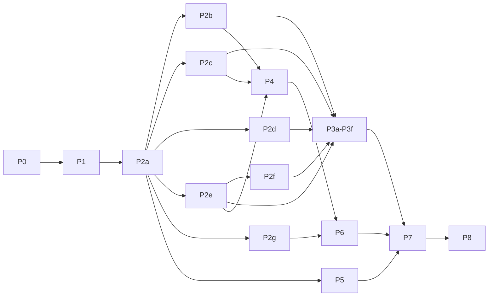

# Mayfly UI implementation roadmap

This roadmap turns the reviewed UI design into an ordered series of changes to `packages/`. It plans the work; it
ships no behavior. It was written on 2026-10-02 against `main` at `94de488`, DeepSeek Harness `0.2.0-rc.2`, and pi-tui
`0.84.2`; where it names a file, a type, or a service, that name exists in that tree unless the text says *new*.

| Input | Role in the implementation |
| --- | --- |
| [`prototypes/ui-preview.mjs`](./prototypes/ui-preview.mjs) with its kit and components | **The final look and behavior.** Every phase reproduces its scenes with the real renderer (§1). |
| [component-library.md](./component-library.md) (the spec) | The rules behind the scenes: states, keys, degradation, vocabulary. |
| [component-library-reference.md](./component-library-reference.md) | Wire mechanics and the backlog IDs (A2 … R25) this roadmap schedules (§9). |
| §2 of this file | The decisions taken after review, and every place the implementation knowingly differs from the prototype. |

Read §1 and §2 first. §3 states the UI API in real terms, §4 the target architecture, §5 the phases, §6 where each
Mayfly component gets its data and where it writes, §7 verification, §8 risks, §9 traceability.

## 1. Rules for every phase

1. **The prototype is the oracle.** A phase is done when the real renderer draws the phase's scenes the way
   `node docs/design/prototypes/ui-preview.mjs <scene>` draws them at the scene's widths: the same rows, glyphs, tones
   (by palette token), and hint rows. The only accepted differences are the rows of §2.3. P0 makes this checkable.
2. **Real signatures stay.** `@ephemeral-ai/mayfly-ui` changes additively: new optional fields, new enum values, and
   two new node kinds (`prompt`, `image`). The prototype's shorthand calls map onto today's builders (§3.1); no existing
   parameter changes, and no field is repurposed.
3. **Mayfly components are pure.** They live in `packages/mayfly/src/components/` (*new*), import only
   `@ephemeral-ai/mayfly-ui` and their siblings, and turn plain facts into `ui.*` nodes. They read no width, paint no
   ANSI, own no timer, and see no key. A spec enforces it (P0).
4. **The architecture rules hold.** Only `packages/mayfly/src/core/` imports pi-tui and owns width, ANSI, focus, layout,
   and clocks. Contributions go through the four services (`mayflyPanes`, `mayflyStatus`, `mayflyOverlays`,
   `mayflyEditorExtensions`); host slots use a core-private lease (§3.4). Effects are Fiber-owned; Agent-scoped writes
   use the exact Agent from `mayflyCurrentAgent`. Data comes from native dsh services and projections; no renderer folds
   session events into a second store.
5. **Every phase is shippable.** Each slice is its own worktree and branch, starts with
   `pnpm run verify:changed -- --plan`, and runs `pnpm run verify:full` whenever `packages/ui` or a shared contract
   changes. It adds width-scan rows for every new row renderer, English and Chinese strings
   (`tests/locale-catalog.spec.ts`), refreshed screenshots (`pnpm run shots:sync`), the Website pages it changes (with
   a LAN preview), and, for runtime behavior, a `PROFILE=mayfly-<tag> script/install-dev.sh` profile with PTY smoke and
   human acceptance before merge (root `AGENTS.md`).

## 2. Decisions and differences

### 2.1 Decisions taken for the implementation

Taken with the reviewer on 2026-10-02, after the design was approved.

| ID | Decision | Consequence |
| --- | --- | --- |
| D1 | **Literal `ui.*` migration, staged.** The status footer, the main editor, and the transcript become pure components whose nodes core compiles, like any plugin surface. | Core gains node-backed host slots and fast paths (§3.4, P4, P6, P7). The transcript migrates last. |
| D2 | **Row-2 views are panes** with a new `placement: 'views'` and a summary. | `mayflyPanes` grows (§3.4); a plugin adds a view with the same call Mayfly uses. |
| D3 | **Native options only** for permissions and plan review. | The permission panel and the onboarding step list the native presets (`read-only`, `workspace-write`, `danger-full-access`). The plan card offers *Approve and start*, *Keep planning…*, *Reject*; there is no *Accept edits* preset and no *Approve and auto-accept edits*. |
| D4 | **Decision cards use variant B, grant-first.** | The common grant is row 1 and focused, digits choose at once, `Esc` rejects, and every card that opens unprompted gets the 300 ms arm delay (E4, P2f). |
| D5 | **No session delete.** The Harness has no deletion (`SessionPersistence` offers `create`, `open`, `flush`, `stat`, `list`). | `/sessions` ships without `x` and without the `u undo · 8s` toast. They return when the Harness exposes deletion. |
| D6 | **Keys are scoped by focus.** | In the editor `Ctrl+S` stays *steer* and `Ctrl+F`/`Ctrl+J` keep their pi-tui editing meaning; inside surfaces `Ctrl+S` is `ui.save`; `Ctrl+F` searches only while the stream or a list has focus; the toast drops `Ctrl+J view` (§3.4 has the table). |
| D7 | **One components area**, `packages/mayfly/src/components/`, with no Cordis entry and no public subpath. | `packages/mayfly/AGENTS.md` gains the area and its layering rule. |
| D8 | **The `/` palette is the editor's completion list.** | Scene 15's inline list, drawn with scene 30's row layout (match bold, description, the command's key at the right). No palette overlay. |
| D9 | **`@` completions: `Enter` or `Tab` insert the token; `Ctrl+G` opens the focused file externally** (`ui.external`, the row shows `↗ code`). | Scene 30's *Files* overlay is not a separate surface. |
| D10 | **Rewind keeps today's conversation branch**, without the restore-scope strip (the Harness has no file checkpoints). | The checkpoint list takes the new look only. |
| D11 | **Changed files opens from a new `/changes` command.** | Data comes from the session's edit and write calls. |
| D12 | **Settings: the rail lists native namespaces; each keeps a draft and saves with `Ctrl+S`** through today's revision-checked `settings.mutate`. | Not the scene's curated groups, and not apply-as-you-go. |
| D13 | **Usage money estimates are priced from models.dev**, in USD, marked `≈`, hidden when a model has no price. | `interaction/models-dev.ts` also reads the catalog's cost fields. |
| D14 | **A new `ui.image` content node** keeps pasted images inline in the stream. | Core paints it with the existing image component; plugins get it too. |
| D15 | **This roadmap lives in PR #84** beside the spec. | — |

### 2.2 Spec §8 questions, resolved

| Spec §8 | Resolution |
| --- | --- |
| 1 Decision variant | B (D4). |
| 2 Rebinding | Overrides persist in the `mayfly` settings namespace (`keybindings`); plugin action ids are namespaced `<owner>.<action>` and `ui.*` is reserved; a clash is refused with the owner's name (P2e). |
| 3 Slash-to-filter | Kept (`filterMode: 'slash'`, P2b). |
| 4 Side conversations | As drawn: identity in row 1's center band, `F7 switch · F8 close` (or `detach`) in row 2's right cluster (P4). |
| 5 Unchecked keys | D6 plus the key audit (P0, P2e). `/view <level>` and `Alt+V` stay unscheduled until confirmed; the scene's `Ctrl+O` level cycling is a demo key. |
| 6 Onboarding permissions step | Ships, with the native presets (D3); the deployment's current preset is marked `recommended`. |
| 7 Delete session | Dropped for now (D5). |
| 8 Account balance | `deepseekAccount.getBalance()` when signed in with the DeepSeek account; API-key providers hide the row (the design's *unsupported*). No identity is shown. |
| 9 Lifetimes | 5 s of visible time for `✓` and `ℹ`; the 8 s undo is unused after D5. |
| 10 Unicode fallback | Specified in P1 as a proposal to confirm at that phase's acceptance. |
| 11 API additions | Approved as §3. |
| 12 Unused builders | `sections` and `diagram` stay for plugins. |
| 13 Trace turn | Derived in Mayfly from the session events (`interaction/trace-aggregate.ts`); no Harness change. |
| 14 Write highlighting | Capped at the expanded card's 12 rows and 32 KB, then plain text. |
| 15 Turn rule | Start time only, as drawn. |

### 2.3 Where the implementation differs from the prototype

Each row is a deliberate difference. P0's parity specs list them by number, and anything else is a defect.

| # | Scene | The prototype draws | The implementation does | Why |
| --- | --- | --- | --- | --- |
| Δ1 | 21 | Variant toggle (`Ctrl+T`), A by default | Variant B only, digits choose, a 300 ms arm delay; the scene's stray-key demo becomes a replay test that grants nothing | D4 |
| Δ2 | 21, 18 | Plan card with four options | *Approve and start*, *Keep planning…* (focuses `Revise:`), *Reject*; `Esc` declines | D3 |
| Δ3 | 21 p4, 29 | *Default*, *Accept edits*, *Full access* | The native presets with their configured names and descriptions; `danger-full-access` asks the shared Yes/No | D3 |
| Δ4 | 24 | `x` delete and `u undo · 8s` | Absent; the hint row omits them | D5 |
| Δ5 | 16 p2 | A toast with `Ctrl+J view` | The toast without a key | D6 |
| Δ6 | 25 | Curated groups, edits applied at once | Native namespaces, a draft per namespace, `Ctrl+S` saves | D12 |
| Δ7 | 26 | `≈ ¥` money figures | `≈ $` priced from models.dev, hidden without a price | D13 |
| Δ8 | 30 p1, p2 | A *Commands* overlay and a *Files* overlay | The editor's `/` and `@` completion lists (scene 15) with the palette's row layout; `Ctrl+G` opens a file | D8, D9 |
| Δ9 | 30 p4 | A restore-scope strip on each checkpoint | No strip; rewind branches the conversation | D10 |
| Δ10 | 19 | Seven prompt styles | Style A (the turn rule) only; the list item `block` field is not added | Spec §5.6 chose A |
| Δ11 | 15 | `Ctrl+K`/`Ctrl+V` add demo tokens | Real flows: pasted images and pastes (`interaction/paste-image.ts`), `@` mentions as tokens | Demo keys |
| Δ12 | 18 | `c` and `Ctrl+G` report what they would do | Real clipboard (`interaction/clipboard-write.ts`) and `$EDITOR` (`interaction/external-editor.ts`) | Demo keys |
| Δ13 | 13, 18 | Row 2 always drawn | Row 2 renders only while a view or a row-2 entry has something to show | Spec §5.1; spec §9 notes the simplification |
| Δ14 | 20 | The after-percentage as a known number | `~` estimate from `compaction/summary.shadowedTokenCount` until the next request reports usage | No native after-value until then |
| Δ15 | 21, 18 | `⚠ deletes files` on a command | A documented Mayfly heuristic on the command text (`rm`, `rmdir`, `unlink`, `git clean`, `del`, …) | No native signal |
| Δ16 | 26, 28 | A balance for every provider | Only with the DeepSeek account sign-in; otherwise the row is hidden | §2.2 row 8 |
| Δ17 | 1 | Captions mention `▌` as the selection mark | The muted bold `→` (spec §2.2) | Stale caption |
| Δ18 | all | The hint words of the kit's `hintFragments` | The same words, including `pick` on a focused select | The kit is the oracle; spec §3.2's table gains `pick` when it is next edited |
| Δ19 | 24 | `n new` on every workspace | `n` acts on the current workspace; other rows carry `unavailableActions.new` with a reason, unless the Harness can start a session in another directory (verify in P3b) | Process cwd |

Spec items the preview does not draw and this roadmap does not schedule: diff hunk review (`HunkReview` is unreachable
in scene 30), scroll match ticks (`marks`, `currentMark`) and `reveal`, the views' fan-out stagger and row flash, and
the edit card's settle flash. They can follow P8 if wanted.

## 3. The UI API in real terms

### 3.1 Prototype calls and today's builders

The kit (`ui-kit.mjs`) shortens a few calls. The implementation keeps today's signatures:

| Prototype | Real API |
| --- | --- |
| `ui.scroll({ id, child, … })` | `ui.scroll(child, { id, … })` |
| `ui.empty(title, { description })` | `ui.empty({ title, description })` |
| `ui.spacer(n)`, `ui.divider(label)` | `ui.spacer({ size: n })`, `ui.divider({ label })` |
| `ui.diff(before, after, options)` | the same, with the new optional third parameter (§3.2) |
| `ui.list({ … })` without `selectedIds` | `selectedIds: []` (required today) |
| list item `label: span[]`, `detail: span[]` | `label: string` (plain, used for filtering) plus `labelSpans` (*new*); the existing `detailSpans` |
| list item `strong: true` | `labelSpans` with `styles: ['strong']` |
| `fields` row `value: 'text'` | `value: [{ text }]` |
| `defineComponent(name, layer, render)` | `defineMayflyComponent({ id: 'mayfly.<name>', render })`; the layer is the module location |
| `patterns.*` | `patterns` exported from `@ephemeral-ai/mayfly-ui` (*new*, P2f) |
| `activate.selected` (each list's cursor row) | The existing action `selections` addresses; a browse list with nothing selected reports its focused row (`UiSurfaceModel.unavailableReason` already resolves it this way) |
| `submit.values` | The existing `MayflySubmission.forms[].fields` |
| reply `invalid.errors: { field: message }` | The existing `MayflyFieldError[]` with form and field addresses |
| `rt.say(message, severity)`, `rt.feedbackNode()` | Reply `feedback`, and `context.report()` for progress; core paints feedback in the surface footer |
| module-level `keymap` | The core `mayflyKeymap` service, extended (§3.4) |

### 3.2 Contract additions

All in `packages/ui/src/contracts.ts` unless noted; every field is optional and defaults to today's behavior.

```ts
// Content
export type MayflyLoaderVariant = 'bloom' | 'fill' | 'gap' | 'breath'
export interface MayflyInlineSpan {
  // …text, tone, styles
  /** One motion channel: the letters shimmer, or the span is one animated loader cell (text must be ''). */
  readonly motion?: 'shimmer' | 'loader'
  readonly variant?: MayflyLoaderVariant              // with motion 'loader'; default 'gap'
}
export type MayflyTextOverflow = 'wrap' | 'truncate' | 'middle' | 'start'   // two new values
export interface MayflyTextNode { /* … */ readonly styles?: readonly MayflyTextStyle[] }
export interface MayflyCodeNode { /* … */ readonly numbered?: boolean }      // highlighting becomes the default
export interface MayflyDiffNode {
  // …before, after
  readonly start?: number            // first line number (default 1)
  readonly numbered?: boolean        // old/new gutters (default true)
  readonly hunkHeader?: boolean      // force an @@ header (default: only when more than one hunk)
  readonly context?: number          // context lines per hunk (default 1, at most 3)
  readonly maxRows?: number          // then `… +N rows · Ctrl+O`
}
export interface MayflyHeatmapChartNode { /* … */ readonly cell?: 1 | 2, readonly columnLabels?: readonly string[] }
export interface MayflyImageNode {   // new kind (D14)
  readonly kind: 'image'
  readonly attachmentId: string      // bytes come from a loader the host tree supplies (P2a)
  readonly alt: string               // the text fallback, e.g. `[Image #1 84 KB]`
  readonly maxRows?: number
}

// Feedback
export interface MayflyLoaderNode {
  // …elapsedMs, cancelActionId, cancelLabel
  readonly message?: string          // now optional: a bare glyph for the activity row
  readonly variant?: MayflyLoaderVariant | 'braille' | 'tide'   // the old values stay accepted as 'gap'
}
export interface MayflyProgressNode {
  // …label, value, max
  readonly style?: 'cells' | 'rule'
  readonly width?: number
  readonly tone?: MayflyTone
  readonly showCount?: boolean       // default true for cells
  readonly showPercent?: boolean
  readonly transition?: { readonly from: number, readonly ms: number, readonly rev: number }  // a renderer-owned one-shot (the compaction drain)
}

// Layout and chrome
export interface MayflyUiChild {
  // …node, id, tab, basis, grow, shrink, minSize, maxSize, when
  readonly priority?: number         // admission order in a row; lower is kept first
  readonly band?: 'left' | 'center' | 'right'
  readonly overflow?: 'truncate' | 'hide'
}
export interface MayflySurfaceNode {
  // …title, subtitle, badges, chrome, padding, child, footer
  readonly titleAlign?: 'left' | 'right'
  readonly border?: MayflyTone
  readonly escapeLabel?: 'close' | 'back' | 'cancel' | 'reject' | 'leave'
  readonly hint?: 'auto' | 'none' | 'completions'
}
export interface MayflyScrollNode {
  // …id, child, follow, scrollbar
  readonly height?: number
  readonly expandedHeight?: number
  readonly fit?: boolean             // shrink to short content; scrollbar only on overflow
  readonly pill?: boolean            // `↓ N new · End` while scrolled away from a followed tail
}

// Tabs
export interface MayflyTabItem {
  // …id, label, disabled, backId
  readonly count?: number | string   // widened: the todo tab reads `2/6`
  readonly attention?: boolean
  readonly group?: string            // rail heading
  readonly clip?: 'end' | 'start'
}
export interface MayflyTabsNode { /* … */ readonly orientation?: 'horizontal' | 'vertical', readonly hintLabel?: string }

// Lists
export interface MayflyListSegment { /* … */ readonly inheritedId?: string }
export type MayflyListBodyNode = MayflyContentNode | MayflyImageNode | MayflyProgressNode | MayflySpacerNode
  | MayflyDividerNode | MayflyListBodyStackNode                               // content only, never a control
export interface MayflyListBodyStackNode extends Omit<MayflyStackNode, 'children'> {
  readonly children: readonly (Omit<MayflyUiChild, 'node' | 'tab'> & { readonly node: MayflyListBodyNode })[]
}
export interface MayflyListItem {
  // …existing fields
  readonly labelSpans?: readonly MayflyInlineSpan[]
  readonly right?: readonly MayflyInlineSpan[]
  readonly rightFocus?: readonly MayflyInlineSpan[]
  readonly body?: string | MayflyListBodyNode
  readonly bodyAlways?: boolean
  readonly expanded?: boolean        // initial disclosure
  readonly wrap?: boolean
  readonly wrapMax?: number          // then `▸ N more lines · Enter`
  readonly meter?: { readonly value: number, readonly max: number, readonly width?: number, readonly tone?: MayflyTone }
  readonly indent?: number
  readonly rule?: string             // a non-selectable muted rule with right-aligned text
  readonly gap?: boolean             // a non-selectable blank row
}
export interface MayflyListNode {
  // …existing fields
  readonly filterMode?: 'type' | 'slash'
  readonly marker?: 'cursor' | 'selection'
  readonly marks?: boolean           // ● ○ on a single choose list
  readonly maxRows?: number
  readonly expandFocused?: boolean
  readonly acceptVerb?: 'open' | 'choose' | 'expand' | 'edit' | 'restore'
  readonly autofocus?: boolean
  readonly focusItem?: { readonly id: string, readonly rev: number }
  readonly hintLabel?: string
}

// Forms
export interface MayflyFormFieldBase { /* … */ readonly help?: string, readonly group?: string }
// input, textarea, secret: readonly pattern?: string, patternMessage?: string, suggestions?: readonly string[]

// Actions
export type MayflyCommonMeaning = 'save' | 'copy' | 'delete' | 'refresh' | 'external' | 'search'
export interface MayflyActionItem {
  // …existing fields
  readonly semantic?: MayflyCommonMeaning   // the key is that meaning's binding; exclusive with `key`
  readonly action?: string                  // `<owner>.<action>` component action; `key` is its default
  readonly hintLabel?: string
}
export interface MayflyActionsNode { /* … */ readonly scope?: string | readonly string[] }

// The prompt (new kind)
export interface MayflyPromptNode {
  readonly kind: 'prompt'
  readonly id: string
  readonly symbol?: string                            // default '> '
  readonly symbolTone?: MayflyTone
  readonly value?: string
  readonly tokens?: readonly { readonly id: string, readonly label: string, readonly size?: string }[]
  readonly recall?: readonly { readonly kind: 'queued' | 'history', readonly text: string }[]
  readonly recallLabel?: string
  readonly placeholder?: string | readonly string[]  // a ladder, longest first
  readonly completions?: { readonly items: readonly { readonly id: string, readonly label: string, readonly detail?: string, readonly right?: string }[] }
  readonly reset?: { readonly rev: number, readonly value: string }
  readonly submitLabel?: string
  readonly autofocus?: boolean
}
```

`MayflyUiNode` gains `MayflyPromptNode` and `MayflyImageNode`. Status nodes stay text, rich text, fields, progress, and
stacks of them, now with child admission but no motion. Editor decorations admit neither new kind. The builders
add `ui.image(...)`, `ui.prompt(...)`, and the optional third parameter of `ui.diff`; `packages/ui/src/patterns.ts`
(*new*) adds the four patterns.

### 3.3 Events

`packages/ui/src/interaction.ts` gains three action events and two observations:

| Event | Class | Carries | Emitted by |
| --- | --- | --- | --- |
| `focus-change` | observation | `controlId`, `itemId?` | a list cursor move, at most once per render frame (detail follows the cursor) |
| `recall-change` | observation | `controlId`, `source: 'queued' \| 'history' \| 'draft'`, `index` | the prompt walking its recall |
| `token-remove` | action | `controlId`, `tokenId` | the prompt's second `Backspace` |
| `completion-accept` | action | `controlId`, `itemId` | `Tab` or `Enter` on a completion |
| `completion-dismiss` | action | `controlId` | `Esc` on an open completion list |

The prompt reuses two events: `value-change` (with `formId` set to the prompt id) and `submit`, whose
`MayflySubmission` holds one form addressed by the prompt id with the fields `text` and `tokens` (the token ids). The
replies are unchanged.

### 3.4 Services, runtime, and core-private seams

| Seam | Change |
| --- | --- |
| `mayflyPanes` (public) | `MayflyPanePlacement` gains `'views'`. A views pane declares `summary: { node: MayflyStatusNode, count?: number \| string }` and updates it with the new `registration.setSummary(summary \| null)`; `null` takes the view out of row 2. Its `set(node)` publishes the panel. `size` and `narrow` do not apply; `onEvent`, `load`, `refresh`, and `loadMore` work as for other panes. |
| `mayflyOverlays` (public) | `MayflyOverlayDefinition.armMs?: number` (0-2000, default 0): every key except `Esc` is swallowed for that long after the overlay first takes focus. |
| `mayflyStatus` (public) | No new API. Core composes row 1 and row 2 with the `ui.child` admission primitive, so a plugin entry and a Mayfly entry are admitted by one rule. |
| `mayflyEditorExtensions` (public) | No new API. `complete()` results join the prompt's completion list; `before`/`after` decorations sit around the editor surface. |
| `mayflyKeymap` (core service) | Scopes (`global`, `editor`, `surface`, `stream`); `bind(id, keys)`, `reset(id)`, `resetAll()`, `list()` (label, scope, defaults, effective keys, owner, overridden), `preferPlain`. Conflicts are refused per scope with the owner's name (the existing `KEY_CONFLICT`). |
| `mayflyScreen` (core-private) | *New* `mountNodeSlot(id, { region: 'content' \| 'dock' \| 'footer' })` returns `{ set(node), dispose() }`; core compiles the node like a surface, with its interaction state in `mayflyUiInteraction`. The footer (P4), the editor (P6), and the conversation (P7) use it. |
| `mayflyUiInteraction` (frontend) | A *new* `UiPromptModel` beside the form, choice, and tab models (draft, selected token, recall index), and list `focusItem` and expansion state, so a core reload keeps them. |

The key scopes of D6:

| Key | Editor (prompt focused) | Surface (overlay or pane focused) | Stream focused |
| --- | --- | --- | --- |
| `Ctrl+S` | steer (`mayfly.interaction.steer`) | `ui.save` | — |
| `Ctrl+F` | cursor right (pi-tui) | `ui.search`, when a list has focus | `ui.search` |
| `Ctrl+G` | `ui.external`: the draft in `$EDITOR` (today's behavior) | `ui.external`: the focused content | `ui.external`: the row |
| `Ctrl+J` | newline (pi-tui) | `ui.newline` in a textarea | — |
| `c` `x` `r` | text | `ui.copy` `ui.delete` `ui.refresh` (no type-to-filter list, not editing) | `ui.copy` |
| `Alt+↑` / `F4` | focus the stream | `ui.focus-prev` | — |
| `Alt+↓` / `F5` | enter the views (empty prompt) | `ui.focus-next` | back to the prompt |
| `F6` | enter the views, then the interactive panes (`mayfly.surface.next`) | next surface | next surface |
| `?` | key help (empty prompt) | text | — |
| `F7` / `F8` | conversation switch / close or detach (global) | same | same |
| `Ctrl+O` | the last three turns at Verbose (global) | same | same |
| `Ctrl+T` | open the views on Todo (global; replaces the todo-pane toggle) | same | same |

### 3.5 What is not added

`MayflyListItem.block`, `strong`, and `expandable` (a body implies it); scroll `marks`, `currentMark`, and `reveal`; the
reference's F1 *buttons on demand*. None appears in the preview.

## 4. Target architecture

```
native dsh services and projections            (Agent, Session, goal, jobs, userQuestions, settings, account, …)
        │ facts (plain readonly data)
        ▼
feature plugins in transcript/ and interaction/  (Fiber-owned subscriptions, writes, timers for data refresh)
        │ call
        ▼
components/  (pure: facts + t → ui.* nodes)     ◄── the same builders a plugin uses
        │ nodes
        ▼
four public services, or a core-private host slot lease
        │
        ▼
core: validator → compiler → painters; one key grammar; one keymap; the only clocks
        │
        ▼
terminal (pi-tui)
```

- **`packages/ui`** owns the wire contracts, builders, and patterns. It never imports Cordis outside `./provider`.
- **`components/`** holds every Mayfly component of spec §6.2 under the names in §6. Each is
  `defineMayflyComponent({ id: 'mayfly.<name>', render })`, takes facts plus a `t` translator, and is covered by
  fixtures, a width scan, and a parity spec.
- **Feature plugins** keep their Cordis rows. They subscribe to native services, keep Agent identity exact, own data
  refresh timers (an elapsed counter is data, refreshed once a second), and publish the component's node.
- **Core** owns every animation clock (loader variants, shimmer, one-shot transitions), width ladders, admission,
  focus, the key grammar and keymap, and the host slots. The prototype's `--audit` becomes
  `tests/components/layering.spec.ts`.

## 5. Phases

| Phase | Slices | Delivers | Prototype scenes | Gate |
| --- | --- | --- | --- | --- |
| P0 | 1 | The oracle and the guardrails | all (goldens) | full (workflow) |
| P1 | 1-2 | The visual language in today's painters | 1, 7, 8, 9 | full |
| P2 | 7 (2a-2g) | The basic-component additions of §3 | 2-12, 15 (isolated) | full each |
| P3 | 6 (3a-3f) | The components area and every command panel | 21-32 | full for 3a (new area), then changed; profile |
| P4 | 1-2 | The two status rows and the views | 13, 12 | full + profile |
| P5 | 1 | The activity row, motion, notices, compaction | 14, 16, 17, 20 | changed + profile |
| P6 | 1-2 | The editor as a prompt composition | 15, 30 p1-p2 | full + profile |
| P7 | 2-3 | The stream as a list, levels, search, request rows | 17-21 | full + profile |
| P8 | 1 | Website, skills, docs, cleanup, release | — | full + pack |



### P0 Oracle and guardrails

**Goal.** Make "draws like the preview" checkable and the layering rule executable, before anything visible changes.
The prototype is not modified.

- **Golden frames.** `script/design-golden.mjs` (*new*) runs
  `node --import script/design-golden-clock.mjs docs/design/prototypes/ui-preview.mjs <scene>` (the preload is *new*
  too) with piped stdio, so the runner takes its non-TTY path. The preload pins `Date.now` and turns `setInterval`
  into a no-op, so every frame is frame 0 at a fixed time. The script sends each scene's key walks (one walk per page
  and state named in the scene's footer), writes a NUL byte to force a repaint where no key does, strips the runner's
  cursor-control prefix, and keeps the scene body. It writes `packages/mayfly/tests/design/golden/<nn>-<scene>/<walk>.txt` (visible text) and `.ansi`
  (raw). `--check` fails when the prototype's output changes. (This capture was tried on scene 13 while writing this
  roadmap and is deterministic.)
- **Parity helper.** `packages/mayfly/tests/design/parity.ts` (*new*) compiles a node with `compileMayflyUiNode` at the
  golden's width, the way `script/shots/render.mjs` does, drives keys through the compiler's focus target, strips ANSI,
  and compares rows with trailing spaces trimmed. Tones are compared for the marks (`→ ● ○ ◐ ✓ ✗ ⚠ ?`) by mapping the
  prototype's six truecolor values and its dim and bold attributes to palette tokens. `tests/design/deltas.ts` (*new*)
  lists the accepted differences, each citing its §2.3 row.
- **Layering spec.** `packages/mayfly/tests/components/layering.spec.ts` (*new*): a file under `src/components/`
  imports only `@ephemeral-ai/mayfly-ui` and its siblings; no `node:` module, no Cordis, nothing from `../core`, no
  width helper (`visibleWidth`, `truncateToWidth`, `wrapText`), no escape sequence, no timer, no keymap. A second test renders every
  component's fixtures and records the node kinds it emits, which must match spec §6.2's builder column.
- **Key audit.** `packages/mayfly/tests/core/key-audit.spec.ts` (*new*): within one scope no two actions share a key;
  every default that uses Alt has a plain alternative; no printable key binds in the editor scope.
- **Impact rules.** `script/test-impact.mjs` selects the components and parity specs for `src/components/**` and the
  golden `--check` for `docs/design/prototypes/**`.

Acceptance: review of the goldens beside the interactive preview. No runtime profile.

### P1 Visual language in the painters

**Goal.** Everything already on screen adopts the vocabulary of spec §2, with no contract change.
**Backlog:** A2, A4 (core), B5, C1, C2 (defaults), D1, D2, G4, G8, G9, G12, G22, H3, R13 (contrast).

| Area | Change | Files |
| --- | --- | --- |
| Chrome | `chrome: 'surface'` draws rounded corners; overlay borders use the focus color, surfaces the quiet border; `lane` is rules only; `none` is a bold title | `core/ui-patterns.ts` (`renderSurfaceHead`, `renderSurfaceTail`), `core/chrome.ts` |
| Marks | Choose lists and pickers draw `●`/`○` (`◐` for a partial parent), never `[x] [ ]`; toggles keep `[on]`/`[off]`; one muted `[current]`; the cursor `→` shows only while its list has focus; a selection list keeps a muted bold `→` | `core/ui-patterns.ts`; delete `CURRENT_MARK` and `SELECT_POINTER` in `interaction/symbols.ts`; `theme-switch.ts`, `permission-panel.ts`, `model-commands.ts` |
| Tabs | The active tab is text color with a heavy `━` underline (dim without focus), never wrapped in `‹ ›` | `core/ui-patterns.ts` |
| Feedback | A glyph and a word (`✓ ℹ ⚠ ✗`); `✓`/`ℹ` leave after 5 s of visible time, `⚠`/`✗` stay | `core/ui-compiler.ts` (feedback row), `core/ui-interaction-notifications.ts` |
| Hints | The kit's words and order, `Ctrl+O` notation, ranges `1-3` | `core/ui-key-grammar.ts`, `core/context-hint-locale.ts`, `transcript/hints.ts`, `transcript/locale.ts` |
| Diff | Old and new numbered gutters; `−`/`+`; `diffRemovedBg`/`diffAddedBg` behind the code only, never the gutter; `⋯` between hunks; long lines end in `…` | `core/diff-align.ts`, `core/plugin-view.ts` |
| Code | Highlighting on by default, capped at 12 rows and 32 KB | `core/highlight.ts`, `core/plugin-view.ts` |
| Monochrome | `NO_COLOR` (or a setting) keeps weight only: `primary`, `warning`, `danger` bold, `muted` dim | `core/theme-palette.ts`, the theme modules |
| Motion | A reduced-motion setting freezes each channel on its first frame | `core/ui-loader-animation.ts`, `interaction/settings.ts` |
| Glyphs | A `glyphs: 'unicode' \| 'ascii'` setting, defaulting from the locale's charset, applies the table below | `core/chrome.ts`, `core/ui-patterns.ts` |
| Contrast | A guard spec: every tone token at least 4.5:1 against the background in all five themes | `tests/core/theme-*.spec.ts` |

Unicode fallback (a proposal; every replacement is one cell; confirm it at this phase's acceptance):

| Unicode | ASCII | Unicode | ASCII |
| --- | --- | --- | --- |
| `→` | `>` | `■` `?` `⚠` `ℹ` | `#` `?` `!` `i` |
| `▸` `▾` | `+` `-` | `⎿` `│` | `L` `:` |
| `●` `○` `◐` | `*` `o` `~` | `━` `─` | `=` `-` |
| `‹` `›` | `<` `>` | `▰` `▱` | `#` `.` |
| `✓` `✗` `⊘` | `v` `x` `/` | `╭` `╮` `╰` `╯` | `+` `+` `+` `+` |
| `░` `▒` `▓` `█` | `.` `:` `*` `#` | spinner frames | `-` `\` `\|` `/` |

Scenes: 1 (pages 1-5), 7 p1, 8 p3-p4, 9 p3. Acceptance: open `/model`, `/settings`, `/permission`, `/theme`, `/status`,
and an edit approval at 120 and 60 columns; `NO_COLOR=1 dsh --profile mayfly-<tag>`; every shot refreshed.

### P2 Basic components

Every slice changes `packages/ui`, so it runs the full gate, updates `website/plugins/ui-reference.md` and its English
twin together with `script/shots/manifest.mjs` (their fidelity contract), adds `examples/ui-gallery` coverage for the new
props, and keeps `pnpm run check:examples` green.

#### P2a Content, layout, and motion

**Backlog:** C1, C2, C3, C4, D3, R4, R25 (chart).

- **Admission.** A `stack.row` whose children carry `priority` admits them in order while they fit; `hide` drops a child
  instead of truncating; a `truncate` child takes the remaining room (at least 8 cells); once the row is full later
  children drop; admitted children lay out by band. This is the kit's `renderAdmit`, moved into `core/ui-compiler.ts`
  from `StatusFooterComponent.renderRow` in `transcript/status-model.ts`, which P4 deletes.
- **Surfaces.** A right-aligned title (start-ellipsised when long), a `border` tone, `escapeLabel` driving the `Esc`
  hint and close semantics (`reject` dismisses as a rejection), and `hint: 'none' | 'completions'`.
- **Scroll.** `height`, `expandedHeight`, `fit`, and `pill`.
- **Content.** Text `middle`/`start` ellipsis (`core/width.ts`) and `styles`; diff `start`, `context`, `maxRows`, and
  hunk headers; code `numbered`; heatmap one-cell mode with `· ░ ▒ ▓ █`, month labels, and the legend row
  (`core/chart-renderer.ts`); progress `rule` (`━`/`─`), cells (`▰▱`), `n/N`, percent, and `transition`.
- **Motion.** `core/ui-loader-animation.ts` gets per-variant tables and cadence: bloom, fill, and gap at 100 ms; breath
  through six tone shades at 400 ms a step; shimmer as a three-letter `accent`+`strong` window over `muted` (weight
  only in monochrome). One clock per surface (as today), stopped while hidden, frozen by reduced motion. The validator
  rejects two motion channels in one rich-text row and any motion in a status node.
- **Images.** `ui.image` paints through the existing `createImage` adapter. The bytes come from a loader the host tree
  supplies from the native attachment store (the transcript's `UserImageLoader` today), so core stays independent of
  the Harness; `alt` shows until the bytes arrive and on a terminal without an image protocol.

Scenes 7, 8, 9, 10. Tests: validator and compiler specs for every field, `ui-loader-animation.spec.ts` (variants,
cadence, freeze), `chart-renderer.spec.ts`, `diff-align.spec.ts`, and width scans of admission ladders from 24 to 140
columns.

#### P2b Lists

**Backlog:** E1, E5, G2, G3, G25, B2, R9 (lists).

- **Slash filter.** `filterMode: 'slash'`: printable keys never start a search; `/` starts it or resumes the kept
  query; `Esc` ends it and keeps the query; `Ctrl+U` clears; the hint reads `/ filter`. The validator lifts its
  printable-accelerator rejection (`core/ui-validator.ts`) only when every filterable list on the page is `slash`.
  Digits stay text while typing into a filter.
- **Rows.** `marker: 'selection'` keeps a muted arrow after focus leaves; `marks` draws `● ○`; `maxRows` windows the
  list with an `↑ n more · ↓ n more` row; the filter row shows `N matches`; `acceptVerb` names `Enter`; `autofocus`;
  `focusItem` moves the cursor when its `rev` changes and opens the parents; `expandFocused`; bodies (`▸ ▾`, a `│ ╰`
  guide for string bodies, node bodies compiled as content only); `wrap`/`wrapMax`; `meter`; `indent`; `rule` and `gap`
  rows that navigation skips; `labelSpans`, `right`, `rightFocus`; tree `*` and `-`.
- **Segment strip on the row** (E1, G3). Drawn on the focused row only; `(default)` while unpinned; `←/→` clamp and
  skip disabled tokens; stepping onto the inherited token unpins; `Delete` unpins (`use default`). It degrades by
  dropping `(default)`, then the label, folding far tokens into `+N`, moving to one footer line the list reserves in
  advance, and last showing the active token alone, so focus never moves a row.

Files: `core/ui-validator.ts`, `core/ui-compiler.ts` (`segmentRows`), `core/ui-patterns.ts` (`renderList`,
`renderListSegment`), `core/ui-interaction-choice.ts`, `core/ui-interaction-tree.ts`, `core/ui-key-grammar.ts`
(`rowBindings`, `listText`). Scenes 5 (all seven pages) and 1 p1. Tests: the hint row in every list state (idle,
searching, segment pinned and unpinned, tree, numbered), choice reducers, and the segment ladder at 120, 84, 62, and 40
columns.

#### P2c Tabs, rails, and focus levels

**Backlog:** F2, G24, R9 (tabs), R22.

- The horizontal strip folds narrow as `‹ active next +N ›`; counts are muted, `!` is `warning` strong.
- The vertical rail draws group headings, a `primary` bold `→` while focused (muted when focus is in the content), and
  right-aligned counts or `!`; `clip: 'start'` keeps the distinguishing end of a label. `↑/↓` emit `tab-change` at once
  so the content follows live; `→` or `Enter` enter the content; below 60 columns the rail becomes the strip.
- **The `←` ladder.** A control consumes `←` only when it changed something: a select at its first option, a number at
  its minimum, or a segment at its end does not. An unconsumed `←` moves focus to the surface's rail wherever it sits;
  `← labels` is hinted only when true; on the rail `←` does nothing.
- **Focus levels.** `ui.focus-prev`/`ui.focus-next` (`Alt+↑/↓`, also `F4`/`F5`) move between controls outside text
  editing; `ui.tab-prev`/`ui.tab-next` (`Alt+←/→`, also `F2`/`F3`).
- `focus-change` reaches observers at most once per frame and cannot publish, navigate, or dismiss.

Files: `core/ui-compiler.ts`, `core/ui-patterns.ts`, `core/ui-key-grammar.ts`, `core/ui-interaction-surface.ts`,
`core/key-actions.ts`, `interaction/keys.ts`. Scenes 6 (four pages) and 11 p2.

#### P2d Forms

**Backlog:** B3, G7, R9 (forms).

Group headings `── Group ──`; the focused field's help line (dropped first when narrow); `! message` under a field once
edited; `•` for an edited field; `(inherited)`/`(override)`; a secret reads `•••• (saved)`; a number reads
`‹ 45 › s  5–120`; a focused textarea opens its box; `pattern` validates on commit (sources capped at 256 characters);
`suggestions` show `⇥` and `Tab` completes. `enterSubmits` on a form whose focused field is a select or toggle submits on
`Enter` (`Space` opens the picker). Buttons: a single-field form draws none; a multi-field form draws one primary
submit (`submitLabel` or *Save*); `cancelActionId` is never drawn and runs as the close step. Core adds the
`unsaved changes` header badge while a form is dirty. `ui.save` submits the surface's form from any field.

Files: `core/ui-interaction-form.ts`, `core/ui-compiler.ts`, `core/ui-patterns.ts` (`renderFormField`),
`core/ui-key-grammar.ts`; re-check every consumer of `cancelActionId`. Scenes 3, 4, 12.

#### P2e Actions, named actions, and the keymap

**Backlog:** R21 (API), the D6 scopes.

- **Actions.** `semantic`, `action`, `hintLabel`, and `scope`. The validator requires `<owner>.<action>` ids, reserves
  `ui.*`, rejects `semantic` together with `key`, and checks that `scope` names a control on the page.
- **Named actions.** The navigation and common-meaning ids of the kit's `DEFAULT_KEYMAP` (`ui.up` … `ui.search`)
  replace the `mayfly.interaction.*` navigation ids in `core/key-actions.ts` and `interaction/keys.ts`; product actions
  (interrupt, steer, cycle model, `F7`, `F8`) keep their ids and gain a scope.
- **Keymap service** (`core/keymap.ts`): scopes, `bind`, `reset`, `resetAll`, `list`, `preferPlain`. A rebound-away key
  is dead, not an alias. `Esc` and `Enter` cannot be unbound. The first `F2`-`F5` press sets `preferPlain` for the
  session; a setting sets it for good.
- **Persistence.** `keybindings` in the `mayfly` settings namespace (`interaction/settings.ts`), applied live through the
  volatile schema and written through `settings.mutate`. `/keys` lists the actions the runtime has seen in admitted
  nodes plus every action with a saved override (its label is saved beside it); there is no declaration API, so the
  four contribution services stay the only plugin surface.
- **Decoder.** Check pi-tui's parser against the encodings of spec §3.5 (xterm `CSI 1;3A` with or without a kitty event
  type, an `ESC` prefix, SS3, kitty `CSI u`, modifyOtherKeys) and normalize any gap beside the existing input
  normalization in `core/terminal.ts`.

Hint rows read effective keys (`keyActionKeys`); `SHARED_KEY_REFERENCE`, both Website `reference/keys.md` pages, and
`tests/core/key-grammar-docs.spec.ts` move together. Scenes 2 and 32 (with P3f).

#### P2f Patterns and the arm delay

**Backlog:** E4 (now required by D4).

`packages/ui/src/patterns.ts` exports `patterns.decisionPanel`, `railPanel`, `splitView`, and `statusPage`: pure and
frozen, built only from the builders, with the kit's props adapted to the real ones (§3.1). `armMs` is implemented in
the overlay focus path (`core/surface-renderer.ts`, `core/ui-interaction-surface.ts`). `examples/mayfly-user-kit` adopts
one pattern as the plugin-side proof. Scenes 11, 12. Tests: a replay that types `1` and `Enter` into the editor while a
request opens grants nothing; after the delay the same keys choose.

#### P2g The prompt node

**Backlog:** R20 (contract).

Core compiles `prompt` on top of the existing editor adapter (`createEditor` in `core/components.ts`), so kill-ring,
undo, paste folding, and IME stay pi-tui's. The first row paints the symbol, the tokens (`[label size ×]`, inverse when
selected), and the buffer; the right corner reads `↑ history 2/4` while recalling; the placeholder is the longest
variant that fits, never cut inside a trigger, and hidden for a multi-line buffer or an IME composition; the completion
list shows up to five rows and, with `hint: 'completions'`, its key line. Keys: the first `Backspace` on an empty buffer
selects the last token and the second removes it (`token-remove`); `↑/↓` on an empty buffer walk `recall`, queued
messages first (`recall-change`), and `↓` past the newest returns the draft; `Enter` submits; `Alt+Enter` and `Ctrl+J`
insert a newline. The draft lives in `UiPromptModel`. Scene 15 in an overlay harness at 96, 60, and 40 columns; paste and
IME go through `docs/platform-acceptance.md`.

### P3 Components area and panels

Creates `packages/mayfly/src/components/` (`index.ts`, no Cordis entry, not exported) and records it in
`packages/mayfly/AGENTS.md`. Each slice moves its panels' node building into components, rewires the owning plugin, and
adds the component's fixtures, parity spec, width scan, strings, and shots. §6 lists every component's facts and writes.

| Slice | Panels | Scenes | Key changes |
| --- | --- | --- | --- |
| P3a | `/model`, `/effort`, `/permission`, `/theme` marks | 23, 21 p4 | Thinking strip on the row with `inheritedId` (the `default` pseudo-option goes); no buttons; `[current · high]`; `/effort` as a numbered list with *Provider default*; native presets with `danger-full-access` behind the shared Yes/No (E1-E3, G2, G7) |
| P3b | `/settings`, `/sessions` | 25, 24, 6 p3 | `patterns.railPanel`; settings namespaces each a tab page so drafts survive switching, `Ctrl+S` saves through the existing CAS path, *Open settings.yaml* becomes `Ctrl+G`; sessions with long-path rules, `filterMode: 'slash'`, `expandFocused` bodies, `c` copy path, `n` new (Δ19), no delete (R10, R18) |
| P3c | `/status`, `/account`, onboarding | 26, 28, 29 | `patterns.statusPage` with Overview, Usage (heatmap and statistics), Account, Connections, About; the account panel with no buttons in any state; the four-step wizard with native presets (R16, R17, R25) |
| P3d | `/plugin` | 27 | `patterns.splitView` at 100 columns, slash filter, `i u x s r` keys, detail following the cursor through `focus-change`, a single-flight loader, the persistent restart banner (R15) |
| P3e | Questions, decision cards | 22, 21 | The wizard with a Review page and `←/→` between questions; `patterns.decisionPanel` as a lane card in the editor slot, variant B, `armMs: 300`, `Esc reject`, `Feedback:`/`Revise:` on the same line, `Ctrl+G` opens the diff or plan, `c` copies the plan (B1, G5, G7, R8, R23). Until P7 the plan keeps today's content-flow document and approvals show their reason above the card. |
| P3f | `/trace`, `/keys`, key help, rewind, job output, `/changes` | 31, 32, 30 p3-p6 | The trace tree with duration meters and numbered JSON; the keybinding panel with capture and restore; key help grouped by task; rewind rows without a strip; job output with follow and stop; the new `/changes` (R11, R21, R24) |

Notes per slice:

- **P3a.** `commitModelSelection` in `interaction/model-commands.ts` stays the write path; `selection-accept.segmentId`
  absent means unpinned (provider default). The notice reads `Switched to <model> (<provider>) · thinking high` or
  `Thinking set to high`.
- **P3b.** Rail labels come from `settings.describe({ redactSecrets: true })`; schema sub-objects become `group`
  headings and schema descriptions become `help`. A revision mismatch still replies `conflict`. Session bodies and
  titles keep the bounded, revision-keyed reads of `interaction/session-list-reads.ts`.
- **P3c.** The Usage tab builds a cross-session index from `sessionPersistence.list()` (once per refresh) and bounded
  cold reads, cached by persistence revision in the command Fiber, the `/sessions` precedent; `sessionStats` supplies
  the current session's figures; models.dev supplies prices. Slow reads show the gap spinner and never block another
  tab. The Account tab and panel read `deepseekAccount.getState()`, `getBalance()`, and `AccountView.links`.
- **P3e.** Approval answers stay `ApprovalOutcome` (`allowed-once` with the per-Agent allowance for *this session*, or
  `rejected` with the feedback steered to the Agent, both already in `interaction/approval-plugin.ts`). Plan answers
  stay `AskUserQuestionAnswer`: the approve label, the decline label, or `custom` text for *Keep planning…*; dismissal
  becomes a decline instead of `ASK_CANCELLED`. The queue position reads `1 of N waiting` from the approval plugin's
  FIFO.
- **P3f.** `trace-aggregate.ts` derives each item's turn from `turn/start` boundaries and its duration from the next
  record's time; the detail follows the cursor through `focus-change`; `/trace copy <seq>` and `copy all` remain.
  `/changes` (*new* `interaction/changes-command.ts`) lists the session's edit and write calls; `Enter` opens the file
  at its first changed line in the external editor (detached with `file:line` for GUI editors, `screen.suspend` for
  terminal editors, only inside the workspace, and pointing to `/settings` when none is configured), `d` shows the diff.
  Job output reads with `jobs.read`/`readAt` without splitting surrogate pairs, and `x` rechecks `jobs.get` before
  `jobs.kill`.

### P4 Status area and views

**Goal.** Two composable rows; row 2 views through the public pane API. **Backlog:** B4 (chips), C4, G16, G17, G23, R6,
R7, R20 (status).

- **API.** `placement: 'views'`, `summary`, and `setSummary` (§3.4); the validator requires a motion-free status node as
  the summary. `core/surface-manager.ts` and `core/surface-renderer.ts` gain a views lane: no rows of its own, its
  summaries joining row 2, its panel shown in place of row 2 when entered, events routed to the active registration.
- **Footer.** The transcript footer plugin builds `StatusRows` (§6) from `mayflyStatus.list()` and the views panes, and
  leases the footer slot with `mountNodeSlot`. `StatusFooterComponent` goes; admission is P2a's primitive.
- **Row 1.** The existing registrations, restyled: model and effort (priority 0), uppercase `PLAN`/`PLAN…` primary
  strong and `YOLO` warning strong (priority 1, `interaction/mode-status.ts`), context (4, right, hide), directory (5,
  truncate), the low-balance chip `⚠ ¥6.2` (6, right, account only, *new*), git (10), the side-conversation identity in
  the center band (`interaction/conversation-view-status.ts`, without its key text), and plugin entries.
- **Row 2.** Agents (`transcript/pane-agents.ts`), Jobs (`transcript/status-jobs.ts`), Goal (`transcript/status-goal.ts`),
  and Todo (`transcript/pane-todo.ts`) become views panes; the right cue reads `↓ views`, or `F7 switch · F8 close` (or
  `detach`) when two or more conversations exist. The goal chip leaves row 1 and the todo pane leaves the space above
  the editor.
- **Entering.** `Alt+↓`/`F5` on an empty prompt, or `F6`, focuses the first view's panel; `←/→` switch views; `↑/↓`
  select; `Enter` opens an agent's conversation (`mayflyConversations`, `F7` returns) or a job's output; `x` stops behind
  the shared Yes/No (`subagents.interrupt(child, { kind: 'ancestor', agent })`, or `jobs.kill` after rechecking
  `jobs.get`); `Esc` returns to the prompt. `Ctrl+T` opens the views on Todo.
- **Goal and todo panels.** The rule heading is the progress bar (`progress` with `style: 'rule'`); the goal shows
  `● active`, `❚❚ paused`, or `✕ blocked` with its reason, from the `goal` projection; the todo panel shows at most five
  rows (in progress, the earliest pending, one slot for the latest done) and `… +N more (k done)`, then
  `✓ Todo done 6/6 · 4m 12s` before the view leaves.

Scenes 13 (100, 72, 52, and 36 columns, every toggle), 12, 18 (the rows under the stream). Tests: the views lane in the
surface specs, `tests/e2e.spec.ts` with a plugin view registered through the public service and cleaned up with its
Fiber, admission width scans, and a PTY smoke that enters the views, stops a job, and returns. Website:
`features/status-bar.md`, `features/panes.md`, `plugins/status.md`, `plugins/dock.md`, `reference/keys.md` (both
languages).

### P5 Activity row, motion, notices, and compaction

**Backlog:** G10, G13, G20, G21, H4, H5, R1, R2, R5.

- **Activity row** (`ActivityRow`). The glyph by phase: thinking blooms, *Deep diving* fills, waiting on an external
  action breathes, a running tool keeps a still `●` while its label shimmers, waiting on the user is a static `?`, and
  stopping is a static `■`. The header tail (`· 8s · ↑30.2k ↓1.1k · 38 tok/s`) is priority 2 and hides first; the right
  gap (priority 1) carries `Esc interrupt · Ctrl+O expand` while a detail exists, the rotating tip only in the
  *Deep diving* row, or a toast. Up to three `⎿` detail items, one truncated row each, as the scene draws. The row pads
  to the turn's highest detail count (a plugin fact) and renders nothing when idle.
- **Ownership.** `transcript/pane-activity.ts` stops measuring widths and stops animating: core's clock moves the glyph
  and the shimmer; the plugin republishes once a second for the elapsed time and throughput (data, not motion). The
  moon and braille tables in `transcript/spinners.ts` and the `tide` loader retire.
- **Tips and cues.** Tips teach keys and prefixes (`transcript/tips-content.ts`) and appear only in the
  *Deep diving* gap; a quiet-hints setting (`minimal`, `off`) trims the gap cue and the placeholder.
- **Notices.** `Banner` rows for rate limiting, offline, context nearly full, low balance, and a resumed session, bound
  to the native facts that carry them (confirm the retry and offline signals against the Harness reference); toasts in
  the activity gap from the notification lane.
- **Tool rows.** `ToolLine`, `EditCard` (numbered diff, diffstat, `A`/`M`/`D` per file, the failure reason on `⎿`), and
  `WriteCard` (one line, numbered highlighted code when expanded), ready for P7.
- **Compaction.** `CompactionRow` over `compaction/start`, `compaction/summary` (`shadowedTokenCount`), and
  `compaction/end` (`error`): `1/2 summarizing`, `2/2 applying`, the occupancy bar from the token meter, the 800 ms drain
  as a `progress.transition`, the settled `✓ Compacted 84 items · 91% → 9%`, and the failure row.

Scenes 14 (every phase at 96, 60, 40, 28), 16, 17, 20.

### P6 Editor

**Backlog:** B4 (border), G15, G18, G19, H7, H8, R11 (`?`), R20 (editor).

- The `Editor` component: an optional queue line (`queued (2)  ⏎ "…"  +N  ↑ recall`, three items cut to 22
  characters), then `ui.surface({ titleAlign: 'right', chrome: 'surface', hint: 'completions', border })` around
  `ui.prompt`. `interaction/input-plugin.ts` publishes it into the editor dock slot through `mountNodeSlot`.
- **Title** from the official `title` session projection (the source `interaction/terminal-title.ts` mirrors).
- **Shell mode** is the `!` symbol and the `accent` border only; `setBorderLabel` goes (`interaction/editor-plus.ts`).
- **Tokens**: pasted images, pasted blocks, and `@` mentions become prompt tokens; on submit the existing pipeline
  (`interaction/prompt-submit-pipeline.ts`) expands them to the same content it sends today.
- **Recall**: queued messages first, then history; recalling a queued message withdraws it (today's `withdrawQueued`),
  and sending it again queues it. `interaction/pane-queue.ts` becomes the queue line.
- **Placeholders** by state from spec §3.3 (main idle or running, shell, side question, subagent live or resumable,
  read-only).
- **Subagent replies** (G18). In a live or resumable subagent conversation the editor sends through the existing
  addressed-subagent path in `interaction/subagent-reply.ts`, and the explicit delivery choice becomes the editor's own
  pair: `Enter` queues, `Ctrl+S` steers. The reply form's `Send`/`Cancel` buttons and its delivery select go;
  `mayfly/request-subagent-reply` stays for plugins.
- **Completions** for `/` (commands, D8), `@` (files through `createFileMentionProvider`; `Enter`/`Tab` insert, `Ctrl+G`
  opens, D9), and `#` (skills); editor-extension `complete()` results join them. The legacy autocomplete adapter
  (`SelectListAdapter`, `core/wrapping-select-list.ts`) retires.
- **Keys** in the editor scope: `Alt+↑` focuses the stream (after P7), `Alt+↓`/`F6` enter the views, `?` opens key help
  on an empty prompt, `Ctrl+S` steers, `Ctrl+G` opens the draft externally.

Scenes 15 (every context at 96, 60, 40), 30 p1-p2 (as completion lists), 13. Platform acceptance for paste, IME, and the
clipboard on macOS, Linux, and Windows.

### P7 Transcript and request rows

**Backlog:** A4 (transcript), G11, G14, H2, H6, R3, R12, R19, R23.

- **`TranscriptView`** returns one `ui.list({ id: 'stream', role: 'browse', acceptVerb: 'expand', hintLabel: 'stream' })`
  and an actions node scoped to the stream (`ui.copy`, `ui.external`). Rows per level follow spec §5.6 and the kit's
  `turnItemsRaw`: the turn rule (a gap and a rule with the start time) before every turn after the first; the prompt
  row with `wrapMax: 4`; the header with its diffstat or the failure line; edit cards with numbered diffs (6 rows
  collapsed, 12 expanded); command rows with their `⎿` tails; reasoning rows; wrapped answers; `⏎ queued` and
  `■ interrupted`; compaction rows; images as `ui.image` bodies; the welcome banner as rich text.
- **Levels.** `transcript/presentation-policy.ts` keeps the four modes with the policies of the spec's table (the header
  open at Detailed, everything open at Verbose, detail in exactly one place); `Ctrl+O` opens the last three turns at
  Verbose; `Enter` on a header toggles that turn.
- **Request rows.** A pending approval (`approval/asked` without `approval/decided`, matched to the tool call by
  `callId`) or plan review (`userQuestions` projection, `intent.callId`) is the newest stream row, open, with today's
  content: the command and `⚠ deletes files` (Δ15), the diff, or the plan as markdown. The decision card stays in the
  editor slot (P3e) and `plan-document.ts` retires.
- **Selection and search.** `Alt+↑` from the prompt focuses the newest row; `Enter` expands, `c` copies the row's
  content, `Ctrl+G` opens it in `$EDITOR`, `Esc`/`Alt+↓` return. `Ctrl+F` opens `StreamSearch` under the stream; matches
  are computed over the frontend transcript models (so details a level hides still match), the turn holding a match
  opens at Verbose, `focusItem` selects the current match, and matched text is `warning` + `strong`.
- **Host and performance.** The conversation slot becomes a node slot. Items are memoized frozen snapshots keyed by
  entry id, content revision, level, and disclosure, so `freezeWire` keeps their identity and the compiler's per-item
  cache skips unchanged rows; only the live turn's items are rebuilt per publish. Live markdown keeps the streamed
  markdown component with its bounded tail. The window of mounted turns and the passive scroll linearization stay; the
  `pill` shows `↓ N new · End` while scrolled away.

Scenes 17, 18 (every level, running on and off, every request card), 19 (style A), 20, 21. Tests: a performance budget
spec (a 2,000-turn fixture republishing a streaming turn at 10 Hz stays within today's frame budget), selection and
search specs, the `transcript/` width scans, and a PTY smoke for `Alt+↑`, `c`, `Ctrl+F`, and `Esc`.

### P8 Finish

- Website: every feature page of spec §7 in both languages (`features/*.md`, `reference/keys.md`, `plugins/*.md`), the
  screenshot gallery, and a LAN preview for acceptance (R14).
- The three shipped skills in `packages/mayfly/presets/mayfly-cordis/skills/` teach `patterns`, views panes, named
  actions, and the new nodes (`pnpm run check:agent-docs`).
- `packages/ui/AGENTS.md`, `packages/mayfly/AGENTS.md`, `examples/AGENTS.md`, and `docs/interaction-model.md` describe
  the new contracts as current behavior; the spec's *Today* lines and the reference backlog rows that shipped are
  removed.
- Remove what the design retired: `CURRENT_MARK`, `SELECT_POINTER`, the moon and braille tables, `tide`, the legacy
  autocomplete adapter, `StatusFooterComponent`, `plan-document.ts`, the todo pane.
- Release: one release line carries the `@ephemeral-ai/mayfly-ui` additions (`pnpm run check:pack`,
  `pnpm release:preflight <version>`).

## 6. Mayfly components: facts, hosts, and writes

Every module in the second column is *new* in `packages/mayfly/src/components/` (D7). The facts, hosts, and writes are
the existing APIs named in each row.

| Component (spec §6.2) | `components/` module | Facts from | Published through | Writes | Phase |
| --- | --- | --- | --- | --- | --- |
| `StatusBar` (row 1 entries) | `status-entries.ts` | `status-basic-model.ts`, `sessionModeSnapshot` (plan projection, permission knobs), the token meter in `status-context.ts`, `status-cwd.ts`, `status-git.ts`, `deepseekAccount.getBalance()`, `mayflyConversations.snapshot()` | `mayflyStatus` | — | P4 |
| `ViewRow`, `ViewPanel` | `status-rows.ts`, `views.ts` | `mayflySessionFacts` (`agentCalls`, `todos`), `child-agent-model.ts`, `jobs.list/get`, the `goal` projection (`phase`, `roundsStarted`, `maxGoalRounds`, `blockedReason`) | views panes; the footer slot | `mayflyConversations.open/display`, `subagents.interrupt`, `jobs.kill` | P4 |
| `ActivityRow` | `activity-row.ts` | `mayflySessionFacts` (phase, activity detail, `turnStartedAt`, `outputProgress`, `flowUp`), `mayfly/request-stop-changed`, tips | the `mayfly.pane.activity` bottom pane | — | P5 |
| `Banner` | `banner.ts` | the notification lane, the token meter, the account, the session controller | the activity gap; the notice row under the editor (today's hint line) | — | P5 |
| `ToolLine`, `EditCard`, `WriteCard` | `tool-rows.ts` | `transcript/tool-model.ts`, `present.ts` | inside `TranscriptView` | — | P5, P7 |
| `CompactionRow` | `compaction-row.ts` | `compaction/start`, `/summary`, `/end`; the token meter | inside `TranscriptView` | — | P5 |
| `TranscriptView`, `StreamSearch` | `transcript-view.ts` | frontend transcript models, the presentation policy, the live assistant stream, `userQuestions`, the approval audit events | the conversation slot | clipboard, `$EDITOR` | P7 |
| `Editor` | `editor.ts` | the `title` projection, the editor state, the queue, history, attachments, the commands, files, and skills catalogs, `mayflyConversations` access | the editor dock slot | the prompt-submit pipeline, steer, attachments | P6 |
| `DecisionCard` | `decision-card.ts` | `approval/request` (`toolName`, `callId`, `reason`, `displayReason`), `user-questions/request` with `intent.kind: 'plan-review'` | `requestOverlay` (editor presentation, `armMs`) | `ApprovalOutcome`, allowances, steer, `AskUserQuestionAnswer` | P3e |
| `QuestionsPanel` | `questions.ts` | `AskUserQuestionItem[]` (`header`, `options`, `multiSelect`, `detail`) | `requestOverlay` | `AskUserQuestionAnswer` (`selected`, `custom`) | P3e |
| `ModelPicker`, `EffortPicker` | `model-picker.ts` | `catalogRows`, `currentModelSelection`, `formatContextWindow` | `openAgentOverlay` | `commitModelSelection` | P3a |
| Permission presets | `permission-presets.ts` | `permissionPresets.names`, `optionOf`, `current` | overlay | `/permission <name>` through `commands` | P3a |
| `SettingsPanel` | `settings-panel.ts` | `settings.describe()`, `settingsProjection` | overlay | `settings.mutate` (revision-checked) | P3b |
| `SessionsPanel` | `sessions-panel.ts` | `session-workspaces-model.ts`, `session-list-model.ts`, `session-list-reads.ts` | overlay | resume, new, clipboard | P3b |
| `StatusPanel` | `status-panel.ts` | `session-info-model.ts`, `usage.ts`, `sessionStats`, the cross-session index, models.dev prices, `mcp-servers.ts`, the account | overlay | refresh, open the top-up link | P3c |
| `AccountPanel`, `AccountContent` | `account.ts` | `deepseekAccount.getState()`, `getBalance()`, `AccountView.links` | overlay; inside onboarding | `startSignIn`, `cancelSignIn`, sign out (`provider-account.ts`) | P3c |
| `Onboarding` | `onboarding.ts` | `welcome.ts`, `provider-onboarding.ts`, the account, `permissionPresets` | overlay | settings, credentials (`provider-store.ts`), `/permission` | P3c |
| `PluginMarketplace` | `marketplace.ts` | `MarketIndex` (`plugin-market/catalog.ts`), the profile manifest | overlay | `plugin-market/installer.ts` | P3d |
| `CommandPalette`, `FilePicker` | `editor.ts` (completion rows) | `commands.list(agent)`, `slash-filter.ts`, `createFileMentionProvider` | the editor | insert, `$EDITOR` | P6 |
| `ChangedFiles` | `changed-files.ts` | the session's edit and write tool models | overlay from `/changes` | `$EDITOR` at a line | P3f |
| `RewindPanel` | `rewind.ts` | `rewindCandidates(session.snapshotEvents())` | editor overlay | `mayfly/request-rewind` | P3f |
| `KeyHelp` | `key-help.ts` | `mayflyKeymap.list()`, `SHARED_KEY_REFERENCE`, commands | overlay (`/help`, `?`) | — | P3f |
| `JobOutput` | `job-output.ts` | `jobs.get`, `read`, `readAt` | overlay | `jobs.kill` | P3f |
| `TracePanel` | `trace.ts` | `buildSessionEventRecords`, `aggregateTraceItems` | overlay | clipboard, `$EDITOR` | P3f |
| `KeybindingsPanel` | `keys-panel.ts` | `mayflyKeymap.list()` | overlay from `/keys` (*new*) | `bind`, `reset`, settings | P3f |

## 7. Verification and acceptance

Every slice runs its gate (§1 rule 5) and, for runtime changes, a dedicated profile. The acceptance message names the
profile, the primary workflow, the expected result, a narrow-width or lifecycle case, and nearby regressions:

| Phase | Primary workflow | Narrow or lifecycle case | Regressions to check |
| --- | --- | --- | --- |
| P1 | Open the panels of P1 and an edit approval | 60 columns; `NO_COLOR=1` | Website screenshots, theme switch |
| P2 | The `examples/ui-gallery` pages for the slice | The slice's width ladders | Existing panels still behave |
| P3 | Each panel's scene, key by key | Each scene's narrow width; reopening after `/theme` | Commands that open the panels, drafts after a core reload |
| P4 | A task with subagents, jobs, a goal, and todos; enter the views | 140 to 36 columns; a BTW side conversation | `F7`/`F8`, plugin status entries |
| P5 | A turn through every phase; a manual `/compact` | 28 columns; interrupt during a tool | Elapsed time, tips, toasts |
| P6 | Typing, completions, tokens, queue and recall, shell mode | 40 columns; a theme swap with a draft | Paste, IME, steer, external editor |
| P7 | Levels, selection, copy, search, request rows | 60 columns; a 2,000-turn session | Scroll, streaming, BTW floor, subagent views |

Each phase's PR body lists the scenes it reproduces and the parity specs that pin them, so a reviewer can run the scene
beside the profile.

## 8. Risks

| Risk | Mitigation |
| --- | --- |
| The stream as one list is slower than today's cached components | Memoized frozen items keep identity through `freezeWire`; per-item compile cache; only the live turn rebuilds; a performance budget spec gates P7 |
| Wrapping the pi-tui editor in a node control loses editing behavior | `prompt` reuses the existing adapter; drafts move to the frontend model; platform acceptance for paste and IME |
| Variant B grants on a stray key | The arm delay (P2f) with a replay test; every unprompted card sets `armMs` |
| Key scopes break muscle memory or collide | The key audit spec; the D6 table in the Website key references; `preferPlain` for terminals that eat Alt |
| Public contract growth breaks plugins | Additive fields only; `check:examples` and the published-package spec in every P2 slice |
| Cross-session Usage reads are expensive | One listing per refresh, bounded cold reads, revision-keyed cache, a loading state that never blocks |
| A plugin `pattern` regex is slow | Capped at 256 characters and evaluated only on commit |
| The views lane changes `F6` focus order | Views first, then interactive panes, documented in `reference/keys.md` |
| Screenshot churn hides regressions | Shots refresh once per phase; parity specs catch visual drift first |

## 9. Traceability

Backlog items of the reference (§6) and where they land. Items the decisions removed are marked.

| Phase | Backlog IDs |
| --- | --- |
| P0 | R13 (guards) |
| P1 | A2, A4 (core), B5, C1, C2, D1, D2, G4, G8, G9, G12, G22, H3, R3 (diff look), R13 |
| P2a | C1, C2, C3, C4, D3, R1 (clocks), R4, R25 |
| P2b | B2, E1, E5, G2, G3, G25, R9 |
| P2c | F2, G24, R9, R22 |
| P2d | B3, G7, R9 |
| P2e | R21 |
| P2f | E4 |
| P2g | R20 (contract) |
| P3 | B1, E2, E3, G5, G7, R8, R10, R11, R15, R16, R17, R18, R21, R23, R24, R25 |
| P4 | B4, C4, G16, G17, G23, R6, R7, R20 |
| P5 | G10, G13, G20, G21, H4, H5, R1, R2, R5 |
| P6 | B4, G15, G18, G19, H7, H8, R11, R20 |
| P7 | A4, G11, G14, H2, H6, R3, R12, R19, R23 |
| P8 | R14 |
| Removed | A3 (not adopted), F1 (not in the design), delete session in R10/R18 (D5) |

The reference's implementation questions, answered:

1. **Balance:** `deepseekAccount.getBalance()`, account sign-in only (§2.2).
2. **Keys:** D6 and the key audit; `↑/↓` queue-then-history recall is today's `withdrawQueued` (P6).
3. **Search:** over the frontend transcript models, mapped to stream item ids (P7).
4. **`filterMode: 'slash'`:** `/` starts or resumes the kept query; numbered rows keep digits only while not typing;
   `acceptActionId` is unaffected (P2b).
5. **Loads more and path completion:** list `maxRows` windowing and pane `load`/`loadMore` paging; a path field gets
   `suggestions` from its owner (P2b, P2d).
6. **Session deletion:** not in the Harness (D5).
7. **Trace turns and Usage counts:** derived in Mayfly; the counts come from the bounded cross-session index (P3c, P3f).
8. **Keymap persistence:** the `mayfly` settings namespace; `/keys` lists seen and overridden actions (P2e).
