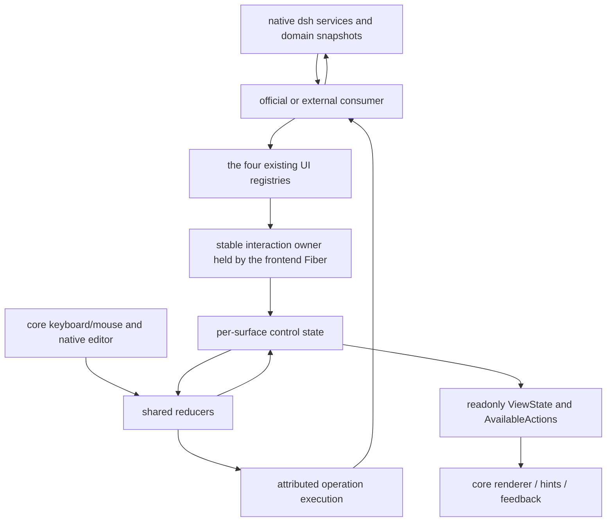

# PR #15 interaction refactor detailed implementation plan

> Superseded by [docs/interaction-model.md](../interaction-model.md); historical.
> This record does not describe current behavior.

Status: executed — the refactor merged into main (`5fbbdc8`, 2026-09-08) and
the candidate worktree was retired. This document is kept as the design
record of the shipped interaction model; §3–§8 describe the protocol and
semantics the implementation follows. Draft date: 2026-09-06; re-review date:
2026-09-07. Problem baseline: `b82acd2`, i.e. main after PR #15 merged; also
checked against the uncommitted implementation in the
`refactor/ui-interaction` worktree. Pinned Harness version: `0.1.2-alpha.5`.

This document builds on [PR #15](https://github.com/Ephemeral-AI-Lab/mayfly/pull/15),
the [unified model design](./ui-ux-unification.md), and the
batched implementation plan, filling in
code-level decisions, models, consumers, interaction timing, and delivery
gates. Type fragments express the target protocol — they are not usage
examples of a released SDK; parts where the candidate implementation already
has corresponding code still require full verification. This document does
not replace the current architecture documents.

## 0. Difference between the baseline and the current implementation

PR #15's head is `aa7efc9`; the change is two audits, the unified design, the
implementation plan, and the docs index — five Markdown files total. Its
audit conclusions should be read against main-branch source, not treated as
the current state of an independent worktree.

| Area | State at this check | Impact on the implementation schedule |
| --- | --- | --- |
| main `b82acd2` | Still has the official Form/List/Info/Frontend controllers, the in-renderer event owner, and the old editor panel stack | Kept as the pre-migration behavioral comparison; do not create another parallel implementation branch |
| Public protocol and stable model | The worktree already has `interaction.ts`, prepared replies, `UiInteractionService`, `UiSurfaceModel`, and Form/Choice plus Tabs/Wizard state | Re-review and complete the existing implementation; do not build a parallel model again |
| Rewritten consumers | Provider/OAuth/first-run/model, questionnaire/approval/plan, settings/preset, Tools/MCP, session info/Skills already use shared nodes | "Rewritten" does not mean lifecycle, coverage, and release closure have passed |
| Jobs | Migrated real native-registry tests and the old width scan: 37 behavior tests and 16 sizing cases pass; jobs.ts is at 100% on all four metrics | The base consumer is closed; full Document in-page anchors still depend on the later shared implementation |
| Not yet closed | Help, marketplace, sessions/agents, permission and update/trace paths, editor extensions, the old generic stack, complete notifications, and action routing | Wire in item by item per the consumer table below, deleting old paths |
| Verification record | A migration progress record (retired after the merge) last recorded 41 related files and 572 tests passing, plus 18 old-protocol type errors and insufficient coverage; that checkpoint predates the Jobs rewrite | Those tests were not rerun this time; the numbers are not a current whole-worktree pass proof |
| Release status | Full build/lib/pack/full gate not done; no new profile/PTY/manual acceptance | The existing mixed `lib/` cannot be installed as this refactor's acceptance build |

This re-review only perfects the plan document. Later execution follows the
resume order in §11.1; §11's batches A–F keep the full design dependencies so
each batch's expected evidence can be reviewed.

## 1. Judgment on PR #15

PR #15 is merged, but the change is only five Markdown files. It established
the audit basis and the target protocol; it did not implement the unified
interaction model nor fix the runtime behaviors the audit listed. The PR's CI
passing proves the doc change did not break existing code — it does not prove
the new interaction works.

The core decisions worth keeping: shared control reducers, per-surface
independent instance state, and a stable lifecycle provided by frontend.
Harness keeps owning domain state; core keeps exclusively owning input,
focus, and terminal layout. Official panels and external UI use the same
protocol.

The following details must be filled in before implementation:

| Code fact or design gap | Impact | This plan's decision |
| --- | --- | --- |
| Both `CanonicalFormController` and `UiFormStateStore` hold field values; advancing past the last field can call whole-form submit | Adjusting one key branch cannot eliminate dual state ownership | Move drafts and validation into the surface instance; the controller migrates to node definition plus domain action |
| `EditorPanelController.entries` stores `MayflyFocusable` objects | The current replay depends on component objects surviving — not the same as restoring user state after a renderer rebuild | The stack stores surface-instance references and return anchors; the renderer recreates objects |
| `SurfaceEventOwner` lives inside the renderer; `selection-change` uses latest while other events go FIFO | Renderer lifecycle affects business settlement; a selection acceptance may be treated as a droppable update | Split local edit events from effect requests and move the operation owner to the stable layer |
| Generic external events have a fixed 30s timeout and failure closes the surface | Reusing that for authorization waits would close a healthy interaction; form errors may lose drafts | Human waits follow the native request lifecycle; ordinary effect failures stay in their surface |
| Provider edit reads the profile first, then reads the latest settings revision only at save, then overwrites the whole route | A stale value can pass validation carrying the newest revision and overwrite another editor's change | Read value and revision from the same descriptor; write only actually-modified paths; submit carries the corresponding revision |
| `MayflyUiEventContext` only has surface ID, signal, and event revision | Cannot uniquely identify a reopened instance, page, submitted draft, and domain version | Separate registration instance, page path, draft revision, operation ID, and source stamp |
| Form receipts describe a single form; tabs only describe page association | How one Save saves cross-page fields is still left to the implementer | Actions declare an explicit form-set submission boundary; buttons and key aliases share it |
| `examples/mayfly-ecosystem` is composition-only and `examples/overlay` is currently a readonly example | Putting a business implementation in an empty bundle entry would violate package boundaries | The editable consumer goes in `examples/overlay`; ecosystem proves packing, install, and composition |
| The native OAuth prompt has its own `signal`, which the current hand-rolled prompt params do not wire; cancel throws a plain Error | A withdrawal after browser success can leave the input panel behind; a user refusal may render as failure | Single-prompt withdrawal, user refusal, and whole-authorization cancellation map to separate native semantics |
| settings has `settings/document-updated`, not only `settings/updated` | When the raw overlay changes but parsed values are equal, the form can still hold a stale revision | Config consumers observe both the raw document version and the parsed values, merged into one authoritative reread |

The code facts above are checked against the main baseline:
[form-panel.ts](https://github.com/Ephemeral-AI-Lab/mayfly/blob/b82acd2/packages/mayfly/src/interaction/form-panel.ts),
[ui-surface-state.ts](https://github.com/Ephemeral-AI-Lab/mayfly/blob/b82acd2/packages/mayfly/src/core/ui-surface-state.ts),
[editor-panel-controller.ts](https://github.com/Ephemeral-AI-Lab/mayfly/blob/b82acd2/packages/mayfly/src/interaction/editor-panel-controller.ts),
[surface-renderer.ts](https://github.com/Ephemeral-AI-Lab/mayfly/blob/b82acd2/packages/mayfly/src/core/surface-renderer.ts),
[provider-add.ts](https://github.com/Ephemeral-AI-Lab/mayfly/blob/b82acd2/packages/mayfly/src/interaction/provider-add.ts).
Native semantics are checked against the
[Harness settings reference](https://deepseek-harness.github.io/deepseek-harness/reference/subsystems/settings),
the [credentials reference](https://deepseek-harness.github.io/deepseek-harness/reference/subsystems/credentials),
and the pinned version's authorization type declarations.

## 2. Target architecture and ownership



The stable owner is the internal `mayflyUiInteraction` service under
`mayfly-frontend`. The implementation lives in `core/` as a pure state module;
`frontend/index.ts` only mounts it and does not import the terminal through
`core/index.ts`. It is not a fifth public UI contribution service.

Official edit panels use `mayflyOverlays.open()` with
`presentation: 'editor'`, sharing registration, state, and event settlement
with ordinary overlays; `presentation` only picks the physical presentation
site inside core. The old `mayflyEditorPanels` generic component stack is
deleted — no separate editor-panel registry, private Panel DSL, or old/new
event translation layer is built. Readonly child sessions' native transcript
renderer is handled per §5.8.

| State | Sole authoritative owner | Auxiliary data allowed to persist |
| --- | --- | --- |
| Agent, Session, settings, credentials, approval, authorization, jobs | native dsh | consumers keep a readonly edit baseline and necessary read context |
| Form drafts, selection sets, active page, wizard steps, semantic focus, return path | surface instances and shared reducers | renderer caches only as derived results |
| UI action pending, errors, single-flight reentry prevention, notification ownership | the stable interaction owner | private effect bindings hold cancel handles and native authority |
| Terminal geometry, scroll measurement, hit regions, ANSI, renderer handles | core renderer | semantic anchors may write back to the core-owned instance slice; geometry does not enter the public model |
| Text-editing protocol, IME, caret, undo/redo | core native editor binding | the model holds the single restorable draft; the business layer maintains no second values copy |
| Completed step results in the Provider add flow, Job consuming reads | the original business owner | may hold domain-flow data, must not interpret generic keys itself |

Text sync has exactly one write chain: the native editor's change callback
submits `DraftChanged`; only model-driven baseline updates sync back to the
editor, with echo suppression. Ordinary repaints must not repeatedly
`setText`. A renderer rebuild restores at least the text and the semantic
position; undo history — for which the native API provides no serialization —
is not claimed to survive a renderer rebuild, and no unloaded editor is kept
to simulate it.

### 2.1 Fiber dependency split

| Fiber | Dependencies and responsibility | Unload means |
| --- | --- | --- |
| frontend root | mounts the stable model and locale; injects no app/skills/theme/screen | the whole UI state tree is destroyed |
| registry observer child Fiber | injects only the actually-consumed pane/overlay/editor-extension registries plus the stable service | that registry's old registrations lapse; other registries are not reset along with it |
| core renderer | injects the stable service, screen/components/theme/keymap | only unbinds the renderer, geometry, and input continuations |
| app-level Provider UI child Fiber | mounted under frontend; depends on settings/credentials/the necessary llm, commands, and the stable service | when a dependency truly disappears, removes its contributions and sensitive drafts |
| Agent-level interaction Fiber | injects exact current-Agent and the actual native request services | closes requests in its scope; rejects stale results entering a new Agent |
| external overlay plugin | injects commands/settings/mayflyOverlays | fully follows ordinary consumer-Fiber cleanup |

A `core` reload temporarily unloads the app that depends on `mayflyScreen`,
which propagates to the interaction that depends on current-Agent. This is
exactly why Provider editing can no longer hang under the interaction parent
Fiber.

When splitting `registerModelCommands()`, the app-level Provider edit/add
flows separate from the Agent-level model-adoption actions. A command entry
may hand off to a stable app-level UI request; the follow-up flow must not
keep the old display quartet or depend on that command Fiber's restore
closure. Choosing the current model after authorization is a separate
Agent-level step that re-obtains the exact target at initiation — it must not
default to the Agent captured when authorization started.

## 3. Model design

### 3.1 Identity and versions

The following are internal type outlines for drawing state boundaries — not
new subpath exports:

```ts
type SurfaceKind = 'pane' | 'overlay' | 'editor-extension'

interface PageSegment {
  readonly controlId: string
  readonly itemId: string
}

interface ControlAddress {
  readonly pagePath: readonly PageSegment[]
  readonly controlId: string
  readonly fieldId?: string
}

interface SurfaceInstance {
  readonly kind: SurfaceKind
  readonly publicId: string
  readonly registrationGeneration: number
  readonly replacementGeneration: number
}

interface SourceStamp {
  readonly resourceId: string
  readonly revision: string | number
}

interface SubmissionIdentity {
  readonly operationId: string
  readonly surface: SurfaceInstance
  readonly draftRevision: number
  readonly source: readonly SourceStamp[]
}
```

`SurfaceInstance` generations are assigned by the stable owner and bound to
the registration lifecycle — plugins do not apply for an owner token.
Same-name IDs across registries, reopening the same ID, and provider reloads
all get distinct instances. Page and control addresses use structured tuple
indexes — not strings stitched with separators, translated labels, or
renderer leaf paths as keys.

Versions must be used separately:

| Version | Purpose | Responsibility it cannot take |
| --- | --- | --- |
| registry revision | ordering and read-invalidation of snapshots/deltas | judging whether a database write conflicts |
| registration/replacement generation | recognizing registration reopen and whole replacement | representing theme or resize |
| draft revision | matching the input of one validation or submission | native CAS |
| operation ID | duplicate-settlement prevention, notification updates, parent/child interaction ownership | external side-effect exactly-once |
| native source stamp | domain concurrency validation by the business handler | comparing version magnitude across different resources |
| renderer generation | rejecting old components' input, positioning, and measurement callbacks | aborting still-valid business actions |

A public registration declares app/session/panel ownership and the target
identity. Panel ownership resolves to the current parent instance and
inherits its business scope; it mainly constrains lifetime. A session ID is
only a serializable ownership — the private action binding must also retain
the exact live Agent authority and selection generation. Switching the target
to another Provider, Agent, or request uses replace.

### 3.2 Control state

| Slice | Key fields | Transitions the reducer owns |
| --- | --- | --- |
| FormState | baseline, field drafts, dirty, conflicts, errors, draftRevision, pendingOperation | edit, reset-field, reconcile, validate, submit, settle, discard |
| FieldState | kind, raw/value, baseline, modified, validation version | numeric intermediate states, text editing, picker acceptance, local error invalidation |
| ListState | role, focusedItemId, draftSelectedIds, committedIds, invalidSelectedIds | move, toggle, accept, anchor reconciliation after reorder/delete |
| SearchState | query, editing state, pre-search anchor, request version | input, clear, exit editing, result update |
| TabsState | activeId, per-page state references | activate, reorder, delete, focus restore |
| TreeState | expandedIds, expansion set during search, activity record | expand/collapse, parent/child navigation, restore after search |
| DocumentState | content semantic anchor, follow intent | page/return to ends; actual line offsets are computed by the renderer |
| WizardState | stepIds, activeStepId, confirmed steps with their draft revisions | forward, back, jump, final submit, invalidating completion marks on edit |
| DecisionState | target action, consequence, default choice, target version, settlement | request confirmation, Yes/No, expiry, restore parent focus |
| NavigationState | active surface, parent instance, return anchor, capture scope | open, return, hide, close, dispose |

A Form's `dirty` comparison includes values plus explicit reset/override
intent. Changing a setting from "inherit default X" to "explicitly save X" is
a domain change even though the displayed value is equal. A UI field may
declare readonly sources like inherited/explicit and a preview value after
reset; the submission carries an `unchanged/set/reset` intent that the
settings consumer maps to native path ops. The shared model knows nothing
about settings namespaces or file paths.

Text keeps the user's input verbatim — the generic layer does not uniformly
`trim()`. Whether names, URLs, integers, etc. are normalized is decided by
field constraints and business validation; secrets, feedback bodies, and
multi-line content must not be arbitrarily trimmed by form reuse. A number
draft stores the raw string — intermediate editing states like `-` or the
empty string are not a valid submitted number.

### 3.3 Reducers, queries, and effects

A pure reducer takes one semantic event and returns a local next state plus a
structured effect intent. Only the effect runner reads private bindings and
calls native services. `render()`, `selectView()`, and `availableActions()`
do not modify semantic state, do not start loads, and do not fill in default
selections.

Do not build a store that copies a big global object per keystroke.
Partition versions and subscriptions by surface/control; input only notifies
the affected form, hint, or feedback consumers. View snapshots may be cached
and share immutable sources, but must never flow back as a new draft
authority.

Private runtime bindings hold callbacks, Promises, AbortControllers, native
editors, and Agent authority. A diagnosable snapshot contains only readonly
data; secrets, OAuth code/URL, and submit payloads are redacted by default
and do not enter ordinary debug exports or notification history.

### 3.4 Implementation boundary for refresh, drafts, and derived views

A consumer keeps only its most recent complete domain read plus its source
and uses it to generate nodes; the model keeps only the baseline/draft needed
for editing. When a directory read fails, it may show the last complete
result from the same scope marked stale; after switching Agent/target it must
not keep showing the previous target's data.

A UI data update splits into three steps: the registry first admits the
immutable declaration, the model then reconciles the affected controls, and
finally a view version is published to the renderer. Field values, candidate
existence, form submission boundaries, and target versions are semantic
changes; colors, translations, duration labels, and sizes are presentation
changes. A presentation change cannot advance a domain source stamp on its
own.

For settings, the source expresses at least the namespace's native raw
revision; additionally use the readonly field definitions plus a summary of
the visible effective values to catch "raw revision unchanged, but the
schema/composed defaults changed". The summary contains no secrets and no
translations. When native offers no namespace-registration epoch, one cannot
claim to detect an unload-then-reregister with the same value and same
version — when the dependency unload is observable, end the old instance
immediately.

`availableActions`, focus queries, and readonly views should cache by
surface/control revision. A structural registry update may traverse the
affected declarations; ordinary keystrokes and repeated renders must not
rescan all sessions, the plugin catalog, or hidden forms. The current
worktree already has a pure structural-traversal file named
`ui-interaction-tree.ts` — it is not evidence that the Tree control
interaction is done.

## 4. Public contract and update protocol

### 4.1 Minimal contract extensions

Reuse the existing nodes and four registries of
`packages/ui/src/contracts.ts` — do not build another Panel DSL.

| Existing contract | Proposed change | First consumer |
| --- | --- | --- |
| Form fields | Declare data constraints like required/length; add number and multi-select fields; distinguish draft from baseline | Provider, settings overlay |
| Form submit/cancel action ID | Explicitly reference an action; one button produces one focus control | official and external forms |
| ActionItem | May declare the form-address set one submission covers; a single-form submitActionId normalizes into the same boundary | Save spanning two tabs |
| ListNode | Clarify browse/choose roles, selection cardinality, unavailability reasons; selectedIds only as the initial/authoritative baseline | multi-select models, OAuth select |
| MayflyUiChild | `tab: { controlId, itemId }` page association | two-page Provider, external overlay |
| registration definition | readonly scope/target; handlers stay in the registration layer | the two pilot consumers |
| SnapshotUpdate | data/replace and source stamps; ack produced by a valid operation's settlement path | settings watcher and Save |
| UiEvent/context | page/form address, independent action ID, operation/draft revision, readonly submitted values | all writable consumers |
| action handler reply | accepted/invalid/conflict/failed, carrying the latest authoritative snapshot when needed | async save and conflict recovery |

`mayflyStatus` stays passive readonly display — no action or draft state is
added for the unified model. Editor decorations keep their narrower node
union; existing decoration actions wire into the shared settlement; Form/Tabs
are not opened up, and `mayflyEditorExtensions` is not expanded into a full
panel host. Official editor replacements use ordinary overlay registration
with `presentation: 'editor'`.

### 4.2 Submission and receipt types

The following is the protocol draft; `Submission` is an immutable snapshot
produced by the unified runner — not a draft the consumer maintains
continuously:

```ts
interface SubmittedField {
  readonly id: string
  readonly change: 'unchanged' | 'set' | 'reset'
  readonly value?: string | number | boolean | null | readonly string[]
}

interface SubmittedForm {
  readonly pagePath: readonly PageSegment[]
  readonly formId: string
  readonly draftRevision: number
  readonly fields: readonly SubmittedField[]
}

interface Submission {
  readonly actionId: string
  readonly draftRevision: number
  readonly forms: readonly SubmittedForm[]
  readonly source: readonly SourceStamp[]
}

interface FieldError {
  readonly pagePath: readonly PageSegment[]
  readonly formId: string
  readonly fieldId: string
  readonly message: string
}

type FormActionReply =
  | {
      readonly kind: 'accepted'
      readonly node: MayflyUiNode
      readonly source?: readonly SourceStamp[]
    }
  | { readonly kind: 'invalid', readonly errors: readonly FieldError[] }
  | {
      readonly kind: 'conflict'
      readonly node: MayflyUiNode
      readonly source?: readonly SourceStamp[]
      readonly message: string
    }
  | {
      readonly kind: 'failed'
      readonly message: string
      readonly node?: MayflyUiNode
      readonly source?: readonly SourceStamp[]
    }
```

Compared with the PR's minimal receipt, this adds the source stamp and lets
`failed` carry actual state — supporting concurrency decisions and partial
success in multi-step writes respectively. They are UI settlement data and do
not replace Harness's native error classes or return values.

Non-form actions additionally return explicit `completed` or `cancelled` —
e.g. opening a detail, or waiting for a native update after a native Stop;
one must not fabricate an old accepted snapshot just to settle a button call.
`failed` may declare `acceptedFields` proven by native results, advancing the
baseline only for fields that did write, and keeping the rest of the draft. A
receipt's `dismiss`/`navigate` must execute only after the receipt is
admitted — a failure must not close the page first.

Observation events and effects should be distinguished at the type level:
navigation/editing observations may have no receipt; a persistent action must
return a structured settlement. The candidate's current overall `onEvent`
type still allows `void`; the final version must tighten it with a
discriminated type or explicit handler grouping, and an external type fixture
must prove "forgetting to return a Save receipt" is rejected — do not paper
over the type gap with a runtime default success.

`Submission.draftRevision` identifies this aggregated snapshot; settlement
checks each `SubmittedForm.draftRevision` against the locked submission
boundary. A user editing another form in the same surface that was not part
of the submission must not invalidate this save. Consumers with a native
revision must return the corresponding source stamp; optional is only for
resources that genuinely lack a version capability.

An unmodified secret's `value` does not enter the submission, and `unchanged`
means keep the original credential; explicit clearing must be a separate
reset/delete intent. A newly added secret exists only in the memory needed
for this edit and submit. An invalid error path is a protocol error — keep
the form and show a locally understandable failure; never silently drop the
error and treat it as success.

A cross-page Save collects values through the action-declared
`forms: [{ pagePath, formId }]`, running one validation and one operation.
Single-field Enter, page switches, and multiple independent field events do
not constitute a submission. A Wizard's final submit likewise uses an
explicit form set rather than asking the business to stitch an answer cache
from multiple events.

Public events are pinned by the following rules — renaming alone must not
keep execution semantics conflated:

| Event | Payload | Local reducer / registration handler |
| --- | --- | --- |
| `value-change` | page, form/field address, current value and field draft revision | update the local draft first; may observe or run readonly validation, never writes the domain |
| `selection-toggle` | choice address, candidate ID, resulting set, draft revision | only changes the selection draft; not equal to confirming a selection |
| `selection-accept` | choice address, real selected set, explicit action ID | an in-form picker updates the parent field; only a standalone selector starts an effect per its declaration |
| `tab-change` | tabs address, activated tab ID | local page state finishes first; may trigger page-isolated readonly loads |
| `submit` | action ID and an immutable Submission | the runner performs one form submission, requiring a structured receipt |
| `activate` | action ID, initiating control address, target definition version | enters navigation, confirmation, or a business effect by semantics — must not guess the target from controlId alone |
| `dismiss` | the current surface, close reason | requests the shared close flow; dispose only after dirty/child-interaction rules pass |

The ordering here is guaranteed by the shared owner. External handlers need
not echo every `value-change`, toggle, or tab to keep the display; no async
task is created when there is no corresponding readonly consumer.
`selection-change` is removed in the new protocol — a change and an accept no
longer race on one latest channel. Handler types distinguish observation from
action, so a save branch returning void cannot be misread as accepted.

### 4.3 The three snapshot updates

| Update | Initialize/keep rule | Effect and focus rule |
| --- | --- | --- |
| data | External data refresh on the same instance; runs three-way field reconciliation | Keeps valid drafts, focus, pages; does not abort a Save just because a revision increased |
| ack | Only producible by a valid operation receipt, correlating the submitted draft revision | On successful admission, syncs baseline and settles; duplicate or stale receipts are invalid |
| replace | Explicit whole-instance content or scope replacement under the same public ID | Cancels applicable tasks, clears draft/confirmation/errors, then initializes from the new baseline |

In the new protocol, omitted update metadata is treated as data; `set(null)`
means the contribution's content is removed and the corresponding control
state released — an overlay needing temporary retention uses hide, and an
editor panel uses navigation hide. null must not be used as an ambiguous
retention mechanism.

The old `set(node, { eventRevision })` is removed with an explicit version
bump, migrating `mayfly-ui`, the Mayfly runtime, the in-repo examples, and
the docs together. The candidate branch may temporarily be unreleasable
during migration, but no compatibility handler, event alias, or conversion
boundary is implemented to mask unmigrated callers; the final typecheck and
source constraints must reject the old protocol.

### 4.4 Field reconciliation for data

Let `B` be the field's baseline when editing started, `D` the current draft,
and `N` the new authoritative value. The comparison here includes field
source/reset intent — it cannot compare formatted text only.

| Condition | Handling |
| --- | --- |
| Field unmodified | baseline and draft both sync to N |
| Field modified, N equivalent to B | keep D; no new field conflict |
| Field modified, N changed | keep the edit baseline B and D; record the newest N and the conflict; show the diff |
| On conflict, user chooses to take the latest | set baseline/draft to N, clear that field's dirty/conflict |
| User explicitly chooses to keep their edit | rebuild baseline to the N the user has seen, keep D; a later Save uses the corresponding native revision |
| Field deleted, kind changed, or action deleted | destroy the related old state and continuations; show the structural change when necessary; submitting old addresses is forbidden |
| Only label, locale, theme, viewport changed | produce no field dirty/conflict/reset |

Even when a modified field happens to satisfy `D === N`, a data update is not
that operation's ack. It may hint that the external value matches the input,
but clearing pending/settling the submit still requires a matching receipt or
explicit user acceptance.

Other field changes in the same namespace may produce no field conflict while
the native revision has still changed; a submit must not automatically wrap
old whole-form data in the latest revision. The business re-reads and decides
per modified path whether a submit can be based on the new descriptor, asking
the user to resolve the conflict if a target field changed. For a service
without native CAS, the only options are re-read, warn about the concurrency
limit, and require explicit confirmation — never promise to eliminate the
race between the last read and the write.

### 4.5 Atomic ack publishing and races

This part changes `services.ts`'s shared publish implementation and the core
operation runner together — a feature must not `set()` once more on success
itself.

1. Before the effect starts, record the instance, scope, submission boundary,
   draft revision, source stamps, and this submission's values, and lock that
   submission boundary.
2. The handler validates and calls the native action; on success it re-reads
   the authoritative value and returns the complete surface snapshot.
3. The provider freezes the candidate via the existing `freezeWire` path;
   core runs schema, address, and quota admission for the controls that need
   settlement.
4. Before admission and publishing, do a last check that the original
   registration, scope, and operation are still valid. Publishing binds the
   original registration instance — it does not look up a possibly reopened
   handle by public ID.
5. Publish the snapshot and the ack through the original registration's
   shared publish path; the stable owner treats this delta and the settlement
   as one state transaction, so subscribers never see the intermediate
   "dirty cleared, baseline still old" state.
6. If relevant data arrived during the submission, check the handler-returned
   source against the latest authoritative snapshot. Apply only if it provably
   covers the current read version; otherwise keep the latest data, the
   draft, and the conflict, and schedule a re-read protected by a read
   generation.
7. If the native write succeeded but UI admission failed, record the "write
   completed, screen sync failed" result and re-read — do not auto-resend the
   write and do not claim it was unsaved. An unknown native result is
   explicitly marked as needs-verification.

Inside the provider, the currently frozen entry must be associated with its
original publish closure, and core submits receipts through the registration
layer's settlement channel. That channel creates no new UI service and lets
no feature fabricate an ack. Batches A/B pin this boundary with a
provider/core integration test that proves "an accepted snapshot still
publishes while the renderer is absent", then lock the final signature.

A new data update that only changes unrelated text cannot invalidate an
operation; a newer data update that modifies the same business value cannot
be overwritten by an older accepted snapshot either. Source stamps only
compare within the same resource — opaque strings are never
magnitude-ordered.

### 4.6 Tabs, dynamic pages, and admission

Page association lives on `MayflyUiChild.tab`; nested associations compose
the pagePath. Within a page, form/list/control IDs are unique; different
pages may reuse them. Tab activation only changes visibility — the associated
subtree stays in the published snapshot and the draft does not transfer to
the plugin.

While loading, keep the existing page: keep its content declaration and
association, and show a loading state on that page; do not swap the whole
page Form for a loader and then expect the deleted fields to still be alive.
A page never loaded before may carry only an associated loading/empty
placeholder. Actually deleting a page releases its fields, sensitive drafts,
validation, and that page's read tasks.

Keep the current lazy admission: structural associations are checked at
admission boundaries, hidden reactive branches get full admission only when
first visible, and a large list is not fully compiled for state indexing. On
error, isolate to the owning page or entry. Render does not repair duplicate
IDs or implicitly create new semantic state.

## 5. Consumer design and migration map

### 5.1 Who reads and writes the model

| Consumer | Input | Output | Forbidden responsibilities |
| --- | --- | --- | --- |
| Official feature / external plugin | native descriptors, projections, requests | readonly nodes, constraints, action handlers, domain receipts | raw keys, a second cursor/draft, self-implemented confirmation |
| registry adapter layer | registrations/deltas, scopes, receipts | surface instance lifecycle events | obtaining an Agent or handling the terminal |
| core compiler/renderer | node + ViewState + actual viewport | painting, hit regions, semantic input events | writing the domain at save, mutating semantic state in render |
| input router | normalized input + AvailableActions | the uniquely matched semantic event | special-casing keys by feature name |
| buttons, hints, help | the same AvailableActions | text, enabled/busy, real key bindings | hand-assembling a keys list that differs from the handler's |
| feedback renderer | NotificationState filtered by scope | summary and details entry under the current editor/panel | copying notifications into another string state |
| headless conformance runner | nodes, event traces, controllable native results | state and side-effect assertions | substituting the test's own reducer for the real call path |

### 5.2 Official feature migration table

| Feature/file | Model reused | Responsibilities the domain consumer keeps | Deleted after migration |
| --- | --- | --- | --- |
| `form-panel.ts`, Provider editing, startup | Form + Decision | settings/credentials read and write, startup coordination | values/editing/submitDirection, save-on-Tab |
| `select-list.ts`, `select.ts` | Browse/Choice + Search | provide the list, selection cardinality, accepted result | cursor/query/filterEditing, empty-selection backfill |
| `settings-command.ts` | browse properties + Form/Choice/Toggle | schema→field projection, inherit/reset, native revision | enum cycling, private notice, string assemble/parse events |
| `provider-add.ts` OAuth | Wizard + Form/Choice + persistent guidance | authorization.begin, model discovery, credential/config step results | select-as-text, guidance via editor notice, self-built prompt keys |
| `frontend-panel.ts`, model picker, market | Tabs + Browse/Choice + Search | group/model metadata, install/remove/adopt model | generic state for group/query/cursor/selectedVariants |
| `/sessions`, `/agents`, `session-tree.ts` | Tree + Document + Action | native Agent relations, liveness, attach/resume/stop | hand-rolled search tree, indent navigation, restore closures |
| Help/Info/Trace/Job output | Document + Scroll | content building, native output reads, paging cursor | private scrollTop/page length/close keys |
| `questionnaire.ts` | Wizard + Choice/Form | map native question/answer, cancel errors | toggled/draft/cursor/tab, stitched `[x]`, auto-submitting the whole thing on the last question |
| approval, plan review | Decision + Document + Feedback Form | native allowed/rejected/feedback outcome | private reasonDraft, numeric-key decisions, separate confirm flow |
| `confirmation-panel.ts`, public `action.confirm` | the same Decision | provide target and consequence | the two decision mechanisms: closure settled and pendingConfirmation |
| editor notice, settings notice, market, update | Notification + Operation | produce structured facts, recovery logs and details | empty-string clear-all, pre-coloring, arbitrary TTLs, duplicate feedback |
| `pane-queue.ts` | readonly projection of the native inbox | classify by source, attachment summaries | treating all inbox messages as pending user tasks |

Generic-state deletions in the table only target migrated features —
similarly named variables inside domain flows are not mechanically deleted.
Job output's consuming reads and bounded pages stay with the existing read
path; infinite output must not be copied into the model for a unified
Document.

### 5.3 First official consumer: Provider editing

Use the existing Provider edit workflow — do not substitute a help document
for the editable pilot. The form splits connection config and credentials
into two tabs with one global Save; do not expand it into a full add wizard
yet.

1. On open, read the same descriptor of the target namespace in
   `settings.describe()` to get the baseline and revision; credentials only
   read `credentials.describe()`'s configured/source/writable — never fill a
   stored secret into a node.
2. The connection page offers name and, when editable, baseURL; the
   credentials page offers an empty write-only secret field plus an explicit
   clear action. A non-writable credential shows the reason.
3. Typing, Tab, page switching, and returning all write nothing. Save
   collects the two pages' submission boundary, runs path-level validation,
   and locks the related fields.
4. settings writes only changed paths — e.g.
   `providers/route/displayName` — preserving unedited native fields like
   models/api; the call carries the expectedRevision matching this baseline.
5. On a native conflict, re-read the descriptor and return conflict; the UI
   keeps the user's input and presents the new value plus "take latest / keep
   my edit" actions.
6. After settings succeeds, update credentials per the explicit intents. The
   two steps have no native transaction; when credentials fail, re-read the
   real config, show the completed part and the retryable credential step —
   never present the whole operation as unchanged.
7. After accepted, clear the confirmed dirty flags and secret references. A
   failed submit stays in the form with field and operation errors visible.
8. Deleting a Provider is a separate browse action entering a default-No
   confirmation; No returns to the same form draft. Yes binds the target and
   the viewed version; after the real delete, close the target form and
   return to the parent page.

Delete/Ctrl-D inside ordinary text fields belong to the editor; deleting a
Provider goes through the reachable action area. Cross-resource transactions,
CAS, or rollback that the native credentials API does not provide are not
fabricated at the UI layer.

### 5.4 First external consumer: a persistent overlay

In `examples/overlay/src/index.ts`, upgrade the readonly example into a real
settings editor; `examples/mayfly-ecosystem` stays ordinary-sibling
composition only. No sixth example package or special plugin host is needed.

The external plugin registers its own `mayfly-example-overlay` settings
namespace and provides two tabs; the two pages reuse the same field IDs to
verify pagePath isolation. Include at least text, single-choice, and toggle;
number/multi-select arrive with batch D. One Save updates the native
namespace, and closing then reopening reads the saved values back.

The consumer only writes four pieces of code: schema/readonly snapshot
building, native event subscription, opening the overlay, and the save
handler. Each keystroke needs no `handle.set()` echo, and no tab/cursor/draft
Map is kept. Save uses the descriptor revision and path ops and returns an
accepted node on success; a watcher's data only means the source changed —
it cannot be hand-marked as an ack.

Update the example's dependencies, owning AGENTS, and both README languages,
and refresh the packed fixture. Prove via `check:examples` and the ecosystem
install that package-name imports also work against built `lib/` — tests must
not bypass the publish boundary with relative imports.

After the official and external each mount a real form, run the same event
trace against both and assert identical draft, conflict, return, and
settlement results. Keeping two different business datasets is allowed;
generic interaction differences must not be patched over by each handler.

### 5.5 Domain and lifecycle list for all consumers

The dependencies below are the minimal set per domain; concrete service names
and signatures follow the current inject declarations and the pinned native
API. A domain consumer may keep the read results, request queues, and
business steps it needs; page, search, selection, form, and confirmation
state belong to the shared model.

| Consumer | Ownership and read source | Surface and explicit actions | Special boundaries and behaviors to preserve |
| --- | --- | --- | --- |
| Provider edit/add/first-run | app; settings, credentials, llm, authorization; first-run also observes startup coordination | Tabs + Form; Save, delete confirmation, start authorization, discover models | Provider config does not depend on renderer or skills; adopting a model after authorization is a separate exact-Agent action; config/credential partial success is presented separately |
| model and preset | exact current-Agent; native llm/model selection, agentPresets | Browse/Choice; after Accept directly call native selection | do not append extra native events to simulate a selection; pending/idle/empty-Session limits are enforced natively; a started native operation without signal support may keep acting on the old Session |
| settings | app; namespace descriptor, raw revision, schema, inherited values | namespace browse + typed Form; Save, Reset, Override, Refresh, the original file entry | one Save writes only changed paths; unknown schema stays opaque; secrets only show configured, never backfilled |
| permission/plan | exact current-Agent; native permission and plan projection | standalone Choice/Toggle; choosing full access enters the shared Decision | re-selecting the current value is a no-op; plan and YOLO are independent; keep PR #14's finished safe defaults and native permission semantics |
| Tools/MCP | exact current-Agent; tools.schemas, tool changes, loader config | Browse + Tabs + Document; View/Refresh | browse only, never execute tools; redact config; do not fabricate connection states, restart, or edit APIs native lacks; close when the detail target disappears |
| Skills | exact current-Agent; native skills catalog | grouped Browse + Document; view details | `/skills`, `#` completion, and submit rewriting share one catalog; incomplete results only keep the same Agent's last complete catalog; browsing never executes a skill |
| status/context | exact current-Agent; one sessionProjections.snapshot | readonly Fields/Progress/Chart/Document | keep each projection's own timing and estimate semantics; do not fold Session events into a self-built statistics truth |
| version/changelog/help | app; version facts, change records, command and action definitions | Document; view details, return | do not unload when current-Agent is temporarily absent; Help's actual bindings come from the same AvailableActions — static content does not guess keys from command names |
| sessions/agents | the browser's own scope and the exact calling Agent; sessionQuery, subagents, agents, current-Agent | Tree + Search + Document; View, Attach/Resume, Stop | re-read live/continuable/ancestor permission before executing; keep the child Agent's native ownership; cold/one-shot uses the existing readonly transcript |
| Jobs | exact current-Agent; jobs.list/get/read/kill and onJobsChanged | Browse -> Inspector -> bounded output Document; Read output, Stop | list, timers, details, and paging must never consume output; Stop's terminal state comes from native — a cancel request is not instantly shown as killed |
| market | app/profile; existing catalog/loader/installer | grouped Browse + Search + Detail; Install, Remove, Refresh | check the target profile and source; keep the existing install blocking and failure recovery; typing `install` must fully enter search; after an operation re-read the real install state |
| trace/update | trace follows the original session target; update is app/profile | Browse/Document + Actions; details, copy, update confirmation | trace keeps native order and details; full output is never stuffed into a notification; update keeps the existing preflight/swap/rollback and host selection |
| questionnaire/approval/plan | native request + exact Agent + request.signal | Wizard, Choice/Form, Document, Decision | default is no-execute; complete native answer encoding, FIFO, session allowance, single settlement, abort takes precedence; native request scheduling is not rewritten |
| editor extensions | plugin registration + the current prompt submit attempt | passive decoration, native completion, submit transform, explicit action | completion latest; submit transforms run once in order; never converted to a navigable big form, and no free renderer injection is added |
| notifications/queue | producer Fiber + app/session/panel + operation; inbox projection | unified summary/details; local feedback and pending input projected separately | failures visible while a panel is open; queue filtered by source; a hint ending may only clear its own records |

Existing ordinary siblings keep their composition ownership. In particular,
`@ephemeral-ai/mayfly/jobs` is already mounted by the preset — Jobs must not
be mounted again from frontend just because other official consumers moved
there, or commands and listeners get registered twice. Every mount adjustment
is verified against the actual Fiber graph by whole-tree tests.

### 5.6 Jobs' concrete interaction and read budget

1. Opening the browser only calls `jobs.list(agent)`; selecting a record only
   calls `jobs.get(id, agent)`. Every call passes the exact Agent captured
   this time and still valid.
2. The Inspector shows the native current state, description, and Read
   output/Stop/Close. Reading while running uses the same native consuming
   cursor — this consequence must be displayed before the read; browsing
   itself does not advance it.
3. Read output calls `jobs.read()` once and keeps the returned `JobRead` in
   that output child Fiber. The output's status label explicitly means
   state-at-read-time; the Inspector keeps independently observing the live
   state.
4. Native distinguishes stream delta from final-output-only; reads after
   termination follow native idempotent semantics. Tests should use the real
   `LocalJobRegistry`, proving the distinction with repeated reads, the
   native cursor, and notice state.
5. The UI publishes only one admissible page of body text. A single line
   exceeding the body quota keeps paging; the candidate implementation caps a
   page at 12,000 UTF-16 code units, preferring line-break boundaries, never
   splitting a surrogate pair or dropping the tail. The output block is a
   domain read cache and does not enter the generic control store.
6. Page numbers belong to the shared numeric Form or the final shared
   Document paging state; First/Previous/Go/Next/Last read the same submitted
   value. Inside each page, the real viewport scrolls. Across paging, resize,
   return, and renderer reload, the `jobs.read()` call count must stay zero.
7. Every Read output creates a new read result; old results are released by
   the explicit child-view close rule — an unbounded Job-output history is
   not accumulated. An empty delta shows that there is currently no new
   output; it does not auto-loop reads.
8. Stop uses the shared confirmation, defaulting to No; the confirmation
   binds the job ID and the observed relevant state. Re-read before
   executing; an already-finished job returns no-op; after a native kill,
   updates come from native notifications — an old accepted node must not
   overwrite a completed/failed that arrives faster.
9. The live-duration timer only works while the displayed list still has live
   jobs, and cleans up when the target or parent UI unloads. Timer updates
   must not interrupt a Stop confirmation or reset the output position.
10. A test producer's kill must eventually settle `done`, or a real registry
    unload will wait; this is a native-lifecycle obligation of the test
    fixture — the production Mayfly UI must not take over a job controller
    for test convenience.

### 5.7 External consumers and editor extensions

The external overlay is the first writable-protocol consumer; additionally
migrate, one by one, the `examples` packages that actually use pane, overlay,
status, and editor extension. Each example stays an ordinary Cordis plugin
with package-name imports, and ecosystem only composes them. A public new
field with temporarily no real consumer should be deleted or deferred — a
type fixture alone is not a completion announcement.

Editor extensions are handled per the three request kinds:

| Request | Scheduling and settlement | Invalidation boundary |
| --- | --- | --- |
| completion | the native editor owns token/caret; the same query uses latest; accepting a candidate inserts once | revoke the stale result when the query/caret target changes, the original registration unloads, or the renderer binding lapses |
| transformSubmit | capture the original text, attachment bindings, and the exact submit attempt; run transforms in the existing order; hand to the native prompt submit only after all succeed | Agent/attempt lapse, user cancel, or registration unload; a late result must not submit the next prompt; a failure preserves the original input and attachments |
| decoration action | wire into the shared operation, confirmation, feedback, and the original registration's prepared reply | original registration/scope/target lapse; a renderer reload itself does not re-invoke a still-valid business action |

The signatures of the existing completion, transform, and action — all using
the same `MayflyUiEventContext` — also need review. A pure read should not
fabricate a persistent operation ID; signal, read/submit versions, and needed
capabilities are expressed through explicit request context types. A
node/decoration still contains no callback or Promise — functions stay in the
registration.

### 5.8 Retiring readonly child sessions and the old component stack

`session-transcript-panel.ts` still holds `MayflyFocusable`,
`ScrollablePanel`, and the transcript renderer through
`mountEditorReplacement()`. Before the old stack is deleted, this real
consumer must be migrated — its install entry cannot be removed just because
every other panel uses overlay.

Keep the existing readonly transcript data source and cold session
observation, attachment/tool presentation, and complete history. Move the
physical shell, input, focus, and mounting to core's existing auxiliary-view /
fixed-slot path; app keeps only declaring the current auxiliary target, and
interaction keeps the necessary native-read coordination. Ordinary
Form/Document use overlay; the readonly transcript keeps using its existing
dedicated renderer — do not stuff a Session, a renderer handle, or a whole
TranscriptModel into a new public UI node.

F7/F8/Esc actions and capture priority are decided by the unified router.
Switching back to the main view may hide while keeping the same readonly
target; closing or changing the target must release the observation, image
reads, and old renderer bindings. After migration, source must no longer
import `mountEditorReplacement` or build a generic panel shell from a
feature.

## 6. Interaction logic

### 6.1 Input routing

Fixed priority: paste/composed-input parsing, explicit emergency interrupts,
the topmost capturing decision/surface, the current editor or candidate menu,
the current control, group/surface, allowed global actions.

Raw terminal input is parsed only in core, reusing
[pi-tui's editor, keyboard, and focus interfaces](https://pi.dev/docs/latest/tui).
Click and keyboard activation map to the same semantic event; mouse hit
regions lapse with the renderer generation and never bypass
disabled/busy/confirm checks.

`availableActions(state, focus)` drives actual binding matching, action
enabled/busy, buttons, hints, and help all at once. The confirmation's
default focus is an explicit semantic property — not derived from
`intent: primary`.

### 6.2 Per-control input rules

| Scenario | Navigation/editing | Submit/exit |
| --- | --- | --- |
| Single-line Form field | focus stays navigable; Enter or direct typing enters editing; Tab/Shift+Tab move back and forth, past the last field reaches the action area | Enter finishes the current field and advances; only Save submits the whole form |
| Multi-line field | Enter makes a newline; the native editor handles paste and delete | explicit Save; Ctrl+Enter shown only when terminal and keymap support it |
| In-form choice/toggle | changes the form draft | picker Accept only updates the field; form Save writes the domain |
| Standalone enum setting | Enter expands all candidates; arrows only navigate | Accept submits explicitly; choosing the current value is a no-op |
| Standalone Boolean setting | a focused, understandable toggle action | Space/Enter toggle explicitly, pending prevents repeats; failure restores the actual value |
| Multi-select | Space/number shortcuts toggle the current candidate; cursor and set are independent | Enter/Accept submits the real set; min=0 allows the empty set |
| Browse list | Up/Down do not wrap, Home/End go to the ends; Page keys use the real viewport | Enter runs the explicit Open/View action |
| Tabs | Left/Right activate the adjacent page; Tab/Shift+Tab move between groups | Enter enters content; switching pages submits nothing and loses no page state |
| Search | direct text input wins; unified searchable fields; Chinese/paste go through native input | Esc exits search editing but keeps the query; Clear empties explicitly, a second Esc returns |
| Readonly document | unified Scroll; long lines readable, actions stay reachable | Esc returns; q only in non-search readonly cases; Enter only activates an action |
| Second confirmation | explicit Yes/No, default No | Yes once, No/Esc restores the parent state; a changed target invalidates an old Yes |

A field error does not block Tab from leaving; the error stays beside the
field, and the whole-form submit locates the first invalid field, including
auto-activating its owning page. A disabled item's reason must be reachable —
a narrow-screen detail may enter the unified Document, not just disappear.

Typing `install` directly in the marketplace should enter search, not trigger
`i/u/r`. Install, update, and remove go into explicit actions or modifier
keys declared through the same router. Numeric candidate aliases in
non-search scenarios are likewise registered as semantic actions — a feature
does not intercept raw characters.

Keep the prompt-specific conventions: Enter sends, Tab completes, Shift+Tab
toggles normal/plan, Ctrl+S steers; plan and YOLO stack. F7/F8 are ordinary
navigation and obey the current capturing surface — they cannot jump past an
interaction awaiting a decision.

### 6.3 Return, close, and discard

Esc acts on the innermost semantic each time: close the completion/field
picker, exit search editing, exit the subpage or sub-confirmation, then
request to close the surface. The form itself keeps no extra "press Enter
once to edit" mode.

With no dirty state, return directly. With dirty state, enter the unified
discard confirmation, defaulting to keep; declining the discard returns to
the same field and draft, and only confirming the discard disposes the
current form. Closing a child form does not rebuild the parent form.

A user Cancel is an interaction request; registration dispose, native abort,
and Fiber unload are lifecycle facts. The latter clean up immediately — they
cannot pop a discard confirmation to block the unload, nor resurrect a
contribution through replay.

### 6.4 Questionnaires, approval, and plan review

Questionnaires use native question IDs as step IDs. Each question reuses
Form/Choice; switching between questions keeps drafts, editing a completed
question clears its completion mark, and there is a final "submit answers"
action. Entering the last question or unchecking everything never auto-
submits another answer.

The native questionnaire's `selected` uses option labels; the UI may assign
stable candidate IDs for one request and the business maps them back to the
original labels at submit; translation does not change native answers. In
single-select, Other overrides selected; in multi-select, Other may
supplement selected; skipped-question empty answers and UI cancel keep the
distinction in the
[native question/answer reference](https://deepseek-harness.github.io/deepseek-harness/reference/subsystems/user-questions).

Tool approval keeps the native outcome and session-allow behavior, with the
default focus migrated to the non-executing option. Plan review uses Document
+ Decision + an optional feedback Form. Esc inside the feedback box first
returns to the decision; only Esc at the decision layer maps to native
decline or cancel. A real request abort takes precedence and settles exactly
once.

Display queueing of multiple native requests stays with the existing request
owner; the shared model only handles the current request's UI. Harness
approval or task scheduling must not be rewritten just because an
OperationState exists.

### 6.5 Search, Tree, and candidate changes

Search is shared state of Choice/Browse — no separate business search
controller is built. The native editor takes the query; the normalized query
is only for matching and does not change the original text the user sees.
Candidates build an index from allowed fields like label, detail, and
explicit searchText; translation or group renaming does not change candidate
IDs.

| Event | Deterministic behavior |
| --- | --- |
| Typing or pasting text directly in a searchable list | updates the query; no same-character business action runs; on no match focus moves to the reachable Clear/Back — the previous result cannot be executed |
| query changed | keep a still-matching focusedItemId; otherwise pick the reachable candidate by the original logical adjacency; the selection set does not change with filtering |
| candidates reordered | keep focus, the set, and expansion state by ID — not rebuilt by array index |
| candidates deleted/disabled | move an unreachable focus; existing selections stay as explicit invalid items that block submission, with a cleanup action — never silently re-pick another item |
| single-select null, multi-select empty | judged by required/minSelected; the cursor item is never an implicit default answer |
| exiting search editing | keep the query and filtered results; Clear empties explicitly, returning to the pre-search anchor that still exists |

Tree reuses `ui.list`'s `tree`/`parentId` data relations, and core builds the
relation index. Cycles, self-references, and duplicate IDs are rejected;
orphan nodes are pinned as root-level visible with a missing-parent marker —
records are never silently dropped. The normal expansion set and the search
temporary expansion set are separate: search shows matching nodes plus their
ancestor paths, and clearing the search restores the user's original
expansion state.

Right expands a collapsed node, then enters the first reachable child; Left
first collapses, then moves to the parent; Up/Down move by the currently
visible tree rows. Enter only executes the recorded explicit action — one
part of the tree must not collapse while another part switches Sessions.
PageUp/Down spans are decided by the actual visible row count, which also
applies when long labels take multiple lines.

Remote directory/dynamic tab loading binds by scope, pagePath, query, and
request generation. A new query only cancels the old read; a native Save on
the same surface is not re-sent or accidentally aborted by a query change.
Only a complete result belonging to the current query replaces the result
set; partial results and failures are each displayed explicitly.

### 6.6 Document semantic anchors and short heights

Having only a shared ScrollView or a saved page number is not yet enough for
the renderer-rebuild recovery the PR requires. The goal is to put "which
logical content position the user is reading" into the stable instance while
leaving the actual line offset to the renderer.

Suggested minimal declared identity: a restorable `MayflyScrollNode` must
have a stable `id`; multi-block documents distinguish blocks through
`MayflyUiChild`'s optional stable content `id`. Reuse the existing
scroll/stack/content nodes — no new Document node kind is added. Provider
authorization guidance, Help/Trace, and the external overlay should all
consume these identities before the public types are pinned.

The internal anchor outline below never enters business submissions or a new
public renderer API:

```ts
interface DocumentAnchor {
  readonly pagePath: readonly PageSegment[]
  readonly documentId: string
  readonly blockId: string
  readonly sourceOffset: number
  readonly follow: 'none' | 'end'
}
```

`sourceOffset` is a logical position in the content source — not a terminal
column or renderer leaf row. Text/code use source character positions;
Markdown uses the existing parser's token/source mapping rather than a second
Markdown parser. Non-textually-locatable blocks like diagrams restore the
block anchor.

1. Input or scroll actions submit the semantic anchor; renderer layout
   produces a readonly logical-position→visible-row mapping. `render()` does
   not mutate the model along the way; corrections needed after measuring go
   through a separate event carrying the renderer generation.
2. resize/theme/rebind remeasure the same content and locate by anchor; old
   components' measurement and scroll callbacks must not modify the new
   binding.
3. When a data update still has the same block ID, adjust the logical
   position using the changed range or the existing token mapping; when it
   cannot correspond, clamp to a legal offset within the same block. When a
   block is deleted, first pick a surviving block after the original
   position, then one before it; an emptied document returns to the empty
   state.
4. An arbitrary full-text rewrite without stable block IDs only promises a
   bounded fallback — it does not claim to restore the same sentence. A
   translated title, repeated text content, or a screen row number must not
   fake a stable identity.
5. Appended content only auto-follows while the user explicitly follows the
   end; after reading upward it switches to none, and new output does not
   pull the user back to the bottom.
6. Each immutable Jobs output page is located by read instance plus page
   number; returning to a page restores its internal anchor. Page-number
   restoration and in-page position restoration are tested separately.

At ordinary heights the body takes the remaining viewport and the action area
lays out in logical order. When the total height cannot show body, errors,
and actions at once, the shared layout puts them into the same scrollable
focus sequence so the focused target stays visible; a fixed footer must never
squeeze the body to negative height, and Save/Cancel must never become
unreachable in a one-line window.

### 6.7 Concrete output of the unified action query

`AvailableActions` is a derived result, not a new business registry. Each
available action carries a stable action ID, a control address, a semantic
verb, enabled, disabledReason, operation phase, and the target version. Core
merges the current keymap and terminal capabilities on top to produce the
actual match table and hints; a public node carries no raw keys, ANSI, or
terminal-capability objects.

Four consumers read the same result: the keyboard/mouse router, buttons and
menus, the current-context hints, and Help. A business declares
label/action ID/constraints and no longer passes a `keys` string; disabled
and busy checks run again before actual execution, and a mouse cannot bypass
them.

Conflicting bindings resolve to a single receiver in this order: innermost
capture, field editing, local action, then ordinary global action. The
document `q` alias is only enabled in non-text-input scenarios; while
searching, q is text. Emergency interrupts are separately declared
exceptions — they are not implemented by broadcasting unhandled characters to
the prompt beneath.

A regression test dynamically modifies the keymap, then reads the displayed
binding from Help and actually executes it, asserting call counts and results
match; it also covers pasting text containing `i/u/r/q`, composed input,
partial escape sequences, and short-height hint trimming. Asserting a hint
string contains "save" alone is not proof the routing is consistent.

## 7. Operation and async lifecycle

The state path is `validating -> awaiting-confirmation -> running ->
succeeded/failed/cancelled`, and unneeded steps may be skipped. An unstarted
action is idle. A cancellation request itself is recorded separately as
`cancelRequested` — not immediately equal to a terminal cancelled.

| Work category | Scheduling policy | Result admission |
| --- | --- | --- |
| async field validation | latest per field | instance, address, and draft version all match |
| search/dynamic-page read | latest per query/page | the read generation and the page are still valid |
| Save/explicit write action | single-flight per submission boundary | valid operation, scope, target, and submission version |
| operations on different surfaces | run independently | each updates its own instance and feedback |
| native domain concurrency | native queue/CAS/constraints | UI local reentry-prevention is no substitute |
| child-interaction waits like authorization | parent operation waits, child interaction has its own lane | the child form can input and submit — it does not queue behind the parent Promise |

Save registers busy before calling the effect, so holding Enter does not
start multiple writes. What is locked is the forms covered by this
submission; independent browsing, cancel, or a child prompt the operation
requires within the same surface are not frozen by a global busy lock.

A regular effect's timeout follows the operation and the native contract — it
does not inherit the fixed "every event closes the surface after 30 s".
Waiting on user input does not count as a stuck renderer handler. An
exception becomes the owning surface's failed receipt and keeps the draft —
it must not be swallowed and only close the window.

After close or a scope switch, the applicable AbortSignal propagates to
native. If the API takes no signal or the write already began, the UI may
stop waiting/showing but cannot claim a rollback; the real result or an
authoritative re-read must confirm. A stale result may be recorded by a
still-alive app-level business owner as the original target's operation
result — it cannot be written into a newly opened same-name panel or a new
Agent's hint.

An instance unload releases the submission/secret references the UI holds;
for an external Promise that ignores cancellation, the UI cannot guarantee
clearing values it already copied — JavaScript memory being physically erased
is not a promise that can be made. The runner at least revokes callback
admission, clears timers/listeners, and keeps rejections handled.

## 8. Notifications, queue, and OAuth

### 8.1 Unified feedback

A notification record contains at least an internal ID, the producer
registration/Fiber, scope, operation ID, severity, purpose, summary, a
details action, cumulative visible time, and acknowledged state. Notification
timing is driven by the effect owner — not accumulated inside render.

| Content | Location/lifetime |
| --- | --- |
| User pending prompts/steers/attachments | native inbox projection, kept until claimed/withdrawn |
| plugin-sourced policy notes | the native inbox keeps delivering to the model; do not enter the user queue |
| success/info short feedback | the unified outlet below the editor or panel, cleared after 5 cumulative visible seconds |
| progress | updated by the same operation ID, lasting until actual settlement |
| warning/error | kept until handled, replaced by the same operation, or the owning scope ends; details are viewable |
| action-required authorization guidance | persistent content of the owning authorization surface; no short-feedback TTL |
| plan/yolo, jobs count | current state on the footer/pane; does not occupy notification history |
| tool output/update logs | the corresponding transcript or Document; feedback only gives a summary |

The unified feedback stays visible while a panel is open; a summary keeps a
stable one-line height by default, and long text enters scrollable content
through the details action. While hidden, a success/info pauses its clock and
continues when visible again. Multiple messages order by current scope,
severity, action-required-ness, and time, and may enter a bounded details
list.

Ordinary records are bounded by uniform count and body quotas, evicting
settled low-priority records first; unhandled critical failures and running
operations must not be displaced by ordinary successes. Repeated failures
merge-count by same operation/source, and new long tasks have a concurrency
cap — "cannot evict" is not a license to build an unbounded Map.

Feedback for external actions enters through the structured reply, and
necessary progress enters the same owner through the operation-bound report
callback. Callbacks belong to the registration/event context — not to the
node. External standalone content with no action still uses the existing
pane/overlay/status. The official background updater may use the internal
notification entry — no public global `mayflyNotifications` is added.

When `pane-queue` filters to empty it returns null — no empty pane holding
only a divider is left behind. Attachment-only input shows an
attachment-type/count summary; classification is by source — it does not
match English policy text, and does not delete or modify the native inbox.

### 8.2 The complete OAuth timing

```mermaid
sequenceDiagram
    participant User as User
    participant UI as authorization surface
    participant Runner as Operation runner
    participant Native as native authorization
    User->>UI: start authorization
    UI->>Runner: invoke, register the parent operation
    Runner->>Native: begin, passing the whole authorization's signal
    Native-->>UI: notify(message, url, code)
    UI->>UI: persistent guidance; full text/copy/cancel reachable
    Native->>UI: prompt(kind, options, prompt.signal)
    UI->>UI: build an independent child Form/Choice
    User->>UI: submit the child answer
    UI-->>Native: text or option ID
    Native-->>Runner: authorized / cancelled / throw
    Runner->>UI: verify the real result, settle, release sensitive references
```

Four paths must be distinguished:

| Path | Native/UI handling |
| --- | --- |
| user explicitly declines the prompt | use the native `AuthorizationDeclinedError` so native treats it as a cancel |
| `prompt.signal` withdrawal | closes only that prompt, settling with a non-decline abort error; the whole authorization may still succeed |
| user cancels the whole authorization | abort the begin request's signal, close applicable child interactions, and let native return the actual settlement |
| prompt/render/network failure | handled as a native failure — never disguised as a user refusal |

This distinction comes from the pinned version's `AuthorizationPrompt`,
`AuthorizationInteraction`, and `AuthorizationDeclinedError` declarations.
The current `provider-add.ts` uses simplified hand-rolled params and misses
prompt.signal — the migration uses the native exported types directly.

Guidance is stored as `{ message, url?, code? }`, not pre-joined into one
line. Notify-then-prompt, tab switching, waiting over five seconds, and
theme/core reload must all keep the only URL/code visible. On a short
terminal, the owning scroll/document shows the full text and keeps copy,
submit, and cancel reachable. Copying uses the existing bounded clipboard
writer, and a failure stays visible on this authorization surface.

New guidance only updates the same authorization instance; a late
notify/prompt does not reopen the old window. Success, failure, cancel,
timeout, and owner unload all release the guidance references, and generic
history keeps at most a result summary without URL/code/secret. OAuth
credentials are written by the native flow — Mayfly does not write a token
back into credentials a second time.

## 9. Rendering and performance constraints

Official panels and external panes/overlays bind the same surface runtime —
they differ only in placement, chrome, and capture. Remove the official
fixed `screenMode: 'main'`, the infinite rows, and the private leaf-path
window; everything uniformly uses the actual viewport core allocates.

Width and reachability must be verified together. At 20/40/80/160 columns and
short heights, Save, Cancel, errors, and the current candidate's details stay
reachable even if the layout needs scrolling or vertical action stacking.
Chinese, combining characters, emoji, long URLs, and long words go through
core width helpers; overflowing must not be hidden by relying on the frame
clamp.

Large lists keep reusing the existing admission and WindowController for
index/windowing. One keystroke updates only the active field and the related
derived views; one snapshot's structural change may reconcile by affected
tree, and render must not repeatedly run full-table normalization. New state
indexes must not turn the currently viewport-bounded list into per-frame O(n)
compilation.

Verify semantic state is identical before and after a repeated render;
renderer-level measurement cache changes are allowed. After resize, relocate
by the semantic anchor, not by old screen row numbers. During a renderer gap,
snapshots and operations keep settling, and a new renderer replays the latest
state — effects are not resent.

## 10. File-level implementation plan

The new files below are created as real consumers need them — no empty
skeletons are pre-built:

| Area | Work |
| --- | --- |
| `packages/ui/src/contracts.ts`, `builders.ts` | readonly field/page/action/receipt/update contracts, freezing and type inference |
| `packages/ui/src/services.ts` | scope/update-metadata admission, the ack publish path on the original registration, keeping load/freeze/Fiber semantics |
| `packages/mayfly/src/core/ui-interaction-state.ts`, new | instance index, unified dispatch, reconcile, subscribe, dispose |
| `core/ui-interaction-form.ts`, `ui-interaction-choice.ts`, new | pure reducers for the paired pilot; later add Tabs/Tree/Wizard/Decision on demand in the same pattern |
| `core/ui-interaction-operations.ts`, new | single-flight reentry prevention, async guards, parent/child operations, receipt settlement |
| `core/ui-interaction-notifications.ts`, added in batch C | ownership, purpose, visible lifetime, details, and reclamation |
| `frontend/index.ts` | mounts the stable service and the actual business child Fibers; keeps the existing entry/subpath |
| `core/ui-surface-state.ts`, `ui-compiler.ts` | move semantic state out of the renderer-private store; keep editor, geometry, windowing, and compile caches |
| `core/surface-renderer.ts`, `core/index.ts` | separate observation/business operations from the renderer lifecycle and wire in the unified input route |
| `interaction/editor-panel-controller.ts`, `canonical-panel.ts`, `editor-dock-host.ts` | delete the first two's generic stack/adapter; the host binds ordinary editor-overlay instances with unified feedback |
| `interaction/provider-add.ts`, `model-commands.ts`, `commands-plugin.ts` | split app configuration from Agent model adoption; Provider read/write and the receipt pilot |
| `examples/overlay`, `examples/mayfly-ecosystem` | the former implements the real external editor, the latter proves packed composition |
| `interaction/keys.ts`, `core/keymap.ts` | AvailableActions drives bindings/hints; prompt and surface scopes stay separate |

Do not presume new public subpaths, composition rows, or packages. Only when
exports actually change are export/source entry/types/files updated together,
with the built/published closure verified. When lifecycle or package
boundaries change, update the owning AGENTS — do not make unrelated doc edits
for an ordinary reducer file split.

## 11. Batches, dependencies, and stop conditions

| Batch | Content and dependencies | Reviewable result / exit condition |
| --- | --- | --- |
| A, protocol | pin down this document's type diffs, source versions and cross-page submit, instance identity, ack timing | type fixtures, the same parameterized event trace, the full call-site migration list; forms a candidate together with B |
| B1, stable owner | A; instance registry, Form/Choice, minimal navigation/Decision/feedback | headless instance state and data/receipt/replacement traces pass |
| B2, paired real pilot | B1; official Provider + external settings overlay; the actual Fiber split | all six mandatory PR scenarios, the full code gate, and profile manual acceptance; the expansion decision is made here |
| C, notifications and authorization | B2; migrate notice, queue, OAuth guidance, parent/child prompts | no hidden failures/cross-scope writes/cross-operation clearing; prompt withdrawal and long authorizations pass |
| D, Form/Choice full category | B2; the OAuth part depends on C | settings, startup, model multi-select, number/set, and public consumers migrated with old state deleted |
| E1, composite browsing | C/D; Tabs/Tree/Search/Document, sessions/agents/market/jobs | browsing, search, scrolling, and page state consistent per role |
| E2, request-type decisions | E1; Wizard, approval, plan review, public confirm | native results preserved, default is no-execute, cancel and replay settle exactly once |
| F, release closure | all of C/D/E | all old protocols and generic controllers deleted; examples/package/bundle/screenshots/docs and manual acceptance complete |

Already-located P1s like queue source classification can ship as independent
fixes first, reusing the later regression tests. Do not migrate all
controllers at once before B2 — otherwise a failure cannot be attributed to
the new protocol vs. the business rewrite.

Expansion stops if B2 does not satisfy every one of these: an external plugin
still has to keep draft/tab itself; a successful Save still needs an extra
`set()`; an app/skills reload makes an independent overlay lose its draft; a
renderer replay resends a write; same-name instances share state; a hidden
tab must be fully compiled to keep its state. Fix A/B's interface and
ownership first.

These are implementation/review batches, not per-batch release promises. The
new protocol migrates consumers on the candidate branch; a kind is released
only when its official and in-repo external behavior is closed. A formal
release must not long run "official on the new rules, external on the old".

### 11.1 Continuing implementation from the current worktree

A broad candidate rewrite already exists — do not redo a round of A/B, and do
not indefinitely postpone the unfinished cleanup. First check the existing
pilot's complete traces, then delete old APIs by consumer dependency. The
steps below run in dependency order; the document itself triggers no runtime
change.

| Step | Concrete deliverable | Evidence before the next step |
| --- | --- | --- |
| S0, confirm the candidate boundary | check the current diff/old references; update the Jobs native fixture and old tests; list local coverage gaps | Jobs explicit-read/paging/stop/Agent-isolation traces pass, no old test runs on a compatibility export; historical pass counts and new changes recorded separately |
| S1, complete the public foundation | tighten the action receipt types; finish Document identity/anchors, Tree/Search, unified action query, and the editor-extension protocol migration | Provider + external overlay refresh/submit/reload/scope traces pass through the real registry path; every new field has a real consumer; legacy eventRevision no longer used |
| S2, close remaining consumers | Help/market -> sessions/agents/permission -> trace/update; migrate the readonly transcript's physical host | every row of §5.5 has a direct production call; old controllers, the panel stack, feature handleInput, and renderer-object dependencies are all deletable; full typecheck/build pass |
| S3, finish the feedback path | all notice producers migrated; unified visible clock, details, and ownership; verify queue and OAuth | durable regressions pass: errors visible while a panel is open, late feedback across Agents, interleaved clearing, five-second guidance, operation reentry prevention |
| S4, finish the release contract | update package exports/types/files, owning AGENTS, architecture/both user-doc languages, the real external examples, and preset skills; update Website/screenshots as needed | build and package closure, examples, bundle/preset, agent-docs, and screenshot checks all have results; keep the Harness pin — no incidental dependency refresh |
| S5, the complete code gate | first look at the verify:changed plan, then run the applicable gates; a broad public-protocol change ultimately requires verify:full | every executable file at 100% coverage, all width/height and native lifecycle assertions pass; a partial test set is no substitute |
| S6, run and manual acceptance | install the `mayfly-ui-interaction` profile from a new build, run headless/PTY; if Website changed, a separate LAN preview | provide the entry plus the §12.3 checklist, wait for all applicable manual acceptances; only then merge, rebuild main, and clean up resources |

S1 may first prove local progress with the relevant tests, but cannot leave
S2's remaining call sites broken with the full type build failing long-term.
If S1 finds that consumers must keep drafts, a renderer replay resends
effects, or returning to a parent page loses state — fix the model first
rather than expanding the new feature scope. Any implementation-order
adjustment keeps B2's six mandatory scenarios; evidence is never skipped
because the pilot was written once already.

Each consumer's completion record contains at least: the native APIs read,
the scope/authority, the public nodes used, allowed effects, cancel and
late-result tests, size coverage, and the deleted old entries. Shared role
tests cover generic behavior; a consumer test only additionally proves the
domain mapping and real-service integration — avoid copying the whole reducer
test per command.

## 12. Verification and acceptance

### 12.1 Paired event traces

Build a conformance harness in the existing test directories: the same
scenario drives the official editor panel and the external overlay
separately, extended to panes in D/E. Reuse the real registry, compiler, and
business entries; native services use controllable results or a real
temporary settings provider.

| Scenario | Must assert |
| --- | --- |
| baseline A, type B, Tab/switch page/return | native writes happen 0 times; B and focus remain |
| Save activated repeatedly | the submission boundary is locked; native starts only once |
| async-validating B then typing C, B's result arriving late | C is not overwritten by B's error |
| data changes A to C | B is kept, C's conflict shown; unmodified fields update normally |
| accepted / invalid / failed | respectively confirm a new baseline, locate fields, keep the draft; feedback visible at the time |
| a later data arriving during Save | the old ack does not overwrite the newer source state; no duplicate write |
| two pages sharing field IDs, tabs reordered/deleted | preserved per pagePath; deleting releases state and sensitive references |
| same-name pane and overlay; close and reopen the same ID | drafts/events/confirmations/receipts isolated |
| same session ID but a different live Agent instance | the old authority cannot write to the new Agent |
| real unload and recovery of core/theme/app/skills | independent contributions survive by dependency; a truly unloaded contribution is not resurrected |
| provider, consumer, frontend unload | subscriptions/tasks/state cleaned up; no late publish left behind |
| Provider settings succeeds, credentials fail | show the actual partial result, keep the necessary retry input, do not claim a transactional rollback |
| OAuth notify then prompt, beyond 5 s and 30 s | guidance stays reachable, the parent operation does not block the child submit, not closed by a generic timeout |
| browser returns and the prompt is withdrawn | the child form closes, the whole authorization settles per the native result, not misreported as a user refusal |
| loading/error/cleanup of different operations interleave | each can only replace/clear its own notification |
| changed keymap, text search, capturing surface | actual behavior matches hints; characters do not start business actions; the prompt beneath does not respond |
| narrow width/short height, CJK/long URL, mouse and keyboard | no overflow; primary operations/errors/details reachable; both input methods behave identically |

New tests prefer landing in the existing
`packages/ui/tests/provider.spec.ts`,
`packages/mayfly/tests/core/ui-compiler.spec.ts`, the pane/overlay bridge
specs, `tests/interaction/provider-add.spec.ts`, `tests/e2e.spec.ts`, and the
owning width scan. A new shared scenario file only drives tests — it does not
duplicate the product state machine.

Also cover: inherited/explicit equal values in native config,
`settings/document-updated` firing alone, select candidates being deleted,
empty-set min/max, readonly credentials, and the difference between user
cancel and a real abort. 100% coverage is no substitute for these semantic
assertions.

### 12.2 Source-level regression prevention

Enforce AST/import constraints per the migrated module boundaries: features
no longer add raw key parsing, generic cursor/editing/filter state,
`notice('')`, private TTLs/page lengths, or second confirmations; avoid
false-positiving native domain data by scanning for variable names alone.

Public nodes keep rejecting
callback/Promise/Agent/Session/renderer; the existing tests for builder
clone/freeze, accessor/cycle rejection, and hidden-branch plus large-list
local admission all stay. New aliases, event renames, or callback return
types each need a real external type fixture and a packed consumer.

### 12.3 Development and manual acceptance process

Each runtime delivery batch gets a dedicated branch/worktree. A new worktree
does a full build first, so package-name imports from source do not resolve a
stale `lib/`; each iteration checks and runs `verify:changed` first.
Deliveries touching public UI, architecture, or composition use
`verify:full` — do not redundantly run plain tests first.

Add `check:lib`, `check:pack`, `check:examples`, bundle/preset, and
`check:agent-docs` per actual changes. Renderer modifications sync and check
screenshots after build. Any Website change additionally does a strict build
and provides a preview on the actual LAN IP, waiting for independent
visual/content acceptance.

Install the worktree profile via
`PROFILE=mayfly-ux-<batch> script/install-dev.sh` and run the relevant
headless/PTY smoke; the user entry is `dsh --profile mayfly-ux-<batch>`.
Never link the production `mayfly` profile. Rebuild after source changes;
reinstall only when the dependency graph changes.

The B2 manual checklist must include: Provider and external overlay
edit/Save/Cancel; two-tab draft return; background refresh conflicts; failure
keeping drafts; delete-confirmation cancel; Save/Cancel reachable on narrow
screens; restore after theme/core reload. The no-regression neighbors are
prompt send/completion, plan/YOLO, and current model and Agent selection.

C adds OAuth browser operations, select, prompt withdrawal, cancel, and
persistent guidance; E adds marketplace type-search, questionnaire final
submit, approval default-decline, and request abort. Only after all
applicable manual acceptances are done may it merge, stop previews, and
remove profiles — after merging, rebuild the main checkout and record the
actual scenarios.

## 13. Final completion standard

When a business adds an ordinary Form/Choice/Tabs/Decision, it only needs to
declare data, constraints, and the native action — no `handleInput` to write,
no cursor/values to copy, no snapshot reset to guess, no duplicate-submission
handling of its own, and no scopeless notice to emit.

Interaction consistency must first be proven by the official Provider and a
real external configuration form, then covered across all same-role
consumers. Whether domain concurrency and lifecycle are correct is decided by
native results, instance isolation, and real Cordis unload/recovery tests —
never inferred from visual similarity or passing reducer unit tests.

This re-review read the PR metadata, main-branch source, the candidate
worktree, and the pinned native types, and modified only this plan document.
The worktree's pre-existing runtime/API rewrite and historical test records
are not counted as this execution's results, nor do they show the full
refactor has passed. Follow this document's consumer list, resume order, and
acceptance scenarios going forward.
