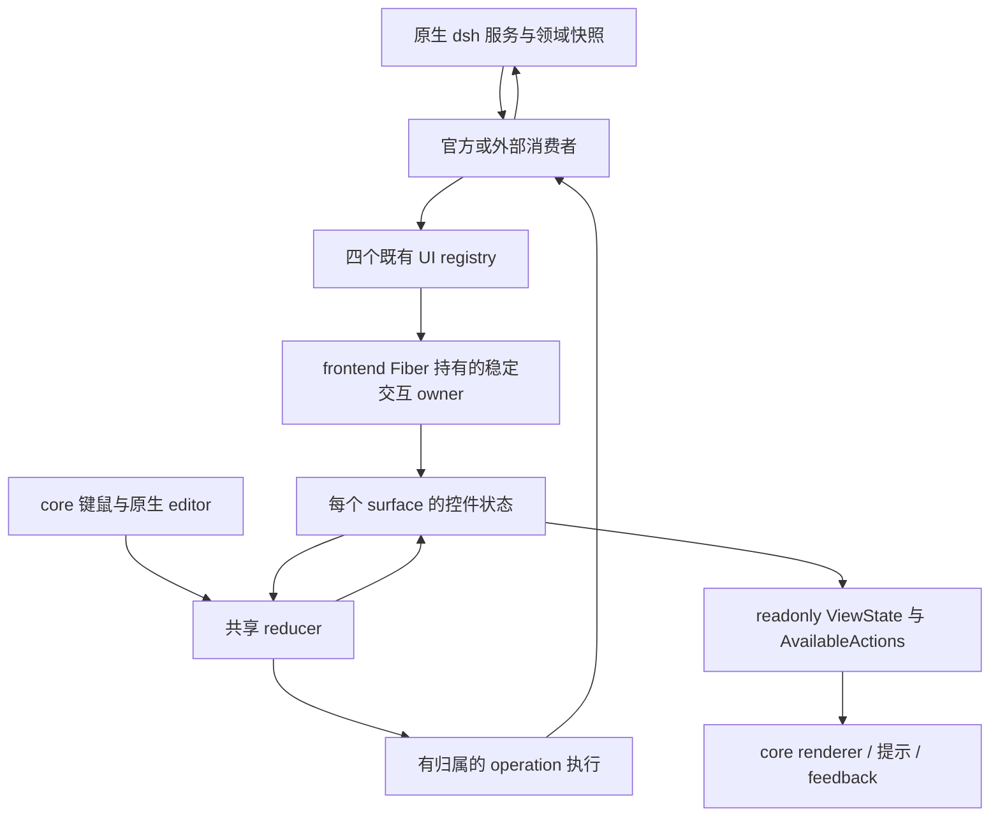
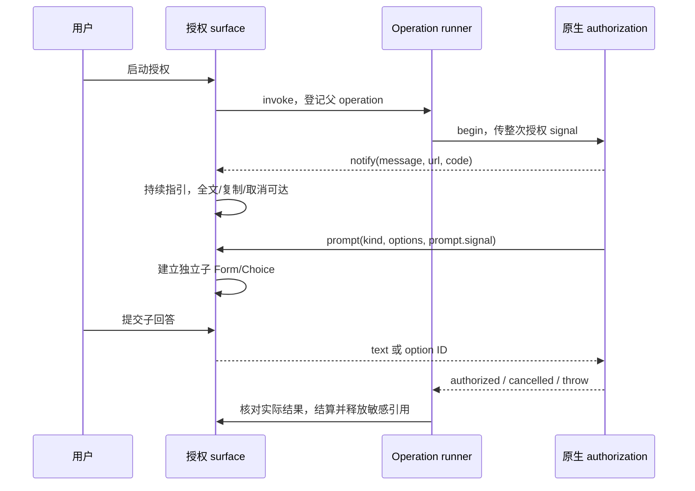

# PR #15 交互重构详细实现方案

状态：目标方案与实施缺口复核，尚未完成发布验收。初稿日期：2026-09-06；复核日期：2026-09-07。问题基线：`b82acd2`，即 PR #15 合并后的主分支；另核对 `refactor/ui-interaction` 工作树中的未提交实现。Harness 锁定版本：`0.1.2-alpha.5`。

本文依据 [PR #15](https://github.com/Ephemeral-AI-Lab/mayfly/pull/15)、[统一模型设计](./ui-ux-unification.zh.md) 和 [分批实施计划](./ui-ux-implementation.zh.md)，补齐代码级决策、模型、消费者、交互时序和交付门槛。类型片段表达目标协议，不是已发布 SDK 的使用示例；候选实现已有对应代码的部分仍须经过完整验证。本文不替代当前架构文档。

## 0. 基线与当前实现的区别

PR #15 的 head 为 `aa7efc9`，改动为两份审计、统一设计、实施计划及文档索引，共五个 Markdown 文件。它的审计结论应对照主分支源码，不能直接当作独立工作树的现状。

| 范围 | 本次核对的状态 | 对实施安排的影响 |
| --- | --- | --- |
| 主分支 `b82acd2` | 仍有官方 Form/List/Info/Frontend controllers、renderer 内事件 owner 和旧 editor panel 栈 | 保留为行为问题与迁移前对照，不再重复创建另一条实现分支 |
| 公共协议与稳定模型 | 工作树已有 `interaction.ts`、prepared reply、`UiInteractionService`、`UiSurfaceModel`、Form/Choice 与 Tabs/Wizard 状态 | 复核和补齐现有实现，不重新搭建平行模型 |
| 已改写消费者 | Provider/OAuth/首启/模型、问卷/审批/计划、设置/预设、Tools/MCP、会话信息/Skills 已使用共享节点 | “已改写”不等于生命周期、覆盖率和发布闭包已经通过 |
| Jobs | 已迁移真实 native registry 测试与旧 width scan：37 项行为测试、16 项尺寸用例通过，jobs.ts 四项覆盖率为 100% | 基础消费者已闭合；完整 Document 页内锚点仍依赖后续共享实现 |
| 尚未闭合 | Help、市场、sessions/agents、权限与更新/trace 路径、editor extensions、旧通用栈、完整通知与动作路由 | 按下文消费者表逐项接入、删除旧路径 |
| 验证记录 | [进度记录](./ui-interaction-progress.zh.md) 最近记录 41 个相关文件、572 项测试通过，也记录 18 处旧协议类型错误和覆盖率不足；该检查点早于 Jobs 改写 | 本次未复跑这些测试；该数字不是当前全工作树通过证明 |
| 发布状态 | 未完成完整 build/lib/pack/full gate，未提供新的 profile/PTY/人工验收 | 已有混合 `lib/` 不能安装成此次重构的验收版本 |

本次复核只完善方案文档。后续执行以第 11.1 节的续做顺序为准；第 11 节 A-F 保留完整设计依赖，便于审查每个批次本应提供的证据。

## 1. 对 PR #15 的判断

PR #15 已合并，但改动只有五个 Markdown 文件。它建立了审计依据和目标协议，没有实现统一交互模型，也没有修复审计列出的运行时行为。PR 的 CI 通过证明这份文档变更未破坏现有代码，不能证明新交互已经可用。

应沿用的核心决定是：共享控件 reducer，每个 surface 独立持有实例状态，frontend 提供稳定生命周期。Harness 继续持有领域状态，core 继续独占输入、焦点和终端布局。官方面板与外部 UI 使用同一协议。

实现前必须补齐下列细节：

| 代码事实或设计缺口 | 影响 | 本方案的落地决定 |
| --- | --- | --- |
| `CanonicalFormController` 和 `UiFormStateStore` 都持有字段值；末字段推进可以调用整表提交 | 调整某个按键分支无法消除双重状态所有权 | 把草稿与验证归入 surface 实例，controller 迁为节点定义和领域 action |
| `EditorPanelController.entries` 保存 `MayflyFocusable` 对象 | 当前 replay 依赖组件存活，不等于 renderer 重建后恢复用户态 | 栈保存 surface 实例引用和返回锚点，renderer 重新创建对象 |
| `SurfaceEventOwner` 位于 renderer 内，`selection-change` 使用 latest，其他事件进入 FIFO | renderer 生命周期影响业务结算；选择接受可能被当作可丢弃更新 | 拆开本地编辑事件与 effect 请求，将 operation owner 移到稳定层 |
| 通用外部事件固定 30 秒超时，失败会关闭 surface | 直接复用于授权等待会关闭正常交互，表单错误也可能丢草稿 | 人工等待服从 native 请求生命周期；普通 effect 失败留在所属 surface |
| Provider 编辑先读取 profile，保存时才读取最新 settings revision，再整体覆盖 route | 旧值可能携带最新 revision 通过校验，覆盖其他编辑者的修改 | 同次 descriptor 读取值和 revision；只写实际修改路径，提交携带对应 revision |
| `MayflyUiEventContext` 只有 surface ID、signal、事件 revision | 不能唯一识别重开实例、页面、提交草稿和领域版本 | 分开注册实例、页面路径、draft revision、operation ID 和 source stamp |
| 表单回执只描述单表，tabs 只描述页面关联 | 一个 Save 如何保存跨页字段仍需实现者决定 | 为 action 声明明确的表单集合提交边界；按钮、键盘别名共用它 |
| `examples/mayfly-ecosystem` 是 composition-only，`examples/overlay` 当前是只读示例 | 在空 bundle entry 中放业务实现会违反包边界 | 可编辑消费者放在 `examples/overlay`；ecosystem 负责打包安装和组合证明 |
| 原生 OAuth prompt 有自己的 `signal`，当前手写 prompt 参数未接入；取消抛普通 Error | 浏览器成功后的撤回可能留下输入面板；用户拒绝可能呈现为失败 | 单 prompt 撤回、用户拒绝、整次授权取消分别映射原生语义 |
| settings 有 `settings/document-updated`，不只 `settings/updated` | 原始覆盖层改变但解析值相等时，表单仍可能持有旧 revision | 配置消费者同时观察原始文档版本和解析值，合并为一次权威重读 |

上述代码事实对照主分支基线：[form-panel.ts](https://github.com/Ephemeral-AI-Lab/mayfly/blob/b82acd2/packages/mayfly/src/interaction/form-panel.ts)、[ui-surface-state.ts](https://github.com/Ephemeral-AI-Lab/mayfly/blob/b82acd2/packages/mayfly/src/core/ui-surface-state.ts)、[editor-panel-controller.ts](https://github.com/Ephemeral-AI-Lab/mayfly/blob/b82acd2/packages/mayfly/src/interaction/editor-panel-controller.ts)、[surface-renderer.ts](https://github.com/Ephemeral-AI-Lab/mayfly/blob/b82acd2/packages/mayfly/src/core/surface-renderer.ts)、[provider-add.ts](https://github.com/Ephemeral-AI-Lab/mayfly/blob/b82acd2/packages/mayfly/src/interaction/provider-add.ts)。原生语义对照 [Harness 设置参考](https://deepseek-harness.github.io/deepseek-harness/reference/subsystems/settings)、[凭据参考](https://deepseek-harness.github.io/deepseek-harness/reference/subsystems/credentials) 和锁定版本的 authorization 类型声明。

## 2. 目标架构与所有权



稳定 owner 是 `mayfly-frontend` 下的内部 `mayflyUiInteraction` 服务。实现位于 `core/` 的纯状态模块，`frontend/index.ts` 只负责挂载，不经 `core/index.ts` 导入终端。它不是第五个公开 UI contribution service。

官方编辑面板使用 `mayflyOverlays.open()` 与 `presentation: 'editor'`，和普通 overlay 共用注册、状态及事件结算；`presentation` 只选择 core 内的物理呈现位置。删除旧 `mayflyEditorPanels` 通用组件栈，不另建 editor-panel registry、私有 Panel DSL 或新旧事件转换层。只读子会话的原生 transcript renderer 按第 5.8 节处理。

| 状态 | 唯一权威 owner | 允许保留的辅助数据 |
| --- | --- | --- |
| Agent、Session、settings、credentials、approval、authorization、jobs | 原生 dsh | 消费者保存只读编辑 baseline、必要的读取上下文 |
| 表单草稿、选择集合、激活页面、向导步骤、语义焦点、返回路径 | surface 实例及共享 reducer | renderer 缓存只作为派生结果 |
| UI action 的 pending、错误、一次调用防重、通知归属 | 稳定交互 owner | 私有 effect bindings 持有取消句柄和 native authority |
| 终端几何、滚动测量、命中区域、ANSI、renderer handles | core renderer | 语义锚点可以写回 core-owned 实例 slice，几何不进入公共模型 |
| 文本编辑协议、输入法、caret、undo/redo | core 原生 editor binding | 模型保存唯一可恢复草稿；业务层不维护第二份 values |
| Provider 新增流程中的已完成步骤结果、Job 消费式读取 | 原有业务 owner | 可以持有领域流程数据，不能据此自行解释通用按键 |

文本同步只有一条写入链：原生 editor 的 change 回调提交 `DraftChanged`；模型驱动 baseline 更新时才同步 editor，并抑制回声。普通重绘不得反复 `setText`。renderer 重建至少恢复文本和语义定位；原生 API 未提供序列化能力的 undo 历史不宣称跨 renderer 重建保留，也不持有已卸载 editor 来模拟保留。

### 2.1 Fiber 依赖拆分

| Fiber | 依赖与职责 | 卸载含义 |
| --- | --- | --- |
| frontend 根 | 挂载稳定模型和 locale；不 inject app/skills/theme/screen | 整棵 UI 状态销毁 |
| registry 观察子 Fiber | 仅 inject 实际消费的 pane/overlay/editor-extension registry 和稳定服务 | 对应 registry 旧注册失效；其他 registry 不连带重置 |
| core renderer | inject 稳定服务、screen/components/theme/keymap | 仅解绑 renderer、几何、输入 continuation |
| app 级 Provider UI 子 Fiber | 在 frontend 下挂载，依赖 settings/credentials/必要的 llm、commands 与稳定服务 | 依赖真正消失时移除其贡献及敏感草稿 |
| Agent 级交互 Fiber | inject 精确 current-Agent 和实际 native 请求服务 | 关闭其 scope 的请求，拒绝旧结果进入新 Agent |
| 外部 overlay 插件 | inject commands/settings/mayflyOverlays | 完全遵循普通 consumer Fiber 清理 |

`core` 重载会使当前依赖 `mayflyScreen` 的 app 暂时卸载，并传导到依赖 current-Agent 的 interaction。这正是 Provider 编辑不能继续挂在 interaction 父 Fiber 下的原因。

拆分 `registerModelCommands()` 时，Provider 编辑/新增的 app 级流程与模型采用的 Agent 级动作分开。命令入口可转交稳定的 app 级 UI 请求；后续流程不得保留旧 display quartet 或依赖该命令 Fiber 的 restore 闭包。授权后选择当前模型是独立的 Agent 级步骤，发起时重新取得确切目标，不能拿开始授权时的 Agent 默认写入。

## 3. 模型设计

### 3.1 身份与版本

下列为内部类型轮廓，用于划清状态边界，不作为新增 subpath 导出：

```ts
type SurfaceKind = 'pane' | 'overlay' | 'editor-extension'

interface PageSegment {
  readonly controlId: string
  readonly itemId: string
}

interface ControlAddress {
  readonly pagePath: readonly PageSegment[]
  readonly controlId: string
  readonly fieldId?: string
}

interface SurfaceInstance {
  readonly kind: SurfaceKind
  readonly publicId: string
  readonly registrationGeneration: number
  readonly replacementGeneration: number
}

interface SourceStamp {
  readonly resourceId: string
  readonly revision: string | number
}

interface SubmissionIdentity {
  readonly operationId: string
  readonly surface: SurfaceInstance
  readonly draftRevision: number
  readonly source: readonly SourceStamp[]
}
```

`SurfaceInstance` 的代际由稳定 owner 分配并绑定注册生命周期，不要求插件申请 owner token。不同 registry 的同名 ID、同 ID 的重开、provider reload 都得到不同实例。页面和控件地址采用结构化 tuple 索引，不能随意用分隔符拼字符串，也不能用翻译后 label 或 renderer leaf path 做 key。

版本必须分开使用：

| 版本 | 用途 | 不能承担的职责 |
| --- | --- | --- |
| registry revision | snapshot/delta 的顺序与读取失效 | 判断数据库写入是否冲突 |
| registration/replacement generation | 辨认注册重开和整体替换 | 表示 theme 或 resize |
| draft revision | 匹配一次校验或提交的输入 | native CAS |
| operation ID | 防重复结算、通知更新和父子交互归属 | 外部副作用 exactly-once |
| native source stamp | 业务 handler 校验领域并发 | 跨不同资源比较版本大小 |
| renderer generation | 拒绝旧组件输入、定位和测量回调 | 中止仍有效的业务 action |

公共 registration 声明 app/session/panel 归属及目标标识。panel 归属解析到当前父实例，并继承其业务 scope；它主要约束 lifetime。session ID 只是可序列化归属，私有 action binding 还必须保留精确 live Agent authority 与选择代际。目标换成另一 Provider、Agent 或请求时采用 replace。

### 3.2 控件状态

| Slice | 关键字段 | reducer 负责的转换 |
| --- | --- | --- |
| FormState | baseline、字段 draft、dirty、conflicts、errors、draftRevision、pendingOperation | edit、reset-field、reconcile、validate、submit、settle、discard |
| FieldState | kind、raw/value、baseline、是否修改、验证版本 | 数值中间态、文本编辑、选择器接受、局部错误失效 |
| ListState | role、focusedItemId、draftSelectedIds、committedIds、invalidSelectedIds | 移动、toggle、accept、重排/删除后的锚点协调 |
| SearchState | query、编辑状态、搜索前锚点、请求版本 | 输入、清空、退出编辑、结果更新 |
| TabsState | activeId、每页状态引用 | 激活、重排、删除、焦点恢复 |
| TreeState | expandedIds、搜索期间展开集合、活动记录 | 展开/折叠、父子导航、搜索后恢复 |
| DocumentState | 内容语义锚点、follow 意图 | 翻页/回到首尾；实际行偏移由 renderer 计算 |
| WizardState | stepIds、activeStepId、已确认步骤及对应 draft revision | 前进、后退、跳转、最终提交、修改后失效完成标记 |
| DecisionState | 目标 action、后果、默认 choice、目标版本、settlement | 请求确认、Yes/No、过期、恢复父焦点 |
| NavigationState | 活动 surface、父实例、return anchor、capture scope | 打开、返回、隐藏、关闭、dispose |

Form 的 `dirty` 比较包含值与显式 reset/override 意图。设置从“继承默认值 X”改成“显式保存 X”，虽然显示值相等，仍是领域变更。UI 字段可以声明 inherited/explicit 等只读来源及 reset 后的预览值；提交携带 `unchanged/set/reset` 意图，由 settings 消费者映射为原生 path ops。共享模型不认识 settings namespace 或文件路径。

文本保持用户输入的原文，通用层不统一 `trim()`。名称、URL、整数等是否规范化由字段约束和业务校验决定；secret、反馈正文、多行内容不能因为复用表单被任意修剪。number draft 保存 raw string，`-`、空串等编辑中间态不是合法已提交 number。

### 3.3 Reducer、查询与 effects

纯 reducer 接收一条语义事件，返回局部 next state 与结构化 effect intent。effect runner 才读取私有 binding 并调用 native 服务。`render()`、`selectView()` 和 `availableActions()` 不修改语义状态、不启动加载、不补默认选择。

不建立每次按键复制全局大对象的 store。按 surface/control 分区维护版本与订阅，输入只通知受影响的表单、提示或反馈消费者。视图快照可以缓存，共享不可变来源，但不得反向成为新的草稿权威。

私有 runtime bindings 存放 callback、Promise、AbortController、原生 editor 及 Agent authority。可诊断快照只含 readonly 数据；secret、OAuth code/URL 和提交 payload 默认脱敏，不进入普通调试导出或通知历史。

### 3.4 刷新、草稿与派生视图的实现边界

消费者只保留最近一次完整领域读取及其来源，用它生成 node；模型只保留编辑需要的 baseline/draft。目录读取失败时，可以展示同 scope 的上次完整结果并标明过期；切换 Agent/目标后不能继续展示前一个目标的数据。

一个 UI 数据更新分成三个步骤：先在 registry 接纳不可变声明，再在模型协调受影响的控件，最后向 renderer 发布视图版本。字段值、候选存在性、表单提交边界与目标版本属于语义变化；颜色、翻译、持续时间标签与尺寸属于呈现变化。呈现变化不能自行推进领域 source stamp。

对 settings，source 至少表达 namespace 的原生 raw revision；另外用只读字段定义及可见有效值摘要检查“raw revision 未变，但 schema/组合默认值变了”的情况。摘要不能包含 secret，也不能包含翻译。native 没有提供 namespace 注册 epoch 时，不能宣称可检测同值、同版本的卸载后重注册；依赖卸载可观察到时立即结束旧实例。

`availableActions`、焦点查询及 readonly view 应按 surface/control revision 缓存。registry 的结构更新允许遍历受影响声明；普通按键与重复 render 不应重扫全部 session、插件目录或隐藏表单。当前工作树已有同名纯结构遍历文件 `ui-interaction-tree.ts`，它不是 Tree 控件交互已经完成的证据。

## 4. 公共契约与更新协议

### 4.1 最小契约扩展

复用 `packages/ui/src/contracts.ts` 的现有 node 和四个 registry，不建立另一个 Panel DSL。

| 现有契约 | 拟定改动 | 第一消费者 |
| --- | --- | --- |
| Form fields | 声明必填/长度等数据约束，补 number 和多选字段；区分 draft 与 baseline | Provider、settings overlay |
| Form submit/cancel action ID | 明确引用 action；同一按钮只产生一个 focus control | 官方与外部表单 |
| ActionItem | 可声明一次提交覆盖的 form 地址集合；单表 submitActionId 归一为同一边界 | 跨两个 tab 的 Save |
| ListNode | 明确 browse/choose 角色、选择基数、不可用原因；selectedIds 只作初始/权威 baseline | 多选模型、OAuth select |
| MayflyUiChild | `tab: { controlId, itemId }` 页面关联 | 双页 Provider、外部 overlay |
| registration definition | readonly scope/目标；handler 继续放注册层 | 试点两个消费者 |
| SnapshotUpdate | data/replace 和 source stamps；ack 由有效 operation 的结算路径生成 | settings watcher 与 Save |
| UiEvent/context | 页面/表单地址、独立 action ID、operation/draft revision、只读提交值 | 所有可写消费者 |
| action handler reply | accepted/invalid/conflict/failed，必要时携带最新权威 snapshot | 异步保存和冲突恢复 |

`mayflyStatus` 保持被动只读展示，不为统一模型增加 action 或草稿状态。editor decoration 保持较窄的 node union，已有 decoration actions 接入共享结算；不开放 Form/Tabs，不把 `mayflyEditorExtensions` 扩成完整面板宿主。官方 editor replacement 使用普通 overlay 注册及 `presentation: 'editor'`。

### 4.2 提交与回执类型

以下是协议草案；`Submission` 是统一 runner 生成的不可变快照，不是消费者持续维护的草稿：

```ts
interface SubmittedField {
  readonly id: string
  readonly change: 'unchanged' | 'set' | 'reset'
  readonly value?: string | number | boolean | null | readonly string[]
}

interface SubmittedForm {
  readonly pagePath: readonly PageSegment[]
  readonly formId: string
  readonly draftRevision: number
  readonly fields: readonly SubmittedField[]
}

interface Submission {
  readonly actionId: string
  readonly draftRevision: number
  readonly forms: readonly SubmittedForm[]
  readonly source: readonly SourceStamp[]
}

interface FieldError {
  readonly pagePath: readonly PageSegment[]
  readonly formId: string
  readonly fieldId: string
  readonly message: string
}

type FormActionReply =
  | {
      readonly kind: 'accepted'
      readonly node: MayflyUiNode
      readonly source?: readonly SourceStamp[]
    }
  | { readonly kind: 'invalid', readonly errors: readonly FieldError[] }
  | {
      readonly kind: 'conflict'
      readonly node: MayflyUiNode
      readonly source?: readonly SourceStamp[]
      readonly message: string
    }
  | {
      readonly kind: 'failed'
      readonly message: string
      readonly node?: MayflyUiNode
      readonly source?: readonly SourceStamp[]
    }
```

相较 PR 的最小回执，补充 source stamp 与 failed 可携带实际状态，分别支持并发判定和多步写入部分成功。它们是 UI 结算数据，不替换 Harness 的原生错误类或返回值。

非表单动作另外返回明确的 `completed` 或 `cancelled`，如打开详情、执行原生 Stop 后等待 native 更新；不能为了结算一次按钮调用而伪造一份旧 accepted snapshot。`failed` 可声明经过原生结果证明的 `acceptedFields`，仅推进确实写入成功的字段 baseline，保留其余草稿。回执中的 `dismiss`/`navigate` 必须在回执准入后执行，失败时不能先关页面。

观察事件与 effect 在类型上应区分：导航/编辑观察可以没有回执，持久化 action 必须给出结构化结算。候选实现目前的总 `onEvent` 类型仍允许 `void`，最终须用判别类型或明确的 handler 分组收紧，并以外部 type fixture 证明“忘记返回 Save 回执”会被拒绝；不要靠运行时默认成功弥补类型缺口。

`Submission.draftRevision` 标识本次聚合快照；结算逐项核对 `SubmittedForm.draftRevision` 与被锁定的提交边界。用户编辑同 surface 中另一个未参与提交的表单，不应使本次保存失效。原生提供 revision 的消费者必须带回对应 source stamp，optional 只用于该资源确实没有版本能力的情况。

未修改 secret 的 `value` 不进入提交，`unchanged` 表示保留原凭据；显式清除必须是单独的 reset/delete 意图。新增 secret 只存在于本次编辑与提交的必要内存中。无效错误路径属于协议错误，保留表单并显示局部可理解的失败，不能静默丢掉错误后视为成功。

跨页 Save 使用 action 声明的 `forms: [{ pagePath, formId }]` 收集值，执行一次验证、一次 operation。单字段 Enter、页切换和多个独立字段事件都不构成提交。Wizard 最终提交也使用显式的表单集合，而不是要求业务从多个事件拼一份答案缓存。

公共事件按以下规则固化，避免只改名字仍混用执行语义：

| 事件 | 载荷 | 本地 reducer / 注册 handler |
| --- | --- | --- |
| `value-change` | 页面、form/field 地址、当前值与字段 draft revision | 先更新本地草稿；可观察或做只读校验，不写领域 |
| `selection-toggle` | choice 地址、候选 ID、变更后的集合、draft revision | 只改选择草稿；不等同于确认选择 |
| `selection-accept` | choice 地址、真实选择集合、明确 action ID | 表单内 picker 更新父字段；独立 selector 才按其声明发起 effect |
| `tab-change` | tabs 地址、激活 tab ID | 本地页面状态先完成；可触发按页隔离的只读加载 |
| `submit` | action ID 和不可变 Submission | runner 执行一次表单提交，要求结构化回执 |
| `activate` | action ID、发起控件地址、目标定义版本 | 根据语义进入导航、确认或业务 effect；不能只用 controlId 猜目标 |
| `dismiss` | 当前 surface、关闭原因 | 请求共享关闭流程；通过 dirty/子交互规则后才 dispose |

这里的先后顺序由共享 owner 保证。外部 handler 不需要回送每次 `value-change`、toggle 或 tab 来保持显示；没有对应只读消费者时不创建异步任务。`selection-change` 在新协议移除，同一次 change 和 accept 不再竞争一个 latest 通道。handler 类型区分 observation 与 action，防止一个返回 void 的保存分支被误判为 accepted。

### 4.3 三种 snapshot 更新

| 更新 | 初始化/保留规则 | effect 与焦点规则 |
| --- | --- | --- |
| data | 同一实例的外部数据刷新，执行字段三方协调 | 保留有效草稿、焦点、页面；不因任意 revision 增加就 abort Save |
| ack | 仅有效 operation 回执可产生，关联提交 draft revision | 准入成功后同步 baseline 与结算；重复或过期回执无效 |
| replace | 同一公开 ID 下显式更换完整实例内容或 scope | 取消适用任务、清草稿/确认/错误，再从新 baseline 初始化 |

新协议中省略 update metadata 按 data 处理，`set(null)` 表示贡献内容移除并释放对应控件状态；需要临时保留的 overlay 使用 hide，editor panel 使用导航隐藏。不得把 null 当作不明确的保留机制。

旧版 `set(node, { eventRevision })` 随明确版本升级删除，同时迁移 `mayfly-ui`、Mayfly runtime、仓库内 examples 和文档。候选分支允许迁移期间暂时不具备发布条件，但不实现兼容 handler、事件别名或转换边界来掩盖未迁移调用；最终类型检查与源码约束必须拒绝旧协议。

### 4.4 data 的字段协调算法

用 `B` 表示开始编辑时该字段的 baseline，`D` 表示当前 draft，`N` 表示新权威值。这里的比较包括字段来源/reset 意图，不能只比较格式化文案。

| 条件 | 处理 |
| --- | --- |
| 字段未修改 | baseline 和 draft 同步到 N |
| 字段已修改且 N 与 B 等价 | 保留 D，无新增字段冲突 |
| 字段已修改且 N 改变 | 保留编辑 baseline B 与 D，记录最新 N 和冲突；展示差异 |
| 冲突时用户选择采用最新值 | baseline/draft 设为 N，清该字段 dirty/conflict |
| 用户明确选择保留自己的修改 | baseline 重建到用户已查看的 N，D 保留；后续 Save 使用对应 native revision |
| 字段被删除、kind 改变或 action 被删除 | 销毁相关旧状态和 continuation；必要时显示结构变化，禁止提交旧地址 |
| 仅 label、locale、theme、viewport 改变 | 不产生字段 dirty/conflict/reset |

已修改字段即使碰巧 `D === N`，data 也不是该 operation 的 ack。可以提示外部值已与输入相同，但清理 pending/提交结算仍需要匹配回执或显式用户接受。

同一 namespace 的其他字段变化可能没有字段冲突，但 native revision 已变；提交不能自动用最新 revision 包装旧整表数据。业务重读并按修改路径判断是否可基于新 descriptor 提交，若目标字段有变化则要求用户处理冲突。无 native CAS 的服务，只能重读、提示并发限制和显式确认，不能承诺消除最后一次读取与写入间的竞态。

### 4.5 ack 的原子发布与竞态

这部分同时修改 `services.ts` 的共享发布实现和 core operation runner，不能由 feature 自己在成功时再 `set()` 一次。

1. 在 effect 启动前，记录实例、scope、提交边界、draft revision、source stamps 和本次提交值，锁住该提交边界。
2. handler 校验并调用 native action，成功后重新读取权威值，返回完整 surface snapshot。
3. provider 使用既有 `freezeWire` 路径冻结候选；core 对需要结算的控件执行 schema、地址与配额准入。
4. 准入及发布前最后检查原注册、scope 和 operation 仍有效。发布绑定原 registration 实例，不按公开 ID 寻找一个可能已重开的 handle。
5. 通过原 registration 的共享发布路径发布 snapshot 和 ack；稳定 owner 将此次 delta 与结算作为一个状态事务处理，订阅者看不到“dirty 已清、baseline 还是旧的”中间态。
6. 若提交期间已收到相关 data，核对 handler 返回的 source 与最新权威快照。能证明覆盖当前读取版本才应用；否则保留最新 data、草稿及冲突，安排一次有读取代际保护的重读。
7. native 写入已成功而 UI 准入失败，记录“写入完成、界面同步失败”的结果并重读，不自动重发写入，也不声称未保存。native 结果未知则明确为待核对。

provider 内部需要把当前已冻结 entry 与其原始发布闭包关联，core 通过注册层的结算通路提交回执。该通路不创建新的 UI service，也不允许 feature 自造 ack。A/B 批次以“renderer 缺席仍会发布 accepted snapshot”的 provider/core 集成测试固化这一边界，再锁定最终签名。

一个新的 data 只改变无关文案，不能使 operation 失效；一个较新的 data 修改了同一业务值，也不能被旧 accepted snapshot 覆盖。source stamps 只对同一资源比较，opaque 字符串不进行大小排序。

### 4.6 tabs、动态页面与准入

页面关联放在 `MayflyUiChild.tab`；嵌套关联构成 pagePath。每页的 form/list/control ID 在页内唯一，不同页可以复用。Tab 激活只改变可见性，相关子树继续存在于已发布 snapshot，草稿不转移给插件。

加载中需要保留已有页：保留其内容声明及关联，在该页显示 loading 状态；不能把整页 Form 换成 loader 后期待已经删除的字段仍存活。首次未加载的页可以只有关联的 loading/empty 占位。真正删除页面释放字段、敏感草稿、校验和该页读取任务。

维持当前 lazy admission：结构关联在可准入边界检查，隐藏响应式分支仍首次可见才做完整准入；大 list 不为状态索引而全量编译。发生错误时隔离到所属页或条目。render 中不修复重复 ID 或隐式创建新的语义状态。

## 5. 消费者设计与迁移映射

### 5.1 谁读写模型

| 消费者 | 输入 | 输出 | 禁止承担的职责 |
| --- | --- | --- | --- |
| 官方 feature / 外部插件 | 原生 descriptor、projection、请求 | readonly node、约束、action handler、领域回执 | raw 按键、第二份 cursor/草稿、自己实现确认 |
| registry 接入层 | 注册/delta、scope、回执 | surface 实例生命周期事件 | 获得 Agent 或处理终端 |
| core compiler/renderer | node + ViewState + 实际 viewport | 绘制、命中区、语义输入事件 | 保存时写领域、render 时修改语义状态 |
| input router | 归一化输入 + AvailableActions | 唯一匹配的语义事件 | 按 feature 名打特殊按键补丁 |
| 按钮、hint、help | 同一 AvailableActions | 文案、enabled/busy、真实键绑定 | 手拼一套与 handler 不同的 keys |
| feedback renderer | scope 过滤后的 NotificationState | 当前 editor/panel 下的摘要和详情入口 | 把通知复制成另一份字符串状态 |
| headless conformance runner | node、事件轨迹、可控原生结果 | 状态和副作用断言 | 用测试自己的 reducer 替代实际调用路径 |

### 5.2 官方功能迁移表

| 功能/文件 | 复用模型 | 领域消费者保留的职责 | 迁移后删除 |
| --- | --- | --- | --- |
| `form-panel.ts`、Provider 编辑、startup | Form + Decision | settings/credentials 读取与写入、startup 协调 | values/editing/submitDirection、按 Tab 保存 |
| `select-list.ts`、`select.ts` | Browse/Choice + Search | 提供列表、选择基数、接受结果 | cursor/query/filterEditing、空选回填 |
| `settings-command.ts` | 浏览属性 + Form/Choice/Toggle | schema 到字段的投影、继承/reset、native revision | enum cycle、私有 notice、字符串拆装事件 |
| `provider-add.ts` OAuth | Wizard + Form/Choice + 持续指引 | authorization.begin、模型发现、凭据/配置步骤结果 | select 文本化、指引发 editor notice、自建 prompt 按键 |
| `frontend-panel.ts`、model picker、market | Tabs + Browse/Choice + Search | 分组/模型元数据、安装/移除/采用模型 | group/query/cursor/selectedVariants 的通用状态 |
| `/sessions`、`/agents`、`session-tree.ts` | Tree + Document + Action | 原生 Agent 关系、live 判断、attach/resume/stop | 手工搜索树、缩进式导航、restore 闭包 |
| Help/Info/Trace/Job output | Document + Scroll | 内容构建、原生输出读取、分页游标 | 私有 scrollTop/页长/关闭键 |
| `questionnaire.ts` | Wizard + Choice/Form | 映射 native question/answer、取消错误 | toggled/draft/cursor/tab、拼 `[x]`、最后一题自动整单提交 |
| approval、plan review | Decision + Document + Feedback Form | 原生 allowed/rejected/feedback outcome | 私有 reasonDraft、数字键决策、独立确认流程 |
| `confirmation-panel.ts`、公开 `action.confirm` | 同一 Decision | 提供目标和后果 | closure settled 与 pendingConfirmation 两套决策 |
| editor notice、settings notice、market、update | Notification + Operation | 生产结构化事实、恢复日志和详情 | 空串全清、预染色、任意 TTL、重复反馈 |
| `pane-queue.ts` | 原生 inbox 的只读投影 | 按 source 分类、附件摘要 | 将所有 inbox 消息视作用户待处理任务 |

表格中的 generic state 删除只针对已迁移功能，领域流程中有相似名称的变量不机械删除。Job output 的消费式读取和有界页仍由现有读取路径持有，不能为统一 Document 把无限输出复制进模型。

### 5.3 第一批官方消费者：Provider 编辑

采用已存在的 Provider 编辑工作流，不先用帮助文档替代可编辑试点。表单将连接配置和凭据分为两个 tab，使用一个全局 Save；先不扩张为完整新增向导。

1. 打开时读取 `settings.describe()` 中目标 namespace 的同一 descriptor，获得 baseline 和 revision；凭据只读取 `credentials.describe()` 的 configured/source/writable，不把已存 secret 填入 node。
2. 连接页提供 name、允许编辑时的 baseURL；凭据页提供空的 write-only secret 字段及明确清除动作。非 writable 凭据展示原因。
3. 输入、Tab、切页、返回均零写入。Save 收集两页提交边界，执行路径级校验，锁住相关字段。
4. settings 只写变化路径，例如 `providers/route/displayName`，保持未编辑 models/api 等原生字段；携带与此次 baseline 对应的 expectedRevision。
5. 发生 native conflict，重读 descriptor 并返回 conflict；UI 保留用户输入，呈现新值及“采用最新/保留我的修改”动作。
6. settings 成功后按明确意图更新凭据。两步没有 native 事务；凭据失败时重读实际配置，显示已完成部分及可重试的凭据步骤，不能把整次操作呈现成原状未变。
7. accepted 后清除已确认的 dirty 和 secret 引用。提交失败时仍在表单内，字段与操作错误可见。
8. 删除 Provider 是独立浏览 action，进入默认 No 的确认；No 返回同一表单草稿。Yes 绑定目标和已查看版本，真正删除后关闭目标表单并回到父页。

一般文本字段中的 Delete/Ctrl-D 归编辑器；删除 Provider 通过可达 action 区执行。原生凭据 API 不提供的跨资源事务、CAS 或回滚能力不在 UI 层补造。

### 5.4 第一批外部消费者：可持久化 overlay

在 `examples/overlay/src/index.ts` 将只读示例升级为实际设置编辑器；`examples/mayfly-ecosystem` 继续只做普通 sibling composition。无需增加第六个示例包或特殊插件 host。

外部插件注册自己的 `mayfly-example-overlay` settings namespace，提供两个 tab；两页有同名字段 ID 以验证 pagePath 隔离。至少包含文本、单选和 toggle；number/多选随 D 批次增加。一个 Save 更新 native namespace，关闭再打开能读回保存值。

消费者仅负责四项代码：schema/只读 snapshot 构建、原生事件订阅、打开 overlay、保存 handler。每次键入不需要 `handle.set()` 回送，不保存 tab/cursor/draft Map。Save 使用 descriptor revision 和 path ops，成功返回 accepted node；watcher 的 data 只代表源变化，不能手工标 ack。

修改 example 的依赖、owning AGENTS 和中英 README，更新 packed fixture。通过 `check:examples` 和 ecosystem 安装证明 package-name imports 读取 built `lib/` 也可运行，不能只用测试相对导入绕过发布边界。

官方和外部各挂载真实表单后运行同一事件轨迹，断言相同的草稿、冲突、返回和结算结果。保存两份不同业务数据是允许的，通用交互差异不允许由各自 handler 修补。

### 5.5 全部消费者的领域与生命周期清单

下表的依赖是按领域划分的最小集合，具体 service 名称和签名以当前注入声明及锁定 native API 为准。领域消费者可以保留必要的读取结果、请求队列和业务步骤；页面、搜索、选择、表单和确认状态归共享模型。

| 消费者 | 归属与读取源 | 界面和明确动作 | 特殊边界与必须保留的行为 |
| --- | --- | --- | --- |
| Provider 编辑/添加/首启 | app；settings、credentials、llm、authorization；首启另观察启动协调 | Tabs + Form；Save、删除确认、开始授权、发现模型 | Provider 配置不依赖 renderer 或 skills；授权后采用模型是另一次精确 Agent 动作；配置/凭据部分成功分别呈现 |
| 模型与 preset | 精确 current-Agent；原生 llm/model selection、agentPresets | Browse/Choice；Accept 后直接调用原生选择 | 不自行追加原生事件模拟选择；pending/idle/空 Session 限制由原生执行；已开始且不支持 signal 的原生操作可能继续作用于旧 Session |
| settings | app；namespace descriptor、raw revision、schema、继承值 | namespace 浏览 + 类型化 Form；Save、Reset、Override、Refresh、原有文件入口 | 一次 Save 只写变化路径；unknown schema 保持不透明；秘密值只显示 configured，不回填 |
| permission/plan | 精确 current-Agent；原生权限和 plan projection | 独立 Choice/Toggle；选择完全访问进入共享 Decision | 当前值再次选择为 no-op；plan 与 YOLO 独立；保留 PR #14 已完成的安全默认与原生权限语义 |
| Tools/MCP | 精确 current-Agent；tools.schemas、工具变更与 loader 配置 | Browse + Tabs + Document；View/Refresh | 只浏览不执行工具；配置脱敏；不臆造原生没有的连接状态、重启或编辑 API；详情目标消失即关闭 |
| Skills | 精确 current-Agent；native skills catalog | 分组 Browse + Document；查看详情 | `/skills`、`#` 补全、提交改写共用一个目录；不完整结果只保留同 Agent 的上次完整目录；浏览不执行 skill |
| status/context | 精确 current-Agent；一次 sessionProjections.snapshot | readonly Fields/Progress/Chart/Document | 保留不同投影各自的时间和估算含义；不折叠 Session events 自建统计真相 |
| version/changelog/help | app；版本 facts、变更记录、命令与动作定义 | Document；查看详情、返回 | 不因 current-Agent 暂缺而卸载；Help 的实际绑定来自同一 AvailableActions，静态内容不用 command 名猜按键 |
| sessions/agents | 浏览器自身 scope 与精确调用 Agent；sessionQuery、subagents、agents、current-Agent | Tree + Search + Document；View、Attach/Resume、Stop | 执行前重读 live/continuable/祖先权限；保留子 Agent 的原生归属；Cold/one-shot 使用既有 readonly transcript |
| Jobs | 精确 current-Agent；jobs.list/get/read/kill 与 onJobsChanged | Browse -> Inspector -> 有界输出 Document；Read output、Stop | 列表、计时、详情与翻页都不能消费输出；Stop 的终态来自 native，不把取消请求立即显示成 killed |
| 市场 | app/profile；现有 catalog/loader/installer | 分组 Browse + Search + Detail；Install、Remove、Refresh | 检查目标 profile 与 source；保留现有安装阻断和失败恢复；输入 `install` 必须完整进入搜索；操作后重读真实安装状态 |
| trace/update | trace 按原会话目标；update 按 app/profile | Browse/Document + Actions；详情、复制、更新确认 | trace 保留原生顺序与详情；不把完整输出塞进通知；update 保留现有 preflight/swap/回退及宿主选择逻辑 |
| 问卷/审批/计划 | 原生 request + 精确 Agent + request.signal | Wizard、Choice/Form、Document、Decision | 默认不执行；完整 native 答案编码、FIFO、session allowance、单次结算、abort 优先；不重写原生请求调度 |
| editor extensions | 插件 registration + 当前 prompt submit attempt | 被动 decoration、原生 completion、submit transform、明确 action | completion latest；submit transform 单次有序执行；不转换为可导航的大表单，也不增加自由 renderer 注入 |
| 通知/queue | 生产者 Fiber + app/session/panel + operation；inbox projection | 统一摘要/详情；局部反馈和待处理输入各自投影 | 面板期间失败可见；按来源过滤 queue；提示结束只能清理自己的记录 |

已有 ordinary sibling 保持其组合归属。尤其 `@ephemeral-ai/mayfly/jobs` 已在 preset 挂载，不能因为其他官方消费者迁到 frontend，就再次从 frontend 挂载 Jobs，造成命令或监听重复注册。任何挂载调整都通过整树测试核对实际 Fiber graph。

### 5.6 Jobs 的具体交互与读取预算

1. 打开浏览器只调用 `jobs.list(agent)`；选择记录只调用 `jobs.get(id, agent)`。所有调用传本次捕获且仍有效的精确 Agent。
2. Inspector 显示原生当前状态、说明与 Read output/Stop/Close。运行中读取使用同一个原生消费游标，必须在读取前显示这一后果；浏览本身不推进它。
3. Read output 调用一次 `jobs.read()`，把返回 `JobRead` 保存在该输出子 Fiber 中。输出的状态标签明确表示读取时状态，Inspector 继续独立观察实时状态。
4. 原生区分 stream delta 和 final-output-only；已终结读取遵循原生的幂等语义。测试应使用真正的 `LocalJobRegistry`，以多次读取、原生 cursor 和 notice 状态证明区别。
5. UI 只发布一页可准入正文。单行超过正文配额时继续切页；候选实现每页最多 12,000 个 UTF-16 code units，优先换行边界，不能截断 surrogate pair 或丢弃尾部。输出块属于领域读取缓存，不进入通用控件 store。
6. 页码属于共享数字 Form 或最终共享 Document 分页状态；First/Previous/Go/Next/Last 读取同一份提交值。每个页面内再使用真实 viewport 滚动。翻页、resize、返回、renderer reload 的 `jobs.read()` 调用次数必须仍为零。
7. 每次 Read output 创建新的读取结果；旧结果按明确的子视图关闭规则释放，不无限累积整个 Job 输出历史。空 delta 显示当前没有新输出，不自动循环读取。
8. Stop 使用共享确认，默认 No；确认绑定 job ID 和已观察到的相关状态。执行前重读，已结束时返回 no-op；原生 kill 后以原生通知更新，不用旧 accepted node 覆盖更快到达的 completed/failed。
9. live duration 定时器仅在可用列表仍有 live jobs 时工作，目标或父 UI 卸载即清理。计时更新不应打断 Stop 确认或重置输出位置。
10. 测试 producer 的 kill 必须最终 settle `done`，否则真实 registry 卸载会等待；这属于测试 fixture 的 native 生命周期义务，生产 Mayfly UI 不应为测试方便接管 job controller。

### 5.7 外部消费者和 editor extensions

外部 overlay 是首个可写协议消费者；另外逐一迁移 `examples` 中实际使用 pane、overlay、status 和 editor extension 的包。每个例子维持普通 Cordis plugin 及 package-name import，ecosystem 仅组合它们。对于公开而暂时无真实消费者的新字段，应删除或延后，不能只加一个类型 fixture 便宣布完成。

editor extension 按三种请求分别处理：

| 请求 | 调度与结算 | 失效边界 |
| --- | --- | --- |
| completion | 原生编辑器负责 token/caret；同 query 请求 latest；接受候选才插入一次 | query/caret 目标改变、原注册卸载或 renderer binding 失效时撤销旧结果 |
| transformSubmit | 捕获原文、附件绑定和精确 submit attempt；按既有顺序运行 transform；全部成功后才交给原生 prompt 提交 | Agent/attempt 失效、用户取消或注册卸载；晚结果不得提交下一份 prompt；失败保留原输入和附件 |
| decoration action | 接入共享 operation、确认、反馈与原注册的 prepared reply | 原注册/scope/目标失效；renderer reload 本身不重复调用仍有效的业务 action |

原有 completion、transform 与 action 使用同一个 `MayflyUiEventContext` 的签名也要审查。纯读取不应伪造持久化 operation ID；通过明确的请求 context 类型表达 signal、读取/提交版本和需要的能力。node/decoration 仍不含 callback 或 Promise，函数只留在 registration。

### 5.8 只读子会话与旧组件栈的退出

`session-transcript-panel.ts` 目前仍通过 `mountEditorReplacement()` 持有 `MayflyFocusable`、`ScrollablePanel` 和 transcript renderer。删除旧 stack 前必须迁移这条真实消费者，不能因为其他面板都使用 overlay 就删掉它的安装入口。

保留原有 readonly transcript 数据源与 cold session observation、附件/工具呈现和完整历史。把物理 shell、输入、焦点和挂载移到 core 的既有辅助视图/固定 slot 路径；app 继续只声明当前辅助目标，interaction 保留必要的原生读取协调。普通 Form/Document 使用 overlay，readonly transcript 继续使用既有专用 renderer，不把 Session、renderer handle 或整个 TranscriptModel 塞进新的公开 UI node。

F7/F8/Esc 的动作及捕获优先级由统一 router 决定。切回主视图可以隐藏保留同一 readonly 目标；目标关闭或变更必须释放 observation、图片读取和旧 renderer 绑定。迁移完成后，源码不得再从 feature 导入 `mountEditorReplacement` 或构造通用 panel shell。

## 6. 交互逻辑

### 6.1 输入路由

固定优先级：粘贴/组合输入解析，明确紧急中断，最上层 capturing decision/surface，当前 editor 或候选菜单，当前控件，group/surface，允许的全局动作。

只在 core 解析原始终端输入，复用 [pi-tui 的 editor、键盘与焦点接口](https://pi.dev/docs/latest/tui)。点击和键盘激活映射为同一种语义事件；鼠标命中区随 renderer generation 失效，不绕开 disabled/busy/confirm 检查。

`availableActions(state, focus)` 同时驱动实际绑定匹配、action enabled/busy、按钮、提示和 help。确认默认焦点是显式的语义属性，不能从 `intent: primary` 推导。

### 6.2 按控件的输入规则

| 场景 | 导航/编辑 | 提交/退出 |
| --- | --- | --- |
| 单行 Form 字段 | 聚焦保持导航；Enter 或直接输入进入编辑；Tab/Shift+Tab 前后移动，末字段到 action 区 | Enter 完成当前字段并前进；Save 才提交整表 |
| 多行字段 | Enter 换行；原生 editor 处理粘贴和删除 | 显式 Save；Ctrl+Enter 仅在终端和 keymap 支持时显示 |
| Form 内 choice/toggle | 改表单 draft | picker Accept 只更新字段；表单 Save 写领域 |
| 独立枚举设置 | Enter 展开所有候选，方向键只导航 | Accept 明确提交；选择当前值为 no-op |
| 独立 Boolean 设置 | 聚焦可理解的 toggle action | Space/Enter 明确切换，pending 防重复；失败恢复实际值 |
| 多选 | Space/数字快捷键切换当前候选；光标与集合独立 | Enter/Accept 提交真实集合；min=0 允许空集合 |
| 浏览列表 | Up/Down 不循环，Home/End 到边界；Page 键使用真实 viewport | Enter 执行明确的 Open/View action |
| Tabs | Left/Right 激活相邻页；Tab/Shift+Tab 在 group 间移动 | Enter 进入内容；切页不提交，不丢页状态 |
| 搜索 | 直接文字输入优先；统一可搜索字段；中文/粘贴走原生输入 | Esc 退出搜索编辑但保留 query；Clear 清空，再 Esc 返回 |
| 只读文档 | 统一 Scroll；长行可读，动作保持可达 | Esc 返回；q 仅非搜索只读场景；Enter 只激活动作 |
| 二次确认 | 显式 Yes/No，默认 No | Yes 一次，No/Esc 恢复父状态；目标改变使旧 Yes 失效 |

字段错误不阻止 Tab 离开；错误仍贴近字段，整表提交时定位第一个无效字段，包括自动激活其所属页。disabled 项的原因必须可达，窄屏详情可以进入统一 Document，不能只消失。

市场直接输入 `install` 应进入搜索，不触发 `i/u/r`。安装、更新、移除放到明确 actions 或经同一 router 声明的修饰键。非搜索场景的数字候选别名同样登记为语义 action，不由 feature 拦截 raw 字符。

保留 prompt 专属约定：Enter 发送、Tab 补全、Shift+Tab 切 normal/plan、Ctrl+S steer；plan 和 YOLO 可叠加。F7/F8 属于普通导航，遵守当前 capturing surface，不能越过正在等待决定的交互。

### 6.3 返回、关闭与丢弃

Esc 每次只作用于最内层语义：关闭补全/字段 picker，退出搜索编辑，退出子页或子确认，再请求关闭 surface。表单本身不保留额外的“按一次 Enter 才能编辑”模式。

无 dirty 直接返回。有 dirty 进入统一丢弃确认，默认保留；拒绝丢弃回到同一字段和草稿，确认丢弃才 dispose 当前表单。关闭子表单不会重建父表单。

用户 Cancel 是交互请求；registration dispose、native abort、Fiber unload 是生命周期事实。后者立即清理，不能弹出丢弃确认阻止卸载，也不能通过 replay 复活贡献。

### 6.4 问卷、审批与计划评审

问卷以 native question ID 做 step ID。每题复用 Form/Choice；前后题切换保留草稿，修改已完成题后清其完成标记，最终有“提交回答”动作。不会因输入最后一题或取消所有勾选而自动提交另一个答案。

native 问卷 `selected` 使用 option label，UI 可以为一次请求分配稳定候选 ID，提交时由业务映射回原始 label；翻译不改变 native 答案。单选 Other 覆盖 selected，多选 Other 可补充 selected，跳过题的空答案和 UI 取消保持 [原生问答参考](https://deepseek-harness.github.io/deepseek-harness/reference/subsystems/user-questions) 的区别。

工具审批保留 native outcome 和 session allow 行为，默认焦点迁移到不执行项。计划评审用 Document + Decision + 可选反馈 Form。反馈框中的 Esc 先返回决定，决定层的 Esc 才映射 native 拒绝或取消。真实 request abort 优先且只结算一次。

多份原生请求的展示排队由现有请求 owner 保留，共享模型只处理当前请求的 UI。不能因为有了 OperationState 就重写 Harness 审批或任务调度。

### 6.5 Search、Tree 与候选变化

Search 是 Choice/Browse 的共享状态，不另造业务搜索 controller。原生 editor 接受 query，归一化查询仅用于匹配，不改用户看到的原文。候选使用 label、detail、明确的 searchText 等允许字段建立索引；翻译、分组重命名不改变候选 ID。

| 事件 | 确定行为 |
| --- | --- |
| 在可搜索列表直接输入文字或粘贴 | 更新 query，不执行同字符的业务动作；无匹配时焦点转到可达的 Clear/Back，不能执行上次结果 |
| query 变化 | 保留仍匹配的 focusedItemId；否则按原逻辑邻接顺序选可达候选，选择集合不随过滤改变 |
| 候选重排 | 按 ID 保留焦点、集合与展开状态，不按数组 index 重建 |
| 候选删除/禁用 | 移动不可达焦点；已有选择保留为明确的无效项并阻止提交，提供清理动作，不悄悄改选另一项 |
| 单选为 null、多选为空 | 按 required/minSelected 判断是否合法；不把光标项作为隐式默认答案 |
| 退出搜索编辑 | 保留 query 和过滤结果；Clear 明确清空，返回原搜索前仍存在的锚点 |

Tree 复用 `ui.list` 的 `tree`/`parentId` 数据关系，由 core 构建关系索引。拒绝环、自引用与重复 ID；孤立节点的处理固定为根级可见并标识缺失父节点，不能静默丢失记录。普通展开集合和搜索临时展开集合分开：搜索展示匹配节点及祖先路径，清空搜索后恢复用户原展开状态。

Right 展开折叠节点，再进入首个可达子节点；Left 先折叠，再到父节点；Up/Down 按当前可见树行移动。Enter 只执行记录的明确 action，不能一部分树用来折叠、一部分树用来切 Session。PageUp/Down 的跨度由实际可见行数决定，长标签占多行时也适用。

远程目录/动态 tab 加载按 scope、pagePath、query 及 request generation 绑定。新查询只取消旧读取；同一界面的原生 Save 不因查询变化被重发或意外中止。只有属于当前 query 的完整结果才替换结果集，部分结果和失败均有明确显示。

### 6.6 Document 语义锚点与短高度

当前只有共享 ScrollView 或保存页码，尚不足以完成 PR 要求的 renderer 重建恢复。目标是把“用户读到哪个逻辑内容位置”放进稳定实例，把实际行偏移留给 renderer。

建议补充最小声明身份：可恢复的 `MayflyScrollNode` 必须有稳定 `id`；多块文档通过 `MayflyUiChild` 的可选稳定内容 `id` 区分块。沿用现有 scroll/stack/content 节点，不新增 Document node kind。Provider 授权指引、Help/Trace 和外部 overlay 共同消费这些身份后再固化公开类型。

内部锚点轮廓如下，不进入业务提交或新公共 renderer API：

```ts
interface DocumentAnchor {
  readonly pagePath: readonly PageSegment[]
  readonly documentId: string
  readonly blockId: string
  readonly sourceOffset: number
  readonly follow: 'none' | 'end'
}
```

`sourceOffset` 是内容源中的逻辑位置，不是终端列或 renderer leaf row。文本/code 采用源字符位置；Markdown 利用既有解析器 token/source 映射，避免另写 Markdown parser。图表等不可文本定位的块恢复块锚点。

1. 输入或滚动动作提交语义锚点；renderer 布局产生只读的逻辑位置到可见行映射。`render()` 不顺手改模型，测量后必要的修正通过带 renderer generation 的独立事件完成。
2. resize/theme/rebind 重新测量同一内容，按锚点定位；旧组件的测量和滚动回调不得改新绑定。
3. data 更新仍有同一 block ID 时，使用变更范围或既有 token 映射调整逻辑位置；无法对应时按同块的合法 offset 钳制。块删除时先选原位置之后的存活块，再选之前的块；文档为空回到 empty state。
4. 没有稳定块 ID 的任意全文重写只承诺有界 fallback，不声称能恢复同一句话。不得用翻译标题、重复文本内容或屏幕行号伪造稳定身份。
5. 追加内容只在用户明确 follow-end 时自动跟随；向上阅读后切为 none，新增输出不把用户拉回底部。
6. Jobs 的每个不可变输出页使用读取实例与页号定位，返回该页恢复其内部锚点；页码恢复和页内位置恢复分别测试。

普通高度下正文占剩余 viewport，action 区按逻辑顺序排列。总高度不足以同时展示正文、错误和 actions 时，由共享布局把它们纳入同一可滚动焦点序列，确保聚焦目标可见；不允许固定 footer 把正文压成负高，或让 Save/Cancel 在一行窗口里永远不可达。

### 6.7 统一动作查询的具体输出

`AvailableActions` 是派生结果，不是新的业务注册中心。每个可用动作携带稳定 action ID、控件地址、语义 verb、enabled、disabledReason、operation phase 与目标版本。core 在此基础上合并当前 keymap 和终端能力，产生实际匹配表及提示；公开 node 不携带 raw key、ANSI 或终端能力对象。

同一份结果被四个消费者读取：键鼠 router、按钮和菜单、当前上下文 hints、Help。业务声明 label/action ID/约束，不再另传 `keys` 字符串；disabled 和 busy 检查在实际执行前再次进行，鼠标不能绕过它们。

有冲突的绑定按最内层 capture、字段编辑、局部 action、普通全局 action 的顺序确定唯一接收者。文档 q 别名只在非文本输入场景启用；搜索中 q 是文本。紧急中断是单独声明的例外，不能通过向底层 prompt 广播未处理字符来实现。

回归测试动态修改 keymap，然后从 Help 读取显示绑定并真正执行，断言调用次数与结果一致；另外覆盖粘贴中包含 `i/u/r/q`、组合输入、部分 escape sequence 与短高度提示裁剪。仅断言提示字符串包含“保存”不足以证明路由一致。

## 7. Operation 与异步生命周期

状态路径为 `validating -> awaiting-confirmation -> running -> succeeded/failed/cancelled`，可跳过不需要的步骤。未启动动作是 idle。取消请求本身单独记为 `cancelRequested`，不立即等同于 terminal cancelled。

| 工作类别 | 调度策略 | 结果准入 |
| --- | --- | --- |
| 字段异步校验 | 同字段 latest | 实例、地址、草稿版本全部匹配 |
| 搜索/动态页读取 | 同 query/page 的 latest | 读取 generation 与页面仍有效 |
| Save/明确写 action | 同提交边界 single-flight | 有效 operation、scope、目标和提交版本 |
| 不同 surface 操作 | 独立运行 | 各自更新自己的实例和反馈 |
| native 领域并发 | 原生 queue/CAS/约束 | UI 不以本地防重替代它们 |
| 授权等等待子交互 | 父操作等待，子交互独立 lane | 子表单可输入与提交，不排在父 Promise 后面 |

Save 登记 busy 后才调用 effect，按住 Enter 不启动多次写入。锁住的是此次提交所覆盖的 forms；同 surface 中独立浏览、取消或该 operation 必需的子 prompt 不被全局 busy 锁死。

常规 effect 的 timeout 由操作与 native 契约决定，不沿用所有事件固定 30 秒关闭 surface。等用户输入的时间不算 renderer handler 卡死。异常转成所属 surface 的 failed 回执并保留草稿，不能吞掉后只关闭窗口。

关闭或切换 scope 后，适用 AbortSignal 传到 native。若 API 不接受 signal 或写入已开始，UI 可以停止等待/显示，但不能宣称回滚；必须通过实际结果或权威重读核对。旧结果可以由仍存活的 app 级业务 owner 记录为原目标操作结果，不能写入新打开的同名面板或新 Agent hint。

实例卸载即释放 UI 持有的提交/secret 引用；对不响应取消的外部 Promise，UI 无法保证清除它已经复制的值，不能承诺 JavaScript 内存被物理擦除。runner 至少撤销回调准入、清 timers/listeners，并保持 rejection 被处理。

## 8. 通知、队列与 OAuth

### 8.1 统一反馈

通知记录至少包含内部 ID、生产者 registration/Fiber、scope、operation ID、severity、purpose、摘要、详情 action、可见累计时间和 acknowledged 状态。通知计时从 effect owner 驱动，不在 render 中累加。

| 内容 | 位置/寿命 |
| --- | --- |
| 用户待处理 prompt/steer/附件 | 原生 inbox 投影，保留到领取/撤回 |
| plugin 来源策略说明 | 原生 inbox 继续投递给模型，不进入用户 queue |
| success/info 短反馈 | editor 或 panel 下方统一出口，累计可见 5 秒后清理 |
| progress | 同 operation ID 更新，持续到实际结算 |
| warning/error | 留到处理、同 operation 替换或所属 scope 结束，可查看详情 |
| action-required 授权指引 | 所属授权 surface 持续内容，不使用短反馈 TTL |
| plan/yolo、jobs 数量 | footer/pane 的当前状态，不占通知历史 |
| 工具输出/更新日志 | 对应 transcript 或 Document，feedback 只给摘要 |

面板打开时统一反馈仍可见；summary 默认保留稳定的一行高度，长文本通过详情动作进入可滚动内容。隐藏时 success/info 暂停计时，重新可见后继续。多个消息按当前 scope、严重度、是否需要动作及时间排序，可进入有界详情列表。

普通记录受统一数量和正文配额限制，优先淘汰已结算低优先级记录；未处理关键失败和运行中操作不能被普通 success 挤掉。对重复失败按相同 operation/来源合并计数，新增长任务有并发上限，避免以“不能淘汰”为由建立无限 Map。

外部 action 的反馈通过结构化 reply，必要的 progress 通过其受 operation 约束的 report callback 进入同一 owner。callback 属于 registration/event context，不进入 node。无 action 的外部独立内容仍使用已有 pane/overlay/status。官方 background updater 可使用内部通知入口，不新增公开全局 `mayflyNotifications`。

`pane-queue` 过滤后为空时返回 null，不能留下只有 divider 的空 pane。附件-only 输入显示附件类型/数量摘要；按 source 判定，不匹配英文 policy 文案，不删除或修改原生 inbox。

### 8.2 OAuth 的完整时序



必须区分四条路径：

| 路径 | native/UI 处理 |
| --- | --- |
| 用户明确拒绝 prompt | 使用原生 `AuthorizationDeclinedError`，让 native 按取消处理 |
| `prompt.signal` 撤回 | 仅关闭该 prompt，使用非 decline 的 abort 错误结算；整次授权可能仍会成功 |
| 用户取消整个授权 | abort begin 的请求 signal，关闭适用子交互，由原生返回实际 settlement |
| prompt/render/网络失败 | 按原生失败处理，不能伪装为用户拒绝 |

这一区别来自锁定版本 `AuthorizationPrompt`、`AuthorizationInteraction` 与 `AuthorizationDeclinedError` 的声明。当前 `provider-add.ts` 用简化手写参数会漏掉 prompt.signal，迁移时直接使用 native 导出类型。

指引保存为 `{ message, url?, code? }`，不提前拼成一行。先 notify 后 prompt、切 tab、等待超过五秒、theme/core reload 都不隐藏唯一的 URL/code。短终端通过所属 scroll/document 查看全文并访问复制、提交和取消。复制使用现有受限 clipboard writer，失败仍在本授权 surface 可见。

新指引只能更新同授权实例，迟到的 notify/prompt 不重开旧窗口。成功、失败、取消、超时、owner unload 均释放指引引用，通用历史只留不含 URL/code/secret 的结果摘要。OAuth 凭据由 native flow 写入，Mayfly 不再次把 token 写回 credentials。

## 9. 渲染与性能约束

官方 panel 和外部 pane/overlay 绑定同一 surface runtime，区别仅是 placement、chrome 和 capture。移除官方固定 `screenMode: 'main'`、无限 rows 与私有 leaf path 窗口；统一使用 core 分配的实际 viewport。

必须同时验证宽度与可达性。20/40/80/160 列、短高度中，即便布局需要滚动或将动作纵排，Save、Cancel、错误和当前候选详情仍可访问。中文、组合字符、emoji、长 URL 与长单词使用 core width helpers；不能只依赖 frame clamp 隐藏溢出。

大 list 的 index/窗口继续复用现有 admission 和 WindowController 能力。一次键入只更新活动字段及相关派生视图；一次 snapshot 结构变化允许按受影响树协调，render 不反复做全表规范化。新增状态索引不得把当前按 viewport 的列表变为每帧 O(n) 编译。

检验语义状态在 repeated render 前后相同；renderer 级测量缓存变化是允许的。resize 后用语义锚点重新定位，不依赖旧的屏幕行号。renderer gap 期间 snapshot 和 operation 继续结算，新 renderer replay 最新状态，不能重发 effect。

## 10. 文件级实施安排

下列新文件按真实消费者需要创建，不先预建空框架：

| 区域 | 工作内容 |
| --- | --- |
| `packages/ui/src/contracts.ts`、`builders.ts` | 只读字段/页面/action/回执/更新契约，冻结与类型推导 |
| `packages/ui/src/services.ts` | scope/更新 metadata 准入，原 registration 的 ack 发布路径，保留 load/freeze/Fiber 语义 |
| `packages/mayfly/src/core/ui-interaction-state.ts`，新增 | 实例索引、统一 dispatch、reconcile、订阅、dispose |
| `core/ui-interaction-form.ts`、`ui-interaction-choice.ts`，新增 | 成对试点的纯 reducer；后续同模式按需增 Tabs/Tree/Wizard/Decision |
| `core/ui-interaction-operations.ts`，新增 | 单次调用防重、异步 guards、父子 operation、回执结算 |
| `core/ui-interaction-notifications.ts`，C 批次新增 | 归属、purpose、可见寿命、详情与回收 |
| `frontend/index.ts` | 挂载稳定服务和实际业务子 Fiber；保持现有 entry/subpath |
| `core/ui-surface-state.ts`、`ui-compiler.ts` | 将语义状态迁出 renderer 私有 store；保留 editor、几何、窗口与 compile 缓存 |
| `core/surface-renderer.ts`、`core/index.ts` | 观察/业务 operation 与 renderer 生命周期分离，接入统一输入路由 |
| `interaction/editor-panel-controller.ts`、`canonical-panel.ts`、`editor-dock-host.ts` | 删除前两者的通用栈/adapter；host 绑定普通 editor overlay 的实例，统一 feedback |
| `interaction/provider-add.ts`、`model-commands.ts`、`commands-plugin.ts` | 分开 app 配置与 Agent 模型采用；Provider 读写和回执试点 |
| `examples/overlay`、`examples/mayfly-ecosystem` | 前者实现真实外部编辑器，后者证明 packed composition |
| `interaction/keys.ts`、`core/keymap.ts` | AvailableActions 驱动绑定/提示；prompt 与 surface scope 分开 |

不预设新增 public subpath、composition row 或包。确实改变导出时才同时更新 export/source entry/types/files，并验证 built/published closure。生命周期和包边界发生变化时更新 owning AGENTS，不为普通 reducer 拆文件做无关文档修改。

## 11. 批次、依赖与停止条件

| 批次 | 内容与依赖 | 可审查结果 / 出口条件 |
| --- | --- | --- |
| A，协议 | 固化本文类型差异、源版本与跨页提交、实例身份、ack 时序 | 类型 fixtures、同一参数化事件轨迹、全调用点迁移清单；与 B 一起形成候选 |
| B1，稳定 owner | A；实例注册、Form/Choice、最小导航/Decision/feedback | headless 实例状态与数据/回执/替换轨迹通过 |
| B2，成对真实试点 | B1；官方 Provider + 外部 settings overlay；实际 Fiber 拆分 | 全六类 PR 强制场景、完整 code gate、profile 人工验收；此处决定是否扩大 |
| C，通知与授权 | B2；迁移 notice、queue、OAuth 指引、父子 prompt | 无隐藏失败/串 scope/跨操作清空；prompt withdrawal 和长时间授权通过 |
| D，Form/Choice 全类 | B2；OAuth 部分依赖 C | settings、startup、模型多选、number/set、public 消费者迁完并删除旧状态 |
| E1，复合浏览 | C/D；Tabs/Tree/Search/Document、sessions/agents/market/jobs | 浏览、搜索、滚动、页状态按角色一致 |
| E2，请求型决定 | E1；Wizard、approval、plan review、public confirm | 原生结果保持，默认不执行，取消与 replay 只结算一次 |
| F，发布闭包 | C/D/E 全部 | 删除全部旧协议与通用控制器，examples/package/bundle/截图/文档及人工验收完成 |

queue 来源分类等已定位 P1 可以先做独立修复，并复用后续的回归测试。B2 前不要同时迁移所有 controllers，否则难以判断失败来自新协议还是业务改写。

B2 未满足以下任一项即停止扩大：外部插件仍要自己保存 draft/tab；成功 Save 仍需额外 `set()`；app/skills reload 使独立 overlay 丢草稿；renderer replay 重发写入；同名实例串状态；隐藏 tab 必须全量编译才能保存状态。先调整 A/B 的接口和所有权。

以上是实现/评审批次，不是逐批发布承诺。新协议在候选分支中按消费者迁移；同类官方与仓库内外部行为闭合才发布。不能让正式版本长期出现“官方新规则、外部旧规则”。

### 11.1 从当前工作树继续实施

已经出现大范围候选改写，后续不重新执行一轮 A/B，也不把未完成的清理无限后推。先检查已有试点的完整轨迹，再按消费者依赖删除旧 API。下列步骤按依赖顺序执行，文档本身不触发运行时修改。

| 步骤 | 具体交付 | 进入下一步前的证据 |
| --- | --- | --- |
| S0，确认候选边界 | 核对当前 diff/旧引用；更新 Jobs 原生 fixture 与旧测试；列清局部 coverage 缺口 | Jobs 显式读取/翻页/停止/Agent 隔离轨迹通过，旧测试没有靠兼容导出运行；历史通过数字与新增改动分开记录 |
| S1，补齐公共基础 | 收紧 action 回执类型；完成 Document 身份/锚点、Tree/Search、统一动作查询和 editor extension 协议迁移 | Provider + external overlay 的刷新/提交/reload/scope 轨迹在真实 registry 路径通过；每个新增字段有真实消费者；不再用 legacy eventRevision |
| S2，关闭剩余消费者 | Help/市场 -> sessions/agents/权限 -> trace/update；迁移 readonly transcript 的物理宿主 | 第 5.5 节每行有直接生产调用；旧 controller、panel stack、feature handleInput 和 renderer 对象依赖均可删除；完整 typecheck/build 通过 |
| S3，完成反馈路径 | 所有 notice 生产者迁移；统一可见时钟、详情与归属；核对 queue 与 OAuth | 面板期间错误可见、跨 Agent 晚反馈、交错清理、五秒指引、操作防重等持久回归通过 |
| S4，完成发布契约 | 更新 package exports/types/files、owning AGENTS、架构/中英用户文档、实际外部例子和 preset 技能；按需要更新 Website/截图 | 构建与包闭包、examples、bundle/preset、agent-docs、截图检查都有对应结果；保持 Harness pin，不顺带刷新依赖 |
| S5，完整代码门禁 | 先看 verify:changed 计划，再执行适用门禁；广泛公共协议变更最终必须 verify:full | 每个可执行文件 100% coverage、全部宽度/高度及原生生命周期断言通过；不能只用局部测试集替代 |
| S6，运行与人工验收 | 以新 build 安装 `mayfly-ui-interaction` profile，执行 headless/PTY；如有 Website 则单独 LAN preview | 提供入口及第 12.3 节清单，等待所有适用人工验收；之后才合并、重建 main 与清理资源 |

S1 可先用相关测试证明局部进展，但不能跳过 S2 的剩余调用点让完整类型构建长期失败。若 S1 发现需要消费者保存草稿、renderer replay 重发 effect 或返回父页丢状态，先修复模型，不继续扩大新功能范围。任何实现顺序调整都保留 B2 的六类强制场景，不能因为试点已经写过而省略证据。

每个消费者的完成记录至少包含：读取的 native API、scope/authority、使用的公共节点、允许的 effect、取消与晚结果测试、尺寸覆盖、已删除的旧入口。共享角色测试负责通用行为，消费者测试只额外证明领域映射和真实服务集成，避免为每个命令重复复制整个 reducer 测试。

## 12. 验证与验收

### 12.1 成对事件轨迹

在既有测试目录建立 conformance harness，用同一份场景分别驱动官方 editor panel、外部 overlay，D/E 扩到 pane。复用真正的 registry、compiler 和业务入口；native 服务使用可控结果或真实临时 settings provider。

| 场景 | 必须断言 |
| --- | --- |
| baseline A，输入 B，Tab/切页/返回 | native 0 次写入，B 和焦点仍在 |
| Save 连续激活 | 锁住提交边界，native 只启动一次 |
| 异步校验 B 后又输入 C，B 结果迟到 | C 不被 B 的错误覆盖 |
| data 把 A 改为 C | 保留 B、显示 C 的冲突，未改字段正常更新 |
| accepted / invalid / failed | 分别确认新 baseline、定位字段、保留草稿；反馈当时可见 |
| Save 期间收到更晚 data | 旧 ack 不覆盖新源状态，不重复写入 |
| 两页同名字段、tab 重排/删除 | 按 pagePath 保留，删除释放状态与敏感引用 |
| 同名 pane 与 overlay；关闭重开相同 ID | 草稿/事件/确认/回执隔离 |
| session ID 相同但 live Agent 实例不同 | 旧 authority 无法对新 Agent 写入 |
| core/theme/app/skills 的真实卸载恢复 | 按依赖关系保留独立贡献，真正卸载的贡献不复活 |
| provider、consumer、frontend unload | 清理订阅/任务/状态，不遗留迟到发布 |
| Provider settings 成功、credentials 失败 | 展示实际部分结果，保留必要重试输入，不宣称事务回滚 |
| OAuth notify 后 prompt，超过 5 秒和 30 秒 | 指引可达，父 operation 不阻塞子提交，不被通用超时关闭 |
| OAuth 浏览器返回并撤回 prompt | 子表单关闭，整次授权按 native 结果结算，不误报用户拒绝 |
| 不同操作的 loading/error/清理交错 | 只能替换/清理自己的通知 |
| 改 keymap、文本搜索、capturing surface | 实际行为与提示一致，字符不启动业务 action，底层 prompt 不响应 |
| 窄宽/短高、CJK/长 URL、鼠标与键盘 | 不超宽，主要操作/错误/详情可达，两种输入行为一致 |

新测试优先落到现有 `packages/ui/tests/provider.spec.ts`、`packages/mayfly/tests/core/ui-compiler.spec.ts`、pane/overlay bridge specs、`tests/interaction/provider-add.spec.ts`、`tests/e2e.spec.ts` 与 owning width scan。新增共享场景文件只负责测试驱动，不复制产品状态机。

还要覆盖原生配置的 inherited/explicit 相等值、`settings/document-updated` 单独触发、select 候选删除、空集合 min/max、只读 credentials、用户取消和真实 abort 的区别。100% 覆盖率不是这些语义断言的替代。

### 12.2 源码防回归

根据已迁移模块边界做 AST/导入约束：feature 不再新增 raw key parsing、通用 cursor/editing/filter 状态、`notice('')`、私有 TTL/页长和二次确认；避免只按变量名扫描误报原生领域数据。

公共 node 继续拒绝 callback/Promise/Agent/Session/renderer；builder 克隆冻结、accessor/cycle 拒绝、隐藏分支与大列表局部准入的现有测试全部保留。新增 alias、事件改名或 callback 返回类型都要有真实外部 type fixture 与 packed consumer。

### 12.3 开发与人工验收流程

每个运行时交付批次建立专用 branch/worktree。新 worktree 先完整 build，避免 source 的 package-name imports 读取陈旧 `lib/`；迭代先检查并执行 `verify:changed`。公共 UI、架构、composition 交付使用 `verify:full`，不先重复跑 plain test。

按实际改动补齐 `check:lib`、`check:pack`、`check:examples`、bundle/preset、`check:agent-docs`。renderer 修改在 build 后同步并检查 screenshots。任何 Website 修改额外严格构建并提供实际 LAN IP 的 preview，等待独立视觉/内容验收。

通过 `PROFILE=mayfly-ux-<batch> script/install-dev.sh` 安装 worktree profile，运行相关 headless/PTY smoke；用户入口为 `dsh --profile mayfly-ux-<batch>`。不链接生产 `mayfly` profile。源码改变后重建，依赖图改变才重装。

B2 人工清单必须包含：Provider 和 external overlay 的编辑/Save/Cancel；双 tab 草稿返回；后台刷新冲突；失败保留；删除确认取消；窄屏 Save/Cancel 可达；theme/core reload 后恢复。相邻不回归检查为 prompt 发送/补全、plan/YOLO、当前模型与 Agent 选择。

C 增加 OAuth 浏览器操作、select、prompt 撤回、取消与持续指引；E 增加市场输入搜索、问卷最终提交、审批默认拒绝及请求 abort。所有适用人工验收完成后才能合并、停止 preview、移除 profile，合并后重建主 checkout 并记录实际场景。

## 13. 最终完成标准

业务新增一个常规 Form/Choice/Tabs/Decision，只需要声明数据、约束和原生 action；不需要写 `handleInput`、复制 cursor/values、猜 snapshot reset、自己处理重复提交或发一条没有 scope 的 notice。

交互一致性必须由官方 Provider 和真实外部配置表单首先证明，再覆盖所有同角色消费者。领域并发和生命周期是否正确，以 native 结果、实例隔离和实际 Cordis 卸载恢复测试为准，不能由视觉相似或 reducer 单测通过推断。

本次复核读取了 PR 元数据、主分支源码、候选工作树及锁定 native 类型，只修改本方案文档。工作树原有的 runtime/API 改写与历史测试记录不作为本次执行结果，也不表示完整重构已经通过。后续按本文的消费者清单、续做顺序和验收场景推进。
