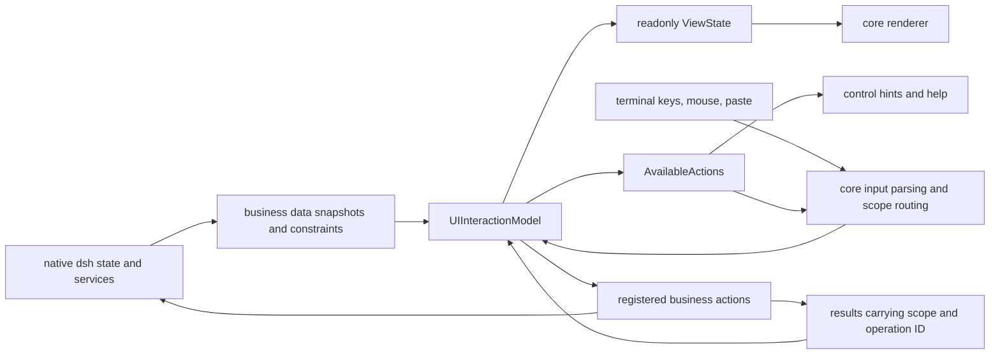

# Mayfly UI/UX unified model design proposal

Status: implemented — the unified model merged into main (`5fbbdc8`).
Sections 2–3 describe the pre-migration baseline (`bd171aa`/`b57eb0d`) and
the controller code they cite has since been deleted; the later sections are
the design rationale the shipped `ui-interaction-*`/`ui-compiler`
implementation follows. This document does not replace the current
architecture documents.

Review date: 2026-09-06. Original audit baseline: `bd171aa`, which included
the plan/YOLO decoupling, the permission picker fix, and Yes/No confirmation.
The design re-review is against main `b57eb0d`, into which those fixes have
now merged; the original probe records still correspond to the original
baseline.

Scope: official commands and panels, plus the four UI registries hosting
external plugins, the core compiler, focus, input, and async event paths.
Conclusions distinguish code facts, executed behavior probes, and proposed new
rules.

Related evidence: [first interaction review](../audits/2026-09-06-interaction-ux.md),
[notification audit](../audits/2026-09-06-notifications.md).

The detailed execution plan that implemented this design is preserved in
[the PR #15 refactor plan](./pr15-interaction-refactor-plan.md); the per-step
process documents were retired after the merge.

## 1. Conclusion and goals

Mayfly currently unifies most painting but does not unify the interaction
model. Many `Canonical...Controller`s still interpret keys themselves, keep
their own generic state, and then convert results into the same
`MayflyUiNode`. Different internal state machines can therefore paint similar
UI while executing different actions.

The proposal is a frontend-tree-scoped **UIInteractionModel**: the generic
interaction state of all surfaces is managed uniformly, state is isolated by
surface/control/session, controls of the same kind use the same reducer, and
painting, shortcut hints, and action availability all come from the same state
and action description.

"One model" means one authoritative write path and reusable behavior rules.
Each list still has its own selected set and each form its own draft, but they
are instance data inside the model, not implementations each feature builds
itself. Render caches, immutable snapshots, and the native editor's internal
buffers must not become a second set of independently-decided business state.

Implementation is bounded by the shared reducers and per-surface state
ownership. The frontend coordinates cross-surface navigation, input routing,
and the operation/notification index; it does not require every keystroke to
walk the whole state tree, nor does it take over the domain flows of
authorization, updates, or Jobs. The scope of centralized storage is decided
after the first phase's real editable consumers verify it.

Target invariants:

1. Navigation never writes domain data; only explicit submits or action
   invocations produce domain side effects.
2. Focus, draft selection, and the already-effective value are expressed
   separately and never impersonate each other.
3. The same kind of control follows the same rules across all commands,
   panes, overlays, and editor replacements.
4. A business module declares data, constraints, and action bindings; generic
   UX is executed by the model.
5. Every action shown in help or hints can be executed by the same input
   routing.
6. Results that are unloaded, replaced, or out of the current scope cannot
   modify another surface's state.
7. Harness still owns Agent, Session, permission, tool, settings, and job
   domain state; the UI model does not duplicate their state machines.

## 2. Current ownership and duplicated implementations

| State or behavior | Current owner | Structural problem |
| --- | --- | --- |
| Text drafts, field being edited | `CanonicalFormController.values/editing/active`; core `UiFormStateStore`, `FocusState`; the native editor | The feature controller and core sync to each other, and Tab/Enter can be reinterpreted by different layers |
| List focus and filtering | `CanonicalSelectController`, `CanonicalDocumentController`, `CanonicalSettingsController`; core `UiListStateStore` | cursor, selectedId, query, filterEditing, and paging are each implemented separately |
| Multi-select sets | `CanonicalMultiSelectController.selected`; `Questionnaire.states[].toggled`; the public list's `selectedIds` | Different branches use different rules for zero selection and submission |
| Tabs, groups, candidate variants | `CanonicalDocumentController.group/groupId/selectedVariants`; `Questionnaire.tab`; core's group focus | Page state and focus sync depend on per-controller callbacks, and tabs and option sets are easily conflated |
| Approval, plan review, second confirmation | `ApprovalPrompt`, `PlanReviewPanel`, `createConfirmationPanel`, core `pendingConfirmation` | Four decision paths: choice list, numeric shortcut, Yes/No, and second Enter |
| Scrolling and windowing | Info/Document/PlanReview private `scrollTop` with different constants; core ScrollView/ListState | Content height and page length are decided by multiple layers |
| Panel stack | `EditorPanelController.entries`; `EditorDockHost.panels`; per-command restore closures; the public overlay registry | Two indexes for logic and mounting can be reasonable, but cancel, async completion, and parent/child return lack a unified flow state |
| Notifications | input-local string; SettingsPanelNotice; market OperationStatus; update content slots; stderr/logger | No shared scope, severity, operation ID, or clearing rule |
| Keys | core keymap; raw key checks in the core compiler; per-controller handleInput; business letter shortcuts | Keymap matching, actual handling, and hints are not the same source |
| Async actions | `SurfaceEventOwner`; official `void onAction`; per-feature busy/unloaded/AbortController | Cancel, concurrency, error, and late-result rules vary by entry point |

Existing capabilities should be kept and consolidated: the draft and virtual
list mechanisms of
[core/ui-surface-state.ts](../../packages/mayfly/src/core/ui-surface-state.ts),
the semantic focus and width protection of
[core/ui-compiler.ts](../../packages/mayfly/src/core/ui-compiler.ts), the host
replay of
[editor-panel-controller.ts](https://github.com/Ephemeral-AI-Lab/mayfly/blob/bd171aa/packages/mayfly/src/interaction/editor-panel-controller.ts),
and the Fiber lifecycle of the four registries. No second renderer or plugin
system is needed.

## 3. Inconsistent behavior list

### 3.1 Submit, forms, and selection

| ID | Priority | Existing behavior | Consequence and evidence |
| --- | --- | --- | --- |
| F01 | P1 | Tab on the last field of an official form calls whole-form submit | Navigation becomes save; `onTextSubmit` in [form-panel.ts](https://github.com/Ephemeral-AI-Lab/mayfly/blob/bd171aa/packages/mayfly/src/interaction/form-panel.ts) plus the core Tab branch; reproduced by probe |
| F02 | P1 | Enter/Space on a settings enum cycles to the next value and triggers a write | Viewing options changes the default permission and other configs; `activate/commitRow` in [settings-command.ts](../../packages/mayfly/src/interaction/settings-command.ts); probe reproduced the change callback firing |
| F03 | P2 | OAuth `select` is mapped to free text with only non-empty validation | Users hand-type internal IDs; `interaction.prompt` in [provider-add.ts](../../packages/mayfly/src/interaction/provider-add.ts) |
| F04 | P2 | Core multi-select can submit an empty set while the official multi-select fills in the cursor item; questionnaires write the same fallback again | Same-kind lists submit different results; [select.ts](https://github.com/Ephemeral-AI-Lab/mayfly/blob/bd171aa/packages/mayfly/src/interaction/select.ts), [questionnaire.ts](../../packages/mayfly/src/interaction/questionnaire.ts); reproduced by probe |
| F05 | P2 | Questionnaire multi-select uses `mode: single` and stitches `[x]` into the label | Core sees a single-select while the feature intercepts Space to fake multi-select — semantics and display diverge; reproduced by probe |
| F06 | P2 | Plain forms, questionnaire Other, approval feedback, and plan revision each manage text editing/submission separately | Some confirm the current field, some end the request immediately, some treat empty text as refusal; the domain results differ legitimately, but the text and submission mechanism should not each be reimplemented |
| F07 | P3 | Context window and reasoning efforts both borrow a text box | Numbers and finite sets make the user memorize formats; `fillModelDefaults` in [provider-add.ts](../../packages/mayfly/src/interaction/provider-add.ts) |

### 3.2 Lists, trees, search, and tabs

| ID | Priority | Existing behavior | Consequence and evidence |
| --- | --- | --- | --- |
| L01 | P2 | The settings list wraps around top/bottom while ordinary lists stop at the boundary | The same Up on the first item goes to different places; Settings `move` vs. Select `moveCursor`; reproduced by probe |
| L02 | P1 | Marketplace `i/u/r` are consumed by the business handler before type-to-search | The first letter of a search word can become install/remove; [frontend-panel.ts](https://github.com/Ephemeral-AI-Lab/mayfly/blob/bd171aa/packages/mayfly/src/interaction/frontend-panel.ts) and [plugin-commands.ts](../../packages/mayfly/src/interaction/plugin-commands.ts); probe reproduced the priority |
| L03 | P2 | Select searches label/filterText, Document searches label+detail, and the tree builds its own search view | Search scope and match results have no shared field declaration |
| L04 | P2 | `selectedIds` sometimes means the chosen values and sometimes the current cursor; an extra current badge marks the effective value | Focus, candidates, and committed value are conflated; visible in all three list controllers |
| L05 | P2 | Tab/Shift+Tab do nothing on tabs — only Enter enters content; elsewhere Tab switches groups or submits a field | Users cannot rely on one Tab traversal rule; [ui-compiler.ts](../../packages/mayfly/src/core/ui-compiler.ts); reproduced by probe |
| L06 | P2 | Switching groups reseeds selection; per-tab cursor, query, and scroll have no uniformly preserved model | Returning to a tab lands wherever the controller decides; Document `reseedSelection/selectedVariants/groupId` |
| L07 | P2 | At 40 columns and below, lists hide detail outright; disabled items are usually skipped, with the failure reason sometimes written to a hidden hint | Narrow screens lose the basis for understanding an unavailable state; `renderList` in [ui-patterns.ts](../../packages/mayfly/src/core/ui-patterns.ts) |
| L08 | P2 | All empty views easily collapse into "no matches" | No initial data, no search match, load failure, and insufficient permission may lack clear distinctions; each feature assembles its own empty/error state |

L05 is an old rule explicitly fixed by existing tests — it must not be quietly
changed as a "bug fix"; this proposal recommends a formal migration via a
unified navigation protocol.

### 3.3 Confirmation, keys, and interaction hints

| ID | Priority | Existing behavior | Consequence and evidence |
| --- | --- | --- | --- |
| A01 | P2 | The four official places have moved to Yes/No, while public `action.confirm` still uses second Enter | Still two confirmation UXes; [confirmation-panel.ts](https://github.com/Ephemeral-AI-Lab/mayfly/blob/bd171aa/packages/mayfly/src/interaction/confirmation-panel.ts) and core `pendingConfirmation` |
| A02 | P2 | With full access already enabled, selecting current still confirms | A no-op still interrupts; `onSelect` in [permission-panel.ts](../../packages/mayfly/src/interaction/permission-panel.ts) |
| A03 | P2 | The primary visual intent also decides core's preferred focus | A style change can change what the first Enter targets; core `collectControls/groupTarget`. Default-No confirmation and default-first-item approval also lack a unified explicit default policy |
| K01 | P2 | Controllers use the keymap, while core controls hardcode Enter/Esc/escape sequences | The provided bindings and the actual handling can disagree; [keymap.ts](../../packages/mayfly/src/core/keymap.ts) and the compiler; probe reproduced a custom submit key being ignored |
| K02 | P1 | Global handlers run before focus routing, and features can intercept raw characters | There is no unified capture/scope rule; the relationship between cross-Agent shortcuts and unfinished interactions must be handled per feature; core `index.ts` and controller.handleInput |
| K03 | P2 | Core auto hints + manual overrides + suppressAuto + string concatenation coexist | What is shown and what is done can diverge; `contextualKeyHints` in [ui-compiler.ts](../../packages/mayfly/src/core/ui-compiler.ts) |
| K04 | P2 | Hints take the top three by a fixed priority and keep trimming when narrow; generic actions/run/choose replace the actual actions | Important back/cancel or the concrete submit consequence may be invisible; retention order should be decided by action type |
| K05 | P2 | InfoPanel supports Enter/Esc/q to close, while Document's q depends on whether it is searchable | Same-kind readonly content is still governed by different controllers; [info-panel.ts](https://github.com/Ephemeral-AI-Lab/mayfly/blob/bd171aa/packages/mayfly/src/interaction/info-panel.ts) and Document `handleInput` |

K02 does not mean every global shortcut is wrong; it means there is currently
no explicit cross-surface priority contract. Interrupt, quit, and ordinary
navigation need separate definitions.

### 3.4 Notification, lifecycle, and rendering consistency

| ID | Priority | Existing behavior | Consequence and evidence |
| --- | --- | --- | --- |
| N01 | P1 | Internal policy messages enter the queue, then are hidden once they reach the official transcript | Contradictory classification of model messages vs. pending user input; notification audit and probes |
| N02 | P1 | Hints are hidden while a panel is open, yet several panels still send errors to the hint | Operation failures are invisible at the moment they happen; EditorDockHost and jobs/agents/preset; probes |
| N03 | P1 | The generic notice has no scope or ID; an old session's async result can write into a new session | Misattributed information; input command callbacks; probes |
| N04 | P1 | Severity survives in some entry points but is lost at the string notice entry | The same failure is emphasized differently depending on the entry; compare the market reporter |
| N05 | P2 | Last-write-wins, empty-string clearing, clear-on-edit, and permanent slots coexist | A new error can be deleted by an unrelated "loading" cleanup; probes |
| N06 | P2 | After eight lines `... more` offers no expansion, update messages truncate line by line, and a separate details panel also exists | Information reachability is inconsistent; probes and updater code |
| N07 | P2 | Updates emit both a hint and a content slot; some runtime errors only go to stderr/logger | Duplicate presentation, unmanageable and flashing; notification audit |
| R01 | P1 | Public surfaces have a unified async event owner, while official controllers still `void onAction` and manage busy/unloaded themselves | Same-kind actions handle errors, concurrency, and late results differently; [surface-renderer.ts](../../packages/mayfly/src/core/surface-renderer.ts) and Document `activate` |
| R02 | P2 | `selection-change` means both a multi-select set change and a submission, and the dispatcher then applies a latest policy to it | Draft change vs. submit intent cannot be told apart by event name; public contracts, core `collectControls`, and `SurfaceEventOwner.emit` |
| R03 | P2 | The official adapter fixes `screenMode: main` and a near-infinite height; public surfaces use the actual viewport/mode | Same-kind row stacks, scroll, and actions may take different layout paths depending on entry; [canonical-panel.ts](https://github.com/Ephemeral-AI-Lab/mayfly/blob/bd171aa/packages/mayfly/src/interaction/canonical-panel.ts) |
| R04 | P2 | Different controllers set their own 6/8/16/20-row windows and page steps, depending on string leaf paths | Visually identical lists scroll different distances; structural changes also need manual window-path sync |
| R05 | P2 | Draft-retention policies for external snapshots, internal recompilation, and theme/locale changes are scattered | User state can be reset by a data refresh or a presentation refresh; core `bind`, adapter `invalidate`, per-panel replay |
| R06 | P2 | Document's read/build-node methods mutate selectedId/group/selectedVariants along the way | State convergence happens inside a render query instead of an explicit event transition |

Inconsistency does not mean all state must be displayed in one place. Queue,
durable state, field validation, tool results, and short notifications have
different semantics; what is unified is the classification rules, state
management, and same-kind interaction protocol.

## 4. The unified model and layering

### 4.1 One interaction data flow



Inside UIInteractionModel are pure reducers divided by control kind, with all
state changes going through a unified dispatch. Splitting files is for module
boundaries — it does not permit a feature to implement another FormState or
ListState.

### 4.2 A single owner per state kind

| State | Authoritative owner | What other layers may do |
| --- | --- | --- |
| Effective permissions, settings, model, Agent/Session, Job | native dsh | UI reads snapshots and submits native actions; no second copy of domain state |
| Surface paths, generic form/choice/wizard/confirmation, notifications, UI operation state | UIInteractionModel | Features provide readonly definitions and action mappings; the renderer reads derived state |
| Focus and input semantics | the core-owned slice of UIInteractionModel | A business may only request to open/locate a semantic control — it cannot sync its own cursor |
| Actual terminal geometry, line widths, visible windows, ANSI, hit regions, renderer handles | core renderer | Supplies the reachability information the model needs for navigation; caches never become a second selection state |
| Text edit buffers, undo/redo, paste protocol | the core-held native editor | The model obtains draft snapshots through a single binding; features do not build another values/editing copy |
| Data reads, subscriptions, domain validation | the original service/feature action handlers | Return data or validation results; must not control generic UX like Tab/Esc |

Caches and derived snapshots needed during rendering may exist, but they must
have a clear source and cannot flow back as new authoritative state.
`render()`, `selectView()`, and `availableActions()` must not mutate semantic
state.

### 4.3 Relationship to existing packages and Fibers

- `packages/ui` continues to own only the readonly contract, the pure builders,
  and the four registries; it holds no mutable store, renderer objects, or
  Harness objects.
- The unified model's reducers and input/focus implementation live inside
  `packages/mayfly/src/core/`, keeping raw keys, layout, and focus handled
  only by core.
- The stable state owner hangs off the existing `mayfly-frontend` sibling,
  with `frontend/index.ts` mounting a pure interaction-state module inside
  core. The module does not import the terminal or renderer through
  `core/index.ts`; no new public subpath or fifth UI contribution service is
  added.
- The proposed internal service name is `mayflyUiInteraction`; it does not
  directly extend `mayflyInteractionState`. The latter is created by the
  interaction Fiber that depends on `mayflyCurrentAgent` and `skills`, and
  cannot become the stable state root for all public surfaces; it keeps its
  existing caches, paste resources, and config references.
- The stable owner does not inject app/current-Agent, skills, theme,
  components, screen, or keymap. Registry subscriptions live on an independent
  child Fiber that explicitly injects whichever of the four UI services are
  actually consumed; renderers and official business contributions each inject
  the stable service, and the dependency direction must not invert.
- `mayflyEditorPanels` gradually becomes the entry of the unified navigation
  slice; EditorDockHost only projects the logical stack onto physical mounts
  and defines no separate cancel rules.
- The four public UI contribution services' names and contribution boundaries
  stay unchanged; the data and event contracts upgrade per §4.6. Business
  plugins still use native dsh directly; no manifest, realm, permission
  facade, or bespoke plugin framework is added.

Model instances are destroyed with the frontend owner; a renderer/theme reload
only unbinds and rebuilds renderer handles. Migrated official contributions
must move out of the input child Fiber that depends on theme/components.
App-scope contributions like Provider configuration must also move out of the
interaction parent Fiber that depends on current-Agent/skills, onto an
independent business child Fiber under the existing frontend sibling,
injecting only the native services actually needed — otherwise a core reload
that unloads via app would still lose forms. A truly unloaded contribution
must not be resurrected under the excuse of "keeping the draft". All
retainable user state lives in the stable model instance and cannot rely on
already-unloaded component objects staying alive.

| Lifecycle event | Behavior of the stable owner and contributions |
| --- | --- |
| renderer/core temporarily absent, theme swap | the owner and still-live registrations survive; a new renderer replays the same surface instance, and old handles and input continuations lapse |
| app/current-Agent or skills provider reload | the owner and external contributions not depending on those services survive; a business Fiber that actually depends on them unloads normally, removing its surfaces and bindings |
| current Agent selection changes | business bindings publish a scope change; results from the old Agent cannot write into the new scope; static UI with no Agent dependency is not reset |
| consumer unload or registration dispose | immediately removes that registration's state, sensitive drafts, action bindings, and applicable tasks; merely hiding/returning to a parent page is not dispose |
| UI provider reload | all old registrations lapse; a new registration under the same public ID is a new instance and does not inherit old actions or drafts |
| frontend owner or whole tree destroyed | cleans up all state, subscriptions, timers, and runtime bindings; other trees are unaffected |

The first phase's whole-tree tests must actually unload and restore the above
dependencies — a unit test of `InteractionStateService.dispose()` alone cannot
substitute for dependency-graph proof. Update the frontend/core/interaction
ownership docs and package guidance alongside implementation.

### 4.4 Internal state partitions

The following is the proposed internal structure, not a new public API:

```text
UIInteractionModel
  navigation
    surface stack / active surface / return anchor
  surfaces[surfaceInstanceKey]
    source revision / scope / lifecycle
    forms[formId]
      baseline / draft binding / dirty / field errors / validation state
    lists[listId]
      focused item ID / selected IDs / committed IDs / query / expanded IDs
    tabs[tabsId]
      active tab ID / per-tab content state
    wizards[wizardId]
      active step ID / completed steps / draft answers
    decisions[decisionId]
      action / question / allowed choices / default choice / settlement
  operations[operationId]
    origin / target / source revision / phase / cancellation facts
  notifications[notificationId]
    scope / operation ID / severity / purpose / content / detail action / lifetime
```

Raw Agents, Sessions, Promises, AbortControllers, pi-tui objects, focus
handles, and width information do not enter the public model snapshot.
Business action mappings, cancel handles, and native editor instances are
managed in the same owner's private runtime bindings.

`surfaceInstanceKey` is determined inside the stable owner by the contribution
kind, the registration instance, and its generation — the public `surfaceId`
alone is not enough. Different registries may reuse the same name ID, and
reopening a same-name ID after dispose must also be isolated. Control state is
then located by a stable page path plus the control ID; a page path uses tab
IDs/item IDs, not label text, array indexes, or renderer leaf paths. This is
an internal instance index — no plugin owner token or realm is added.

### 4.5 Data contracts that need filling in

The existing readonly node is a good foundation but cannot express all the
generic UX. The capabilities below evolve on the existing node, registration,
and event contracts; §4.6 defines the protocol that must be implemented, and
§4.7 gives the consumer timing. The final exported type names are pinned by
type tests — no second panel DSL is built at the same time.

| Contract | Reused existing parts | Semantics to clarify or fill in |
| --- | --- | --- |
| Form | fields, value, submitActionId, cancelActionId | typed constraints, an explicit submit boundary, field errors; validation functions live in the registration/effect layer |
| List/Choice | id, mode, items, selectedIds | browse/choose roles, focus vs. value distinction, selection cardinality, unavailability reasons; selection change and acceptance are separate |
| Tabs | id, activeId, items | semantics belonging to view navigation, per-page state retention, and a unified exit rule |
| Action/Decision | id, label, intent, disabled, busy, confirm | business action vs. visual emphasis separated; default decision, one-shot confirmation, and operation state managed by the unified model |
| Notification | existing readonly text/action data and registration events | scope, ID, severity, details, lifetime; the entry belongs to the existing model — no fifth UI contribution service |
| Source update | revision/eventRevision, stable node/control IDs | explicit distinction between acknowledgement, data refresh, schema change, and whole replacement |

An action handler may consume the draft snapshot submitted by the unified
model and call native services, but must not hold a UI draft that updates
itself. The committed snapshot from an external source and the UI edit
baseline are readonly references — not a new domain-state authority.

### 4.6 Snapshot, page, and action protocol

The following is called the new interaction protocol; it ships through an
explicit version bump of Mayfly and `mayfly-ui`. The pilot is only used in
candidate builds; the released `MayflyUiEvent` and `set(node, {
eventRevision })` keep their current meanings. Before release, form a type
migration note and migrate the real external consumers in the repository; do
not add a permanent old/new mode switch or compatibility export.

| Protocol part | Deterministic semantics of the new protocol |
| --- | --- |
| Registration's initial node | A form's `value` and a choice's `selectedIds` are the readonly baseline from which the first draft is created; later editing only writes the surface's draft. A browse list's cursor is no longer written back from `selectedIds` |
| Registration scope | A registration declares a readonly app/session/panel ownership and target identity; the business authority inside the scope stays in the handler's private binding. A changed target requires a whole replace — `data` must not quietly transfer an old draft to another target |
| Ordinary data update | Extends snapshot update metadata, expressed explicitly as `reason: 'data'`; the new protocol also treats omitted metadata as data. Unmodified fields follow the new value; modified fields keep the draft and are only marked conflicted when the corresponding baseline value changed |
| Operation confirmation write-back | The owner admits the handler's accepted receipt as `reason: 'ack'`, associating this operation ID and the submitted draft revision. It only admits the same registration instance, scope, and still-valid operation; the business does not issue another `set()` to confirm the same submit, and a stale receipt does not act as a reset |
| Whole replacement | `reason: 'replace'` explicitly destroys the old instance state and applicable continuations, then initializes from the new node; it cannot be triggered implicitly by changing a title or rebuilding an equivalent object |
| Presentation refresh | theme, locale, and resize trigger no replace and create no domain version; a translated readonly text may be re-emitted with an equivalent data snapshot, and as long as the baseline value is unchanged the draft is not reset. A new renderer takes its state from the stable instance |
| Tab content ownership | Adds a readonly `tab: { controlId, itemId }` association on the existing `MayflyUiChild`; nested associations compose the page path. When the page switches to invisible the draft is kept; explicitly deleting the associated subtree releases the state |
| Dynamic pages | A plugin publishes a page's loading/empty/data subtrees while keeping the tab association; deleting the page must not be used to mean "temporarily unloaded". Results bind the page path and the read generation and cannot overwrite another page |
| Selection change vs. acceptance | `selection-toggle` only changes the local draft; `selection-accept` initiates the selection action. The public event types are separate — one `selection-change` handed to latest can no longer continue |
| Action submission | The registration's handler receives the action ID, the control/page path, the immutable draft, and an operation context; the context carries a cancellation signal. The business only reads this submission's values and does not maintain a continuously-updated form copy |
| Validation and settlement | The registration layer returns a structured UI receipt: accepted, invalid, conflict, or failed. invalid carries field paths and errors; accepted writes back the authoritative node plus an ack; failed keeps the draft. The receipt does not rewrite native dsh's return types or error taxonomy |

Before Save starts, it freezes this draft revision and locks the form against
modification and duplicate submission; it does not lock other surfaces, nor
block child interactions the action requires. Async readonly validation may
use latest, but its result must match the field draft version. Domain
validation and the native effect before writing are executed by the business
handler — the model does not infer whether a native action succeeded.

A receipt's accepted node is first frozen and published through the
registration/provider's existing snapshot publish path, and the stable owner
admits the corresponding ack with the operation settlement once; one must not
only change the renderer's private node, or clear dirty first and then receive
another baseline. An admission failure is treated as that operation failing
and keeps the draft. If a conflicting data update arrives during submission,
keep both the conflict and the actual native result; do not erase the updated
authoritative value just because an accepted arrived. For domains without a
native revision/CAS capability, the handler must re-read and report a conflict
or ask the user to reconfirm — a UI revision cannot be treated as a domain
concurrency guarantee.

The minimal shape of a form-submission receipt is below; it belongs to the
proposed registration-layer protocol. The event context correlates the
operation, page path, and cancellation signal, and the node still contains no
callback/Promise; other events need not return a form receipt. The accepted
node is the complete surface snapshot re-read after the write, and the
conflict node is the latest authoritative snapshot — both must pass the
existing freeze and admission boundaries first.

```ts
type FormActionReply =
  | { readonly kind: 'accepted', readonly node: MayflyUiNode }
  | { readonly kind: 'invalid', readonly errors: readonly FieldError[] }
  | { readonly kind: 'conflict', readonly node: MayflyUiNode, readonly message: string }
  | { readonly kind: 'failed', readonly message: string }

interface FieldError {
  readonly pagePath: readonly { readonly controlId: string, readonly itemId: string }[]
  readonly formId: string
  readonly fieldId: string
  readonly message: string
}
```

Page association is validated at core admission: it must reference existing
tabs/items; control IDs are unique within a page; different pages may reuse
same-name fields, with the page path included in events. Visibility, width,
and the visible window are still decided by the renderer. Extending the
association does not change the contracts of viewport-bounded admission for
large lists, deferred admission for hidden branches, and local failure
isolation.

### 4.7 One timing for official and external forms

The pilot picks the official Provider edit form plus an external config form
registered through `mayflyOverlays.open()`. Both publish the same Form/Choice
nodes; the external example's business values read and write through the
native settings namespace. The table below only expresses calls in protocol
semantics — it does not disguise proposed fields as existing SDK examples.

| Step | Plugin/business action | Shared model's result |
| --- | --- | --- |
| Open | Publishes baseline `name=A`, domain version r1, and two pages with explicit associations | Creates a registration instance; the draft is A; each page's draft is isolated |
| Type B, then Tab/switch page/return | No domain write; the business may read the readonly draft for validation without `set()`-echoing every keystroke | The current value B is kept, focus and page anchor restore, and the native value is still A |
| Background data update | Publishes `name=C`, r2 with `reason: data` | Keeps B and marks a conflict; unmodified fields sync; cancel does not write A back |
| Resolve the conflict | The user discards that field's draft, or explicitly resubmits after viewing the new baseline | The handler uses the actual native revision; no unconditional overwrite or automatic conflict retry |
| Save | The handler receives this draft, the baseline version, the operation ID, and the signal | busy is registered first; a repeated Save does not start a second write |
| Validation fails | Returns invalid with field paths | busy clears, the error is located, and the whole draft is kept; no domain write happens |
| Write succeeds | After the native write succeeds, returns accepted with the authoritative node; the owner correlates the ack | Atomically updates baseline/draft, clears dirty, shows that operation's feedback |
| renderer reload | The registration and business Fiber are still alive | Rebinds the same instance and restores the draft; does not resend Save |
| Close or reopen a same-name surface | Dispose the old registration, then create a new one | Stale receipts are invalid; the new surface inherits no old draft, error, or confirmation target |

The first phase provides both real mountings and the same parameterized event
trace. If an external consumer still has to maintain tabs/drafts itself or
guess a reset, the protocol pilot is not complete and full migration cannot
begin.

## 5. The unified interaction protocol

### 5.1 Basic verbs

Internally distinguish `navigate`, `edit`, `toggle`, `accept-selection`,
`submit-form`, `invoke-action`, `cancel-edit`, `close-surface`, and
`interrupt-operation`. These can no longer all be stuffed into a vague
`selection-change` or `submit`.

| Internal event family | State it may modify | May directly produce domain effects |
| --- | --- | --- |
| FocusMoved / ViewportChanged | focus, visibility derivations | no |
| DraftChanged / SelectionToggled / FilterChanged | drafts, candidate sets, query | no; may trigger readonly search/validation |
| TabActivated / TreeExpanded | the current view | no; may trigger readonly loads |
| SelectionAccepted / FormSubmitted / ActionInvoked | operation requests | executed through the registered action binding |
| ValidationFailed / OperationSettled | validation errors, progress, feedback | records the result; no retry inside render |
| SurfaceClosed / OwnerDisposed / ScopeChanged | lifecycle, cancellation, ownership | does not equate closing UI with a rolled-back domain operation |

The already-public `MayflyUiEvent` cannot have its meaning changed silently.
Clarify the events internally first, then migrate the affected public
contracts by version with the real external consumers synced; transition
conversion exists at only one boundary — every plugin must not be left to
guess the old/new semantics itself.

### 5.2 Forms

All configuration forms have explicit Save / Cancel. A single-field edit is
also a form — "only one field" does not bring back implicit submission.

| Input | Unified behavior |
| --- | --- |
| Focused text field | Directly editable with a visible caret; no extra Enter required to enter a hidden mode |
| Tab / Shift+Tab | Move to the next/previous control keeping the draft; past the last field moves to the action area without submitting |
| Single-line field Enter | Finishes the current field and advances; does not save the whole form |
| Multi-line field Enter | Newline; text handling reuses the native editor |
| Save button Enter/Space | Validates the whole form and submits once on success; on failure locates the first invalid field and keeps the whole draft |
| Cancel / form-level Esc | With no changes closes directly; with unsaved changes uniformly asks whether to discard, defaulting to No |
| Esc on a popup picker/completion | Only closes the current selection layer and returns to the same field without losing the whole draft |

A unified Ctrl+Enter submit alias may be provided, but only enabled and
displayed when terminal capabilities and the keymap can express it accurately;
explicit Save is always reachable. Do not reuse the prompt's Ctrl+S — which
already means steer — as an invisible global save key.

Field validation is separate from navigation: Tab does not trap the user on an
error field, errors persist beside the field, and the final submit blocks
invalid data. Synchronous constraints come from the data declaration, and
domain validation returns structured field errors from the business handler.
A feature must not simulate field errors by temporarily swapping a title or a
global notice.

### 5.3 Value types and submission boundaries

| Value type | Control | Where submission happens |
| --- | --- | --- |
| Free text | input / textarea | The form draft; Save writes the domain |
| Secret/password | secret | Same as the form; logs and audit snapshots redact, and the draft reference is released after close |
| Boolean | toggle | Changes the draft inside a form; a standalone settings row is an explicit toggle action that shows pending until settled |
| Single enum | choice picker / explicit segmented choice | Expands the full option set; accepting changes the draft or calls a standalone settings action; repeated Enter must not be used to cycle-and-save |
| Finite collection | multiple choice | Shows the selected count and constraints, submitting the actual selected set |
| Number | numeric input with unit, min/max/step | Allows typing an incomplete draft, normalized/validated on submit; a temporary `-` and similar intermediate states must not be reported as saved values |

OAuth's `text/secret/select` map to the types above. A select with no
candidates shows a clear not-completable state instead of producing an
empty-label text box. Internal option IDs never require the user to type them
by hand.

### 5.4 Lists and trees

Keep only two recognizable semantics: **browsing a record** and **choosing a
value**. Identical visual structure does not mean browsing a record should
select a config value, but identical semantics must share the reducer.

- `focusedItemId` is the cursor; `selectedIds` is the draft set;
  `committedIds` is the native current value. These three states cannot be
  carried by one `selectedIds`.
- Up/Down stop at the boundary by default; Home/End go to the ends;
  PageUp/PageDown move by core's actual visible page. The per-controller
  private 6/8/16/20-row steps are uniformly retired.
- Enter in a browse list executes a clearly-named Open/View action; Enter in a
  chooser accepts the candidate. Both go through the same action routing — a
  feature does not handle raw Enter.
- Space in multi-select only toggles the current item; Enter/the confirm
  button submits the actual set. `minSelected=0` may submit an empty set;
  `minSelected>0` shows validation — the cursor item must not be filled in.
  Number shortcuts in multi-select only toggle candidates, not submit the
  whole questionnaire.
- Unavailable items must have a reachable reason. Record-type items should be
  focusable for inspection with the action still disabled; an unavailable
  value in a choice cannot become a new submitted value. The renderer should
  provide the same details presentation — not depend on a feature swallowing
  Enter and writing an invisible notice.
- A data refresh keeps focus and selection by stable ID; deleting the focused
  item selects an adjacent reachable one. A selected value that lapses is
  shown explicitly, not silently changed to another value.
- Tree expand/collapse, search expansion, and return position are managed by
  the shared TreeState. A business provides the parent/child relations — it
  does not stitch indent strings to implement a different tree navigation.

### 5.5 Search

- Filterable collections uniformly support typing directly to enter search;
  `/` or a registered search action may also enter it.
- Typed text takes precedence over unmodified business letters. Marketplace
  install/remove/refresh should become explicit actions or uniformly
  registered modified keys — `i/u/r` can no longer steal the first letters of
  a search.
- SearchState uniformly holds the query, editing state, visible results, and
  the return anchor. A business declares searchable fields; matching and input
  rules are executed uniformly by the model, while character handling stays
  with core's native SearchInput.
- Esc exits search editing and keeps the visible query; Clear explicitly
  empties it; only then does Esc exit per the surface return rule. Clearing
  restores the previous list anchor.
- No initial data, no match, loading, failure, and insufficient permission are
  different states, using a shared empty/loading/error model with explicit
  available actions.
- A filter across tabs is kept in each tab's own content state by default; if
  it is a global search surface, the global scope should be shown explicitly
  instead of implicitly changing the search scope per feature.

### 5.6 Tabs and option groups

- Tab/Shift+Tab move forward/back across all interactive groups, including
  from the tab strip into content; compound controls use arrow-key roving
  focus internally.
- Left/Right on the tab strip activate the adjacent view without wrapping at
  the boundary; Enter may enter the current view's content. Switching views
  itself submits no business data.
- Each tab keeps its own draft, filter, focus, and scroll anchor; switching
  merely activates another instance without clearing it.
- Deleting/reordering tabs relocates by ID, and a translation change does not
  reset state. Async load results are attributed by tab/request ID.
- Tabs only represent views. Mutually exclusive values like a model's
  reasoning effort should use choice/segment semantics — not tabs pretending
  to switch views.

This intentionally changes the current "Tab does nothing on tabs" rule, and
needs explicit version notes, key documentation, and cross-panel acceptance.

### 5.7 Confirmation, approval, and questionnaires

Unify DecisionState and decision actions, rather than forcing every question
into a binary.

| Scenario | Definition and shared behavior |
| --- | --- |
| Second confirmation | Question, target, consequence, Yes/No; default No; Yes submits once, No/Esc returns to the original surface |
| Native tool approval | Uses the native allow/deny and session-grant options; shares the choice/feedback controls; the native outcome is not renamed |
| Plan review | document + decision + optional feedback; shares scroll, choice, and form; do not hand-write cursor and editing state |
| Multi-question request | WizardState + per-question Form/ChoiceState; cross-question drafts are kept; a final explicit "submit answers" action |

The default focus is decided by the decision's explicit default rule, not
inferred from a button color or `intent: primary`. A permission/dangerous
decision requiring explicit approval defaults to the non-executing option; the
existing approval default of "first item is allow" is an interaction decision
that needs formal migration.

Confirmation only applies to an actual change; no change returns directly.
When the confirmation's target changes, the source surface is replaced, or the
owning Agent lapses, an old Yes must not execute against the new target.
Cancelling a lower confirmation restores the parent surface's same draft and
focus.

The public `action.confirm` must also be rendered by the same DecisionState —
the separate "append a question mark to the text, press Enter again" state
machine is not kept. A business only registers the action's semantics and
consequences; it does not decide the confirmation panel's look, keys, or
lifecycle.

Parameterized native dsh commands execute per their own documentation — the
UI does not rewrite `/permission`'s permission semantics on its own. What is
unified is the presentation/invocation path of Mayfly's same-kind controls and
UI actions; a Mayfly permission system must not be duplicated for surface
consistency.

### 5.8 Readonly documents and long content

- Help, Info, Trace, Job output, and plan bodies use one
  DocumentState/ScrollState. Format differences are expressed by the content
  data; close, paging, and anchor retention are consistent.
- Esc closes/returns; a non-searchable readonly document may have a unified q
  alias. Enter only activates the focused explicit action — it no longer
  implicitly closes in some documents.
- The real viewport decides the window; active controls and confirmation
  actions must stay reachable. Width compliance does not imply height
  compliance.
- On narrow screens the same button group may stack vertically, but navigation
  is generated from the actual layout, keeping the logical operation order.
  Two layout semantics must not exist just because the official adapter and
  plugin surfaces differ.
- Important details must not become completely unreachable below some width
  threshold; provide a current-row details area or an explicit details action.
  When something is elided, viewing the full text must be possible.

## 6. One input route and hint source

Proposed priority: terminal paste/composed-input recognition → explicit
emergency interrupts → the topmost capturing decision/surface → the current
text editor or candidate menu → the current control → the owning
group/surface → available global actions.

Only a few explicitly declared emergency actions may bypass a capturing
surface; ordinary navigation like F7/F8 decides availability based on whether
the current surface allows leaving. A captured key must not keep propagating
to the prompt beneath.

The prompt's agreed semantics are preserved: Enter sends, Tab completes,
Shift+Tab only toggles normal/plan, Ctrl+S steers; plan and YOLO can still
stack, and YOLO is controlled by its own native permission command. Other
controls do not reuse the prompt's mode-switch handler.

An explicitly-named shortcut action like Alt+M for "next model" may stay,
scoped by the same action registry. It is not the same control semantics as
"pressing Enter on an ordinary enum row implicitly cycles to the next value".

The core interface should be a derived query:
`availableActions(model, focusedControl)`. Input matching, button
enabled/busy, shortcut hints, help, and accessibility names all read it. A
business only registers an action ID, a business label, and the action binding
— it no longer passes hand-assembled `keys` strings or
`suppressAutomaticContextHints` to patch the actual handling.

Hint rules:

- Show actions that are actually executable now with their real bindings;
  names use accurate semantics like "save", "choose", "back", "cancel".
- While typing, do not show business character shortcuts that would steal
  text.
- Narrow screens prioritize exit/cancel and the primary operation, trimming
  explanation rather than inventing nonexistent actions; the full list is
  available in the unified help.
- If there is no actionable details entry, do not show only `... more`.
- Copy translation is generated uniformly by stable keys — user-provided
  content is never a translation key; translation and theme changes only
  repaint, never alter interaction state.

## 7. Notifications and operation state

### 7.1 Display semantics

| Content | Unified location and responsibility |
| --- | --- |
| Internal model policy messages | Keep the native inbox; not shown as a user queue |
| User pending prompts/steers/attachments | The upper queue, a readonly projection; does not duplicate inbox state |
| Short operation feedback | A unified feedback slot below the current editor or panel, above the footer |
| Guidance while awaiting an external user operation | The owning interaction surface persistently shows the necessary information and actions; feedback only notes the interaction is still waiting |
| Field errors | Field errors in the same model, adjacent to the field |
| Long-task progress/failure details | The owning operation/document surface; feedback provides a summary and a details action |
| Current plan/yolo, jobs, context state | footer/pane durable projection, independent of notification acknowledgement |
| Errors before startup or when the UI cannot be maintained | stderr; recoverable errors while running also enter the unified feedback |

The feedback slot no longer belongs to "a hint visible only beside the
editor". An active panel has the same visible outlet. Keeping one line for a
short feedback summary is recommended, with long text presented through
details, so notification length does not make the edit area jump repeatedly;
the actual allocation is still decided uniformly by core from the viewport.
Guidance needed to complete an operation is not bounded by this one-line
summary quota — see §7.3.

### 7.2 Lifecycle and ownership

- Every notification has a stable ID, owner, app/session/panel scope,
  operation ID, severity, and purpose. purpose distinguishes short feedback,
  progress, and guidance awaiting user action — severity alone must not decide
  lifetime.
- The same operation's loading/success/error update the same record; a
  producer can only clear its own records.
- Progress persists until the operation settles; only success/info summaries
  with short-feedback purpose disappear after 5 cumulative visible seconds,
  and the clock pauses while the owning surface is hidden. warning/error
  persist until explicitly handled, replaced by the same operation, or the
  scope closes, and offer reviewable details; guidance awaiting user action is
  cleared by the interaction settling, with no TTL. Timing is driven by the
  model's effect owner — not advanced inside render — and no per-feature
  arbitrary TTL is offered.
- Errors are no longer all cleared by an arbitrary edit; the scroll "new
  messages" hint is a state and does not overwrite an operation failure.
- App-level update results are visible across sessions and mark the target
  profile; session-level results belong to their original session; closing a
  panel must not write the result to another panel.
- Use bounded session/app notification records; overflow recycles settled
  low-priority items under a unified policy; in-flight operations and
  unhandled critical failures must not be displaced by high-frequency ordinary
  messages.
- Sensitive field contents do not enter hints, operation audit snapshots, or
  notification history.

### 7.3 OAuth and continuous interaction guidance

The current `provider-add.ts` accepts the native authorization's
`notify({ message, url?, code? })`. The URL and verification code may be the
only information the user needs to finish login in the browser — they must
move into the authorization surface's persistent content, not just be turned
into one info notice. Native authorization keeps owning the authentication
state, timeout, and result; Mayfly only holds the currently displayable
guidance.

| Event | UI behavior and cleanup |
| --- | --- |
| Received url/code or a notify clearly requiring user action | Publishes `purpose: action-required` guidance on this authorization instance; keeps the message, full URL, and code structured — not concatenated first and truncated later. An authorization notify that cannot be classified is kept until the request ends |
| A subsequent text/secret/select prompt | The guidance stays viewable on the same authorization surface and the prompt uses shared Form/Choice; the capturing panel must not block viewing the full guidance, copying the needed values, or cancelling the authorization |
| Narrow terminal or a long URL | Uses the owning Document/Scroll area to present the full text, keeping the prompt and actions reachable; does not depend on the bottom footer's details button, and does not show an ellipsis with no entry |
| Waiting on the browser, switching tabs, or renderer reload | The guidance persists; the five-second clock, unrelated loading, typing, or other operation feedback does not clear it |
| The authorization updates its guidance | Updated by authorization instance and guidance ID; a new code may replace the old code but must not replace another authorization request's content |
| Native success, failure, cancel, timeout, or business-owner unload | Settles the interaction and releases the URL/code/secret references; history and logs keep at most a result summary without sensitive content |

The plaintext of a URL, code, or secret is only usable within that
authorization instance's necessary interactions — it does not enter generic
notification history, debug state exports, or audit snapshots. Provider
addition is an app-configuration operation: switching the current Agent itself
should not attribute the authorization guidance to a new session; if its
actual business Fiber unloads, the normal cancel rules end it.

An authorization action may await a child prompt while running. The parent
operation only blocks repeated authorization launches; the child form must
keep receiving input and settle independently — the same global FIFO must not
block the child interaction while awaiting the parent Promise. Cancellation
propagates to the native signal, and a late notify/prompt/result cannot reopen
a closed authorization surface.

## 8. Async, close, and data refresh

### 8.1 One OperationState

Action state is unified as `idle → validating → awaiting-confirmation →
running → succeeded/failed/cancelled`; a domain action does not necessarily go
through every phase. The state is driven by the shared reducer and the
business only provides validation and the native effect. `running` may
associate a child interaction awaiting the user — its parent/child settlement
and local-busy rules are in §7.3; the subdivided phases of a native
authorization, update, or Job are not copied into the generic state machine.

Register the operation and busy in the model before starting the effect, so
repeated input cannot launch twice. Draft search/validation may use latest,
but an explicit submit/action must not be mistaken for a droppable draft
update just because a same-name `selection-change` arrived.

Local single-flight reentry prevention is not external-side-effect
exactly-once. Cancelling an AbortSignal is not a successful rollback either:
if a domain write already happened or the completion state is unknown, keep
the native result and re-read the authoritative state — do not falsely report
"cancelled, nothing changed".

### 8.2 Use existing identities and versions

Reuse the Fiber lifecycle, the existing surface generation, registry
revision/eventRevision, current-Agent revision, and the domain services' own
revisions. Their applicability is validated uniformly — do not add another set
of private loaded/unloaded/generation flags per feature.

A UI snapshot only records identity; a business effect must obtain the exact
Agent through the native service — an Agent/Session must not be smuggled into
a renderer-neutral node. The same session ID does not automatically prove it
is still the same live Agent instance.

### 8.3 Draft vs. external value conflicts

| Change | Policy |
| --- | --- |
| Theme, language, terminal size, equivalent node rebuild | Keep draft/focus/selection; only recompute presentation |
| External value update, field unmodified | Sync the new baseline |
| External value update, field has a draft | Mark a conflict and keep the draft only when the corresponding baseline value changed; validate with the domain revision at submit, and when there is no native revision follow §4.6 |
| List reorder or additions | Keep the anchor by stable ID, not array/object identity |
| Field/item/action deleted | Fall back per the shared reconcile rules; the old action lapses |
| Return to the parent surface | Restore the original instance state and focus anchor |
| Owning Fiber truly unloads | Unregister the contribution, cancel applicable tasks, remove state — do not resurrect the old panel |

Public surfaces currently have explicit reset semantics on external
replacement. The new protocol implements §4.6's data/ack/replace and
presentation-refresh rules and migrates with an explicit version bump; old
released versions must not have all external plugin behavior changed under the
original `set()` without explanation.

## 9. Responsibilities a business module may and may not have

| May be defined by the business | Must be owned by the unified model |
| --- | --- |
| Native data sources, readonly queries, business labels | cursor, editing state, tab/filter/expand/scroll state |
| Field types, required, numeric bounds, selection cardinality | Tab/Enter/Esc/arrow-key interpretation |
| Explicit action IDs, targets, and native calls | confirmation presentation, default focus, busy, reentry prevention |
| Native domain validation and error content | validation-error attribution and presentation, generic return behavior |
| Native result encoding of request allow/deny | questionnaire step drafts, selection and submission mechanics |
| Whether a business operation is cancellable and its true result | notification ID/scope, concurrency, late-result validation |

The distinction comes from data semantics, not command names. New switches
like `isProviderPanel`, `isSettingsPanel`, or `submitOnLastTab` are forbidden
from preserving the old forks.

## 10. Migration map

| Current implementation or entry | Target | Private UX deleted after migration |
| --- | --- | --- |
| `form-panel.ts`; Provider, startup, config value editing | FormState + typed fields | values/editing/submitDirection, last-field submission, and per-feature key chains |
| `select-list.ts`, `select.ts` | Choice/BrowseListState | self-built cursor/query/filterEditing, zero-selection fallback |
| `settings-command.ts` | PropertyList + Form/Choice/Toggle | enum cycling, self-built settings cursor/values, SettingsNoticeController |
| `frontend-panel.ts`; market, model, jobs | TabbedCollection/Document composition | private rules for group/selectedVariants/query/scroll, raw onUnhandledInput |
| `session-tree.ts`, `/sessions`, `/agents` | TreeBrowser | each one's expand, filter, and search navigation logic; relation data still comes from native services |
| `Questionnaire`, `ApprovalPrompt`, `PlanReviewPanel` | Wizard/Decision + standard controls | cursor/editing/reasonDraft/toggled and stitched checkboxes |
| `createConfirmationPanel`, public `action.confirm` | the same DecisionState | the two mechanisms of closure settled and core pendingConfirmation |
| Help/Info/Trace/Job output | DocumentState | private close keys, page lengths, scrollTop, leaf paths |
| hint, settings notice, market status, update notice | NotificationState/OperationState | notice strings and per-feature clearing/coloring/lifetime logic |
| Official CanonicalPanelAdapter, public surface compilation | the same surface session and renderer interface | the official-only focus mirror, main-mode and infinite-viewport branches |

These are the final deletion targets. On the candidate branch, consumers may
migrate one by one with a short-term conversion boundary kept; before a
control kind is declared complete, both the official and in-repo external
consumers must be covered. Do not ship two default behaviors for the same role
on the grounds of phase completion, nor require all third-party plugins beyond
the repository's control to upgrade simultaneously — third parties upgrade by
the released version and the migration docs.

## 11. Implementation order

| Phase | Content | Phase completion condition |
| --- | --- | --- |
| 0. Pin the protocol and standalone fixes | Turn §4.6/§4.7 into types, event traces, and migration notes; list the owner dependency graph; standalone fixes like queue classification ship separately | The public update/receipt/page protocol has no key semantics left to guess; every audit item has a target phase and regression scenario |
| 1. Paired editable pilot | frontend stable owner, per-surface Form/Choice reducers, local action execution, minimal navigation/feedback; the official Provider edit form and a real external overlay share them | Pass the mandatory scenarios below plus the full gate and profile acceptance; readonly Document/Decision is auxiliary and cannot substitute for editable evidence |
| 2. Migrate notifications and navigation | visible feedback, scope/ID/purpose, return and async settlement, OAuth persistent guidance | The five notification probes become fix regressions; no hidden errors, cross-session writes, or cross-operation clearing; during an OAuth prompt the full guidance is reachable and does not time out |
| 3. Migrate Form and Choice | form Save/Cancel, settings enums, OAuth, numbers/collections, multi-select, plus the corresponding public fields/events and consumers | All forms/selectors share the protocol; navigation causes zero domain writes; the old controller state machines are deleted |
| 4. Migrate Tree/Tabs/Wizard/Document/Decision | session/Agent browsing, market, model, questionnaire, plan review, and public action.confirm | Search, boundaries, tab retention, readonly close, and confirmation rules consistent; cancel keeps the parent draft |
| 5. Cross-entry verification and wrap-up | complete third-party composition, conversion boundaries deleted, docs and release closure | Official and external produce the same UX on the same logical traces; source gates forbid private generic logic flowing back |

This is an architecture change across modules and public UI — it cannot be
done with scattered patches. Each phase should have an independently
acceptable worktree/profile; deliver to manual acceptance only after the full
gate, the necessary package/example verification, and PTY pass. Any phase
touching the Website also provides a LAN preview, and is merged and cleaned up
only after acceptance per repository procedure.

Phase-1 mandatory acceptance:

1. The official and external entries execute the same input trace; Tab/page
   switches cause zero domain writes, Save writes once, and Cancel restores
   the parent surface's same draft and focus.
2. Stale results of async field validation lapse; a submit failure keeps the
   draft; data conflict, ack settlement, and replace reset produce distinct,
   deterministic results.
3. Two tabs reuse the same field IDs and each restores after switching or
   reordering; explicitly deleting a page releases the draft and sensitive
   data.
4. Real renderer/core/theme reloads keep live contributions; an
   app/skills reload does not clear external forms with no dependency on them,
   and a form whose business unloaded is not resurrected.
5. Same-name IDs across registries, closing and reopening a same-name ID, and
   exact-Agent scope switching all isolate; old callbacks and confirmations
   cannot write into a new instance.
6. At 20/40/80/160 columns and short terminals, Save/Cancel, conflicts, and
   field errors are all reachable; the existing guarantees of large-list
   windowing and hidden-branch admission still hold.

If the pilot fails, only adjust the protocol and shared implementation — do
not keep expanding to the marketplace, questionnaire, or all forms. If the
shared reducer and instance owner already meet the goals, the coordination
layer does not centralize more business flows just for the sake of "one
model". Confirmed, independently verifiable P1 fixes may ship first; the
concrete coding batches, dependencies, and acceptance were recorded in the
implementation plan (retired with the migration's process documents).

The public-contract migration for each control kind completes together with
that kind — third-party entry points are not deferred to the end. Pilots or
unfinished same-kind migrations stay on the acceptance branch; the release
boundary is drawn by control-protocol closure, not by file count or internal
phase numbers.

## 12. Consistency testing and regression gates

### 12.1 Verify all consumers by control role

Build a parameterized conformance suite whose input is one set of declarative
scenarios and event traces, mounted once on the official command panel and
once on a public pane/overlay. Assert state and side effects, then check the
real renderer's visible result.

| Test family | Must verify |
| --- | --- |
| Form | Tab/Shift+Tab write no domain data; Save happens once; Cancel restores the draft; errors locate; multi-line input; secrets do not leak |
| Choice | focus/selected/committed are distinct; empty-set cardinality; no-op; disabled; ID reordering |
| Tree/Search | no business letters stealing input; empty results are exitable; expansion restores; Chinese/English/long text/paste |
| Tabs | Tab can enter content; arrow keys do not wrap; explicit page association; same-name field isolation; per-tab drafts and anchors kept and released on deletion |
| Decision | default is no-execute; Yes executes once; No/Esc return; old events are invalid after the target lapses |
| Notification | visible while a panel is open; severity/purpose; scope; update/clear by ID; late results and details; OAuth URL/code reachable during the prompt, not TTL-cleared, not entering history |
| Async | validation rejection, failure, timeout, cancel, duplicate submit, concurrency, target deletion, Fiber unload |
| Reload | theme/locale/resize/renderer gap do not change drafts or business results; data/ack/replace distinguished; the real app/skills/provider/consumer unload dependency graph; same-name IDs across registries and reopen isolation |
| Input/Help | the same AvailableActions drives actual handling and hints; changing a key changes both; a capturing surface blocks the layer beneath |
| Layout | 20/40/80/160 columns, short terminal heights, CJK/long words; not just no overflow — the operable buttons and errors must be visible |

Key properties: `render` does not modify semantic state; a navigation trace
produces zero domain effects; one valid confirmation starts at most one local
action; a result from another scope cannot change this scope's draft; a
language/theme change does not change the selected values.

### 12.2 Source constraints

- Raw terminal/key parsing and geometry/focus live only in core.
- A feature must not add generic
  `cursor/editing/filterEditing/selectedIds/pendingConfirmation` state
  machines; same-name fields of domain data must not false-positive — enforce
  with module boundaries and AST checks.
- A feature must not call `notice('')`, assemble ANSI or shortcut-hint
  strings, or set its own generic TTL, page length, or confirm key.
- `handleInput` is allowed only for the core input implementation, the native
  editor binding, and explicit migration boundaries; a migrated feature only
  submits definitions and business actions.
- Public nodes remain readonly data and structured actions; callbacks live in
  the registration layer, and no Promise/Agent/Session/renderer goes into a
  node.
- The full gate keeps running; 100% coverage cannot substitute for UX
  consistency testing, since the existing tests already cover and accept
  several undesirable behaviors.

### 12.3 This round's actual verification

This round ran 13 ad-hoc audit probes against the existing source and all
passed — i.e. successfully reproduced the current state: the five notification
problems from the previous round, plus Tab-submit on the last field, different
boundaries for settings vs. ordinary lists, enum Enter triggering a write
immediately, business letters stealing search, core ignoring a supplied submit
binding, official vs. public multi-select disagreeing on empty sets,
questionnaire faking multi-select with single-select, and Tab doing nothing on
tabs.

Log: `/tmp/mayfly-ux-system-audit-probes.log`. They were not added to product
tests to cement these inconsistencies, nor do they mean this proposal is
implemented. The other items above give static code evidence and the risks to
verify during implementation.

## 13. Completion standard

After the unified refactor is done, a business author adding an ordinary form,
enum picker, list, tabbed page, or confirmation panel only needs to provide
the data and the business actions — no `handleInput` to write, no Enter/Tab/
Esc details to decide, no second copy of generic UI state to keep, and no
custom notification or async reentry-prevention flow to build.

If adding a new command still requires copying another panel's cursor,
editing, notice, or confirmation logic, the unified model's coverage is not
yet complete.
