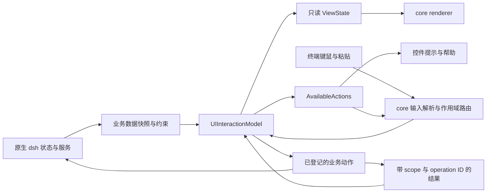

# Mayfly UI/UX 统一模型设计提案

状态：分析与设计提案，尚未实施。本文件不替代当前架构文档，不表示下文拟定的内部类型、事件或 API 已经存在。

审视日期：2026-09-06。代码基线：`bd171aa`，包含已经完成的 plan/YOLO 解耦、权限 picker 修复和 Yes/No 确认；这些改动尚未合并主分支。

范围：官方命令和面板，以及承载外部插件的四个 UI registry、core compiler、焦点、输入与异步事件路径。结论区分代码事实、已运行的行为探针和建议的新规则。

相关证据：[第一轮交互审视](../audits/2026-09-06-interaction-ux.zh.md)、[通知审计](../audits/2026-09-06-notifications.zh.md)。

## 1. 结论与目标

当前 Mayfly 统一了大部分绘制，但没有统一交互模型。许多 `Canonical...Controller` 仍自行解释按键、自行保存通用状态，然后把结果转换为同一种 `MayflyUiNode`。不同的内部状态机因此可以画出相似的 UI，却执行不同动作。

建议建立一个 frontend-tree-scoped 的 **UIInteractionModel**：所有 surface 的通用交互状态由它统一管理，状态按 surface/control/session 隔离；同类控件使用同一个 reducer；绘制、快捷键提示和动作可用性来自同一状态与动作描述。

“唯一模型”指唯一权威写入路径和可复用的行为规则。每个列表仍有自己的选中集合，每个表单仍有自己的草稿，但它们是模型中的实例数据，不是各业务功能自建的实现。渲染缓存、不可变快照、原生编辑器的内部缓冲不应成为另一套可独立决策的业务状态。

目标不变式：

1. 导航不写领域数据；只有明确的提交或动作调用才产生领域副作用。
2. 焦点、草稿选择、已经生效的值分别表达，互不冒充。
3. 同种控件在所有命令、pane、overlay 和 editor replacement 中遵循同一规则。
4. 业务模块声明数据、约束和动作绑定；通用 UX 由模型执行。
5. 帮助与提示展示的每个动作都能由同一个输入路由执行。
6. 已卸载、被替换或不属于当前 scope 的结果不能修改另一个 surface 的状态。
7. Harness 仍拥有 Agent、Session、权限、工具、设置和任务领域状态；UI 模型不复制它们的状态机。

## 2. 当前所有权与重复实现

| 状态或行为 | 当前 owner | 结构性问题 |
| --- | --- | --- |
| 文本草稿、正在编辑的字段 | `CanonicalFormController.values/editing/active`；core `UiFormStateStore`、`FocusState`；原生 editor | 功能控制器与 core 互相同步，Tab/Enter 可以被不同层重新解释 |
| 列表焦点与过滤 | `CanonicalSelectController`、`CanonicalDocumentController`、`CanonicalSettingsController`；core `UiListStateStore` | cursor、selectedId、query、filterEditing、分页分别实现 |
| 多选集合 | `CanonicalMultiSelectController.selected`；`Questionnaire.states[].toggled`；公开 list 的 `selectedIds` | 不同分支对零选中和提交采用不同规则 |
| 标签页、组、候选变体 | `CanonicalDocumentController.group/groupId/selectedVariants`；`Questionnaire.tab`；core 的 group focus | 页面状态与焦点同步依赖各自回调，tab 和选项集合容易混用 |
| 审批、计划评审、二次确认 | `ApprovalPrompt`、`PlanReviewPanel`、`createConfirmationPanel`、core `pendingConfirmation` | 有选择列表、数字直达、Yes/No 和二次 Enter 四条决策路径 |
| 滚动与窗口 | Info/Document/PlanReview 私有 `scrollTop`、不同常数；core ScrollView/ListState | 内容高度和页长由多个层决定 |
| 面板栈 | `EditorPanelController.entries`；`EditorDockHost.panels`；各命令的 restore 闭包；公开 overlay registry | 逻辑与挂载两份索引本身可以合理，但取消、异步结束和父子返回缺少统一流程状态 |
| 通知 | input 局部字符串；SettingsPanelNotice；market OperationStatus；update content slots；stderr/logger | 没有共同的 scope、severity、操作 ID 和清除规则 |
| 按键 | core keymap；core compiler 原始键判断；各 controller.handleInput；业务字母快捷键 | keymap 的匹配、实际处理和提示并非同一个来源 |
| 异步动作 | `SurfaceEventOwner`；官方 `void onAction`；各功能的 busy/unloaded/AbortController | 取消、并发、错误和晚结果规则因入口而变 |

现有能力应保留并收拢：[core/ui-surface-state.ts](../../packages/mayfly/src/core/ui-surface-state.ts) 的草稿和虚拟列表机制、[core/ui-compiler.ts](../../packages/mayfly/src/core/ui-compiler.ts) 的语义焦点和宽度保护、[editor-panel-controller.ts](../../packages/mayfly/src/interaction/editor-panel-controller.ts) 的 host replay，以及四个 registry 的 Fiber 生命周期。无需另起一套 renderer 或插件系统。

## 3. 不一致行为清单

### 3.1 提交、表单与选择

| ID | 优先级 | 已存在的行为 | 后果与证据 |
| --- | --- | --- | --- |
| F01 | P1 | 官方表单末字段的 Tab 会调用整表 submit | 导航变成保存；[form-panel.ts](../../packages/mayfly/src/interaction/form-panel.ts) 的 `onTextSubmit` 与 core Tab 分支；探针复现 |
| F02 | P1 | 设置枚举 Enter/Space 循环到下一值并触发写入 | 查看选项即改变默认权限等配置；[settings-command.ts](../../packages/mayfly/src/interaction/settings-command.ts) 的 `activate/commitRow`；探针复现发出变更回调 |
| F03 | P2 | OAuth `select` 被映射为自由文本，只有非空校验 | 用户手输内部 ID；[provider-add.ts](../../packages/mayfly/src/interaction/provider-add.ts) 的 `interaction.prompt` |
| F04 | P2 | core 多选可提交空集合，官方多选补入光标项；问卷另写同样回退 | 同类列表提交结果不同；[select.ts](../../packages/mayfly/src/interaction/select.ts)、[questionnaire.ts](../../packages/mayfly/src/interaction/questionnaire.ts)；探针复现 |
| F05 | P2 | 问卷多选使用 `mode: single` 并把 `[x]` 拼进 label | core 看到单选，功能再拦截 Space 实现多选，语义与显示脱节；探针复现 |
| F06 | P2 | 普通表单、问卷 Other、审批反馈、计划修订分别管理文本编辑/提交 | 有的确认当前字段，有的立即结束请求，有的空文本代表拒绝；领域结果有差异，但文本与提交机制不应各写一套 |
| F07 | P3 | context window 和 reasoning efforts 都借用文本框 | 数值与有限集合需用户记格式；[provider-add.ts](../../packages/mayfly/src/interaction/provider-add.ts) 的 `fillModelDefaults` |

### 3.2 列表、树、搜索与标签页

| ID | 优先级 | 已存在的行为 | 后果与证据 |
| --- | --- | --- | --- |
| L01 | P2 | 设置列表首尾循环，普通列表到边界停止 | 同样的 Up 在首项会去不同位置；Settings `move` 与 Select `moveCursor`；探针复现 |
| L02 | P1 | 市场 `i/u/r` 在 type-to-search 前被业务 handler 消费 | 搜索单词首字母可能变成安装/移除；[frontend-panel.ts](../../packages/mayfly/src/interaction/frontend-panel.ts) 与 [plugin-commands.ts](../../packages/mayfly/src/interaction/plugin-commands.ts)；探针复现优先级 |
| L03 | P2 | Select 搜索 label/filterText，Document 搜索 label+detail，树再自行生成搜索视图 | 搜索范围与匹配结果没有共同的字段声明 |
| L04 | P2 | `selectedIds` 有时表示已选择值，有时表示当前 cursor；另加 current badge 表示已生效值 | 焦点、候选与 committed value 混用；三个 list controller 均可见 |
| L05 | P2 | tabs 上 Tab/Shift+Tab 无动作，Enter 才进入内容；其他区域 Tab 切组或提交字段 | 用户不能依赖同一种 Tab 遍历规则；[ui-compiler.ts](../../packages/mayfly/src/core/ui-compiler.ts)；探针复现 |
| L06 | P2 | 切组会重新播种 selection；各 tab 的光标、query、scroll 没有统一独立保留模型 | 返回原 tab 的位置取决于 controller；Document `reseedSelection/selectedVariants/groupId` |
| L07 | P2 | 40 列及以下列表直接隐藏 detail；disabled 项通常跳过，失败原因有时写入隐藏 hint | 窄屏丢掉理解不可用状态的依据；[ui-patterns.ts](../../packages/mayfly/src/core/ui-patterns.ts) 的 `renderList` |
| L08 | P2 | 所有空视图容易归为 no matches | 初始无数据、搜索无匹配、加载失败、无权限可能缺少清楚区分；各功能自行拼 empty/error 状态 |

L05 是已被现有测试明确规定的旧规则，不应当偷偷作为一个“bug fix”改变；本提案建议以统一导航协议正式迁移。

### 3.3 确认、按键与交互提示

| ID | 优先级 | 已存在的行为 | 后果与证据 |
| --- | --- | --- | --- |
| A01 | P2 | 官方四处已改 Yes/No，公开 `action.confirm` 仍二次 Enter | 仍是两套确认 UX；[confirmation-panel.ts](../../packages/mayfly/src/interaction/confirmation-panel.ts)、core `pendingConfirmation` |
| A02 | P2 | 已启用完全访问，再选 current 仍确认 | no-op 也打断；[permission-panel.ts](../../packages/mayfly/src/interaction/permission-panel.ts) 的 `onSelect` |
| A03 | P2 | primary 视觉 intent 同时决定 core preferred focus | 样式变动可以影响首次 Enter 的目标；core `collectControls/groupTarget`。确认默认 No、审批默认首项也缺少统一的显式默认策略 |
| K01 | P2 | controller 使用 keymap，core 控件大量使用固定 Enter/Esc/转义序列 | 提供的绑定与实际处理可不一致；[keymap.ts](../../packages/mayfly/src/core/keymap.ts)、compiler；探针复现自定义提交键被忽略 |
| K02 | P1 | 全局 handler 在焦点路由前执行，业务又可拦截原始字符 | 缺少统一 capture/scope 规则，跨 Agent 快捷键与未完成交互的关系要逐功能处理；core `index.ts` 与 controller.handleInput |
| K03 | P2 | core 自动提示 + 手工覆盖 + suppressAuto + 字符串拼装并存 | 显示什么和实际做什么可分离；[ui-compiler.ts](../../packages/mayfly/src/core/ui-compiler.ts) 的 `contextualKeyHints` |
| K04 | P2 | 提示固定优先级取前三项，窄屏继续裁剪；用泛化 actions/run/choose 代替实际动作 | 重要的返回/取消或具体提交后果可能不可见，需由动作类型决定保留顺序 |
| K05 | P2 | InfoPanel 支持 Enter/Esc/q 关闭，Document 的 q 依赖是否可搜索 | 同类只读内容仍受不同 controller 控制；[info-panel.ts](../../packages/mayfly/src/interaction/info-panel.ts)、Document `handleInput` |

K02 不表示所有全局快捷键都有错误；它表示现在缺少一个跨 surface 的明确优先级契约。中断、退出与普通导航需要分别定义。

### 3.4 通知、生命周期与渲染一致性

| ID | 优先级 | 已存在的行为 | 后果与证据 |
| --- | --- | --- | --- |
| N01 | P1 | 内部 policy 消息进 queue，进正式 transcript 后又隐藏 | 模型消息和用户待处理输入分类矛盾；通知审计及探针 |
| N02 | P1 | 面板打开时 hint 隐藏，但多个面板仍向 hint 发错误 | 操作失败当时不可见；EditorDockHost 与 jobs/agents/preset；探针 |
| N03 | P1 | 通用 notice 无 scope、ID；旧会话异步结果能写入新会话 | 信息归属错误；input 命令回调；探针 |
| N04 | P1 | severity 在某些入口保留，在字符串 notice 入口丢失 | 同一失败的强调方式取决于入口；market reporter 对照 |
| N05 | P2 | 后写覆盖、空串清除、编辑即清除、常驻 slot 等规则并存 | 新错误可被无关 loading 清理删掉；探针 |
| N06 | P2 | 八行后 `... more` 无展开，更新消息逐行截断，同时还有独立详情面板 | 信息可达性不一致；探针与 updater 代码 |
| N07 | P2 | 更新同时发 hint 和 content slot；部分运行中错误只发 stderr/logger | 重复展示、不可管理和闪现；通知审计 |
| R01 | P1 | 公开 surface 有统一异步事件 owner，官方 controller 仍 `void onAction` 并自管 busy/unloaded | 同类 action 的错误、并发和晚结果处理不同；[surface-renderer.ts](../../packages/mayfly/src/core/surface-renderer.ts)、Document `activate` |
| R02 | P2 | `selection-change` 同时表示多选集合变动与提交，dispatcher 又按 latest 策略处理它 | 草稿变化与提交意图无法从事件名区分；公共 contracts、core `collectControls` 与 `SurfaceEventOwner.emit` |
| R03 | P2 | 官方 adapter 固定 `screenMode: main` 和近似无限高度；公开 surface 使用实际 viewport/mode | 同 kind 的行栈、scroll、actions 可能因入口采用不同布局路径；[canonical-panel.ts](../../packages/mayfly/src/interaction/canonical-panel.ts) |
| R04 | P2 | 不同 controller 自设 6/8/16/20 行窗口与页面步长，依赖字符串 leaf path | 看起来相同的列表滚动距离不同；结构变化还需手工同步窗口 path |
| R05 | P2 | 外部 snapshot、内部重编译、theme/locale 改变的草稿保留策略分散 | 用户态可能因数据刷新或呈现刷新被重置；core `bind`、adapter `invalidate`、各 panel replay |
| R06 | P2 | Document 的读取/构建节点方法顺便修改 selectedId/group/selectedVariants | 状态收敛发生在 render 查询里，而非明确的事件转换中 |

不一致并不意味着所有状态必须显示在一个位置。队列、持久状态、字段校验、工具结果和短通知有不同语义；统一的是分类规则、状态管理和同类交互协议。

## 4. 统一模型与分层

### 4.1 一条交互数据流



UIInteractionModel 内部由按控件种类划分的纯 reducer 组成，所有状态变更通过统一 dispatch。拆文件是为了模块边界，不是允许业务再实现另一份 FormState 或 ListState。

### 4.2 明确每种状态的唯一 owner

| 状态 | 权威 owner | 其他层允许做什么 |
| --- | --- | --- |
| 已生效权限、设置、模型、Agent/Session、Job | 原生 dsh | UI 读取 snapshot、提交原生 action；不建立第二套领域状态 |
| surface 路径、通用表单/选择/向导/确认、通知、UI 操作状态 | UIInteractionModel | 功能提供 readonly 定义与动作映射；renderer 读取派生状态 |
| 焦点及输入语义 | UIInteractionModel 的 core-owned slice | 业务只能请求打开/定位一个语义控件，不能同步自己的 cursor |
| 实际终端几何、行宽、可见窗口、ANSI、命中区、renderer handles | core renderer | 给模型提交导航所需的可达性信息；缓存不成为第二套选择状态 |
| 文本编辑缓冲、undo/redo、粘贴协议 | core 持有的原生 editor | 模型通过唯一绑定取得草稿快照；功能不另建 values/editing 副本 |
| 数据读取、订阅与领域校验 | 原有 service/功能 action handler | 返回数据或校验结果，不能控制 Tab/Esc 等通用 UX |

渲染中需要的缓存与派生快照可以存在，但必须有明确来源且不可反向作为新的权威状态。`render()`、`selectView()`、`availableActions()` 必须不修改语义状态。

### 4.3 与现有包和 Fiber 的关系

- `packages/ui` 继续只拥有 readonly contract、纯 builder 和四个 registry；不放可变 store、renderer 对象或 Harness 对象。
- 统一模型的 reducer 与输入/焦点实现放在 `packages/mayfly/src/core/` 内，确保原始按键、布局和 focus 仍只有 core 处理。
- 演进现有内部 `mayflyInteractionState` 作为 frontend tree 的稳定状态入口；把 UI 模型的挂载与 renderer/theme 的挂载生命周期分开。若需要调整注册位置，使用普通 Cordis sibling 和显式 inject，实施时更新组合与包指引。
- 现有缓存、粘贴资源和配置引用与新的交互状态分别分区；不把这个服务继续扩展成任意业务数据的杂物箱。
- `mayflyEditorPanels` 逐步变为统一 navigation slice 的入口；EditorDockHost 只投影逻辑栈到物理挂载，不另定取消规则。
- 四个公开 UI contribution service 保持不变。业务插件仍直接使用原生 dsh；不增加 manifest、realm、权限 facade 或特有插件框架。

模型实例随 frontend tree 销毁；renderer/theme reload 只解绑并重建 renderer handles。所有可保留的用户态存于稳定模型实例，不能依赖已经卸载的组件对象存活。

### 4.4 内部状态分区

以下是拟定的内部结构，不是新增公共 API：

```text
UIInteractionModel
  navigation
    surface stack / active surface / return anchor
  surfaces[surfaceId]
    source revision / scope / lifecycle
    forms[formId]
      baseline / draft binding / dirty / field errors / validation state
    lists[listId]
      focused item ID / selected IDs / committed IDs / query / expanded IDs
    tabs[tabsId]
      active tab ID / per-tab content state
    wizards[wizardId]
      active step ID / completed steps / draft answers
    decisions[decisionId]
      action / question / allowed choices / default choice / settlement
  operations[operationId]
    origin / target / source revision / phase / cancellation facts
  notifications[notificationId]
    scope / operation ID / severity / content / detail action / lifetime
```

原始 Agent、Session、Promise、AbortController、pi-tui 对象、焦点 handle 和宽度信息不进入公开模型快照。业务动作映射、取消句柄与原生 editor 实例在同一 owner 的私有 runtime bindings 中管理。

### 4.5 需要补齐的数据契约

现有只读 node 是良好基础，但不足以表达全部通用 UX。以下是契约能力清单，具体字段名由真实消费者和类型测试确定，不同时建立另一套面板 DSL。

| 契约 | 复用现有部分 | 需要明确或补齐的语义 |
| --- | --- | --- |
| Form | fields、value、submitActionId、cancelActionId | 类型化约束、明确的提交边界、字段错误；校验函数放注册/effect 层 |
| List/Choice | id、mode、items、selectedIds | browse/choose 角色、焦点与值的区别、选择基数、不可用原因；选择变动与接受分开 |
| Tabs | id、activeId、items | 属于视图导航的语义、每页状态保留和统一退出规则 |
| Action/Decision | id、label、intent、disabled、busy、confirm | 业务动作与视觉强调分开；默认决定、一次性确认与操作状态由统一模型管理 |
| Notification | 现有 readonly text/action 数据与注册事件 | scope、ID、severity、详情、生命周期；入口归既有模型，不新增第五个 UI contribution service |
| Source update | revision/eventRevision、稳定 node/control ID | acknowledgement、数据刷新、schema 改变、整体替换的明确区分 |

动作 handler 可以消费统一模型提交的草稿快照并调用原生服务，但不能持有一份会自行更新的 UI 草稿。外部源的 committed snapshot 和 UI 编辑 baseline 是只读参照，不成为新的领域状态权威。

## 5. 统一交互协议

### 5.1 基础动词

必须在内部区分 `navigate`、`edit`、`toggle`、`accept-selection`、`submit-form`、`invoke-action`、`cancel-edit`、`close-surface`、`interrupt-operation`。这些不能继续统一塞入模糊的 `selection-change` 或 `submit`。

| 内部事件族 | 可修改的状态 | 可否直接产生领域副作用 |
| --- | --- | --- |
| FocusMoved / ViewportChanged | 焦点、可见性派生 | 否 |
| DraftChanged / SelectionToggled / FilterChanged | 草稿、候选集合、query | 否；可触发只读搜索/校验 |
| TabActivated / TreeExpanded | 当前视图 | 否；可触发只读加载 |
| SelectionAccepted / FormSubmitted / ActionInvoked | 操作请求 | 通过已登记的 action binding 执行 |
| ValidationFailed / OperationSettled | 校验错误、进度、反馈 | 记录结果，不在 render 中重试 |
| SurfaceClosed / OwnerDisposed / ScopeChanged | 生命周期、取消、归属 | 不把关闭 UI 等同于已回滚领域操作 |

已经公开的 `MayflyUiEvent` 不能悄悄改义。先在内部明确事件，再按版本迁移涉及的 public contract，并同步真实外部消费者；过渡转换只存在于一个边界，不能让每个插件自行猜测新旧语义。

### 5.2 表单

所有配置表单具有显式 Save / Cancel。单字段编辑也是表单，不因“只有一个字段”恢复隐式提交。

| 输入 | 统一行为 |
| --- | --- |
| 聚焦文本字段 | 直接可编辑，显示 caret；不另要求一次 Enter 进入隐藏模式 |
| Tab / Shift+Tab | 移至下/上一个控件，保留草稿；末字段移至 action 区，不提交 |
| 单行字段 Enter | 完成当前字段并前进，不保存整表 |
| 多行字段 Enter | 换行；文本处理复用原生 editor |
| Save 按钮 Enter/Space | 校验整表，通过后提交一次；失败定位首个无效字段并保留全部草稿 |
| Cancel / 表单层 Esc | 无修改直接关闭；有未保存修改则统一确认是否丢弃，默认 No |
| 弹出的选择器/补全上的 Esc | 仅关闭当前选择层，返回同一字段，不丢整表草稿 |

可提供统一的 Ctrl+Enter 提交别名，但只有终端能力与 keymap 能准确表达时才启用和显示；显式 Save 始终可达。不复用 prompt 中已经表示 steer 的 Ctrl+S 作为不可见的全局保存键。

字段校验与导航分开：Tab 不把用户困在错误字段，错误持续标在字段旁；最终提交时阻止无效数据。同步约束来自数据声明，领域校验由业务 handler 返回结构化字段错误。禁止功能通过临时替换标题或全局 notice 模拟字段错误。

### 5.3 值类型与提交边界

| 值类型 | 控件 | 提交位置 |
| --- | --- | --- |
| 自由文本 | input / textarea | 表单草稿，Save 才写领域 |
| 密钥/密码 | secret | 与表单相同；日志和审计快照脱敏，关闭后释放草稿引用 |
| Boolean | toggle | 在表单中改草稿；独立设置行是明确的 toggle action，结算前显示 pending |
| 单一枚举 | choice picker / 明确的 segmented choice | 展开完整选项，接受后改草稿或调用独立设置 action；不得靠反复 Enter 遍历并保存 |
| 有限集合 | multiple choice | 显示已选数与约束，提交实际选中集合 |
| 数值 | 带单位、min/max/step 的数值输入 | 允许键入不完整草稿，提交时规范化/校验；不把暂时的 `-` 等中间态误报为保存值 |

OAuth 的 `text/secret/select` 按上述类型映射。缺少候选项的 select 显示明确不可完成状态，不生成空标签文本框。内部 option ID 不要求用户手输。

### 5.4 列表与树

只保留两种可识别语义：**浏览记录**和**选择值**。视觉结构相同不意味着浏览一条记录就应选择某个配置值，但相同语义必须共享 reducer。

- `focusedItemId` 是光标；`selectedIds` 是草稿集合；`committedIds` 是原生当前值。这三种状态不能由一份 selectedIds 兼任。
- Up/Down 默认到边界停止；Home/End 到首尾；PageUp/PageDown 按 core 实际可见页移动。统一取消各 controller 私有的 6/8/16/20 行步长。
- 浏览列表 Enter 执行清楚命名的 Open/View action；选择器 Enter 接受候选。二者都经过同一个 action 路由，功能不处理原始 Enter。
- 多选 Space 只切换当前项；Enter/确认按钮提交实际集合。`minSelected=0` 可提交空集合，`minSelected>0` 显示校验，不得补光标项。数字快捷键在多选里只切换候选，不提交整个问卷。
- 不可用条目必须有可达的原因。建议记录型条目可聚焦检查，动作仍 disabled；choice 中不可用值不能成为新提交值。renderer 应提供同一详情呈现，不依赖功能吞掉 Enter 后写一条不可见 notice。
- 数据刷新按稳定 ID 保留焦点和选择；删除焦点项时选相邻可达项。选择中的值失效时明确显示，不能悄悄改成另一值。
- 树的展开/折叠、搜索展开和返回位置由共享 TreeState 管理。业务提供 parent/child 关系，不拼缩进字符串来实现另一种树导航。

### 5.5 搜索

- filterable 集合一致支持直接输入进入搜索；`/` 或注册的搜索动作也可进入。
- 输入文本优先于无修饰业务字母。市场安装/移除/刷新应改为显式 action 或统一注册的修饰键，不能再让 `i/u/r` 抢走搜索首字母。
- SearchState 统一持有 query、编辑状态、可见结果与返回锚点。业务声明可搜索字段；匹配与输入规则由模型统一执行，字符处理仍由 core 原生 SearchInput 负责。
- Esc 退出搜索编辑并保留可见 query；Clear 明确清空；随后 Esc 才按 surface 返回规则退出。清空后恢复先前列表锚点。
- 初始无数据、无匹配、加载中、失败、权限不足是不同状态，使用共同的 empty/loading/error 模型与明确可用动作。
- 跨 tab 的过滤默认保留在各 tab 自己的 content state；若是一个全局搜索界面，应明确呈现全局范围，而不是按功能隐含改变搜索范围。

### 5.6 标签页与选项组

- Tab/Shift+Tab 在所有可交互 group 之间前后移动，包括从 tab strip 进入内容；复合控件内部用方向键 roving focus。
- tab strip 的 Left/Right 激活相邻视图，边界不循环；Enter 可进入当前视图内容。视图切换本身不提交业务数据。
- 每个 tab 保留自己的草稿、筛选、焦点和滚动锚点；切换只是激活另一个实例，不清空它。
- 删除/重排 tab 按 ID 重定位，翻译文案变化不重置状态。异步加载结果按 tab/request ID 归属。
- tabs 只代表视图。模型的 reasoning effort 等互斥值应使用 choice/segment 语义，不用 tabs 假装视图切换。

这会有意改变当前“tabs 上 Tab 无动作”的规则，需要明确的版本说明、键位文档与跨面板验收。

### 5.7 确认、审批与问卷

统一 DecisionState 和决策动作，而非把所有问题都强行压成二选一。

| 场景 | 定义与共享行为 |
| --- | --- |
| 二次确认 | 问题、目标、后果、Yes/No；默认 No；Yes 提交一次，No/Esc 返回原 surface |
| 原生工具审批 | 使用原生允许/拒绝及会话授权选项；共享 choice/feedback 控件；原生 outcome 不改名 |
| 计划评审 | document + decision + 可选反馈；共享滚动、choice 与 form；不要手写光标和编辑状态 |
| 多问题请求 | WizardState + 每题的 Form/ChoiceState；跨题草稿保留；最后有明确“提交回答”动作 |

默认焦点由 decision 的明确默认规则决定，不从按钮颜色或 `intent: primary` 推断。需要明确批准的许可/危险决定默认落在不执行项；已有审批首项默认允许属于需要正式迁移的交互决定。

确认只针对实际变化；无变化直接返回。确认对象发生变化、来源 surface 被替换或所属 Agent 不再有效时，旧 Yes 不能执行新目标。取消下层确认恢复父 surface 的同一草稿和焦点。

公开 `action.confirm` 也必须由同一个 DecisionState 呈现；不保留另一套“文字后加问号、再按 Enter”的状态机。业务只登记 action 的语义和后果，不决定确认面板长相、按键或生命周期。

参数化原生 dsh 命令仍按其文档执行，UI 不擅自改写 `/permission` 的权限语义。统一的是 Mayfly 同类控件和 UI action 的呈现/调用路径，不能为了表面一致复制一个 Mayfly 权限系统。

### 5.8 只读文档与长内容

- Help、Info、Trace、Job output、plan 正文使用一个 DocumentState/ScrollState。格式不同由内容数据表达，关闭、分页、锚点保留一致。
- Esc 关闭/返回；非搜索的只读文档可有统一的 q 别名。Enter 仅激活聚焦的明确动作，不再在一部分文档里隐式关闭。
- 真实 viewport 决定窗口；活动控件与确认动作必须保持可达。宽度合规不等于高度合规。
- 窄屏可把同一组按钮纵排，但导航根据实际布局生成，保持逻辑操作顺序。不能仅因官方 adapter 和插件 surface 不同而采用两套布局语义。
- 重要详情不能因宽度小于某阈值而彻底不可达；提供当前行详情区或显式详情动作。省略时必须能查看全文。

## 6. 单一输入路由与提示来源

拟定优先级：终端粘贴/组合输入识别 → 明确的紧急中断 → 最上层 capturing decision/surface → 当前文本编辑器或候选菜单 → 当前控件 → 所属 group/surface → 可用的全局动作。

只有少量明确声明的紧急动作可越过 capturing surface；F7/F8 等普通导航依据当前 surface 是否允许离开来决定可用性。被捕获的按键不得继续传给底层 prompt。

prompt 的已约定语义保留：Enter 发送，Tab 补全，Shift+Tab 只切 normal/plan，Ctrl+S steer；plan 与 YOLO 仍可叠加，YOLO 通过独立原生权限命令控制。其他控件不复用 prompt 的 mode-switch handler。

Alt+M 这类明确命名为“下一个模型”的快捷动作可以保留，并由同一 action registry 限定 scope。它与“在一个普通枚举行按 Enter，隐式切到下个值”不是同一种控件语义。

核心接口应是一个派生查询：`availableActions(model, focusedControl)`。输入匹配、按钮 enabled/busy、快捷键提示、帮助、无障碍名称均读取它。业务只能登记动作 ID、业务标签及 action binding，不再传手拼 `keys` 字符串或 `suppressAutomaticContextHints` 来修补实际处理。

提示规则：

- 展示当前确实可执行的动作和实际绑定；名称使用“保存”“选择”“返回”“取消”等准确语义。
- 输入态不展示会窃取文本的业务字符快捷键。
- 窄屏优先保留退出/取消与主要操作，精简说明而不制造不存在的动作；完整列表可在统一帮助查看。
- 没有可操作的详情入口就不能只显示 `... more`。
- 文案翻译统一按稳定 key 生成，用户提供的内容不当作翻译 key；翻译与主题变化只重绘，不改变交互状态。

## 7. 通知与操作状态

### 7.1 展示语义

| 内容 | 统一位置与责任 |
| --- | --- |
| 模型内部策略消息 | 保留原生 inbox；不作为用户 queue 显示 |
| 用户待处理 prompt/steer/附件 | 上方队列，只读投影；不复制 inbox 状态 |
| 短操作反馈 | 当前 editor 或 panel 下方、footer 上方的统一 feedback slot |
| 字段错误 | 同一模型中的 field error，贴近字段 |
| 长任务进度/失败详情 | 所属操作/document surface，feedback 提供摘要与详情动作 |
| 当前 plan/yolo、jobs、context 状态 | footer/pane 持续投影，独立于通知 acknowledgement |
| 启动前或无法维持 UI 的错误 | stderr；运行中可恢复错误同时进入统一反馈 |

feedback slot 不再属于“仅编辑器可见的 hint”。活动面板也有同一个可见出口。建议为摘要保留一行，长文通过详情呈现，避免通知长度使编辑区反复跳动；实际分配仍由 core 统一根据 viewport 决定。

### 7.2 生命周期与归属

- 每条通知都有稳定 ID、owner、app/session/panel scope、operation ID 和 severity。
- 同一操作的 loading/success/error 更新同一记录；生产者只能清理自己的记录。
- progress 持续到操作结算；建议第一版 success/info 摘要在累计可见 5 秒后消失，所属 surface 隐藏时暂停计时；warning/error 保留到明确处理、同操作替换或 scope 关闭，并可回看详情。计时由 model 的 effect owner 驱动，不在 render 中改状态，也不提供功能各自设定的任意 TTL。
- 不再由任意编辑清空所有错误；滚动“有新消息”是状态提示，不覆盖操作失败。
- 应用级更新结果跨会话可见且标记目标 profile；会话级结果归原会话；panel 关闭不把结果写给另一个 panel。
- 使用有界的会话/应用通知记录，超额按统一策略回收已结算低优先级项；进行中的操作和未处理的关键失败不得因高频普通消息被挤掉。
- 敏感字段内容不进入提示、操作审计快照或通知历史。

## 8. 异步、关闭与数据刷新

### 8.1 同一个 OperationState

动作状态统一为 `idle → validating → awaiting-confirmation → running → succeeded/failed/cancelled`；领域动作并不一定经过所有阶段。状态由共享 reducer 驱动，业务只提供校验与原生 effect。

启动 effect 前先在模型中登记 operation 和 busy，防止连续输入重复启动。草稿搜索/校验可以采用 latest；明确提交/动作不能因为同名 `selection-change` 到达就被误当成可丢弃的草稿更新。

本地单次调用防重不等于外部副作用 exactly-once。取消 AbortSignal 也不等于回滚成功：若领域写入已发生或完成状态未知，保留原生结果并重新读取权威状态，不伪报“已取消、没有变化”。

### 8.2 使用已有身份和版本

复用 Fiber 生命周期、既有 surface generation、registry revision/eventRevision、current-Agent revision，以及领域服务自己的 revision。统一校验它们的适用范围，不为每个功能再添加一组私有 loaded/unloaded/generation 标志。

UI 快照仅记录标识；业务 effect 必须通过原生服务取得精确 Agent，不能把 Agent/Session 藏进 renderer-neutral node。session ID 相同也不自动证明它还是原来的 live Agent 实例。

### 8.3 草稿与外部值冲突

| 变化 | 策略 |
| --- | --- |
| 主题、语言、终端尺寸、等价 node 重建 | 保留草稿/焦点/选择；只重算呈现 |
| 外部值更新，字段未修改 | 同步新 baseline |
| 外部值更新，字段有草稿 | 保留草稿并标记冲突，提交时使用领域 revision 校验 |
| 列表重排或新增 | 按稳定 ID 保留锚点，不依赖 array/object identity |
| 字段/条目/动作被删除 | 按共享 reconcile 规则回退；旧动作失效 |
| 返回父 surface | 恢复原实例状态与焦点锚点 |
| 所属 Fiber 真正卸载 | 注销贡献、取消适用任务、移除状态，不复活旧 panel |

公开 surface 当前对 external replacement 有明确的重置语义，因此新的“数据刷新保留草稿”需要区分呈现刷新、数据更新和意图上的整体替换。实施时必须形成清楚的版本化契约；不能在原 `set()` 上无说明地改变所有外部插件行为。

## 9. 业务模块允许与禁止的职责

| 允许由业务定义 | 必须由统一模型负责 |
| --- | --- |
| 原生数据来源、只读查询、业务标签 | cursor、编辑态、tab/过滤/展开/滚动状态 |
| 字段类型、必填、数值边界、选择基数 | Tab/Enter/Esc/方向键解释 |
| 明确的 action ID、目标及原生调用 | 确认呈现、默认焦点、busy、防重 |
| 原生领域校验与错误内容 | 校验错误归属和呈现、通用返回行为 |
| 请求允许/拒绝的原生结果编码 | 问卷逐步草稿、选择与提交机制 |
| 业务操作是否可取消及真实结果 | notification ID/scope、并发、晚结果校验 |

区别来自数据语义，不来自命令名。禁止以 `isProviderPanel`、`isSettingsPanel`、`submitOnLastTab` 等新开关保留原先的分叉。

## 10. 迁移映射

| 当前实现或入口 | 目标 | 迁移完成后删除的私有 UX |
| --- | --- | --- |
| `form-panel.ts`；Provider、startup、配置值编辑 | FormState + typed fields | values/editing/submitDirection、末字段提交与各自键链 |
| `select-list.ts`、`select.ts` | Choice/BrowseListState | 自建 cursor/query/filterEditing、零选中回退 |
| `settings-command.ts` | PropertyList + Form/Choice/Toggle | enum cycle、自建 settings cursor/values、SettingsNoticeController |
| `frontend-panel.ts`；市场、模型、jobs | TabbedCollection/Document 组合 | group/selectedVariants/query/scroll 私有规则、raw onUnhandledInput |
| `session-tree.ts`、`/sessions`、`/agents` | TreeBrowser | 各自的展开、过滤和搜索导航逻辑；关系数据仍来自原生服务 |
| `Questionnaire`、`ApprovalPrompt`、`PlanReviewPanel` | Wizard/Decision + 标准控件 | cursor/editing/reasonDraft/toggled 和拼接的 checkbox |
| `createConfirmationPanel`、公开 `action.confirm` | 同一个 DecisionState | closure settled 与 core pendingConfirmation 两套机制 |
| Help/Info/Trace/Job output | DocumentState | 私有关闭键、页长、scrollTop、leaf path |
| hint、settings notice、market status、update notice | NotificationState/OperationState | notice 字符串和各功能的清空/染色/寿命逻辑 |
| 官方 CanonicalPanelAdapter、公开 surface 编译 | 同一个 surface session 与 renderer 接口 | 官方专属 focus mirror、main-mode 与无穷 viewport 分支 |

这些是最终删除目标。迁移期间可以有一个短期转换边界，但迁移某类控件时应一次覆盖所有该类消费者；不能让旧、新两种相同行为长期并存。

## 11. 实施顺序

| 阶段 | 内容 | 阶段完成条件 |
| --- | --- | --- |
| 0. 固化协议 | 交互矩阵、状态 owner、内部事件、版本影响和 conformance fixtures | 所有已发现问题都有指定的新规则和验收场景 |
| 1. 建立共享模型与动作路由 | 稳定 model owner、surface instance、输入作用域、AvailableActions、effects/notification 基础 | 一个只读 Document 与一个标准 Decision 在验收环境试点；renderer reload 不丢状态；不把局部试点称为已统一发布 |
| 2. 迁移通知与导航 | queue 分类、可见 feedback slot、scope/ID、返回与异步结算 | 五个通知探针转为修复回归；无 hidden error、串会话和跨操作清空 |
| 3. 迁移 Form 与 Choice | 表单 Save/Cancel、设置 enum、OAuth、数值/集合、多选，以及对应公开字段/事件和消费者 | 所有表单/选择器共用协议；导航零领域写入；删除旧 controller 状态机 |
| 4. 迁移 Tree/Tabs/Wizard/Document/Decision | 会话/Agent 浏览、市场、模型、问卷、计划评审与公开 action.confirm | 搜索、边界、tab 保留、只读关闭和确认规则一致；取消保留父级草稿 |
| 5. 跨入口验证与收尾 | 第三方完整 composition、删除转换边界、文档和发布闭包 | 官方/外部相同逻辑轨迹得到相同 UX；源码门禁禁止私有通用逻辑回流 |

这是跨模块和公共 UI 的架构变更，不能靠零散补丁完成。每阶段应有可单独验收的 worktree/profile；通过完整 gate、必要的 package/example 验证和 PTY 后再交付人工验收。凡涉及 Website 的阶段同时提供 LAN preview，按照仓库流程验收后再合并和清理。

每类控件对应的公共契约迁移随该类一起完成，不等到最后才处理第三方入口。若某阶段不能同时迁完该类所有消费者，继续留在验收分支，不把同一角色的两种行为作为正式版本发布。

## 12. 一致性测试与防回归门禁

### 12.1 以控件角色验证所有消费者

建立参数化 conformance suite，输入是同一组声明式场景和事件轨迹，分别挂到官方命令面板与公开 pane/overlay。断言状态和副作用，再检查真实 renderer 的可见结果。

| 测试族 | 必须验证 |
| --- | --- |
| Form | Tab/Shift+Tab 无领域写入；Save 一次；Cancel 草稿；错误定位；多行输入；secret 不泄露 |
| Choice | 焦点/已选/已生效不同；空集合基数；no-op；disabled；ID 重排 |
| Tree/Search | 无业务字母抢输入；空结果可退出；展开恢复；中英文/长文本/粘贴 |
| Tabs | Tab 可进入内容；方向键不循环；各 tab 草稿和锚点保留 |
| Decision | 默认不执行；Yes 一次；No/Esc 返回；目标失效后旧事件无效 |
| Notification | 面板期间可见；severity；scope；按 ID 更新/清除；晚结果与详情 |
| Async | 校验拒绝、失败、超时、取消、重复提交、并发、目标删除、Fiber unload |
| Reload | theme/locale/resize/renderer gap 不改变草稿与业务结果；整体替换按明确策略处理 |
| Input/Help | 同一 AvailableActions 驱动实际处理与提示；改键后两者一起变；捕获 surface 阻止底层响应 |
| Layout | 20/40/80/160 列、短终端高度、CJK/长单词；不仅不溢出，还要看得到可操作按钮和错误 |

关键性质：`render` 不修改语义状态；导航轨迹产生零领域 effects；一次有效确认最多发起一次本地动作；另一个 scope 的结果不能改变本 scope 草稿；语言/主题变化不改变已选值。

### 12.2 源码约束

- raw terminal/key parsing、geometry/focus 只在 core。
- feature 不得新增通用 `cursor/editing/filterEditing/selectedIds/pendingConfirmation` 状态机；领域数据的同名字段不误报，采用模块边界和 AST 检查。
- feature 不调用 `notice('')`，不拼 ANSI 或快捷键提示字符串，不私设通用 TTL、页长与确认键。
- `handleInput` 只允许核心输入实现、原生 editor 绑定及明确迁移边界；已迁移 feature 只提交定义与业务 actions。
- 公开 node 仍为 readonly 数据与结构化 actions；注册层承载 callbacks，node 中不塞 Promise/Agent/Session/renderer。
- 完整 gate 继续执行；100% 覆盖率不能代替 UX 一致性测试，因为现有测试已经覆盖并接受了若干不理想行为。

### 12.3 本轮实际验证

本轮直接运行现有源码的 13 个临时审计探针全部通过，即成功复现现状：前轮五个通知问题，以及末字段 Tab 提交、设置/普通列表边界不同、enum Enter 立即触发写入、业务字母抢搜索、core 忽略 supplied submit binding、官方/公开多选空集合不同、问卷用单选伪装多选、tabs 上 Tab 无动作。

日志：`/tmp/mayfly-ux-system-audit-probes.log`。它们没有被加入产品测试来固化这些不一致，也不表示本提案已经实现。其他条目在上文给出了静态代码依据和实施时需要验证的风险。

## 13. 完成标准

统一改造完成后，业务作者新增一个普通表单、枚举选择器、列表、标签页或确认面板，只需要提供数据与业务动作，不需要编写一个 `handleInput`，不需要决定 Enter/Tab/Esc 的细节，不需要保存第二份通用 UI 状态，也不需要自建通知或异步防重流程。

若新增一个命令仍然需要复制另一面板的 cursor、editing、notice 或确认逻辑，就说明统一模型的覆盖尚未完成。
