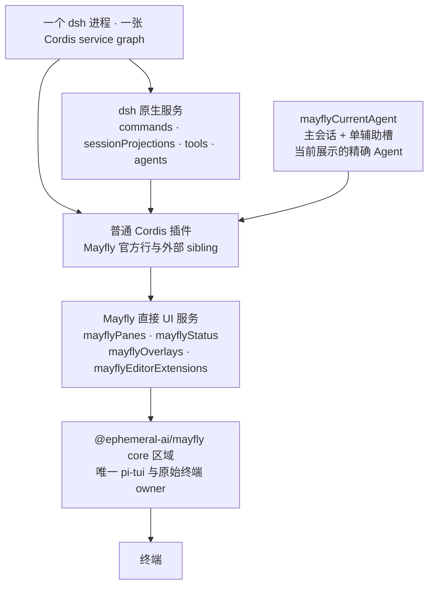

# Mayfly 架构

Mayfly 是 `dsh-base` 上的一组普通 Cordis sibling 插件。它不建立第二个插件
模型，不拦截或复制 dsh service graph，也不为外部插件建立私有 runtime realm。

<!-- BEGIN diagram:mayfly-layers -->
<!-- single source 单一来源: docs/diagrams/mayfly-layers.zh.mmd — edit the .mmd, then `pnpm run diagrams:sync` -->

<!-- END diagram:mayfly-layers -->

## 运行时原则

1. 插件直接 inject 并使用 dsh 原生服务，例如 `commands`、
   `sessionProjections`、`tools` 和 `settings`。与 `planMode` 同 realm 的插件
   可以直接 inject 它；根级 UI 插件通过原生 `plan` projection 读取状态、通过
   原生 `/plan` 命令写入，不增加 Mayfly adapter。
2. Mayfly 只增加终端 UI 所需的四个 service：
   `mayflyPanes`、`mayflyStatus`、`mayflyOverlays`、
   `mayflyEditorExtensions`。
3. `mayflyCurrentAgent` 持有一个主 Agent 与一个辅助会话槽；`current()` 始终返回
   当前展示的精确 live Agent。插件拿到 Agent 后仍调用原生 dsh service；该对象
   不是 renderer model。BTW 与 continuable subagent 因而复用同一套 transcript、
   status、pane、command 与 editor，不建立第二份会话 renderer。
4. 注册、listener、timer 与异步 continuation 都属于创建它们的 Cordis Fiber。
   Fiber unload 是唯一的插件贡献清理机制。
5. 只有 `packages/mayfly/src/core/` import pi-tui、处理 ANSI/raw mode、焦点、
   布局和 visible width。
6. UI contribution 始终是普通 readonly node；core 私有地窗口化大列表，并在
   响应式分支首次可见时才校验和编译，不向插件暴露 renderer 调度状态。
   Pane 与 overlay 的表单、选择、页面、文档锚点、操作和反馈由 frontend 的
   `mayflyUiInteraction` 实例持有，因此 core/theme reload 不会丢失有效草稿。
7. core 启动时按固定顺序预建 prelude、conversation、local activity、EditorDock
   与 Footer host。Feature 只领取 named slot lease；临时 notice/echo 进入 local
   activity region，不改变 terminal root 顺序。
8. 普通 surface 按 provider revision 缓存；transcript 按
   `(session generation, entry id, content revision, width, presentation revision)`
   缓存。Durable entry 的 content revision 是 `updatedSeq`；实时 entry 使用
   独立的 `renderRevision`，两者不共用数值时钟。

## 包边界

| 包 | 当前职责 |
| --- | --- |
| `@ephemeral-ai/mayfly-ui` | renderer-neutral contract、纯 node builder、`defineMayflyComponent` 与四个直接 UI registry/provider |
| `@ephemeral-ai/mayfly` | frontend、conversation、app、core、transcript、interaction、theme，以及 `dsh-base` 上的 flat composition 与 presets |
| `@ephemeral-ai/mayfly-cli` | dependency-free `mayfly` launcher；首次运行展开内置 dsh runtime 并校准 profile |

`frontend`、`conversation`、`app`、`core`、`transcript` 与 `interaction` 仍是
清晰的源码所有权区域和 Cordis row，但不再分别发布 npm 包。

不存在第二套插件作者工具、Harness service adapter 包、validation-only adapter
包、可替换 provider owner、插件 bridge 或 app session facade。

## 状态所有权

- Harness 的 Agent、Session、command、tool 与 projection 状态仍由 Harness
  package 持有。
- app 持有主 Agent selection、单辅助槽与当前显示侧；它不重做 Harness
  command/tool/projection API。live 辅助会话成为精确 current Agent；one-shot
  child 由 core-owned 通用只读 transcript panel 展示。
  App 不依赖 terminal screen，因此 core/theme 重载不会新建会话或重置 selection。
- BTW Agent 仍携带完整 seed 作为模型上下文，但 `mayflyCurrentAgent` 的 BTW
  metadata 记录 seed cutoff，transcript source 只呈现 cutoff 之后的新问题、工具
  与回答。
- `mayfly-ui` provider 持有当前 UI contribution snapshots，且每项
  registration 随 consumer Fiber 清理。
- frontend 的 `mayflyUiInteraction` 按 registration instance 持有 renderer-neutral
  Form、Choice、Tabs、Document、operation 与 feedback 状态。它分别观察 pane 和
  overlay registry，在 renderer 缺位时继续存活，并在 registration replace/remove
  或 provider unload 时清理对应实例。
- frontend 同时持有 `mayflyLiveAssistantStream`。实时文本按精确 Agent、attempt、
  revision 和 chunk index 接收；需要恢复时读取原生 session-controller 的
  assistant-stream opening baseline，并对恢复期间收到的原生帧去重。
  状态栏的 session-facts bridge 与 transcript 消费同一 draft，不随 theme/core
  卸载，也不读取第二份持久化事件缓存。
- `conversation` 的纯 stream accumulator 统一 live、baseline 和 durable attempt
  的文本、phase 与 output-progress 语义。Projection wire 明确携带
  `settledSteps`；reasoning block 结束不等于 assistant step 完成。
- interaction 保留 prompt editor/autocomplete 与 submit transform 的专属状态。
  Editor presentation 是普通 `mayflyOverlays` registration；旧 panel/controller 栈
  已删除。业务只发布 readonly node，并通过结构化 action reply 写回权威 snapshot。
- transcript 只有一个 selected-session conversation controller；session generation
  改变时会销毁旧 entry cache。
  原生 projection registry 校验完整值，transcript source 暂存最新尚未读取的
  原生值，在下一次 snapshot 时转换符合 cutoff 的 durable entry。实时更新
  单独携带当前 attempt 的 overlay，复用已转换历史与工具 presenter 结果；
  renderer 缓存历史布局，只重绘受影响的 live entry。切换、detach 和 unload
  丢弃待绘制值；不假设 Zod 解析前后的 entry 对象身份保持不变。
- core 持有 named Screen Shell、terminal、focus、layout、editor binding、
  control/scroll handle、admission cache 与编译后的 renderer object；这些状态随
  renderer generation 失效，不进入公开 node，也不成为 draft 的第二来源。

Renderer 可以根据当前 Agent 调用 projection snapshot，但不能折叠第二份
Harness session event truth。

## Composition

<!-- BEGIN diagram:mayfly-composition -->
<!-- single source 单一来源: docs/diagrams/mayfly-composition.mmd — edit the .mmd, then `pnpm run diagrams:sync` -->

<!-- END diagram:mayfly-composition -->

`cordis.patch.yml` 在 `dsh-base` 上插入普通 sibling：一组 dsh 支撑行与全部
Mayfly product 行；行清单以该文件为准。YAML 顺序不代表启动顺序；所有顺序
要求必须由 `inject` 表达。动态 Cordis plugin 与官方 Mayfly 行处在同一
service graph。

## 验证

whole-tree bundle 测试必须证明原生 command/projection/tool service 可达、
current Agent identity 精确、四个 UI service 可注册、Fiber unload 会清理、
core reload 后 registry 仍可重挂 renderer。宽度敏感组件继续接受
`packages/mayfly/tests/{core,transcript,interaction}/width-scan.spec.ts` 检查。

Cold continuable child 的历史读取和显式回复使用 Harness addressed-subagent API；
浏览历史不激活 Agent，发送回复才恢复。`resumable` 与 `readonly` 分别表示可恢复与只读。

Agent Team 由 `dsh-plugins` 中的可选插件提供独立 `team` preset；默认 composition
和现有 preset 不安装 Team 工具或提示词，普通委派保持上游配置。插件市场仍通过
原有 CLI installer 修改 profile，默认 HMR 关闭，安装/移除后重启生效。
