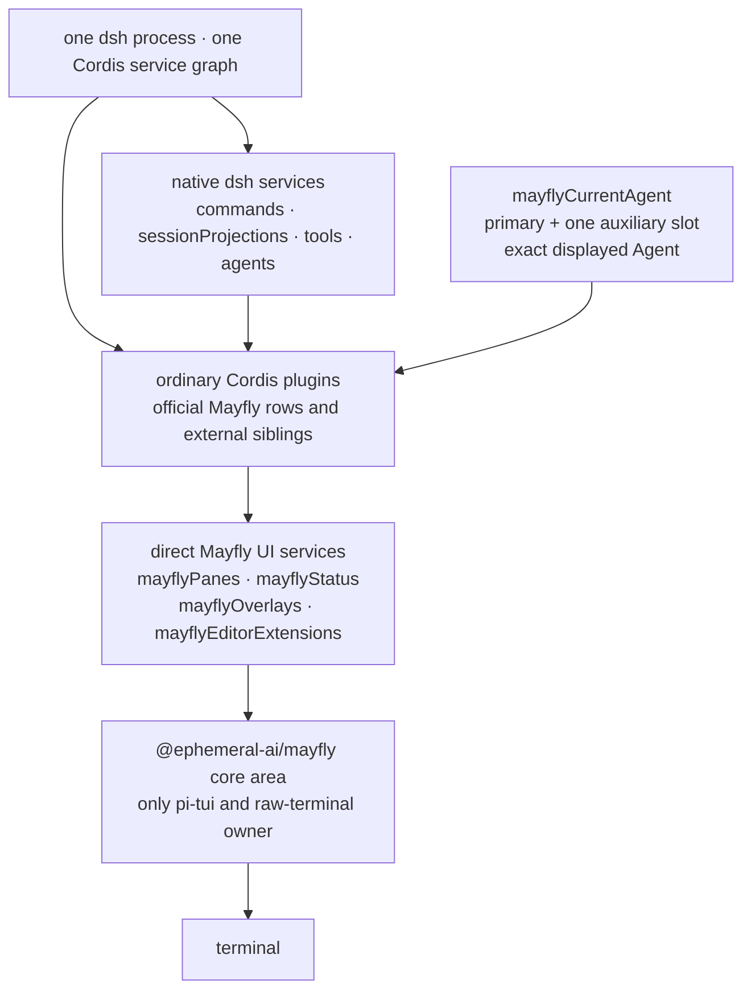

# Mayfly architecture

Mayfly is a set of ordinary Cordis sibling plugins on `dsh-base`. It does not
build a second plugin model, does not intercept or replicate the dsh service
graph, and does not create a private runtime realm for external plugins.

<!-- BEGIN diagram:mayfly-layers -->
<!-- single source: docs/diagrams/mayfly-layers.en.mmd — edit the .mmd, then `pnpm run diagrams:sync` -->

<!-- END diagram:mayfly-layers -->

## Runtime principles

1. Plugins inject and use native dsh services directly, such as `commands`,
   `sessionProjections`, `tools`, and `settings`. A plugin in the same realm as
   `planMode` can inject it directly; root-level UI plugins read state through
   the native `plan` projection and write through the native `/plan` command,
   with no Mayfly adapter added.
2. Mayfly only adds the four services a terminal UI needs:
   `mayflyPanes`, `mayflyStatus`, `mayflyOverlays`, and
   `mayflyEditorExtensions`.
3. `mayflyCurrentAgent` holds one primary Agent and one auxiliary session slot;
   `current()` always returns the exact live Agent currently displayed. A
   plugin that obtains an Agent still calls native dsh services; the object is
   not a renderer model. BTW and continuable subagents therefore reuse the same
   transcript, status, pane, command, and editor without building a second
   session renderer.
4. Registrations, listeners, timers, and async continuations belong to the
   Cordis Fiber that created them. Fiber unload is the only cleanup mechanism
   for plugin contributions.
5. Only `packages/mayfly/src/core/` imports pi-tui and handles ANSI/raw mode,
   focus, layout, and visible width.
6. A UI contribution is always an ordinary readonly node; core privately
   windows large lists and validates/compiles a reactive branch only when it
   first becomes visible, without exposing renderer scheduling state to
   plugins. Form, selection, page, document-anchor, action, and feedback state
   for panes and overlays is held by the frontend `mayflyUiInteraction`
   instance, so a core/theme reload does not lose valid drafts.
7. At startup core prebuilds the prelude, conversation, local activity,
   EditorDock, and Footer hosts in a fixed order. Features only claim named
   slot leases; temporary notice/echo content enters the local activity region
   and does not change the terminal root order.
8. Ordinary surfaces cache by provider revision; the transcript caches by
   `(session generation, entry id, content revision, width, presentation
   revision)`. A durable entry's content revision is `updatedSeq`; live entries
   use a separate `renderRevision`, and the two do not share a numeric clock.

## Package boundaries

| Package | Current responsibility |
| --- | --- |
| `@ephemeral-ai/mayfly-ui` | renderer-neutral contracts, pure node builders, `defineMayflyComponent`, and the four direct UI registries/providers |
| `@ephemeral-ai/mayfly` | frontend, conversation, app, core, transcript, interaction, theme, plus the flat composition and presets over `dsh-base` |
| `@ephemeral-ai/mayfly-cli` | dependency-free `mayfly` launcher; expands the bundled dsh runtime and calibrates the profile on first run |

`frontend`, `conversation`, `app`, `core`, `transcript`, and `interaction`
remain distinct source-ownership areas and Cordis rows, but are no longer
published as separate npm packages.

There is no second plugin-authoring toolkit, no Harness service adapter
package, no validation-only adapter package, no replaceable provider owner, no
plugin bridge, and no app session facade.

## State ownership

- Agent, Session, command, tool, and projection state remains owned by the
  Harness packages.
- App holds the primary Agent selection, the single auxiliary slot, and the
  currently displayed side; it does not reimplement the Harness
  command/tool/projection APIs. A live auxiliary session becomes the exact
  current Agent; a one-shot child is shown by the core-owned generic readonly
  transcript panel.
  App does not depend on the terminal screen, so a core/theme reload creates no
  new session and resets no selection.
- A BTW Agent still carries the complete seed as model context, but
  `mayflyCurrentAgent`'s BTW metadata records the seed cutoff, and the
  transcript source only presents new questions, tools, and answers after the
  cutoff.
- The `mayfly-ui` provider holds the current UI contribution snapshots, and
  every registration is cleaned up with its consumer Fiber.
- The frontend `mayflyUiInteraction` holds renderer-neutral Form, Choice,
  Tabs, Document, operation, and feedback state per registration instance. It
  observes the pane and overlay registries separately, survives renderer
  absence, and cleans up an instance on registration replace/remove or provider
  unload.
- The frontend also holds `mayflyLiveAssistantStream`. Live text is received
  per exact Agent, attempt, revision, and chunk index; when recovery is needed
  it reads the native session controller's assistant-stream opening baseline
  and deduplicates native frames received during recovery.
  The status bar's session-facts bridge consumes the same draft as the
  transcript, does not unload with theme/core, and reads no second durable
  event cache.
- `conversation`'s pure stream accumulator unifies text, phase, and
  output-progress semantics across live, baseline, and durable attempts. The
  projection wire explicitly carries `settledSteps`; the end of a reasoning
  block does not equal assistant-step completion.
- Interaction keeps dedicated state for the prompt editor/autocomplete and the
  submit transform. An editor presentation is an ordinary `mayflyOverlays`
  registration; the old panel/controller stack has been deleted. Features only
  publish readonly nodes and write back authoritative snapshots through
  structured action replies.
- The transcript has a single selected-session conversation controller; when
  the session generation changes, the old entry cache is destroyed.
  The native projection registry validates complete values; the transcript
  source stashes the latest unread native value and converts cutoff-eligible
  durable entries on the next snapshot. Live updates separately carry the
  current attempt's overlay and reuse converted history and tool presenter
  results; the renderer caches historical layouts and only repaints the
  affected live entries. Switching, detach, and unload discard pending values;
  entry object identity is not assumed stable across native parsing.
- Core holds the named Screen Shell, terminal, focus, layout, editor bindings,
  control/scroll handles, admission cache, and compiled renderer objects; all
  of these lapse with the renderer generation, never enter public nodes, and
  never become a second source for drafts.

A renderer may call projection snapshots for the current Agent, but must not
fold in a second copy of Harness session-event truth.

## Composition

<!-- BEGIN diagram:mayfly-composition -->
<!-- single source: docs/diagrams/mayfly-composition.mmd — edit the .mmd, then `pnpm run diagrams:sync` -->

<!-- END diagram:mayfly-composition -->

`cordis.patch.yml` inserts ordinary siblings over `dsh-base`: a set of dsh
support rows plus all Mayfly product rows; the row list is defined by that
file. YAML order does not imply startup order; every ordering requirement must
be expressed via `inject`. Dynamic Cordis plugins and the official Mayfly rows
live in the same service graph.

## Verification

Whole-tree bundle tests must prove that native command/projection/tool services
are reachable, current Agent identity is exact, the four UI services accept
registrations, Fiber unload cleans up, and registries can re-attach renderers
after a core reload. Width-sensitive components remain covered by
`packages/mayfly/tests/{core,transcript,interaction}/width-scan.spec.ts`.

Cold continuable children use the Harness addressed-subagent API for history
reads and explicit replies; browsing history does not activate the Agent, and
only sending a reply resumes it. `resumable` and `readonly` mean resumable and
readonly respectively.

Agent Team is provided by an optional plugin in `dsh-plugins` under its own
`team` preset; the default composition and existing presets do not install Team
tools or prompts, and ordinary delegation stays at the upstream configuration.
The plugin marketplace still modifies the profile through the existing CLI
installer, HMR stays off by default, and installs/removals take effect after
restart.
