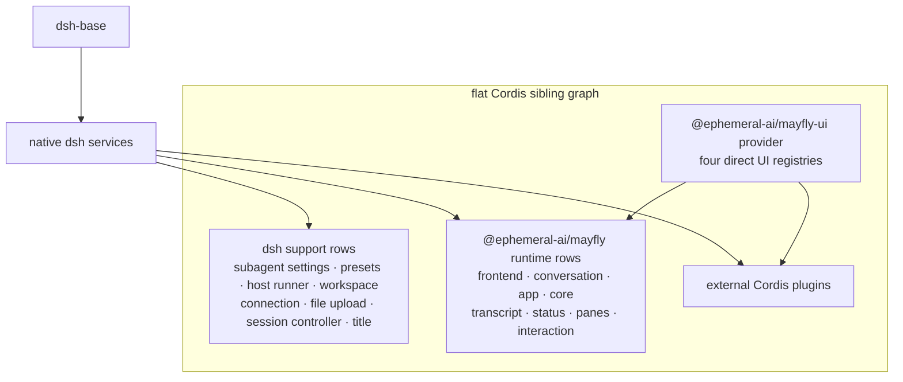

# Built-in plugins

The Mayfly bundle inserts ordinary Cordis siblings over `dsh-base`: a set of
dsh support rows and the Mayfly product rows (`cordis.patch.yml` is the row
list of record). There is no group/isolate or private service realm.

<!-- BEGIN diagram:mayfly-composition -->
<!-- single source 单一来源: docs/diagrams/mayfly-composition.mmd — edit the .mmd, then `pnpm run diagrams:sync` -->

<!-- END diagram:mayfly-composition -->

## Support rows

- subagent model settings and agent presets;
- dynamic Cordis host runner;
- workspace, connection, and file-upload;
- session controller;
- all-prompts title provider.

## Mayfly rows

- `mayfly-ui-provider`: mounts the four direct UI registries from `@ephemeral-ai/mayfly-ui/provider`;
- `mayfly-frontend`, `mayfly-core`, and dark theme;
- `mayfly-conversation`, startup, app/current Agent;
- banner, transcript, and official model;
- basic/cwd/git/title/context/mode/jobs/goal status;
- activity/queue/todo/agents/workflow panes;
- BTW, jobs, and agents commands, attachments, paste image, editor-plus, and interaction.

External plugin rows share this service graph. Activation dependencies come
from `inject`, not YAML position. Every built-in status or pane uses the same
`mayflyStatus`/`mayflyPanes` registry available to external plugins.
